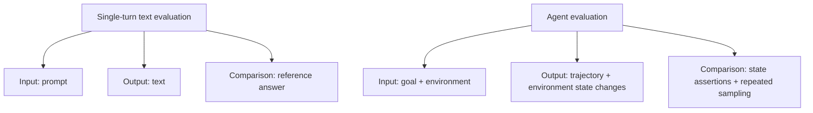
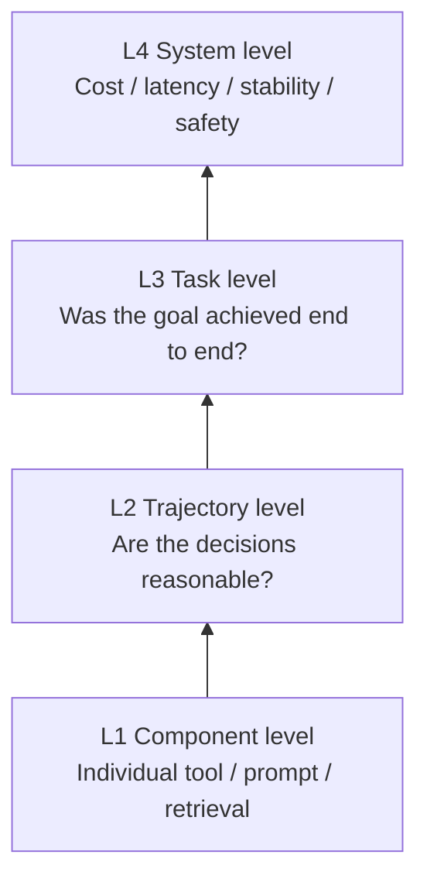
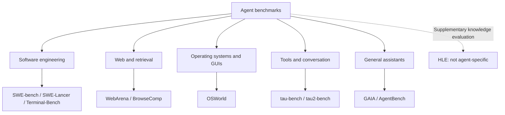
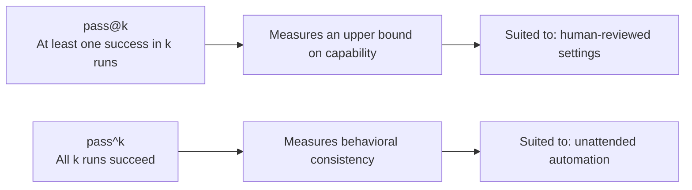
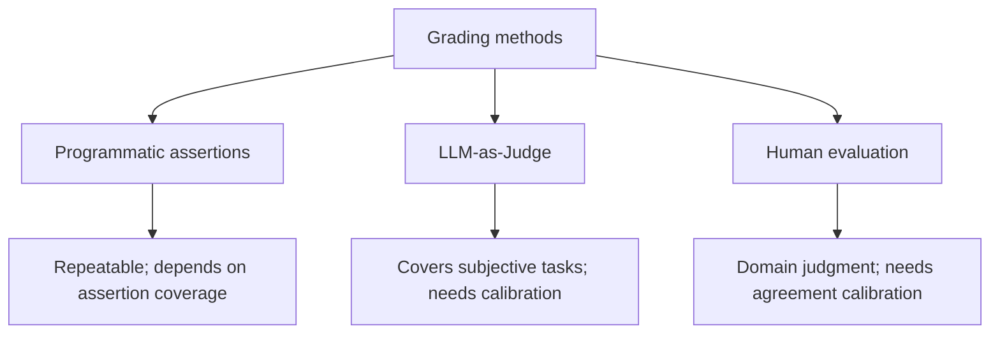
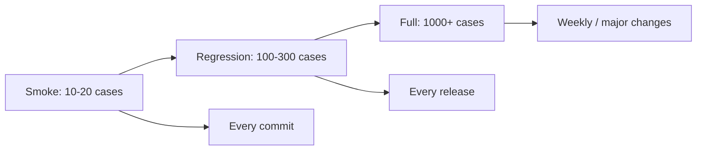
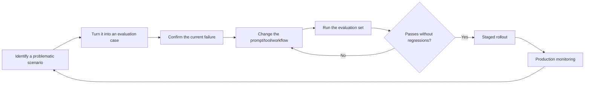

# Chapter 14: Agent Evaluation and Benchmarks

## 14.1 Why Agent Evaluation Is a Separate Problem

Does a final answer that looks correct prove that an agent completed the task? No. It might claim to have issued a refund when it has only submitted a request. Or it might complete the refund but send duplicate notifications or skip a required approval.

Compared with a typical single-turn text evaluation, agent evaluation starts from a goal and an initial environment and examines **an entire execution trajectory**: which tools were called, which arguments were supplied, what results were observed, how often the agent changed direction, and which external states ultimately changed. This does not mean that all LLM evaluation merely compares text. The point is that tool execution introduces additional things to verify.

It makes some of the difficulties of single-turn text evaluation more pronounced and adds the problem of verifying external state and side effects.

**First, there is often no single correct path.** An agent may search before reading a file or read the file before searching; both paths can be valid. Scores should therefore not depend solely on whether a trajectory matches a reference trajectory. Only ordering explicitly required by the task, such as approval before payment, should be a hard constraint.

**Second, the result is more than text.** An agent may modify a database, commit code, or send an email. Correctness must be verified against **the state of the environment**, not just the output text.

**Third, behavior is nondeterministic.** Two runs of the same task may take different paths and produce different results. A single run can reveal a failure, but it cannot estimate repeatability for that task. Repeated trials and task coverage are two separate dimensions.

**Fourth, failures take different forms.** Task failure, malformed tool calls, infinite loops, budget overruns, and unauthorized actions are distinct failures. They should not be collapsed into a single “error rate.”



## 14.2 Four Levels of Evaluation

A complete agent evaluation system should cover four levels, from the bottom up:



| Level | What is evaluated | Typical metrics | When to use it |
|---|---|---|---|
| L1 Component | An individual tool, prompt, or retrieval module | Argument accuracy, recall, schema compliance rate | Regression testing after a component changes |
| L2 Trajectory | The sequence of decisions | Step count, redundant-call ratio, path quality | Diagnosing “right result, poor process” |
| L3 Task | The end-to-end outcome | Task success rate, pass@k, pass^k | Primary metrics before a release |
| L4 System | Overall operational behavior | Token cost, P95 latency, unauthorized-action rate, loop rate | Continuous production monitoring |

In practice, it is easy to focus only on L3 end-to-end success. The problem is that success then tells you little about why the agent succeeded, and failure tells you little about where it got stuck. L1 and L2 provide **attribution**: they let you break “task failed” down into “retrieval missed the relevant material at step 3” or “the tool arguments were wrong at step 5.”

## 14.3 An Overview of Major Agent Benchmarks

The value of understanding academic benchmarks is not in chasing scores. Each benchmark **defines a category of capability**, and its evaluation design can inform a test set for your own application.



### 14.3.1 Software Engineering

**SWE-bench** draws issues and fixes from real GitHub repositories and asks the agent to produce a patch against a specified repository baseline. Evaluation uses a test patch and existing tests to check both tests that should change from failing to passing (FAIL_TO_PASS) and tests that should continue to pass (PASS_TO_PASS). It does not merely run whatever tests happen to be present after the agent's modifications.

Two aspects of its design are worth borrowing:

1. **Use executable tests rather than text similarity to judge success.** This reduces subjective scoring, although tests can still miss requirements, be brittle, or reward solutions that game them.
2. **Provide a complete repository rather than isolated files.** This requires the agent to retrieve information and navigate the codebase.

Some instances in the original dataset had underspecified issue descriptions or unreliable tests. This led to **SWE-bench Verified**, a human-screened subset of 500 tasks. OpenAI has identified flaws in test design and training-data contamination in this benchmark, stopped reporting its scores, and recommended reporting SWE-bench Pro instead; see [Why SWE-bench Verified no longer measures frontier coding capabilities](https://openai.com/index/why-we-no-longer-evaluate-swe-bench-verified/). **Always identify the subset when citing a score.** Full, Lite, and Verified scores are not directly comparable, and these limitations matter when citing Verified results.

**SWE-Lancer** uses software tasks from a real freelance marketplace, including both independent-contributor tasks and managerial tasks that require choosing an implementation proposal. Amounts aggregated from historical task payments are a proxy for value within the benchmark, not actual agent earnings, and cannot be directly extrapolated to production ROI.

**Terminal-Bench** evaluates task completion in terminal-only environments, covering scenarios such as compilation, debugging, and system configuration.

### 14.3.2 Web and Retrieval

**WebArena** provides reproducible, self-hosted website environments, including e-commerce, forums, and code hosting. Its [official evaluators](https://github.com/web-arena-x/webarena/blob/73d9de71c25af3f5037c722ede9cabe25a8c77c2/evaluation_harness/evaluators.py) check answers, URLs, or page content according to the task. Information-seeking tasks can use exact answer matching, required phrases, or model-based fuzzy matching. An answer is a legitimate task output to grade; an agent merely saying “I completed the action” is not evidence that the required website state changed.

**BrowseComp** takes a different approach: answers are short and easy to verify, but finding them requires **deep, multi-hop web retrieval**. It specifically measures the ability to keep searching and cross-check information.

### 14.3.3 Operating Systems and GUIs

**OSWorld** evaluates multimodal agents in real operating systems. Tasks involve operations across applications, and evaluation checks the resulting files and system state. This adds challenges in visual grounding, action execution, and asynchronous interfaces, but it does not justify claiming that OSWorld is necessarily harder than every text-only benchmark across different models and task sets.

### 14.3.4 Tools and Conversation

**tau-bench** has an agent interact with a user simulator and business APIs while following **domain policies**. Policies are task constraints, not a third participant in the conversation. Tasks require tool use, clarification, and refusal of requests that violate policy. The original benchmark scores performance primarily by comparing the final database state with the target state; this does not exhaustively check policy compliance throughout the conversation.

**tau²-bench**, its successor, introduces “dual control”: the user can also take actions, and the agent must guide the user through those actions. This more closely resembles real technical-support scenarios.

### 14.3.5 General Assistants

**GAIA** is built around questions that are “easy for humans, difficult for AI.” They require a combination of web browsing, multimodal understanding, file processing, and reasoning. Short responses with clearly defined reference answers allow automated grading under specified normalization rules.

**AgentBench** spans eight environments, including operating systems, databases, knowledge graphs, and games, to compare the agent capabilities of different models.

**Humanity's Last Exam (HLE)** is not an agent benchmark. It is an exceptionally difficult academic-knowledge benchmark, often evaluated alongside tool-use capabilities.

### 14.3.6 Benchmark Comparison

| Benchmark | Domain | Grading method | Main capabilities assessed |
|---|---|---|---|
| SWE-bench | Code repair | Unit tests | Repository navigation + code modification |
| SWE-Lancer | Software tasks | Tests for implementation tasks; proposal selection for managerial tasks; payment amounts provide value weighting | Software delivery and implementation judgment |
| Terminal-Bench | Terminal operations | State assertions | Command-line and system skills |
| WebArena | Web operations | Answer, URL, or page-content checks, depending on the task | Multistep web interaction |
| BrowseComp | Deep retrieval | Grading against short reference answers; the official implementation uses a model judge | Finding hard-to-retrieve information and verifying evidence |
| OSWorld | Desktop GUIs | File/system state | Long-horizon operations across applications |
| tau-bench | Customer-support conversations | Primarily final database-state comparison | Tools + clarification + handling requests under policy constraints |
| tau²-bench | Dual-control conversations | State assertions | Guiding users through actions |
| GAIA | General assistants | Exact answer matching | Multimodal understanding + combinations of tools |
| AgentDojo | Security | Task success + attack success | Resistance to prompt injection |

### 14.3.7 Limitations of Academic Benchmarks

Academic benchmarks **cannot replace an application-specific evaluation set**, for four reasons:

1. **Data contamination:** public benchmark questions and answers may have entered the model's training data, inflating scores.
2. **Distribution mismatch:** your application's task distribution will almost certainly differ from the benchmark's.
3. **Overfitting:** agent-harness optimizations for one benchmark may not transfer.
4. **Inconsistent measurement conditions:** reports use different subsets, attempt counts, and tool sets, making scores incomparable.

**The right approach is to borrow the evaluation design of academic benchmarks to build your own application-specific test set.** Useful ideas include executable assertions instead of subjective scoring, verification against actual environment state, and separate accounting for safety violations.

## 14.4 Core Metrics

### 14.4.1 Task Success Rate

This is the most basic metric. For an evaluation set of $N$ tasks, let the grading function for task $i$ be $s_i \in \lbrace 0, 1 \rbrace$. Then:

$$
\mathrm{SuccessRate} = \frac{1}{N}\sum_{i=1}^{N} s_i
$$

The key is to define reproducible grading criteria in advance. Prefer executable assertions for database state and coding tasks. For open-ended tasks such as report quality, use calibrated model or human rubrics. Where programmatic assertions provide incomplete coverage, “tests passed” cannot be equated directly with “the user's goal was achieved.”

### 14.4.2 pass@k: The Chance of Getting It Right at Least Once

Fix the model, agent configuration, and per-run budget, and perform $n$ independent, identically distributed runs for each task. If task $i$ succeeds $c_i$ times, the unbiased estimate of “at least one success” when choosing $k$ runs without replacement is:

$$
\mathrm{pass@}k = \frac{1}{N}\sum_{i=1}^{N}\left(1 - \frac{\binom{n-c_i}{k}}{\binom{n}{k}}\right), \quad n \geq k
$$

This estimates the probability of success when multiple attempts are allowed and any successful result can be selected. It measures **an upper bound on capability** under those conditions. It suits settings with human review or safe candidate selection, such as an engineer choosing one patch from several candidates.

### 14.4.3 pass^k: Consistency Across Repeated Runs

Let $p_i$ be the single-run success probability for task $i$. The definition of $\mathrm{pass}^{k}$ is the average probability that all $k$ independent runs of the same task succeed:

$$
\mathrm{pass}^{k} = \frac{1}{N}\sum_{i=1}^{N}p_i^k
$$

Given $n$ observations of the same task and $c_i$ successes, the unbiased finite-sample estimate is:

$$
\widehat{\mathrm{pass}^{k}} = \frac{1}{N}\sum_{i=1}^{N}\frac{\binom{c_i}{k}}{\binom{n}{k}}, \quad n \geq k
$$

This is not $\mathrm{pass@}k$. The original tau-bench paper calls it “pass hat k.” When citing `pass^k`, explain that all k runs must succeed; do not rely on a spoken shorthand alone to distinguish it from `pass@k`. For unattended production agents, $\mathrm{pass}^{k}$ provides a complementary measure of reliability under repeated execution. The tau-bench experiments show that even when $\mathrm{pass@}1$ looks reasonable, $\mathrm{pass}^{k}$ can fall sharply as $k$ increases. A single-run average is not a promise of consistent performance over repeated runs.

Both estimators use the convention that the numerator is zero when fewer than `k` elements are available to choose from. Sharing reflection memory across runs, changing strategies, or not resetting the environment violates the independent, identically distributed assumption. Such stateful operation must be evaluated separately rather than by applying these estimators directly.



Why are long action sequences fragile? Under the teaching assumptions that “each step is independent, every step has the same probability of being correct, and any failed step is unrecoverable,” the success probability for $m$ steps is $p^m$. For $p = 0.95$ and $m = 20$, it is about $0.36$. Real agents have correlated errors, retries, and verification, so this formula cannot be applied directly. Still less does it imply that “reducing variance is always more important than improving capability.” Moreover, $p_i^k$ decreases with the number of repetitions even for a single-step task.

When reporting pass@k, explain how a successful result is selected from the candidates. Without a reliable acceptance mechanism in production, the offline finding that “at least one candidate succeeded” does not mean the system can deliver it. When comparing pass^k, reset the environment, hold budgets fixed, and distinguish repeated execution of one task from consecutive execution of different tasks.

### 14.4.4 Trajectory-Level Metrics

| Metric | Definition | What it diagnoses |
|---|---|---|
| Average step count | Average number of loop iterations to complete a task | Unnecessary detours |
| Redundant-call rate | Proportion of repeated or ineffective tool calls | Failure to make progress |
| Tool-selection accuracy | Proportion of steps that select the right tool | Clarity of tool descriptions |
| Argument compliance rate | Proportion of arguments that pass schema validation | Schema design and model capability |
| Loop-limit termination rate | Proportion of runs terminated at the maximum iteration count | Failure of stopping conditions |
| Recovery rate | Proportion of errors followed by successful self-correction | Effectiveness of error handling |

### 14.4.5 Agentic Trajectories: Correct, Compliant, and Recoverable

A passing final state does not necessarily make the trajectory acceptable. For agents with side effects, evaluation cases should also assert the following:

| Dimension | Example |
|---|---|
| **Evidence and authorization chain** | Every high-risk call can be linked to the user's goal, permitted sources, and approval records |
| **Policy compliance** | No unauthorized actions or prohibited tools; approval precedes execution |
| **Correct state transitions** | Intermediate writes satisfy invariants; failures leave no partial or duplicate side effects |
| **Recovery and idempotency** | The agent can recover after timeouts/retries, and repeated execution does not duplicate charges, emails, or deletions |
| **Minimum sufficient action** | The task is completed without redundant calls, unrelated data access, or unnecessary permissions |

Do not compare a trajectory literally against a single “golden sequence of steps.” Use executable constraints like these to judge different valid paths. Agents that retrieve and cite information should also reuse the citation, freshness, and robustness cases from [RAG Evaluation](../../rag/05-generation-evaluation/18-rag-evaluation.md).

### 14.4.6 Cost and Latency

$$
\mathrm{CostPerTask} = \frac{\sum_{i=1}^{N}\left(c_{\mathrm{in}} \cdot T_{\mathrm{in}}^{(i)} + c_{\mathrm{out}} \cdot T_{\mathrm{out}}^{(i)}\right)}{N}
$$

This assumes that all calls use the same model and pricing tier. Here, $c_{\mathrm{in}}$ and $c_{\mathrm{out}}$ are the input and output prices per token, and $T^{(i)}$ is the cumulative token usage across all calls for task $i$. Convert prices quoted per million tokens into per-token prices first. With multiple models, caching, or other billable items, aggregate the actual usage separately for each category.

**Always report cost alongside success rate.** Reporting only success encourages unlimited increases in reflection rounds and search breadth. A common combined metric is “cost per successful task”:

$$
\mathrm{CostPerSuccess} = \frac{\mathrm{CostPerTask}}{\mathrm{SuccessRate}}
$$

This allocates total cost across successful tasks; the ratio has no finite definition when success rate is zero. In a teaching example, an option with 90% success at USD 0.5 per task costs about USD 0.56 per successful task, whereas an option with 95% success at USD 2 per task costs about USD 2.11. The first is cheaper only under this cost definition. Different failure losses or SLAs prevent an unqualified claim that it is better. Full costs must also include failed attempts, tools, compute, and human handling. At a minimum, report P50 latency, P95 latency, and timeout rate together.

## 14.5 Grading: What Makes a Run Successful?

This is the most important design decision when constructing an evaluation set.



### 14.5.1 Programmatic Assertions: First Choice

Use code to check whether the final state meets the requirements:

- Do the unit tests pass?
- Does the expected database record exist?
- Does the generated file contain the required fields?
- Were prohibited tools **not** called?

For requirements that can be formalized, prefer programmatic assertions over asking a model to infer whether they were met. Assertions are usually more repeatable and do not directly depend on a judge's model version. They can nevertheless be wrong or incomplete, and changes to the test environment or dependencies can cause results to drift. Human or model evaluation can supplement dimensions that are difficult to formalize, such as report quality.

A useful technique is to **write both positive and negative assertions**: positive assertions check “what was done,” while negative assertions check “what should not have been done,” such as deleting unrelated data or making unauthorized calls.

### 14.5.2 LLM-as-Judge: Second Choice

For tasks such as assessing report quality or answer usefulness, human and model scoring can be combined. Model judges must account for the following biases; switching to another provider's model does not guarantee that they disappear:

| Bias | Manifestation | Mitigation |
|---|---|---|
| Position bias | Preference for candidates presented first | Evaluate both orders and average the scores |
| Length bias | Preference for longer answers | State explicitly in the rubric that length earns no extra credit |
| Self-preference | Preference for outputs from the same model family | Use a judge different from the model being evaluated |
| Scale drift | Scores are incomparable across batches | Calibrate with fixed anchor examples |

First calibrate on samples that cover the main categories and edge cases. Sample size depends on error tolerance, category sparsity, and the labeling budget; there is no universal rule that “100 examples are enough.” Beyond overall agreement and, where appropriate, Cohen's Kappa, examine misclassifications by category, disagreements between judges, and label base rates. Fix the rubric, model version, and anchor examples to avoid optimizing for the judge's preferences.

For tasks that can be broken down into clear criteria, first try binary judgments for each criterion or a small number of rating levels. These are easier to calibrate than a 1–10 scale with unexplained ratings. If fine-grained scoring is necessary, define what each level means and then check agreement against human labels. The scoring format alone does not establish greater reliability.

### 14.5.3 Human Evaluation

Domain experts can establish reference labels, calibrate judges, review production samples, and adjudicate disputed cases. They too need consistent labeling rules and a process for resolving disagreements. Tasks with automated acceptance checks should not require a complete manual regression run every time. For tasks without reliable automated scoring that require nuanced domain judgment, however, humans may still need to perform most acceptance evaluation.

## 14.6 Building an Evaluation Set

### 14.6.1 A Tiered Design

An evaluation set can be organized into tiers. The sizes and frequencies below are teaching examples, not industry standards; adjust them to risk coverage, statistical precision, and execution cost:



| Tier | Size | Frequency | Purpose |
|---|---|---|---|
| Smoke | 10–20 | Every code commit | Quickly catch obvious breakage |
| Regression | 100–300 | Every release | Prevent fixed problems from returning |
| Full | 1000+ | Weekly or for major changes | Comprehensive evaluation and comparisons |

### 14.6.2 Sources of Test Cases

In descending order of priority:

1. **Real production failures**, to address weaknesses that have already surfaced.
2. Real production successes, to prevent regressions.
3. Edge cases constructed by domain experts.
4. Model-generated cases, to broaden coverage, with human spot checks.

**Whenever a production bug is fixed, turn its scenario into a permanent regression case.** This is the healthiest way to grow an evaluation set.

A failure-regression set deliberately overrepresents difficult cases; it is not the full production distribution. Estimating production success rate also requires sampling from the application's task distribution or specifying stratification weights. Safety-boundary cases can be scored separately so that common, easy tasks do not dilute their results.

If a full task is too long, separately save the context and environment state immediately before the first error, and check what the next step is allowed and forbidden to do. This “trajectory-prefix regression” complements end-to-end regression. See [Chapter 25: From Failed Trajectories to Reliable Policies](../07-post-training/25-agent-post-training.md) for how to construct it. A correct prefix-level decision still does not guarantee completion of the rest of the task.

### 14.6.3 What Each Test Case Should Contain

```json
{
  "id": "refund-001",
  "goal": "为订单 A123 办理退款并通知用户",
  "initial_state": {
    "orders": [ { "id": "A123", "status": "shipped", "return_confirmed": true } ]
  },
  "assertions": [
    { "type": "db", "check": "orders.A123.status == 'refunded'" },
    { "type": "event_count", "event": "refund_committed", "order_id": "A123", "equals": 1 },
    { "type": "event_order", "before": "return_confirmed", "after": "refund_committed" },
    { "type": "event_order", "before": "refund_committed", "after": "email_sent" },
    { "type": "email", "order_id": "A123", "recipient": "order_owner", "delivered": true },
    { "type": "tool_not_called", "name": "delete_order" }
  ],
  "policy": ["已发货订单退款需先确认用户已退货"],
  "budget": { "max_steps": 15, "max_tokens": 60000 },
  "tags": ["refund", "policy-check"]
}
```

The Chinese sample strings mean “Issue a refund for order A123 and notify the user” (`goal`) and “Before refunding a shipped order, first confirm that the user has returned it” (`policy`).

This is an illustrative test-case format; the evaluator must implement the assertions. The key fields are the initial state, positive and negative assertions, and budget. The environment fixture must supply the `return_confirmed` event; the agent's claim is not sufficient. If the return has not been confirmed, create a separate case that requires clarification first and forbids a refund. Do not simultaneously demand an unconditional successful refund.

### 14.6.4 Environment Isolation and Reproducibility

Evaluation environments that involve writes must be isolated from production, and each trial must start from the agreed initial state. Container snapshots can restore a controlled filesystem, and database transaction rollback can undo writes within that transaction. Neither automatically reverses an email already sent or an external payment. Such tools must use isolated environments or controlled test doubles.

To test different initial states or random failures, define the sampling distribution in advance and record the configuration. Do not let leftovers from one run affect the next. Compare versions using paired tasks and the same environmental conditions wherever possible, and record external data, tool, and dependency versions.

## 14.7 Production Evaluation and Observability

Offline evaluation sets cannot cover every real-world situation; production monitoring must complement them.

### 14.7.1 Fields That Must Be Persisted

Each agent run should record a trajectory sufficient to reconstruct its control flow. This does not mean storing all sensitive content verbatim:

| Field | Purpose |
|---|---|
| trace_id / span_id | Link the complete call chain |
| Each step's action, observation, and structured decision rationale/state summary | Review the auditable decision process; rationales must be explicitly generated summaries that are permitted to be logged |
| Tool name, arguments, return value, duration, and error status | Diagnose component-level problems; redact and control access according to sensitivity |
| Input/output token counts and model version | Attribute costs and compare versions |
| Termination reason | Distinguish normal completion / iteration limit / timeout / error |
| User feedback signals | Implicit feedback, such as asking again or adopting the answer, and explicit feedback, such as thumbs up/down |

**Do not store hidden thoughts/private chain of thought or ask the model to expose them.** They are not reliable explanations and may contain sensitive context. Audit tool calls, visible observations, state changes, and separately generated short rationale summaries instead. Termination reasons are equally essential: without them, “an 8% failure rate” cannot be broken down further.

### 14.7.2 Core Production Metrics

- Task completion rate and the rate at which users ask again.
- P50 / P95 latency.
- Cost per task.
- Loop-limit termination rate: the proportion that reach the maximum iteration count.
- Tool error rate, grouped by tool.
- Safety-block rate and the number of unauthorized-action attempts.

### 14.7.3 Staged Rollouts and A/B Tests

Validate agent changes—switching models, editing prompts, or adding tools—through staged rollouts. Sample size depends on baseline success rate, the effect size you want to detect, variance, and statistical power. It is not necessarily larger than for conventional features. Randomize by user or task group so that one user's multiturn interaction does not cross experimental groups; likewise, do not treat correlated steps as independent samples in the analysis. **Estimate the required sample size before making a change, or noise can easily mislead you.**

### 14.7.4 Tracing Standards

OpenTelemetry's GenAI semantic conventions cover information such as model and agent spans and work alongside tool-call conventions. As of 2026-09-15, the GenAI conventions were still marked **Development**. Pin the convention and SDK versions, verify backend field mappings, and redact sensitive content. Do not assume that every platform can consume all of the information without adaptation.

## 14.8 Evaluation-Driven Development

Put evaluation before development changes, not after them.



For a case intended to verify a fix, first confirm that it reproduces the target failure, then compare behavior before and after the fix. Nondeterministic failures may require multiple trials. Cases that already pass can still protect existing capabilities and safety invariants; an initial pass is not a reason to exclude a case from the regression set.

## 14.9 Common Mistakes

### 14.9.1 Reporting Only a Single Run

A single run can expose a specific failure, but it cannot adequately estimate repeated reliability. Choose the number of runs based on the desired error tolerance and cost. 3–5 runs can serve as an initial screen, not a universally sufficient statistical threshold. For version comparisons, use paired analysis on the same tasks where possible, and report the task count, attempts per task, confidence intervals, and failure distribution. Repeating one task is not a substitute for adding application coverage.

### 14.9.2 Looking Only at End-to-End Success

This prevents attribution. Trajectory-level metrics are also needed to locate the step where things went wrong.

### 14.9.3 Reporting Success Rate Without Cost

This encourages adding reflection rounds and search breadth to inflate scores, only to lose control of costs in production.

### 14.9.4 Using LLM-as-Judge Without Calibration

Uncalibrated judge scores may differ substantially from human judgments. In that case, optimization improves “appeal to the judge,” not actual quality.

### 14.9.5 Contaminating the Evaluation Set

Using the same data for prompt tuning and final evaluation is equivalent to reporting performance on the training set. **Keep a holdout set that is never used for tuning.**

### 14.9.6 Treating Academic Benchmark Scores as Promises of Application Performance

There is no reliable mapping from benchmark scores to performance in your application.

### 14.9.7 Ignoring Safety Metrics

Even with a 95% success rate, other successful tasks cannot offset a single unauthorized deletion. Define hard release gates for unauthorized actions, data leakage, and similar failures in advance, and track violation types and impact separately. One confirmed violation may block a release. “No unauthorized actions observed” in testing is not proof that they will never occur; report sample size, coverage, and the threat model as well.

## 14.10 Chapter Summary

Agent evaluation must go beyond the final text to examine **the full trajectory and environment state**, confirming both that the goal was achieved and that execution respected its constraints.

A practical approach separates evaluation into four levels: components support attribution, trajectories reveal process quality, tasks provide end-to-end conclusions, and system metrics continuously track cost, latency, and safety. Prefer a consistent order of grading methods as well: use programmatic assertions wherever possible, and calibrate LLM-as-Judge before relying on it. Human evaluation is particularly useful for spot checks and calibration baselines.

For unattended systems, look beyond $\mathrm{pass@}k$ to $\mathrm{pass}^{k}$, cost per success, P95 latency, and the soundness of authorization, state transitions, and recovery within the trajectory. Run evaluation tiers at appropriate frequencies—Smoke, Regression, and Full—and continually add production failures. After deployment, retain redacted, auditable trajectories and termination reasons. Score unauthorized actions and other safety violations separately rather than averaging them into success rate.

Academic benchmarks are best used as sources of evaluation design ideas. Decisions about releases still require your own application-specific evaluation set.

## References

- [SWE-bench: Can Language Models Resolve Real-World GitHub Issues?](https://arxiv.org/abs/2310.06770)
- [OpenAI: Why SWE-bench Verified no longer measures frontier coding capabilities](https://openai.com/index/why-we-no-longer-evaluate-swe-bench-verified/)
- [SWE-Lancer: Can Frontier LLMs Earn $1 Million from Real-World Freelance Software Engineering?](https://arxiv.org/abs/2502.12115)
- [Terminal-Bench: Official tasks and versions](https://www.tbench.ai/)
- [GAIA: a benchmark for General AI Assistants](https://arxiv.org/abs/2311.12983)
- [tau-bench: A Benchmark for Tool-Agent-User Interaction in Real-World Domains](https://arxiv.org/abs/2406.12045)
- [tau^2-Bench: Evaluating Conversational Agents in a Dual-Control Environment](https://arxiv.org/abs/2506.07982)
- [OSWorld: Benchmarking Multimodal Agents for Open-Ended Tasks in Real Computer Environments](https://arxiv.org/abs/2404.07972)
- [WebArena: A Realistic Web Environment for Building Autonomous Agents](https://arxiv.org/abs/2307.13854)
- [BrowseComp: A Simple Yet Challenging Benchmark for Browsing Agents](https://arxiv.org/abs/2504.12516)
- [AgentBench: Evaluating LLMs as Agents](https://arxiv.org/abs/2308.03688)
- [MLE-bench: Evaluating Machine Learning Agents on Machine Learning Engineering](https://arxiv.org/abs/2410.07095)
- [Humanity's Last Exam](https://arxiv.org/abs/2501.14249)
- [AgentDojo: A Dynamic Environment to Evaluate Prompt Injection Attacks and Defenses for LLM Agents](https://arxiv.org/abs/2406.13352)
- [OpenTelemetry: Generative AI Semantic Conventions](https://github.com/open-telemetry/semantic-conventions-genai)
- [OpenTelemetry: GenAI convention status (Development, pinned commit 0c87594)](https://github.com/open-telemetry/semantic-conventions-genai/blob/0c87594975195608dc91b3f702e250a7b240c151/docs/gen-ai/README.md)
- [Anthropic: Building Effective Agents](https://www.anthropic.com/engineering/building-effective-agents)
- [Anthropic: Demystifying evals for AI agents](https://www.anthropic.com/engineering/demystifying-evals-for-ai-agents)
- [SWE-bench: Evaluation harness](https://www.swebench.com/SWE-bench/guides/evaluation/)
- [OpenAI: BrowseComp reference implementation](https://github.com/openai/simple-evals/blob/main/browsecomp_eval.py)
- [Anthropic: How we built our multi-agent research system](https://www.anthropic.com/engineering/multi-agent-research-system)
