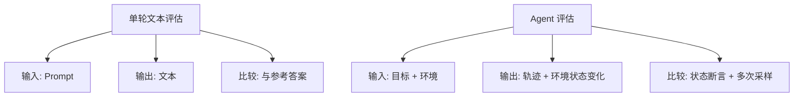
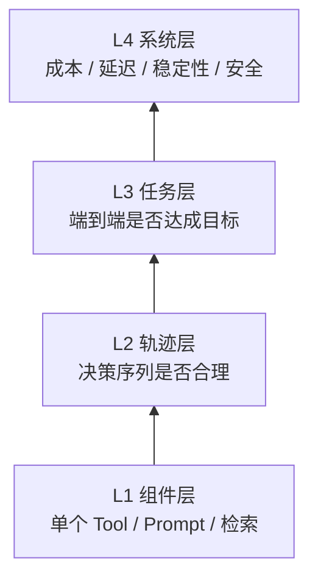
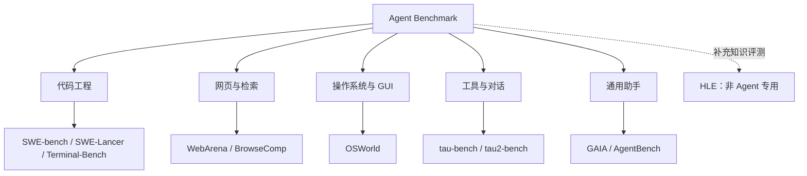
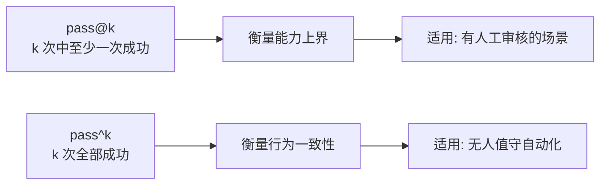
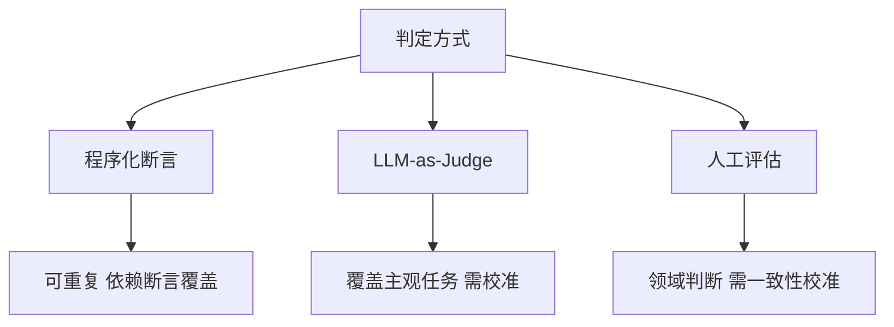
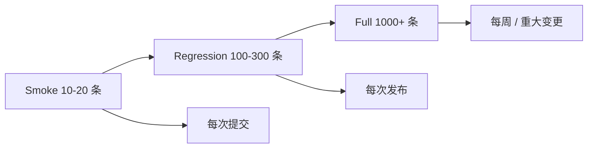
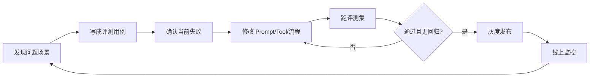

# 第十四章：Agent 评估与 Benchmark

## 14.1 为什么 Agent 评估是独立问题

“最终回答看起来正确”，能说明 Agent 完成任务了吗？不能。它可能声称已经退款，实际只提交了申请；也可能退款成功，却重复发送通知或跳过必要审批。

与常见的单轮文本评估相比，Agent 评估要从目标和初始环境出发，检查**一整条执行轨迹**：调用了哪些 Tool、传了什么参数、读到了什么结果、中途改了几次方向、最后改动了哪些外部状态。这里不是说所有 LLM 评估都只比较文本，而是强调工具执行带来的额外验收对象。

这让单轮文本评估中的一些困难更突出，并增加外部状态与副作用的验收问题。

**第一，往往没有唯一正确路径。** 同一个任务可以先搜索再读文件，也可以先读文件再搜索，两条路径都对。因此不应只用「轨迹是否匹配参考轨迹」来打分；只有任务明确要求的顺序，例如审批先于付款，才应作为硬约束。

**第二，结果不只是文本。** Agent 可能改了数据库、提交了代码、发了邮件。正确性必须在**环境状态**上验证，而不是在输出文本上验证。

**第三，行为不确定。** 同一个任务跑两次可能走不同路径、得到不同结果。单次运行可以发现失败，但无法估计同一任务的重复可靠性；重复试验与任务覆盖是两个不同维度。

**第四，失败有多种形态。** 任务失败、工具调用格式错误、无限循环、超预算、越权操作，这些是不同的失败，不能合并成一个「错误率」。



## 14.2 评估的四个层次

一个完整的 Agent 评估体系应该覆盖四层，从下到上分别是：



| 层次 | 评估对象 | 典型指标 | 何时用 |
|---|---|---|---|
| L1 组件层 | 单个 Tool、单条 Prompt、检索模块 | 参数正确率、召回率、Schema 合规率 | 改动某个组件时的回归 |
| L2 轨迹层 | 决策序列 | 步数、冗余调用比例、路径合理性 | 定位「结果对但过程差」的问题 |
| L3 任务层 | 端到端结果 | 任务成功率、pass@k、pass^k | 版本发布前的主指标 |
| L4 系统层 | 整体运行特性 | Token 成本、P95 延迟、越权率、循环率 | 上线后的持续监控 |

工程里很容易只盯 L3 端到端成功率。这样做的问题是：成功时说不清为什么成功，失败时也难定位卡在哪一步。L1 和 L2 的价值就在于**归因**，能把一个「任务失败」继续拆到「第 3 步检索没召回」或「第 5 步工具参数填错」。

## 14.3 主流 Agent Benchmark 全景

理解学术基准的价值不在于刷分，而在于它们各自**定义了一类能力**，可以借鉴其评测设计思路来构造自己的业务评测集。



### 14.3.1 代码工程类

**SWE-bench** 从真实 GitHub 仓库抽取 Issue 与修复，要求在指定基线仓库中提交补丁。评测使用测试补丁和既有测试，检查应从失败转成功的测试（FAIL_TO_PASS）及应保持通过的测试（PASS_TO_PASS），不是只运行 Agent 修改后恰好已有的测试。

它的设计有两个关键点值得借鉴：

1. **用可执行测试而非文本相似度做判定**，减少主观评分，但测试仍可能遗漏需求、脆弱或被投机满足；
2. **提供完整仓库而非孤立文件**，迫使 Agent 具备检索与导航能力。

由于原始数据集中存在部分描述不充分或测试不可靠的样例，后续出现了人工筛选过的 **SWE-bench Verified** 子集（500 题）。OpenAI 指出该基准存在测试设计缺陷和训练数据污染问题，已停止报告其分数，并建议改报 SWE-bench Pro，见 [Why SWE-bench Verified no longer measures frontier coding capabilities](https://openai.com/index/why-we-no-longer-evaluate-swe-bench-verified/)。**引用分数时必须说明是哪个子集**，Full、Lite、Verified 的分数不可直接比较；引用 Verified 成绩时应注意这些局限。

**SWE-Lancer** 使用真实自由职业市场的软件任务，包含独立贡献者任务与管理者选择方案任务。按任务历史报酬聚合的金额是该基准下的价值代理，不是 Agent 实际收入，也不能直接推算生产 ROI。

**Terminal-Bench** 关注纯终端环境中的任务完成能力，覆盖编译、调试、系统配置等场景。

### 14.3.2 网页与检索类

**WebArena** 构建了可复现的自托管网站环境（电商、论坛、代码托管等）。[官方评估器](https://github.com/web-arena-x/webarena/blob/73d9de71c25af3f5037c722ede9cabe25a8c77c2/evaluation_harness/evaluators.py) 按任务检查答案、URL 或页面内容；信息查询任务可以采用答案精确匹配、必要词句检查或模型裁判的模糊匹配。最终答案本身可以是需要评分的任务产物，但 Agent 自称“操作完成”不能证明网站状态确实发生了所要求的变化。

**BrowseComp** 走向另一个方向：题目答案简短且易于验证，但需要在网络上进行**深度、多跳的检索**才能找到，专门用来测量「持续搜索并交叉验证」的能力。

### 14.3.3 操作系统与 GUI 类

**OSWorld** 在真实操作系统中评测多模态 Agent，任务涉及跨应用操作，判定基于最终文件与系统状态。它增加了视觉定位、动作执行和异步界面的困难，但不能跨不同模型与任务集断言一定比所有纯文本基准难。

### 14.3.4 工具与对话类

**tau-bench** 让 Agent 与用户模拟器、业务 API 交互，并要求遵守**领域政策**。政策是任务约束，不是第三个对话参与者。任务要求覆盖工具调用、信息澄清和拒绝不合规请求；原版主要通过最终数据库状态与目标状态比较来计分，这不能穷尽检查整个对话中的政策遵守情况。

**tau²-bench** 是其后继，引入「双向控制」：用户侧也能执行动作，Agent 需要指导用户完成操作，更贴近真实的技术支持场景。

### 14.3.5 通用助手类

**GAIA** 的设计理念是「对人类简单、对 AI 困难」。题目需要组合网页浏览、多模态理解、文件处理与推理，采用有明确参考答案的简短回答，便于按规定的标准化规则自动判定。

**AgentBench** 覆盖操作系统、数据库、知识图谱、游戏等八类环境，用于横向比较不同模型的 Agent 能力。

**Humanity's Last Exam (HLE)** 不是 Agent 基准，而是极高难度的学科知识基准，常被用来配合工具使用能力做联合评测。

### 14.3.6 基准对比表

| 基准 | 领域 | 判定方式 | 主要考察 |
|---|---|---|---|
| SWE-bench | 代码修复 | 单元测试 | 仓库导航 + 代码修改 |
| SWE-Lancer | 软件任务 | 实现任务用测试、管理任务检查方案选择；报酬用于价值加权 | 软件交付与方案判断 |
| Terminal-Bench | 终端操作 | 状态断言 | 命令行与系统能力 |
| WebArena | 网页操作 | 按任务检查答案、URL 或页面内容 | 多步网页交互 |
| BrowseComp | 深度检索 | 依据参考短答案判分，官方实现使用模型裁判 | 难检索信息定位与证据核实 |
| OSWorld | 桌面 GUI | 文件/系统状态 | 跨应用长程操作 |
| tau-bench | 客服对话 | 主要比较最终数据库状态 | 工具 + 澄清 + 政策约束下的处理 |
| tau²-bench | 双向对话 | 状态断言 | 指导用户执行动作 |
| GAIA | 通用助手 | 精确答案匹配 | 多模态 + 多工具组合 |
| AgentDojo | 安全 | 任务成功 + 攻击成功 | 抗 Prompt Injection |

### 14.3.7 学术基准的局限

必须清楚学术基准**不能替代业务评测集**，原因有四个：

1. **数据污染**：公开基准的题目和答案可能已进入模型训练语料，分数被高估；
2. **分布不匹配**：你的业务任务分布与基准分布几乎必然不同；
3. **过拟合风险**：针对某个基准做的 Scaffold 优化不一定能迁移；
4. **口径混乱**：不同报告使用不同子集、不同尝试次数、不同工具集，分数不可比。

**正确的用法是：用学术基准的评测设计思路，构造自己的业务评测集。** 具体借鉴点包括「用可执行断言代替主观打分」「在真实环境状态上验证」「把安全违规单独计分」。

## 14.4 核心指标定义

### 14.4.1 任务成功率

最基础的指标。设评测集有 $N$ 个任务，第 $i$ 个任务的判定函数为 $s_i \in \lbrace 0, 1 \rbrace$，则：

$$
\mathrm{SuccessRate} = \frac{1}{N}\sum_{i=1}^{N} s_i
$$

关键是预先定义可复现的判分标准。数据库状态和代码任务优先用可执行断言；报告质量等开放任务可用经校准的模型或人工 Rubric。程序断言覆盖不全时，也不能把“测试通过”直接等同于用户目标完成。

### 14.4.2 pass@k：至少一次做对的机会

固定模型、Agent 配置与单次运行预算，对每个任务各做 $n$ 次独立同分布运行。若任务 $i$ 有 $c_i$ 次成功，则从其中无放回选取 $k$ 次时，“至少一次成功”的无偏估计为：

$$
\mathrm{pass@}k = \frac{1}{N}\sum_{i=1}^{N}\left(1 - \frac{\binom{n-c_i}{k}}{\binom{n}{k}}\right), \quad n \geq k
$$

它估计的是允许多次尝试并任选一个成功结果时的成功概率，衡量**能力上界**。适用于有人工审核或可安全挑选候选的场景，例如工程师从多个补丁中选择一个。

### 14.4.3 pass^k：连续运行的一致性

令 $p_i$ 为任务 $i$ 的单次成功概率， $\mathrm{pass}^{k}$ 的定义是同一任务独立运行 $k$ 次都成功的平均概率：

$$
\mathrm{pass}^{k} = \frac{1}{N}\sum_{i=1}^{N}p_i^k
$$

用同一任务的 $n$ 次观测估计时， $c_i$ 次成功给出的无偏有限样本估计为：

$$
\widehat{\mathrm{pass}^{k}} = \frac{1}{N}\sum_{i=1}^{N}\frac{\binom{c_i}{k}}{\binom{n}{k}}, \quad n \geq k
$$

这不是 $\mathrm{pass@}k$。tau-bench 原论文称它为 “pass hat k”。引用 `pass^k` 时应说明“k 次都成功”的定义，不要只靠口头简称与 `pass@k` 区分。对于无人值守生产 Agent， $\mathrm{pass}^{k}$ 补充衡量重复执行的可靠性。tau-bench 的实验揭示： $\mathrm{pass@}1$ 看起来不错时， $k$ 增大， $\mathrm{pass}^{k}$ 仍可能急剧下降，不能把单次平均成绩当成连续运行承诺。

两个估计式都约定：组合数中可选元素少于 `k` 时，分子取零。若跨次共享反思记忆、改变策略或不重置环境，就不再满足上述独立同分布假设；应另行评估这种有状态运行方式，不能直接套用该估计。



长链路为何脆弱？在“每步独立、正确率相同、任一步失败都不可恢复”的教学假设下， $m$ 步成功率为 $p^m$； $p = 0.95$、 $m = 20$ 时约为 $0.36$。真实 Agent 存在相关错误、重试和验证，不能直接套用此式，更不能由它推出“降低方差一定比提高能力重要”。此外，即便只有单步任务， $p_i^k$ 也会随重复次数衰减。

报告 pass@k 时还要说明怎样从候选中选出成功结果；若生产没有可靠验收器，离线“至少有一个成功”不代表实际能交付它。比较 pass^k 时应重置环境、固定预算，并区分重复同一任务与连续执行不同任务的可靠性。

### 14.4.4 轨迹层指标

| 指标 | 定义 | 诊断什么 |
|---|---|---|
| 平均步数 | 完成任务的平均循环轮次 | 是否绕路 |
| 冗余调用率 | 重复或无效的 Tool 调用占比 | 是否在原地打转 |
| 工具选择准确率 | 选对工具的步数占比 | Tool 描述是否清晰 |
| 参数合规率 | 参数通过 Schema 校验的比例 | Schema 设计与模型能力 |
| 循环终止率 | 因触达最大轮次而终止的比例 | 停止条件是否失效 |
| 恢复率 | 出错后成功自我纠正的比例 | 错误处理是否有效 |

### 14.4.5 Agentic trajectory：正确、合规且可恢复

最终状态通过不代表轨迹一定可接受。对有副作用的 Agent，评估用例还应断言：

| 维度 | 例子 |
|---|---|
| **证据与授权链** | 每次高风险调用能关联用户目标、允许来源和审批记录 |
| **策略合规** | 未越权、未调用禁用工具，审批发生在执行前 |
| **状态转移正确性** | 中间写入满足不变量；失败后没有留下半完成或重复副作用 |
| **恢复与幂等** | 超时/重试后能恢复，重复执行不重复扣款、发信或删除 |
| **最小充分性** | 在完成任务前提下避免冗余调用、无关数据读取和多余权限 |

轨迹不应与单一“黄金步骤序列”逐字比对；应通过这些可执行约束判断不同合法路径。含检索与引用的 Agent 还应复用 [RAG 评估](../../rag/05-generation-evaluation/18-rag-evaluation.zh.md) 的 Citation、时效和鲁棒性用例。

### 14.4.6 成本与延迟

$$
\mathrm{CostPerTask} = \frac{\sum_{i=1}^{N}\left(c_{\mathrm{in}} \cdot T_{\mathrm{in}}^{(i)} + c_{\mathrm{out}} \cdot T_{\mathrm{out}}^{(i)}\right)}{N}
$$

这里假设所有调用采用同一模型和计费档位； $c_{\mathrm{in}}$、 $c_{\mathrm{out}}$ 是每 Token 的输入输出单价， $T^{(i)}$ 是任务 $i$ 所有调用累计的 Token 消耗。若报价以百万 Token 为单位，先换算单价；多模型、缓存及其他计费项目应按实际用量分项汇总。

**成本必须和成功率一起报告。** 只报成功率会鼓励无限增加反思轮次和搜索宽度。实践中常用的联合指标是「单位成功任务的成本」：

$$
\mathrm{CostPerSuccess} = \frac{\mathrm{CostPerTask}}{\mathrm{SuccessRate}}
$$

即把总成本摊到成功任务上，成功率为零时该比值没有有限定义。教学示例中，90%/0.5 美元方案约为每成功任务 0.56 美元，95%/2 美元方案约为 2.11 美元；前者只在此成本口径上更低，若失败损失或 SLA 不同，不能直接宣布更优。完整成本还要计入失败尝试、工具、计算与人工处理。延迟至少同时报告 P50、P95 和超时率。

## 14.5 判定方式：如何决定一次运行算不算成功

这是构建评测集时最关键的设计决策。



### 14.5.1 程序化断言（首选）

用代码检查最终状态是否满足条件：

- 单元测试是否通过；
- 数据库中是否存在预期记录；
- 生成的文件是否包含指定字段；
- 是否**没有**调用禁止的工具。

对能形式化的要求，优先用程序化断言，而不是让模型猜测是否满足。它通常更可重复，也不直接依赖 Judge 的模型版本；但断言可能写错、覆盖不足，测试环境和依赖变化也可能让结果漂移。报告质量等难以形式化的维度仍可补充人工或模型评价。

一个实用技巧是**同时写正向断言和负向断言**：正向检查「做到了什么」，负向检查「没有做不该做的事」（如没有删除其他数据、没有越权调用）。

### 14.5.2 LLM-as-Judge（次选）

对于报告质量、回答有用性等任务，可以结合人工与模型评分。模型裁判需处理以下偏差，换成另一家模型也不保证偏差消失：

| 偏差 | 表现 | 缓解手段 |
|---|---|---|
| 位置偏差 | 偏好排在前面的候选 | 交换顺序各评一次取平均 |
| 长度偏差 | 偏好更长的回答 | 在 Rubric 中显式声明长度不加分 |
| 自我偏好 | 偏好同族模型的输出 | 用与被测模型不同的裁判模型 |
| 尺度漂移 | 不同批次分数不可比 | 用固定锚点样例校准 |

先在覆盖主要类别与边界的样本上校准，样本量由误差容忍度、类别稀疏程度和标注预算决定，没有通用的“100 条足够”。除总体一致率与适用时的 Cohen's Kappa，还要检查各类误判、裁判间分歧和标签基率。固定 Rubric、模型版本与锚点样例，防止优化成讨好裁判。

对于可拆成明确标准的任务，优先试用逐项二元判定或少档位判定，比没有刻度解释的 1–10 分更容易校准。如果确实需要细粒度评分，先定义各档含义，再用人工标注检验一致性，不能仅凭评分形式断言更可靠。

### 14.5.3 人工评估

领域专家可以建立参考标签、校准 Judge、抽查线上样本，并处理争议样例，但也需要统一标注规则和分歧裁决。可自动验收的任务不宜每次全量人工回归；尚无可靠自动评分、又必须做细致领域判断的任务，则可能仍需人工承担主要验收。

## 14.6 评测集的构建

### 14.6.1 分层设计

评测集可以分层。下面数量与频率是教学示例，不是行业标准；实际按风险覆盖、统计精度与运行成本调整：



| 层次 | 规模 | 频率 | 用途 |
|---|---|---|---|
| Smoke | 10–20 | 每次代码提交 | 快速发现明显崩溃 |
| Regression | 100–300 | 每次发布 | 防止已修复问题回归 |
| Full | 1000+ | 每周或重大变更 | 全面评估与横向对比 |

### 14.6.2 样例来源

优先级从高到低：

1. **线上真实失败样例**（优先补齐已暴露的薄弱环节）；
2. 线上真实成功样例（用于防回归）；
3. 领域专家构造的边界样例；
4. 模型合成的样例（用于扩充覆盖，需人工抽检）。

**每修复一个线上 Bug，就把对应场景固化成一条回归用例。** 这是评测集最健康的增长方式。

失败回归集会刻意富集难题，不等于完整的生产分布。估计线上成功率时，还需按业务分布抽样或明确分层权重；安全边界样例可以单独计分，避免被常见简单任务稀释。

如果完整任务太长，可以另存第一次错误之前的上下文和环境状态，检查下一步允许做什么、不能做什么。这种“轨迹前缀回归”与端到端回归互补，构造方法见[第二十五章：从失败轨迹到可靠策略](../07-post-training/25-agent-post-training.zh.md)；前缀判断正确仍不代表后续任务一定完成。

### 14.6.3 每条用例应包含什么

```json
{
  "id": "refund-001",
  "goal": "为订单 A123 办理退款并通知用户",
  "initial_state": {
    "orders": [ { "id": "A123", "status": "shipped", "return_confirmed": true } ]
  },
  "assertions": [
    { "type": "db", "check": "orders.A123.status == 'refunded'" },
    { "type": "event_count", "event": "refund_committed", "order_id": "A123", "equals": 1 },
    { "type": "event_order", "before": "return_confirmed", "after": "refund_committed" },
    { "type": "event_order", "before": "refund_committed", "after": "email_sent" },
    { "type": "email", "order_id": "A123", "recipient": "order_owner", "delivered": true },
    { "type": "tool_not_called", "name": "delete_order" }
  ],
  "policy": ["已发货订单退款需先确认用户已退货"],
  "budget": { "max_steps": 15, "max_tokens": 60000 },
  "tags": ["refund", "policy-check"]
}
```

这是示意用例格式，断言需由评测器实现。关键字段是初始状态、正负向断言及预算；`return_confirmed` 事件须由环境夹具提供，而不能凭 Agent 声明。若未确认退货，应另设“先澄清、不得退款”的用例，不能同时要求无条件退款成功。

### 14.6.4 环境隔离与可复现

涉及写入的评测环境必须与生产隔离，每次试验前恢复约定的初始状态。容器快照可以恢复受控文件系统，数据库事务回滚可以撤销该事务内的写入，但都不会自动撤销已发送邮件或外部付款；这类工具应接入隔离环境或受控替身。

如果要测试不同初始状态或随机故障，应预先定义采样分布并记录配置，而不是让上一次运行的残留影响下一次。版本比较尽量使用配对任务与相同环境条件，同时记录外部数据、工具和依赖版本。

## 14.7 在线评估与可观测性

离线评测集覆盖不了所有真实情况，必须配合线上监控。

### 14.7.1 必须落库的字段

每次 Agent 运行应记录足以还原控制流的轨迹；这不等于原样保存所有敏感内容：

| 字段 | 用途 |
|---|---|
| trace_id / span_id | 关联完整调用链 |
| 每步的 Action、Observation、结构化决策理由/状态摘要 | 复盘可审计决策过程；理由必须是显式生成且允许记录的摘要 |
| Tool 名称、参数、返回、耗时、是否报错 | 定位组件级问题；按敏感级别脱敏与访问控制 |
| 输入输出 Token 数与模型版本 | 成本归因与版本对比 |
| 终止原因 | 区分正常完成 / 超轮次 / 超时 / 报错 |
| 用户反馈信号 | 隐式（是否重问、是否采纳）与显式（点赞点踩） |

**不得保存或要求模型暴露隐藏 Thought / 私有 CoT。** 它既不是可靠解释，也可能包含敏感上下文；用工具调用、可见观察、状态变化和专门生成的简短理由摘要完成审计。终止原因同样不能遗漏，否则「失败率 8%」无法进一步拆解。

### 14.7.2 线上核心监控指标

- 任务完成率与用户重问率；
- P50 / P95 延迟；
- 单任务成本；
- 循环终止率（触达最大轮次的比例）；
- 工具错误率（按工具分组）；
- 安全拦截率与越权尝试次数。

### 14.7.3 灰度与 A/B

Agent 的改动（换模型、改 Prompt、加工具）应通过灰度发布验证。样本量取决于基线成功率、希望检出的差异、方差和统计功效，不能笼统断言比传统功能一定更大。按用户或任务分组随机化，避免同一用户的多轮交互跨实验组；分析时也不能把相关的步骤当成独立样本。**改动前先估算所需样本量，否则容易被噪声误导。**

### 14.7.4 追踪标准

OpenTelemetry 的 GenAI 语义约定覆盖模型与 Agent 的 Span 等信息，并与工具调用相关约定配合使用；截至 2026-09-15，GenAI 约定仍标记 **Development**。采用时固定约定与 SDK 版本，验证后端字段映射，并对内容脱敏；不能假定所有平台无需适配即可完整消费。

## 14.8 评估驱动开发

把评估放在开发流程的前面，而不是后面。



对于修复用例，先确认它能复现目标失败，再比较修复前后；随机失败可能需要多次试验。已经通过的用例仍可保护现有能力和安全不变量，不能因为“初始通过”就拒绝加入回归集。

## 14.9 常见错误

### 14.9.1 只报单次运行结果

单次运行能发现具体失败，但不足以估计重复可靠性。运行次数应由目标误差和成本决定；3–5 次可作初筛，不能当作统计充分的固定门槛。版本比较尽量对同一批任务做配对分析，报告任务数、每题尝试数、置信区间及失败分布；重复同一题不能替代新增业务覆盖。

### 14.9.2 只看端到端成功率

无法归因。需要同时看轨迹层指标才能知道问题出在哪一步。

### 14.9.3 只报成功率不报成本

会导致不断增加反思轮次和搜索宽度来刷分，上线后成本失控。

### 14.9.4 用 LLM-as-Judge 但不做校准

未经校准的 Judge 分数可能与人工判断严重不一致，此时优化的是「讨好裁判」而非真实质量。

### 14.9.5 评测集被污染

用同一批数据既做 Prompt 调优又做最终评估，等于用训练集测分数。**必须保留一个从不用于调优的 Holdout 集。**

### 14.9.6 直接引用学术基准分数作为业务能力承诺

基准分数与业务表现之间没有可靠的映射关系。

### 14.9.7 忽略安全指标

即使成功率达到 95%，一次越权删除也不能用其他成功任务抵消。应预先定义越权、泄露等硬性发布门槛，独立统计违规种类与影响；一次确认的违规可能直接阻止发布。测试中“未观察到越权”也不等于证明永不越权，仍需说明样本量、覆盖范围和威胁模型。

## 14.10 本章总结

Agent 评估不能停留在最终文本，还要检查**整条轨迹和环境状态**，确认目标完成且过程没有违反约束。

工程上更实用的做法，是把评估拆成四层：组件层负责归因，轨迹层看过程质量，任务层给端到端结论，系统层持续盯成本、延迟和安全。判定顺序也尽量固定：能用程序化断言就别交给模型打分，必须用 LLM-as-Judge 时先做校准；人工评估更适合做抽查和校准基线。

无人值守场景别只看 $\mathrm{pass@}k$，还要看 $\mathrm{pass}^{k}$、单位成功成本、P95 延迟，以及轨迹里的授权、状态转移和恢复是否站得住。评测集也要分层运行：Smoke、Regression、Full 各跑各的频率，线上失败样例持续回流。上线后还要保存经过脱敏、可审计的轨迹和终止原因，并把越权、违规这类安全问题单独计分，不和成功率平均。

学术基准更适合借鉴评测设计，真正做版本决策还得靠自己的业务评测集。

## 参考资料

- [SWE-bench: Can Language Models Resolve Real-World GitHub Issues?](https://arxiv.org/abs/2310.06770)
- [OpenAI: Why SWE-bench Verified no longer measures frontier coding capabilities](https://openai.com/index/why-we-no-longer-evaluate-swe-bench-verified/)
- [SWE-Lancer: Can Frontier LLMs Earn $1 Million from Real-World Freelance Software Engineering?](https://arxiv.org/abs/2502.12115)
- [Terminal-Bench：官方任务与版本入口](https://www.tbench.ai/)
- [GAIA: a benchmark for General AI Assistants](https://arxiv.org/abs/2311.12983)
- [tau-bench: A Benchmark for Tool-Agent-User Interaction in Real-World Domains](https://arxiv.org/abs/2406.12045)
- [tau^2-Bench: Evaluating Conversational Agents in a Dual-Control Environment](https://arxiv.org/abs/2506.07982)
- [OSWorld: Benchmarking Multimodal Agents for Open-Ended Tasks in Real Computer Environments](https://arxiv.org/abs/2404.07972)
- [WebArena: A Realistic Web Environment for Building Autonomous Agents](https://arxiv.org/abs/2307.13854)
- [BrowseComp: A Simple Yet Challenging Benchmark for Browsing Agents](https://arxiv.org/abs/2504.12516)
- [AgentBench: Evaluating LLMs as Agents](https://arxiv.org/abs/2308.03688)
- [MLE-bench: Evaluating Machine Learning Agents on Machine Learning Engineering](https://arxiv.org/abs/2410.07095)
- [Humanity's Last Exam](https://arxiv.org/abs/2501.14249)
- [AgentDojo: A Dynamic Environment to Evaluate Prompt Injection Attacks and Defenses for LLM Agents](https://arxiv.org/abs/2406.13352)
- [OpenTelemetry: Generative AI Semantic Conventions](https://github.com/open-telemetry/semantic-conventions-genai)
- [OpenTelemetry: GenAI 约定状态说明（Development，固定提交 0c87594）](https://github.com/open-telemetry/semantic-conventions-genai/blob/0c87594975195608dc91b3f702e250a7b240c151/docs/gen-ai/README.md)
- [Anthropic: Building Effective Agents](https://www.anthropic.com/engineering/building-effective-agents)
- [Anthropic: Demystifying evals for AI agents](https://www.anthropic.com/engineering/demystifying-evals-for-ai-agents)
- [SWE-bench: Evaluation harness](https://www.swebench.com/SWE-bench/guides/evaluation/)
- [OpenAI: BrowseComp reference implementation](https://github.com/openai/simple-evals/blob/main/browsecomp_eval.py)
- [Anthropic: How we built our multi-agent research system](https://www.anthropic.com/engineering/multi-agent-research-system)
