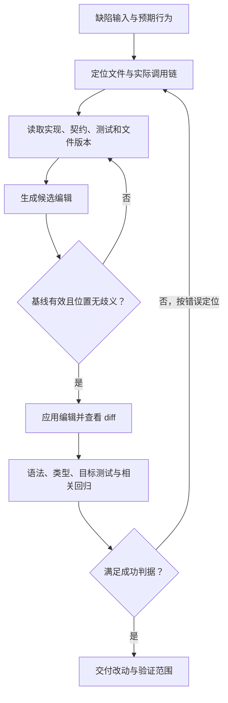

# 第二十四章：Coding Agent 的代码搜索、编辑与验证

## 24.1 从一张缺陷单开始，而不是从“全库理解”开始

> 下面是一个虚构的 Python 报表服务案例：查询接口约定 `None` 不限条数、`0` 返回空列表、正整数限制条数，负数由入口拒绝；测试同学小周却发现 `limit=0` 返回了全部 3 条记录。

开发者把缺陷交给 Agent，要求修复查询接口，又不能改变后台导出任务的既有行为。困难不是模型会不会写 `is None`，而是它能否证明：找到了真正执行的函数，只改了该改的位置，并且没有用一个绿色的语法检查冒充业务验收。

[第 19 章](../02-runtime-harness/19-tool-registry-and-execution-pipeline.md)已经解释工具如何调度与返回错误；[第 20 章](../02-runtime-harness/20-permissions-sandbox-isolation.md)解释执行边界；[第 23 章](../02-runtime-harness/23-tracing-evaluation-cost-and-coding-agent-case-study.md)比较产品与记录成本。本章只把代码这条链走透：



“找到代码”与“允许改代码”是两次不同判断。搜索返回的是候选证据；真正编辑前还要确认调用关系、目标版本与业务约束。

## 24.2 先把搜索问题缩小到能够回答

Agent 最初只知道“报表查询的条数限制失效”。直接搜索 `limit` 会命中连接池、重试器、导出器和测试夹具，结果多不代表理解多。

它先用 glob 看报表相关文件和测试的路径，再在这些候选目录内搜索请求字段或接口错误消息。下面是案例目录中的只读命令示意，不是要求在本知识库运行：

```bash
rg --files src tests -g '**/reports/**/*.py' -g '*report*.py'
rg -n -F 'limit' src/reports tests/reports -g '*.py'
```

第一条借助 ripgrep 的文件枚举与 glob 过滤定位文件名，第二条才读文件内容。实际的忽略规则、隐藏文件和大小写选项会影响覆盖范围；没有命中时，应先确认搜索范围，而不是马上断言代码不存在。

| 已有线索 | 优先选择 | 能回答什么 | 容易误判什么 |
|---|---|---|---|
| 大致文件名、扩展名或目录 | glob | 哪些路径值得打开 | 路径名称不等于业务职责，生成代码与被忽略文件可能不在结果中 |
| 字段、错误消息、函数名 | grep / ripgrep | 该文本在哪些位置出现 | 同名符号、注释和字符串不是同一条调用链 |
| 已知具体符号，需要理解使用者 | 符号定义、引用、调用层级 | 定义在哪、哪些位置引用它、可解析的调用关系 | 动态导入、反射、运行时注册可能不完整 |
| 只有业务描述，不知道代码术语 | 语义搜索，必要时混合关键词 | 哪些实现与意图相关 | 相似不等于实际执行；索引可能落后于工作区 |

这里的分类参考李博杰（Bojie Li）《深入理解 AI Agent》的[搜索与编辑讨论](https://github.com/bojieli/ai-agent-book/blob/985a49d35b9f50937f1f757cf25867672991ded7/book/chapter5.md#L227-L307)，但不把任何工具顺序当作所有任务都应遵守的流程。

有精确报错就先搜索报错；已知类名且语言服务可用，就直接跳定义。glob 避免读取正文，通常适合缩小范围，但网络文件系统、大量目录项或已有索引会改变耗时，不能仅凭工具名字断定谁一定更快。

### 从文本命中走到调用关系

小周的接口最后落到 `src/reports/query.py` 的 `take_rows`。同名函数也出现在 `src/reports/export.py`，而导出配置把 `0` 约定为“不设上限”。修改所有同名函数会制造另一个缺陷。

Agent 需要从路由处理函数追到实际导入的 `take_rows`，再查看其引用，确认查询与导出走不同实现。符号导航比字符串命中更适合区分这种情况；如果没有语言服务，就沿导入语句、调用点与已有测试手动追踪，不能把文本搜索的结果列表称为完整调用图。

AST 能识别函数、调用表达式等语法结构，但单靠 AST 通常不知道跨模块名字最终绑定到谁。LSP 是客户端与语言服务通信的协议；定义、引用、调用层级等能力依赖服务器实现和能力协商，并不保证解析出每一条运行时调用。

客户端如何请求这些关系，可以对照 [LSP 3.17 的定义、引用与调用层级接口](https://microsoft.github.io/language-server-protocol/specifications/lsp/3.17/specification/)阅读。

如果一开始连 `take_rows` 都不知道，语义搜索可以用“截取报表结果数量”召回候选函数。按函数分块能保留局部语义，但装饰器、类状态和调用方仍可能在块外。命中后必须回到当前文件读取，并核对索引对应的提交或文件版本。

### 停止搜索需要理由

当 Agent 已确认入口对 `limit` 的解析、实际调用的实现、导出的不同约定以及覆盖这些行为的测试位置，就有了修复所需的最小证据集。继续逐页翻全库只会增加噪音。

反过来，如果调用方可能传字符串 `"0"`，就还不能改：先确定参数何时变成整数。这个问题会影响补丁是否真的触发，而不是可以省略的“周边细节”。

## 24.3 取足上下文，不是多读几行就够了

Agent 打开函数时看到了这行：

```text
return rows[:limit] if limit else rows
```

它确实把 `0` 和 `None` 合并成了同一分支，但仅凭这一行，无法判断谁才是错误的一方：实现错了，也可能是测试误解了 API。

于是 Agent 接着读取函数签名、同文件的入口处理、接口契约与现有测试。案例中，入口把缺失参数转为 `None`，把 `"0"` 转为整数 `0`，并拒绝负数；查询契约也明确允许返回空列表。这才支持修改查询函数，而不是把 `0` 从请求中删掉。

读文件工具最好返回相对路径、完整行区间、是否截断，以及文件内容哈希或宿主文档版本。哈希用来识别读取基线；单独记录提交 SHA 不够，因为工作区可能有尚未提交的修改。

行号是方便引用的元数据，不是源码的一部分。把 `42: return ...` 的行号前缀抄进旧字符串会导致匹配失败；模型看到的省略号、截断提示也不能拿来替代实际代码。

上下文应覆盖“会改变判断的部分”。本例需要查询入口与导出约定，不需要整份报表渲染模板。如果读取范围切断了一个分支、装饰器或测试夹具，应扩大到完整结构，而不是固定只拿命中点前后五行。

## 24.4 编辑格式决定模型必须准确表达什么

文本替换与 diff 都能表达本次修复。差别不只是 Token 数，而是执行器凭什么相信修改位置：

| 编辑格式 | 定位依据与适合场景 | 主要失败方式 | 应采取的约束 |
|---|---|---|---|
| 完整文件重写 | 小文件、新文件或整体重构 | 漏掉未展示内容，顺手改动无关格式 | 必须有完整基线，检查整个文件差异 |
| 旧字符串 → 新字符串 | 局部改动，以当前原文作锚点 | 零匹配、多匹配、转义或空白不一致 | 非空旧串、默认唯一匹配，歧义时补上下文 |
| 行号区间 → 新内容 | 大段删除、范围明确的编辑 | 前一次插入或他人编辑导致行号漂移 | 绑定文档版本，声明所有区间使用哪个基线 |
| 带上下文的 diff | 多处相关变更，可读性较好 | hunk 上下文过期，宽松匹配落到相似段 | 明确补丁语法，冲突时拒绝或显式合并 |
| 变更意图 → Apply Model | 由另一模型把简写意图合成候选文件 | 合并模型误解省略段，改错同构代码 | 候选结果仍需基线校验、diff 审阅与测试 |

这里把确定性补丁执行与 Apply Model 分开：前者按约定解析修改；后者再次调用模型解释修改意图。不能因为输入长得像 diff，就认为合并过程一定是确定性的。

同样，“diff”不是任意编辑工具都通用的协议。Git unified diff 与某些工具的自定义 patch 语法并不相同；模型必须按当前工具契约生成，不能混用头部与区间标记。

本次改动很小，适合包含函数签名的精确旧字符串，或带上下文的补丁。以下是**原创、完整的单个 hunk 示意**；文件路径属于案例，未包含项目导入、HTTP 层与测试文件，不是可直接应用到本仓库的补丁：

```diff
--- a/src/reports/query.py
+++ b/src/reports/query.py
@@ -1,2 +1,2 @@
 def take_rows(rows: list[str], limit: int | None) -> list[str]:
-    return rows[:limit] if limit else rows
+    return rows if limit is None else rows[:limit]
```

### 拒绝多匹配，是保护意图而不是工具笨

假设查询文件内还有一段相同的 `return`，短旧字符串就会命中两次。Agent 不能为了“让工具成功”而打开 `replace_all`；应把目标函数签名和相邻代码一起作为锚点，重新确认只有一处匹配。

即使搜索跨文件发现相同代码，也要按各自契约决策。本例导出器的 `0` 语义不同，应保留其实现，并保留对应回归测试。

只提供开头与结尾的区间替换能减少长旧串，但两个边界各自唯一并不等于中间内容仍然可信；执行器还要检查顺序、配对与整个基线。把“复制成本低”换成“默认删除没读过的中间段”并不安全。

### 文本保真比肉眼相似更严格

旧字符串必须来自原始读取结果，不应自动把直引号改成弯引号、把 Tab 换成空格，或对 Unicode 做未经约定的规范化。视觉相近的字符可能不同，Python 缩进也参与语法。

换行编码、文件末尾换行与工具参数的转义层也要保留。JSON 字符串中的 `\n` 解码为换行，`\\n` 解码后则是反斜杠和字母 n；执行器应比较解码后的目标文本，不靠反复增加反斜杠猜测。

LSP 位置还涉及协商的字符编码单位，不能把 Unicode 码点数、UTF-16 代码单元数与字节偏移混用。含中文或 emoji 的行尤其能暴露这种偏移错误。坐标适配属于编辑器实现，不应让模型凭视觉计算。

## 24.5 旧字符串还在，也可能已经不该改了

第二个失败分支更隐蔽：Agent 读取文件后，另一位开发者调整了入口对 `limit` 的解释，但目标 `return` 没变。旧字符串仍能唯一匹配，旧补丁却可能已经不符合新契约。

因此匹配唯一性与基线新鲜度要分别检查。执行器应把“当前版本等于读取版本”作为写入前置条件；不一致就返回冲突、实际版本与受影响范围，让 Agent 重读相关契约后再生成候选，而不是静默覆盖。

检查和写入之间也不能留出另一个写者插入的空档。受控编辑服务可以用串行化或版本比较后写入的机制；原子文件替换只能避免读到半份文件，**单独使用并不能防止丢失并发更新**。不受服务控制的外部编辑者，需要宿主提供一致性保障或检测并升级冲突。

如果采用行号编辑，同一批多个区间应基于同一快照计算，拒绝重叠区间，再由执行器一致地应用。按倒序处理不重叠区间能减少批内行号漂移，但不能解决基线已经过期的问题。

重新读取后若发现用户已经做了等价修复，Agent 应检查现有 diff 与测试，而不是重复应用。如果用户改动与任务要求矛盾，就说明冲突所在，不能擅自把用户改动恢复成自己更熟悉的版本。

### 编辑报错后，文件可能已经变了

李博杰配套的 [`EditTool`](https://github.com/bojieli/ai-agent-book/blob/985a49d35b9f50937f1f757cf25867672991ded7/chapter5/coding-agent/tools/edit_tool.py)展示了非空旧串检查、默认唯一匹配，以及写后检查。它先写入文件，再报告语法问题，没有自动回滚。因此，Agent 收到“语法检查失败”时，应先读回当前内容，不能按“编辑从未发生”重试原补丁。

这个小实现没有覆盖版本比较与并发写入保护，接入宿主时仍需补齐。检查器也应使用项目实际支持的语言版本与配置，不能把一次语法检查当作完整类型检查或业务测试。

## 24.6 查看 diff 后，再问每一层验证证明了什么

补丁应用成功，只证明执行器接受了编辑请求。Agent 应先查看工作区 diff：目标分支是否改成显式判断 `None`，导出实现是否未动，有没有整文件换行变化，新增测试是否还在验证原来的需求。

随后依次使用项目已有工具，由便宜、局部的检查走向与影响面匹配的回归。它们回答的问题不同，不能彼此替代：

| 层级 | 本次修复要看什么 | 通过后仍不能断言什么 |
|---|---|---|
| 语法或编译前端 | 修改后的文件能否按项目语言版本解析、编译 | 不能证明条数限制正确，也不能保证依赖可用 |
| 类型检查 | `limit` 的可空类型、调用方传参和返回类型是否一致 | 两个合法整数值的业务差别可能完全不受类型系统约束 |
| 目标测试 | `None`、`0`、正整数、空输入的返回值 | 不能证明请求参数真的按约定传到了函数 |
| 接口或集成测试 | 请求 `limit=0` 是否返回空结果，负数是否仍被入口拒绝 | 不能证明其他调用方行为不变 |
| 相关回归 | 导出器 `0` 仍不限条数，其他报表查询不受影响 | 不能据此宣布全库与生产环境无缺陷 |

Python 的 [`ast.parse`](https://docs.python.org/3/library/ast.html#ast.parse)得到 AST，也不等于完成所有编译与作用域检查；`py_compile` 更不执行业务断言。验证报告应写实际使用的检查器及覆盖范围，而不是笼统标成“lint 成功”。

### 先证明测试会抓住旧错误

下面是可单独运行的原创纯计算示例，需要 Python 3.10 或更新版本。它完整演示函数级最小复现与成功判据，不读写文件、不启动 HTTP 服务，也不模拟整个项目：

```python
def before(rows: list[str], limit: int | None) -> list[str]:
    return rows[:limit] if limit else rows


def after(rows: list[str], limit: int | None) -> list[str]:
    return rows if limit is None else rows[:limit]


rows = ["甲", "乙", "丙"]
assert before(rows, 0) == rows
assert before(rows, 0) != []

cases = [
    (rows, None, rows),
    (rows, 0, []),
    (rows, 1, ["甲"]),
    (rows, 3, rows),
    (rows, 5, rows),
    ([], 0, []),
]
for source, limit, expected in cases:
    snapshot = source.copy()
    assert after(source, limit) == expected
    assert source == snapshot

print("旧错误已复现；6 个函数级样例满足预期")
```

前两条断言确认旧实现确实返回全部记录；如果把“结果必须等于空列表”的验收断言放到旧实现上，它就会失败。修改后再通过同一判据，才说明测试不是无论怎么写都会绿。

表中没有负数的函数级样例，因为本例约定由入口拒绝负数，不要求内部切片函数重复校验。真实项目必须在入口测试该约束；若函数会被外部直接调用，则需要重新讨论校验边界，不能靠本例假设遮住漏洞。

返回值相等与对象身份相同也不是一回事。本例只约定内容与输入不变，不新增“总是返回副本”的需求；是否需要复制，应由调用方契约决定。

## 24.7 根据错误回到正确的位置

如果工具报告旧串匹配两处，修复对象是**定位证据**：补读函数上下文，缩小锚点。继续改 `new_string` 不会减少旧串的歧义。

如果类型检查发现调用方传入 `str | None`，修复对象可能是**输入边界**：回到参数转换位置，确认 `"0"` 与缺失值是否被区分。不要靠类型断言把它强行变成 `int`，也不要扩大接受类型来掩盖不符合约定的调用。

如果函数样例通过、接口测试仍返回全部记录，优先检查入口是否真的调用了修改的函数，以及是否有缓存、数据库查询或序列化层提前处理条数。绿色单测不能推翻红色接口测试。

如果检查器根本没启动，或者测试在依赖初始化阶段失败，应明确记为“未验证”，保留命令、退出状态与首个有效错误。不能反复改业务代码来治疗缺失依赖，更不能把跳过测试当成修复。

恢复时先确认哪些内容已经写入。语法失败不自动意味着文件没改；此时应读取当前版本，修正自己引入的错误，或只撤销自己的差异。整文件覆盖与粗暴恢复基线都可能抹掉用户并发改动。

当多轮重试只重复同一个错误、没有新证据时，应停止并说明缺什么：可能是接口契约、可用环境或并发编辑协调。有限重试不是降低可靠性，而是避免用更多修改扩大不确定性。

## 24.8 如何评价这套流程，而不是只看一次成功演示

面试中若被问到“为什么不统一使用语义搜索和 Apply Model”，可以回到这次修复：字段名已知，文本搜索足以快速缩小范围；调用关系需要符号或导入证据；改动只有一行，再调用一个模型合并只会引入额外解释步骤。

换成跨模块重构，结论可能不同。应在相同仓库快照、模型与预算下，比较精确搜索、符号增强、语义召回等方案；预先固定成功判据，不让模型改写测试来定义自己的成功。

检索侧看是否找到真正的执行点与受影响调用方，以及读取量、轮数和耗时。编辑侧看正确应用率、歧义拒绝率、冲突检测与无关变更；把错误位置上的“成功写入”计作失败，而不是工具成功。

还应有意插入两类扰动：复制一段同构代码，检查 Agent 是否误用全量替换；在读取后修改入口契约，检查它是否识别过期基线并保留并发改动。这样才测到了本章最重要的失败分支，而不只是模型会写一行 Python。

最终交给小周的应是可解释的差异：查询把 `None` 与 `0` 分开，导出约定没变；函数样例覆盖了什么、接口和相关回归覆盖了什么、哪些环境尚未验证，分别说清楚。工程交付的边界由这些证据决定，不由 Agent 最后一条“已完成”决定。

如果同类错误反复出现，先按[第二十五章](../07-post-training/25-agent-post-training.md)定位模型第一次做错决定的位置，再判断该改工具、提示还是训练数据，不要把每次编辑失败都归因于模型能力。

## 参考资料与来源边界

- 李博杰（Bojie Li），《深入理解 AI Agent：设计原理与工程实践》[第五章相关段落](https://github.com/bojieli/ai-agent-book/blob/985a49d35b9f50937f1f757cf25867672991ded7/book/chapter5.md#L227-L307)：用于搜索类别、编辑格式与即时反馈的讨论。固定提交 `985a49d35b9f50937f1f757cf25867672991ded7`，查阅于 2026-09-14。
- 同提交 [`edit_tool.py`](https://github.com/bojieli/ai-agent-book/blob/985a49d35b9f50937f1f757cf25867672991ded7/chapter5/coding-agent/tools/edit_tool.py)：用于匹配与写后检查的讨论。上游仓库按 [Apache-2.0](https://github.com/bojieli/ai-agent-book/blob/985a49d35b9f50937f1f757cf25867672991ded7/LICENSE) 发布，第三方内容保留原许可；本章未搬运其实现或配图。
- [Language Server Protocol 3.17](https://microsoft.github.io/language-server-protocol/specifications/lsp/3.17/specification/)：定义、引用、调用层级与位置编码机制。查阅于 2026-09-14。
- [Python `ast.parse` 文档](https://docs.python.org/3/library/ast.html#ast.parse)：解析 AST 与完整编译检查的边界。查阅于 2026-09-14。

原创中文说明、案例、示例与图示：Polo Li，采用 [CC BY 4.0](https://creativecommons.org/licenses/by/4.0/)；引用资料的权利与许可归原作者。
