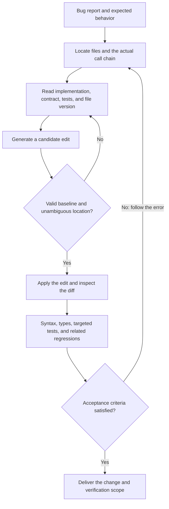

# Chapter 24: Code Search, Editing, and Verification for Coding Agents

## 24.1 Start with a bug report, not “understanding the entire repository”

> Consider a fictional Python reporting service. Its query API specifies that `None` means no row limit, `0` returns an empty list, positive integers limit the number of rows, and the entry point rejects negative values. Zhou, a tester, discovers that `limit=0` returns all 3 records.

A developer asks the agent to fix the query API without changing the existing behavior of background exports. The difficult part is not whether the model can write `is None`. It is whether the agent can establish that it found the function actually executed, changed only the appropriate location, and did not substitute a passing syntax check for business acceptance.

[Chapter 19](../02-runtime-harness/19-tool-registry-and-execution-pipeline.md) explains tool scheduling and error reporting; [Chapter 20](../02-runtime-harness/20-permissions-sandbox-isolation.md) covers execution boundaries; [Chapter 23](../02-runtime-harness/23-tracing-evaluation-cost-and-coding-agent-case-study.md) compares products and explains cost tracking. This chapter follows the code-specific process in detail:



“Found the code” and “may change this code” are separate judgments. Search produces candidate evidence. Before editing, the agent must still confirm call relationships, the target version, and business constraints.

## 24.2 Narrow the search until it can answer a concrete question

Initially, the agent knows only that the report query's row limit does not work. Searching directly for `limit` finds connection pools, retry handlers, exporters, and test fixtures. More results do not imply better understanding.

The agent first uses glob patterns to identify report-related source and test paths, then searches those candidate directories for request fields or API error messages. These are illustrative read-only commands for the case study's directory, not instructions to run them in this knowledge base:

```bash
rg --files src tests -g '**/reports/**/*.py' -g '*report*.py'
rg -n -F 'limit' src/reports tests/reports -g '*.py'
```

The first command uses ripgrep's file listing and glob filtering to find filenames; only the second reads file contents. Ignore rules, hidden-file settings, and case-sensitivity options affect coverage. If nothing matches, first check the search scope rather than conclude that the code does not exist.

| Available clue | Preferred tool | What it can answer | What can mislead you |
|---|---|---|---|
| Approximate filename, extension, or directory | glob | Which paths are worth opening | A pathname does not establish business responsibility; generated or ignored files may be absent |
| Field, error message, or function name | grep / ripgrep | Where the text occurs | Same-named symbols, comments, and strings do not constitute one call chain |
| A known symbol whose users matter | Definitions, references, and call hierarchy | Where it is defined, which sites reference it, and resolvable call relationships | Dynamic imports, reflection, and runtime registration may not be fully resolved |
| A business description without code terminology | Semantic search, combined with keywords when useful | Which implementations may match the intent | Similarity does not prove execution; the index may lag behind the workspace |

This classification draws on the [discussion of search and editing](https://github.com/bojieli/ai-agent-book/blob/985a49d35b9f50937f1f757cf25867672991ded7/book/chapter5.md#L227-L307) in Bojie Li's *Understanding AI Agents*, but no tool ordering is a universal workflow.

If you have an exact error message, search for it first. If you know the class name and have a language service, jump straight to its definition. Glob patterns avoid reading file bodies and are usually useful for narrowing scope, but network filesystems, large directory listings, and existing indexes affect latency. A tool's name alone does not establish that it is always faster.

### From text matches to call relationships

Zhou's API eventually reaches `take_rows` in `src/reports/query.py`. A function with the same name also exists in `src/reports/export.py`, but the export configuration defines `0` as “unlimited.” Changing every same-named function would introduce another bug.

The agent must trace the route handler to the `take_rows` it actually imports, inspect references, and confirm that queries and exports use different implementations. Symbol navigation distinguishes these cases better than text matches. Without a language service, trace imports, call sites, and existing tests manually; do not describe a list of text matches as a complete call graph.

An AST identifies syntax such as functions and call expressions, but an AST alone generally does not resolve cross-module name bindings. LSP is the communication protocol between a client and a language service. Definition, reference, and call-hierarchy support depends on the server implementation and negotiated capabilities; it does not guarantee resolution of every runtime call.

See the [LSP 3.17 definition, reference, and call-hierarchy interfaces](https://microsoft.github.io/language-server-protocol/specifications/lsp/3.17/specification/) for how clients request these relationships.

If the agent does not yet know about `take_rows`, semantic search for “limit the number of report results” can retrieve candidate functions. Function-based chunks preserve local semantics, but decorators, class state, and callers may remain outside the chunk. After a match, return to the current file and check the commit or file version represented by the index.

### Stopping the search requires a reason

Once the agent has confirmed how the entry point parses `limit`, which implementation runs, the exporter's different convention, and where tests cover these behaviors, it has the minimum evidence needed for the fix. Continuing to browse the entire repository adds noise.

Conversely, if a caller might pass the string `"0"`, it is too early to edit. First determine where the argument becomes an integer. This affects whether the patch will take effect at all; it is not an incidental detail.

## 24.3 Enough context means more than a few surrounding lines

Opening the function reveals:

```text
return rows[:limit] if limit else rows
```

This does send `0` and `None` down the same branch. The line alone, however, does not tell us whether the implementation is wrong or the test misunderstands the API.

The agent therefore reads the function signature, entry-point handling in the same file, API contract, and existing tests. In this case, the entry point converts a missing parameter to `None`, converts `"0"` to integer `0`, and rejects negative values. The query contract explicitly permits an empty result. That evidence supports changing the query function rather than removing `0` from the request.

A file-reading tool should return the relative path, complete line range, truncation status, and a content hash or host document version. The hash identifies the read baseline. A commit SHA alone is insufficient because the workspace may contain uncommitted edits.

Line numbers are reference metadata, not source code. Copying a prefix such as `42: return ...` into the old string makes matching fail. Ellipses and truncation notices shown to the model are not substitutes for the actual code either.

Context should include whatever can change the decision. Here, that means the query entry point and export convention, not the entire report-rendering template. If a read cuts through a branch, decorator, or test fixture, expand it to include the complete structure instead of always taking five lines around the match.

## 24.4 The edit format determines what the model must express precisely

Both string replacement and a diff can express this fix. Their differences are not limited to token count: they provide different grounds for trusting the edit location.

| Edit format | Location evidence and suitable uses | Main failure modes | Required safeguards |
|---|---|---|---|
| Rewrite the entire file | Small files, new files, or comprehensive refactoring | Omitting unseen content; incidental formatting changes | Require a complete baseline and review the whole-file diff |
| Old string → new string | Local changes anchored in current source text | No match, multiple matches, escaping or whitespace differences | Require a nonempty old string and a unique match by default; add context when ambiguous |
| Line range → new content | Large deletions or clearly bounded edits | Line drift after an earlier insertion or another person's edit | Bind to a document version and state the baseline used by every range |
| Contextual diff | Several related changes with readable presentation | Stale hunk context; permissive matching against a similar passage | Specify patch syntax; reject conflicts or merge them explicitly |
| Change intent → apply model | Another model turns abbreviated intent into a candidate file | Misinterpreting omitted passages or modifying similar but unintended code | Still require baseline validation, diff review, and tests |

Deterministic patch application and an apply model are different mechanisms. The former parses edits according to an agreed format; the latter calls another model to interpret the intended change. Input that resembles a diff does not make the merge deterministic.

Nor is “diff” a universal protocol shared by all editing tools. Git unified diffs differ from the custom patch syntax used by some tools. The model must follow the current tool contract, not mix headers and range markers from different formats.

This change is small enough for an exact old string containing the function signature, or a contextual patch. The following is an **original, complete single-hunk illustration**. Its path belongs to the case study; it omits project imports, the HTTP layer, and test files, and cannot be applied directly to this repository:

```diff
--- a/src/reports/query.py
+++ b/src/reports/query.py
@@ -1,2 +1,2 @@
 def take_rows(rows: list[str], limit: int | None) -> list[str]:
-    return rows[:limit] if limit else rows
+    return rows if limit is None else rows[:limit]
```

### Rejecting multiple matches protects intent

Suppose the query file contains another identical `return` statement. A short old string then matches twice. The agent must not enable `replace_all` just to make the tool succeed. It should include the target function signature and neighboring code as an anchor, then confirm that only one match remains.

Identical code found across files must also be judged against each file's contract. The exporter's `0` has a different meaning, so its implementation and regression test must remain intact.

Specifying only the start and end of a replacement range saves copying a long old string. Yet unique boundary markers do not prove that the intervening content is still valid. The executor must check ordering, pairing, and the entire baseline. Lower copying cost is not a justification for deleting an unread middle section by default.

### Text fidelity is stricter than visual similarity

The old string must come from the original read result. Do not automatically replace straight quotes with curly ones, tabs with spaces, or apply unspecified Unicode normalization. Visually similar characters may differ, and Python indentation affects syntax.

Preserve newline encoding, the final newline, and escaping layers in tool arguments. In a JSON string, `\n` decodes to a newline; `\\n` decodes to a backslash followed by the letter n. The executor should compare the decoded target text, not guess by adding more backslashes.

LSP positions also depend on negotiated character-encoding units. Unicode code points, UTF-16 code units, and byte offsets are not interchangeable. Lines containing Chinese characters or emoji expose these errors particularly clearly. Coordinate conversion belongs in the editor implementation; the model should not calculate it visually.

## 24.5 The old string can still match when the edit is no longer valid

A second failure is subtler. After the agent reads the file, another developer changes the entry point's interpretation of `limit`, but leaves the target `return` unchanged. The old string still matches uniquely, yet the patch may no longer satisfy the new contract.

Match uniqueness and baseline freshness therefore require separate checks. Before writing, the executor should require the current version to equal the version that was read. On a mismatch, it should return a conflict, the actual version, and the affected scope, so the agent can reread the relevant contract and generate a new candidate rather than silently overwrite changes.

There must also be no gap between checking and writing in which another writer can intervene. A controlled editing service can serialize writes or use compare-and-write version checks. Atomic file replacement prevents readers from seeing a partially written file, but **does not, by itself, prevent lost concurrent updates**. For external editors outside the service's control, the host must provide consistency guarantees or detect and escalate conflicts.

For line-based editing, calculate all ranges in a batch against the same snapshot, reject overlaps, and apply the ranges consistently. Applying nonoverlapping ranges in reverse order reduces line drift within the batch; it does not fix a stale baseline.

If rereading shows that the user has already made an equivalent fix, inspect the existing diff and tests rather than apply the change again. If the user's edits conflict with the task requirements, explain the conflict; do not restore the file to a version that happens to be more familiar to the agent.

### A failed edit report does not mean the file is unchanged

The companion [`EditTool`](https://github.com/bojieli/ai-agent-book/blob/985a49d35b9f50937f1f757cf25867672991ded7/chapter5/coding-agent/tools/edit_tool.py) in Bojie Li's book demonstrates a nonempty-old-string check, unique matching by default, and post-write checks. It writes the file before reporting syntax problems, with no automatic rollback. When the agent receives “syntax check failed,” it should read back the current file instead of retrying the original patch as though no edit occurred.

This small implementation does not provide version comparison or concurrent-write protection; host integration must supply them. Checkers should also use the language version and configuration actually supported by the project. A syntax check is not a complete type check or a business test.

## 24.6 After reviewing the diff, ask what each verification layer proves

A successfully applied patch proves only that the executor accepted the edit request. First inspect the workspace diff: does the intended branch now test `None` explicitly, is the export implementation untouched, did whole-file newline changes occur, and do the added tests still check the original requirement?

Then use the project's existing tools, moving from inexpensive local checks to regressions that match the impact of the change. Each layer answers a different question:

| Layer | What to examine for this fix | What a pass still does not establish |
|---|---|---|
| Syntax or compiler front end | Whether the modified file parses or compiles under the project's language version | Correct row limits or available dependencies |
| Type checking | Whether nullable `limit`, caller arguments, and return types agree | Business distinctions between two valid integer values may be outside the type system |
| Targeted tests | Results for `None`, `0`, positive integers, and empty input | Whether request parameters actually reach the function as specified |
| API or integration tests | Whether `limit=0` returns no rows and the entry point still rejects negatives | Whether other callers remain unaffected |
| Related regressions | Whether export `0` remains unlimited and other report queries are unchanged | A defect-free repository or production environment |

Python's [`ast.parse`](https://docs.python.org/3/library/ast.html#ast.parse) produces an AST without performing every compilation or scoping check. `py_compile` does not execute business assertions either. State the actual checker and its coverage rather than labeling everything “lint passed.”

### First establish that the test catches the old bug

The following original, self-contained computation requires Python 3.10 or later. It demonstrates a minimal function-level reproduction and acceptance criteria. It does not access files, start an HTTP server, or simulate the entire project:

```python
def before(rows: list[str], limit: int | None) -> list[str]:
    return rows[:limit] if limit else rows


def after(rows: list[str], limit: int | None) -> list[str]:
    return rows if limit is None else rows[:limit]


rows = ["甲", "乙", "丙"]
assert before(rows, 0) == rows
assert before(rows, 0) != []

cases = [
    (rows, None, rows),
    (rows, 0, []),
    (rows, 1, ["甲"]),
    (rows, 3, rows),
    (rows, 5, rows),
    ([], 0, []),
]
for source, limit, expected in cases:
    snapshot = source.copy()
    assert after(source, limit) == expected
    assert source == snapshot

print("旧错误已复现；6 个函数级样例满足预期")
```

The three Chinese characters are sample row values. The final message means “The old bug was reproduced; 6 function-level cases meet expectations.” The first two assertions confirm that the old implementation returns every row. Applying the acceptance assertion “the result must equal an empty list” to that implementation would fail. Passing the same criterion after the fix establishes that the test is not green regardless of implementation.

There is no negative-value function test because the case assigns negative-value rejection to the entry point; the internal slicing function need not duplicate it. A real project must test this boundary at the entry point. If external callers can invoke the function directly, reconsider where validation belongs rather than hide the gap behind this example's assumption.

Equal return values and identical object identity are also different requirements. This case specifies returned contents and unchanged input; it does not add a requirement to always return a copy. Whether copying is necessary depends on the caller's contract.

## 24.7 Follow each error back to the right part of the process

If the tool reports two old-string matches, the problem to fix is **location evidence**: read more function context and refine the anchor. Changing `new_string` does not remove ambiguity in the old string.

If a type checker finds that a caller passes `str | None`, the issue may lie at the **input boundary**. Return to parameter conversion and confirm that `"0"` and a missing value are distinguished. Do not force an `int` with a type assertion or broaden accepted types to conceal a caller that violates the contract.

If function tests pass but the API still returns every row, first check whether the entry point calls the modified function and whether a cache, database query, or serialization layer applies the limit earlier. Green unit tests do not invalidate a failing API test.

If a checker never starts, or tests fail during dependency initialization, record the behavior as **unverified**, retaining the command, exit status, and first meaningful error. Repeated business-code edits will not repair missing dependencies; skipping tests is not a fix.

Before recovery, establish what has already been written. A syntax failure does not automatically mean the file is unchanged. Read its current version and correct the error you introduced, or undo only your own difference. Whole-file replacement or indiscriminate restoration can erase concurrent user edits.

When retries repeat the same error without producing new evidence, stop and state what is missing: perhaps the API contract, a usable environment, or coordination between concurrent editors. Bounded retries improve reliability by preventing additional edits from amplifying uncertainty.

## 24.8 Evaluate the workflow, not just one successful demonstration

If an interviewer asks why semantic search and an apply model should not be used for everything, return to this repair. The field name was known, so text search could narrow scope quickly. Call relationships required symbol or import evidence. The edit changed one line; calling another model to merge it would introduce another interpretation step.

A cross-module refactor may lead to a different choice. Compare exact search, symbol-enhanced search, and semantic retrieval on the same repository snapshot, model, and budget. Fix acceptance criteria in advance; do not let the model redefine success by rewriting tests.

For retrieval, measure whether the agent found the actual execution point and affected callers, along with content read, number of rounds, and elapsed time. For editing, examine correct application, ambiguity rejection, conflict detection, and unrelated changes. Count a “successful write” to the wrong location as a failure, not a tool success.

Deliberately introduce two disturbances: duplicate a structurally similar code section to test misuse of global replacement, and change the entry-point contract after the read to test stale-baseline detection and preservation of concurrent edits. These test the chapter's central failure branches, not merely whether the model can write one line of Python.

The handoff to Zhou should make the change explainable: queries now distinguish `None` from `0`, while the export contract remains unchanged. State separately what the function examples cover, what API and related regressions cover, and which environments remain unverified. Those facts define the delivery boundary, not the agent's final “done.”

If the same class of failure recurs, use [Chapter 25](../07-post-training/25-agent-post-training.md) to locate the model's first incorrect decision before choosing a tool, prompt, or training-data change. Not every editing failure is a model-capability problem.

## References and source boundaries

- Bojie Li, *Understanding AI Agents: Design Principles and Engineering Practice*, [relevant Chapter 5 passages](https://github.com/bojieli/ai-agent-book/blob/985a49d35b9f50937f1f757cf25867672991ded7/book/chapter5.md#L227-L307): search categories, edit formats, and immediate feedback. Pinned commit `985a49d35b9f50937f1f757cf25867672991ded7`; consulted 2026-09-14.
- [`edit_tool.py` at the same commit](https://github.com/bojieli/ai-agent-book/blob/985a49d35b9f50937f1f757cf25867672991ded7/chapter5/coding-agent/tools/edit_tool.py): matching and post-write checking, especially the write-then-check sequence without automatic rollback.
- [Language Server Protocol 3.17](https://microsoft.github.io/language-server-protocol/specifications/lsp/3.17/specification/): definitions, references, call hierarchies, and position encodings. Consulted 2026-09-14.
- [Python `ast.parse` documentation](https://docs.python.org/3/library/ast.html#ast.parse): the boundary between AST parsing and complete compilation checks. Consulted 2026-09-14.
