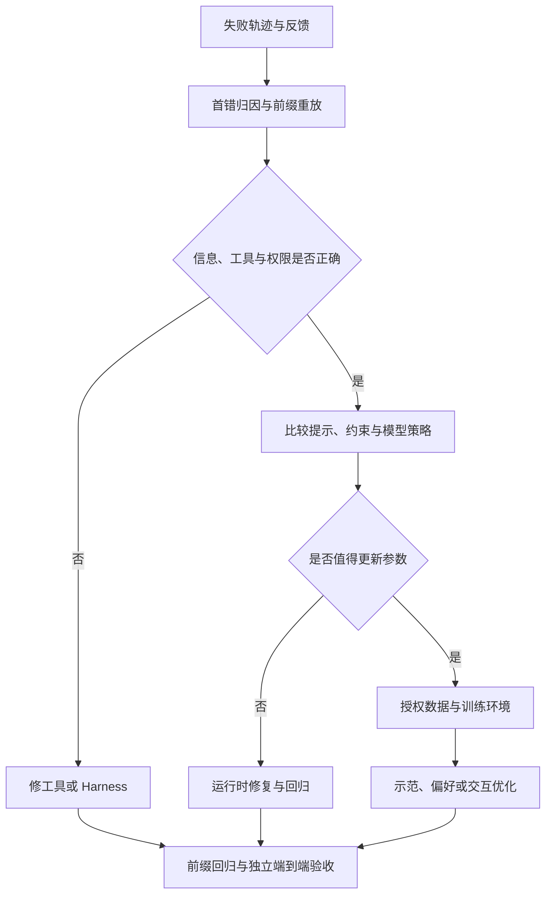
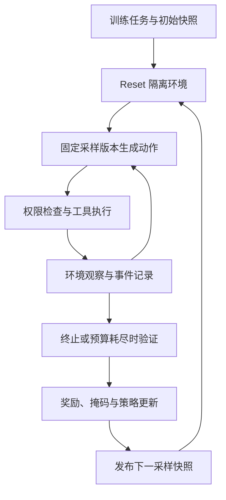

# 第二十五章：Agent 后训练：从失败轨迹到可靠策略

## 25.1 测试没过，不等于该训练模型

> 下面是一个虚构的 CSV 导出助手案例：产品要求固定列顺序、写入 UTF-8 BOM、空数据仍输出表头；助手只完成前两项便宣称全部完成。

工程师小周拿到用户反馈：“空表导出还是坏的。”她的第一步不是收集一批“不要提前结束”的句子，而是把用户请求、实际修改、工具返回和最后答复放在一起看。

工具记录显示，两项检查通过，空数据分支尚未实现。助手能看到这个结果，却回答“所有要求均已完成”。这里至少有两个待查问题：为什么遗漏实现，以及为什么在已知有缺项时收尾。只把最终失败标成负样本，会把此前正确的修改也混在一起。

**Agent 后训练要改变的是模型在特定状态下选择动作的倾向，不是替运行时补齐缺失的信息或权限。** 没读到验收要求、工具错误返回成功、模型看见缺项仍收尾，表面相似，修法完全不同。

[工具学习](../../tools/01-function-calling/02-tool-learning.md)已介绍工具轨迹和 assistant-only loss；[后训练方法](../../llm/02-training-alignment/10-post-training.md)与 [DPO/PPO 对比](../../llm/02-training-alignment/11-dpo-vs-ppo.md)解释算法。本章只沿着一次失败，讨论怎样把工程证据接到训练和验收。

## 25.2 先找到第一个不可接受的决策

小周从最后的失败向前查，但按时间顺序核对证据。最后一个报错只是入口；第一个工具失败也未必是策略错误，合理探索可能失败，再由助手恢复。

| 查到的证据 | 暂时归因 | 下一步 |
|---|---|---|
| 用户原请求有第三项，实际模型输入被截断后没有 | 上下文装配或数据管线 | 修截断和需求保留策略，再重放 |
| 检查脚本只跑两项，却返回 `all_passed` | 工具或验证契约 | 明确已检查、未检查和失败项 |
| 输入含三项要求与缺项结果，助手直接宣布全完成 | 候选策略错误 | 冻结收尾前状态，测是否稳定复现 |
| 推理连接中断后，UI 自动补出“已完成” | 运行时终止处理 | 区分正常终止、截断与异常 |
| 用户中途取消，助手停止并如实报告部分完成 | 不应标为过早结束 | 保留取消与交接语义 |

她记录首错位置、错误类别、责任组件、输入证据，以及尚未排除的其他原因。若早期规划已经明确删掉第三项，那才是更早的错误；若只是先做两项，仍可能正常接着做，不能仅凭任务暂未完成就判错。

本例假定此前没有违反约束的动作，第一处可确认的错误是准备生成“全部完成”的决策。冻结它能隔离收尾策略，但不能证明最初为什么漏改；两者需要分别保留假设。

### 字符复制失败也要这样拆

另一条轨迹出现 `old_string` 匹配失败时，不能直接增加“精确复制 SFT”。沿文件读取、工具返回、上下文序列化、模型输出、JSON 解析、工具匹配逐段找首次差异。

比如 JSON 源文本里的 `\n` 解码后是换行，`\\n` 解码后是反斜杠加字母 `n`。日志显示的转义形式不同，并不自动表示内容改变。应在相同语义层比较字节、Unicode 码点与首次差异位置；token ID 只在同一 tokenizer 下比较。

读取工具若压缩了空白，修工具；JSON 被二次转义，修适配层；工具使用了过期文件快照，处理版本冲突。只有确认模型收到准确内容、输出首先改变目标字符，才把它列为模型复制能力候选。若拿不到原始输入或输出，保留“未能归因”，不要用最终错误强行补标签。

不同编辑格式的匹配和版本问题，见[第二十四章：代码搜索、编辑与验证](../06-coding-agents/24-code-search-edit-verification.md)。

## 25.3 冻结的是决策前的完整条件

小周截下错误答复之前的轨迹。所谓**决策前缀**，不是一段“你还没做完，请继续”的新提示，而是当时模型实际看到的全部有效消息与工具定义，以及这些消息对应的环境状态。

这种把失败切成决策边界的做法，可对照李博杰书中[首错归因与前缀回归](https://github.com/bojieli/ai-agent-book/blob/985a49d35b9f50937f1f757cf25867672991ded7/book/chapter7.md#L434-L535)的讨论。

| 冻结内容 | 为什么不能缺 |
|---|---|
| 此前的 system、user、assistant、tool 消息与调用关联 ID | 保留真实指令优先级、已做动作和观察 |
| 工具 Schema、工具版本、Harness 与上下文模板版本 | 参数含义、输出解析和截断都可能改变行为 |
| 工作区快照、依赖、外部服务夹具与随机种子 | 同样的检查应针对同样的文件和状态 |
| 读写范围、网络限制、审批状态与剩余预算 | 合法动作和能否继续取决于这些条件 |
| 用户成功条件与验证器版本 | 区分“实现了”“检查了”和“允许交付了” |
| 采样模型、tokenizer、解码配置和数据来源 | 支持复现、版本对照与数据治理 |

首错之后的批评、最终正确补丁和隐藏验收答案不能倒灌进前缀。否则训练教的是“看到纠正后改口”，而上线需要的是“尚未被纠正时就选对”。

冻结并不等于把生产上下文全部送去训练。先确认训练用途授权，替换凭据和个人信息，隔离租户数据；替换后重新确认错误仍成立。审计原件与训练副本分开授权、记录血缘和保留期。脱敏不能替代授权，详见[反馈闭环与数据治理](../../engineering/06-performance-operations/13-feedback-loop-data-flywheel.md)。

回归应检查下一步或有限几步的**可观察行为**，不要求输出或采集私有思维链，也不把不可见推理日志当必需标签。服务要求回传的不透明 reasoning 状态按接口契约保留，不擅自解析成训练文本。

### 为同一状态写出允许与禁止动作

在本例的收尾前缀上，允许先读取空数据实现、执行空数据探针，或在已有充分证据时直接提交合法修补；不是必须逐字复制某条“标准操作”。

禁止动作包括：未补第三项便声称全部完成、篡改验收断言、伪造检查结果、越权读取业务数据。若环境确实阻塞，应允许报告缺项并交接；但本例工具可用、要求清楚，“需要用户重新确认是否要空表头”不是合理澄清。

这样定义的是**行为边界**：可以走不同的正确路径，但最终交付声明必须由当前版本的证据支持。前缀回归通过，只说明这个边界上的行为改善，不等于整项任务完成。

## 25.4 决定修哪里，再选择训练信号



小周先让检查工具返回覆盖清单，并在运行时设置完成门禁。若一个清晰提示就能稳定避免误报、额外成本可接受，没必要先动权重。硬权限和验收门禁也不应在训练之后删除。

当同类错误在多个任务族持续出现，已有足够可信的纠正数据，且提示方案仍有明显失败或成本问题，才比较参数更新。模型还必须有可训练权重或明确支持该训练方式的托管接口；拥有一个聊天 API 并不意味着能对它运行任意 DPO 或 PPO。

| 当前缺口 | 可尝试的信号 | 先证明什么 |
|---|---|---|
| 不会补空数据分支或不会调用检查工具 | SFT 示范 | 正确续写可执行，工具与角色格式正确 |
| 会继续修复，却常选提前结束 | 同前缀偏好对 | 优劣来自动作质量，而非上下文差异 |
| 局部动作合理，连续多步仍难完成 | 可重置环境中的交互训练 | 能稳定采样、验证，且有合法成功路径 |
| 学生常进入示范未覆盖的状态 | 学生采样、教师监督 | 教师能纠正这些状态，接口与数据许可满足要求 |

这些不是必经的四个阶段。少量失败可能只够验证假设，不能凭一个固定样本门槛决定“现在适合微调”。

## 25.5 一条前缀怎样变成训练样本

### 共同上下文，两个不同的下一步

下面是**教学用偏好样本清单**，不是训练框架或模型厂商的请求格式。`messages_ref` 指向经授权、不可变的完整消息序列；内联 `last_observation` 只是其最后一条工具消息的摘要，不可拿它替代整个前缀。制成数据集时必须解析引用并校验摘要与原件一致，缺少文件就报错。

```json
{
  "id": "csv-empty-header-01",
  "prefix": {
    "messages_ref": "fixture://csv/messages-before-completion-v1",
    "snapshot_ref": "fixture://csv/workspace-after-two-fixes-v1",
    "tools_ref": "fixture://csv/tool-schemas-v1",
    "harness_version": "harness-v1",
    "verifier_version": "csv-contract-v1",
    "permissions": {
      "read": ["src/export.py", "tests/"],
      "write": ["src/export.py"],
      "network": false
    },
    "remaining_tool_calls": 6,
    "success_conditions": [
      "固定列顺序",
      "输出包含 UTF-8 BOM",
      "空数据仍输出表头"
    ],
    "last_observation": {
      "role": "tool",
      "tool_call_id": "check-02",
      "result": {
        "passed": ["column_order", "utf8_bom"],
        "failed": ["empty_header"],
        "artifact_version": "worktree-v2"
      }
    }
  },
  "chosen": {
    "role": "assistant",
    "tool_calls": [{
      "id": "inspect-03",
      "name": "read_file",
      "arguments": {"path": "src/export.py"}
    }]
  },
  "rejected": {
    "role": "assistant",
    "content": "三项要求均已完成，可以交付。"
  }
}
```

这里的 `read_file` 只读指定路径，工具返回文件内容与版本；它在示例工具集中可用。偏好不是“长答复胜过短答复”，而是同一个已知缺项状态下，读取实现以继续处理比虚报完成更合适。`chosen` 只是可接受下一步之一，还不是修复成功标签。

这个 JSON 能检验结构，却不能单独运行轨迹：示例引用没有附带真实快照和工具实现。实际流水线还应锁定模型、tokenizer、模板、文件内容哈希，以及调用前后的状态证据。

两支必须从同一个前缀分叉。不能给 `chosen` 加上事后“第三项没完成”的用户提醒，却不给 `rejected`；也不能一边有写权限，一边被只读沙箱阻塞。

### SFT：示范不止一句“继续检查”

小周让标注员从快照继续：读取空数据分支、补实现、运行相关检查、核对三项条件，再如实收尾。她执行这段续写，确认没有改动验证器，也没有把先前正确的列顺序和 BOM 弄坏。

可以把首错边界的正确下一步作为短 SFT 样本，也可以保留修复到交付的多轮轨迹。短样本更聚焦边界，但不能独自教会完整修复；长样本覆盖恢复过程，却更容易混入无关操作与过长上下文。

前缀作为条件，纠正后的 assistant 动作作为训练目标；不要把冻结前缀中已有错误重新当正例。角色掩码、调用序列化、停止标记与截断规则沿用[工具学习](../../tools/01-function-calling/02-tool-learning.md)的说明，并检查训练模板能被部署端正确消费。

### 偏好：标签必须对应真实行为

对下一步偏好，检查动作合法且确实针对缺项；对多轮续写偏好，还要分别恢复快照、执行两支，检查结果与副作用。两条都合理就不强分胜负，两条都不合格也不能仅因一条“稍好”便自动加入纠正数据。

教师可以生成候选，但“我会验证”不等于已经调用工具。无依据的完成承诺应与调用事件、检查结果交叉核对；存在歧义的标签交人工复核，不把教师评价当客观执行记录。

扩充数据时改变缺失条件、任务来源和工具组合，而不只是换文件名。也要覆盖已完成应收尾、信息不足应澄清、越权应拒绝的状态，否则模型可能学到“不结束总比结束安全”。

### 小数据 DPO 的反例说明了什么

李博杰配套的[“过早结束”教学实验](https://github.com/bojieli/ai-agent-book/blob/985a49d35b9f50937f1f757cf25867672991ded7/chapter8/premature-completion-dpo/README.md)，在固定提交中使用合成的小规模偏好数据。README 报告固定候选比较有所改善，但自由生成出现过度谨慎，已完成任务的正常收尾明显退化。

这不能表述为“DPO 已提升 Agent 总体可靠性”。候选打分只测指定两个回答的相对倾向，自由生成还受到措辞、长度与整个输出空间的影响；二者都不能替代实际执行。这里值得借鉴的是**未完成边界集和正常收尾保留集必须分开**，而不是复用实验数字作为收益承诺。

## 25.6 多轮训练：把环境真正接进循环

上述单步样本直接针对收尾选择，不能据此判断后续修复能力。若助手知道要继续，却读错文件、重复修补或永远验证，就需要观察它在自己的动作之后会走到哪些新状态。



图中的回路不是一边读结果一边随意改权重。一次采样应能追溯到确定策略版本，更新后再按训练方案同步采样器；独立验收不参与这个奖励循环。

| 环节 | CSV 助手需要的具体契约 |
|---|---|
| Reset | 恢复任务初始文件、依赖和服务夹具；清除上次写入与缓存，核对快照 |
| Rollout | 记录模型动作、工具观察、状态版本、预算消耗与终止原因 |
| 执行 | 保留生产中相关的工具语义，但使用隔离文件与假数据，禁止真实业务副作用 |
| 验证 | 读取真实导出结果，检查三项条件、禁止改动和完成声明 |
| 优化 | 绑定奖励版本、动作 token 掩码、采样概率与所用算法配置 |
| 验收 | 使用不参与采样和调参的任务、环境与验收数据 |

从中途前缀 reset，必须恢复**动作后的实际快照**，不能只把旧工具消息粘到全新工作区。并发 rollout 使用独立环境；外部服务无法可靠重放时，要么提供语义明确的夹具，要么将不可复现范围记入结论，不能声称严格可重现。

环境观察 token 不是模型动作，不应被当作该策略采样的 token 计算策略概率比或策略梯度。观察仍会影响后续动作；屏蔽的是动作损失，不是从上下文删掉工具反馈。

### 奖励如何找到真正该改的动作

如果只在最后给任务成功奖励，读取、修改、重复测试和收尾共享了粗糙的结果信号。它不会直接告诉模型“第几轮提前结束导致失败”。PPO 的价值估计或适当的回报分配可以缓解这一点，但不能把最终奖励解释成逐步因果标签。

小周可以为“准确识别尚缺条件”增加过程信号，但必须防止助手反复报告同一缺项刷分；奖励“运行测试”也可能诱导不断重跑已有通过项。过程信号应落在可核验、不可重复套利的事件上，并持续检查它是否损害最终完成率。

路径约束则检查不允许做什么：改验收器、越权写文件、伪造执行结果。不能用足够多的成功奖励抵消严重越权；关键限制由沙箱直接阻止，违规事件另外记录。结果奖励与路径约束的组合可参考 RLVP 讨论，但这里不把一种奖励配方当作安全边界。

每个约束都要有可达的合规路径。本例禁止修改测试，但允许修 `src/export.py` 并执行检查；如果连目标文件也只读，正确行为只能是说明阻塞或请求授权，不能仍要求“修复并交付”。若当前策略从不采到合规成功，可先补示范、调整任务难度；组内奖励相同的限制见 [LLM 第十章](../../llm/02-training-alignment/10-post-training.md) §10.4。

### 失败、超时和未知要分别处理

| 终止情况 | 应保留的判定 |
|---|---|
| 当前产物违反空表头条件 | 可复核的任务失败，按预定奖励规则处理 |
| 一直重复检查直到用尽预算 | 策略未在预算内完成，记录动作与全部成本 |
| 沙箱服务故障，产物无法验收 | 基础设施错误、结果未知；隔离、重跑并报告占比 |
| 用户取消或权限不足 | 按取消、交接或澄清任务契约评价，不冒充正常完成 |

不能把所有失败自动记为零，也不能跳过所有超时，只在顺利结束的样本上汇报成功率。策略截断、真正终止和基础设施异常要分开；是否 bootstrap、是否重采样、哪些样本进入优化，由算法和任务契约明确规定。

验证器必须在模型不可修改的信任边界运行，读真实状态而不是完成关键词。训练验证器可以提供学习反馈，最终验收器不得把留出答案回流给模型；“隐藏”指隔离验收实现与数据，不是隐藏用户应知的成功条件。

## 25.7 在轨蒸馏：学生走路，教师给监督

示范往往很顺利，学生却可能在第一次编辑失败后进入没见过的状态。在轨蒸馏的出发点是让当前学生生成轨迹，再让教师在这些学生实际访问的前缀上提供监督，而不是只模仿教师自己走出的成功路线。

要把三个版本分清：**谁采样状态、谁提供教师信号、谁接受参数更新**。同时记录采样引擎、模板、tokenizer 与解码配置；核对更新前采样端和训练端的 log probabilities 是否在约定容差内一致。异步积压的旧轨迹需要有版本滞后策略，不能无限混用仍称严格在轨。

若采用逐 token 分布蒸馏，需要教师支持相应 logits 或 log probabilities、可兼容的词元空间与合法的数据使用授权。只有生成文本的 API 不能提供完整分布；只有 top-k 概率也不等于全词表分布，需要明确近似目标及未覆盖概率的处理。

拿不到分布时，可以在学生前缀上收集教师纠正文本，经执行校验后做监督学习；应称作这种数据采集与训练组合，不能伪称完成了分布级 KL 蒸馏。教师也可能误判空表头需求，因此教师信号不能替代最终产物验证。

在轨蒸馏可能减少为获取反馈而额外探索的次数，但会增加教师推理开销。是否划算，要比较每次有效修复消耗的环境交互、教师调用和训练成本，不是看到密集监督就断言样本效率必然提高。

## 25.8 上线前，不只问“还有没有提前结束”

小周将数据先按任务来源、仓库或客户、模板家族与时间划分，再在各分区内扩充。来自同一失败的改名版本、同一会话的不同前缀、同一补丁的不同描述应归到同一组，避免近重复跨越训练和测试。

已经用于训练的失败可以保留为**已知问题回归**，但不能再称独立测试；被反复用于挑 checkpoint 的数据属于开发集。独立留出集不参与候选筛选、教师示范构造或奖励调参。

| 验收层 | 要回答的问题 | 必须观察 |
|---|---|---|
| 前缀回归 | 已知错误边界是否修复 | 允许动作命中、禁止动作、无证据完成声明 |
| 端到端留出 | 从新任务起点能否真正完成 | 最终产物、完整性、路径合规、恢复能力 |
| 原能力保留集 | 是否把正确行为一起改坏 | 正常收尾、必要澄清、合理拒绝、原有工具与通用能力 |

三层都应包含自由生成与适用的真实执行，而不只做固定候选比较。前缀回归允许多条合法路径；端到端通过不靠“已完成”关键词；保留集尤其要查已完成之后是否重复验证、无谓请求确认，或不再正常答复。

对照至少保留原模型加原 Harness，以及原模型加运行时修复的方案，才能分清收益来自参数还是工具改动。固定任务预算和采样设置，报告分层计数、重复运行波动、总失败成本与每成功任务成本，避免用更多调用换分却不披露。

上线门槛应预先规定，而不是看完结果才挑有利指标：降低提前结束不能以明显增加过度拒绝、越权或预算耗尽为代价。低样本下没有观察到问题不等于证明可靠；保持版本可回退，用灰度反馈继续观察真实任务分布。指标细节见 [Agent 评估](../05-production/14-agent-evaluation.md)。

## 25.9 后训练与运行时反思各自留下什么

[反思与自我改进](../02-reasoning-planning/12-agent-reflection.md)可以让助手在当前任务中发现空表头遗漏，把适用经验放入有作用域的记忆；这通常不更新模型权重。下一次若经验没被检索到，或上下文挤掉了它，收益就可能消失。

后训练把经验证的行为倾向写入参数，可能减少反复提示的成本，却更难按单条经验撤回，也可能影响无关任务。频繁变化的用户偏好、权限与业务规则更适合受治理的运行时配置；稳定、反复出现的策略缺陷才值得考虑训练。

两条路可以配合：反思提供待复核的失败解释，回归确认边界，训练学习跨任务行为。不能让模型写一条“下次注意完成所有任务”，便自动把它存为事实、加入训练并宣布能力改善。

回到小周的处理，她最终需要交出的不是一条下降的训练损失，而是一组能追溯的证据：原来在哪里错、为什么归给模型、同一状态允许做什么、新策略能否执行到正确结果，以及原来正确的行为有没有被破坏。

## 参考资料

- 李博杰，`ai-agent-book` 第七章：[失败归因、精确复制排查与轨迹前缀回归](https://github.com/bojieli/ai-agent-book/blob/985a49d35b9f50937f1f757cf25867672991ded7/book/chapter7.md#L434-L535)。
- 李博杰，第八章：[多轮信用分配、奖励与在轨蒸馏](https://github.com/bojieli/ai-agent-book/blob/985a49d35b9f50937f1f757cf25867672991ded7/book/chapter8.md#L564-L706)，[从问题案例到后训练](https://github.com/bojieli/ai-agent-book/blob/985a49d35b9f50937f1f757cf25867672991ded7/book/chapter8.md#L731-L792)。
- 李博杰，配套实验：[过早结束的 DPO 修复 README](https://github.com/bojieli/ai-agent-book/blob/985a49d35b9f50937f1f757cf25867672991ded7/chapter8/premature-completion-dpo/README.md)，重点参照数据、评估指标口径与可信根说明。

资料查阅于 2026-09-14，固定提交为 `985a49d35b9f50937f1f757cf25867672991ded7`。DPO 结果仅转述 README，未独立复现训练；其中候选比较与自由生成的差异不能外推为总体任务完成率提升。RLVP 等方法线索不代表本章完成了相应训练实验。
