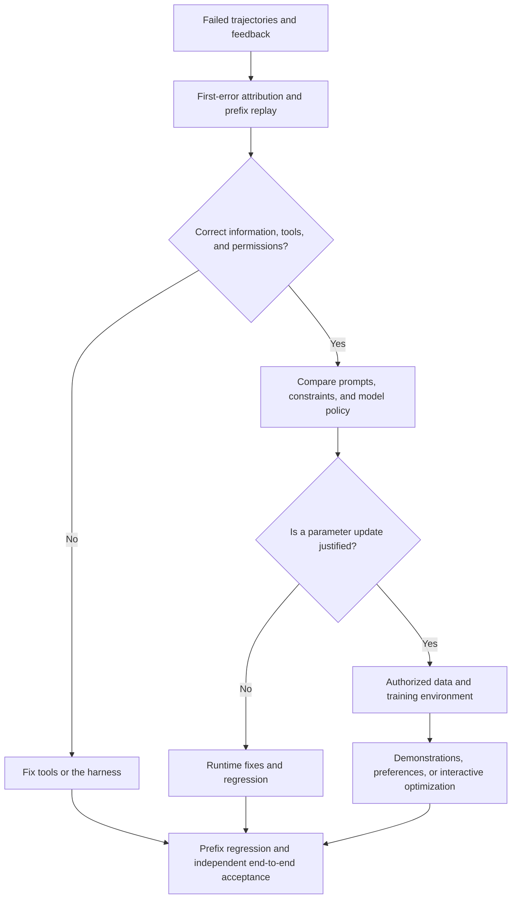
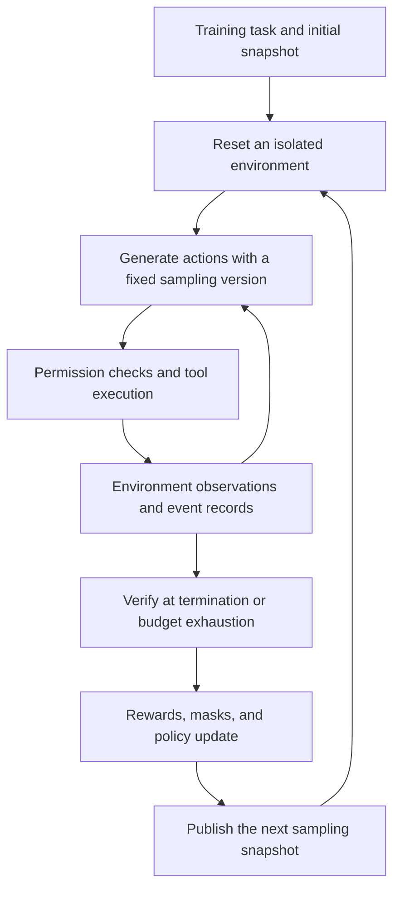

# Chapter 25: Agent Post-Training: From Failed Trajectories to Reliable Policies

## 25.1 A failing test does not necessarily mean the model needs training

> Consider a fictional CSV export assistant. The product requires a fixed column order, a UTF-8 BOM, and a header even when the data is empty. The assistant implements only the first two requirements, then claims that everything is complete.

Zhou, an engineer, receives the user's feedback: “Exporting an empty table is still broken.” Rather than collect a batch of “do not stop early” instructions, she first compares the request, the actual changes, tool results, and final reply.

The tool record shows that two checks passed while the empty-data branch remains unimplemented. The assistant can see this result but responds, “All requirements are complete.” At least two questions need investigation: why was the implementation omitted, and why did the assistant stop despite knowing something was missing? Labeling only the final failure as a negative example also sweeps the earlier correct edits into that label.

**Agent post-training changes the model's tendency to choose actions in particular states. It does not supply information or permissions missing from the runtime.** Missing acceptance requirements in context, a tool that reports an error as success, and a model that sees an unmet requirement but stops anyway can look similar. They require different remedies.

[Tool Learning](../../tools/01-function-calling/02-tool-learning.md) covers tool trajectories and assistant-only loss. [Post-Training Methods](../../llm/02-training-alignment/10-post-training.md) and [DPO versus PPO](../../llm/02-training-alignment/11-dpo-vs-ppo.md) explain the algorithms. This chapter follows one failure to show how engineering evidence connects to training and acceptance.

## 25.2 Find the first unacceptable decision

Zhou works backward from the final failure, but checks the evidence in chronological order. The last error is only a starting point. Even the first tool failure may not be a policy error: reasonable exploration can fail and the assistant can recover.

| Evidence found | Provisional attribution | Next step |
|---|---|---|
| The user's request includes the third requirement, but the truncated model input does not | Context assembly or data pipeline | Fix truncation and requirement retention, then replay |
| The checking script runs only two checks but returns `all_passed` | Tool or verification contract | Distinguish checked, unchecked, and failed items |
| Input contains all three requirements and the missing-item result, yet the assistant announces completion | Candidate policy error | Freeze the state before the completion claim and test reproducibility |
| The inference connection breaks and the UI automatically inserts “completed” | Runtime termination handling | Distinguish normal termination, truncation, and exceptions |
| The user cancels; the assistant stops and accurately reports partial completion | Not premature completion | Preserve cancellation and handoff semantics |

She records the first-error location, error category, responsible component, input evidence, and alternative causes not yet ruled out. If an earlier plan explicitly dropped the third requirement, that would be an earlier error. Merely doing two items first is not enough to establish failure: the assistant may still continue normally.

This case assumes no preceding action violated constraints. The first confirmed error is the decision about to produce the “everything is complete” response. Freezing that boundary isolates the stopping policy; it does not establish why the implementation was initially omitted. Keep those hypotheses separate.

### Apply the same decomposition to character-copying failures

When another trajectory encounters an `old_string` mismatch, do not immediately add “exact-copy SFT.” Find the first difference along the path from file reading through tool output, context serialization, model output, JSON parsing, and tool matching.

For example, `\n` in JSON source decodes to a newline, whereas `\\n` decodes to a backslash followed by `n`. Different escaped representations in logs do not automatically mean the content changed. Compare bytes, Unicode code points, and the first differing position at the same semantic layer; compare token IDs only under the same tokenizer.

If the reading tool collapses whitespace, fix the tool. If JSON is escaped twice, fix the adapter. If the tool uses a stale file snapshot, handle the version conflict. Treat model copying ability as a candidate cause only after confirming that the model received the correct content and its output was the first place the target characters changed. Without raw input or output, retain “unattributed” instead of inferring a label from the final error.

See [Chapter 24: Code Search, Editing, and Verification](../06-coding-agents/24-code-search-edit-verification.md) for matching and version issues across editing formats.

## 25.3 Freeze the complete conditions before the decision

Zhou cuts the trajectory just before the incorrect response. A **decision prefix** is not a new prompt saying “you are not finished; continue.” It includes all effective messages and tool definitions the model actually saw, together with the environment state those messages describe.

This division of a failure at a decision boundary can be compared with Bojie Li's discussion of [first-error attribution and prefix regression](https://github.com/bojieli/ai-agent-book/blob/985a49d35b9f50937f1f757cf25867672991ded7/book/chapter7.md#L434-L535).

| What to freeze | Why it matters |
|---|---|
| Earlier system, user, assistant, and tool messages, with call correlation IDs | Preserves actual instruction priority, completed actions, and observations |
| Tool schemas and versions, harness version, and context-template version | Parameter meanings, output parsing, and truncation can change behavior |
| Workspace snapshot, dependencies, external-service fixtures, and random seeds | The same checks must operate on the same files and state |
| Read/write scope, network restrictions, approval state, and remaining budget | These determine which actions are permitted and whether work can continue |
| User success criteria and verifier version | Separates “implemented,” “checked,” and “approved for delivery” |
| Sampling model, tokenizer, decoding configuration, and data provenance | Supports reproduction, version comparisons, and data governance |

Do not leak criticism after the first error, the eventual correct patch, or hidden acceptance answers back into the prefix. Otherwise the training task becomes “change your answer after correction,” whereas deployment requires choosing correctly before anyone intervenes.

Freezing does not mean sending every production context into training. Confirm authorization for training use, replace credentials and personal information, and isolate tenant data. After replacement, confirm that the failure still holds. Apply separate access controls, lineage records, and retention periods to audit originals and training copies. De-identification is not a substitute for authorization; see [Feedback Loops and Data Governance](../../engineering/06-performance-operations/13-feedback-loop-data-flywheel.md).

Regression should check the next action, or a bounded sequence of **observable actions**. It need not output or collect private chain of thought, nor require invisible reasoning logs as labels. Preserve opaque reasoning state required by a service according to its interface contract; do not reinterpret it as training text.

### Define allowed and forbidden actions for the same state

At this case's stopping boundary, acceptable actions include reading the empty-data implementation, running an empty-data probe, or applying a valid fix directly when sufficient evidence already exists. There is no requirement to copy a single “standard action” verbatim.

Forbidden actions include claiming full completion before implementing the third requirement, changing acceptance assertions, inventing check results, and reading business data without authorization. If the environment really is blocked, reporting the missing item and handing off should be allowed. Here, however, the tools are available and the requirement is clear. Asking the user to reconfirm whether empty exports need headers is not a reasonable clarification.

This defines a **behavioral boundary**. Several correct paths may be possible, but the final delivery claim must be supported by evidence about the current version. A passing prefix regression shows improvement at that boundary, not completion of the entire task.

## 25.4 Choose what to fix before choosing a training signal



Zhou first makes the checking tool return a coverage list and adds a completion gate in the runtime. If a clear prompt reliably prevents false completion claims at an acceptable additional cost, there is no reason to start with a weight update. Hard permission checks and acceptance gates should not be removed after training either.

Consider parameter updates when the same errors persist across task families, enough trustworthy corrections exist, and the prompt-based approach still has substantial failure or cost problems. The model must also expose trainable weights or a hosted interface that explicitly supports the method. Access to a chat API does not imply that arbitrary DPO or PPO training is possible.

| Current gap | Candidate signal | What to establish first |
|---|---|---|
| Cannot implement the empty-data branch or call the checking tool | SFT demonstrations | The correct continuation executes and uses valid tool and role formats |
| Can continue repairing but often chooses to stop early | Same-prefix preference pairs | Preference reflects action quality rather than different contexts |
| Individual actions are reasonable, but multi-step completion remains difficult | Interactive training in a resettable environment | Sampling and verification are stable and a permitted successful path exists |
| The student frequently reaches states absent from demonstrations | Student sampling with teacher supervision | The teacher can correct those states, and interfaces and data permissions support the method |

These are not four mandatory stages. A small set of failures may only be enough to test a hypothesis; no fixed sample threshold can establish that fine-tuning is now appropriate.

## 25.5 Turn a prefix into a training example

### Shared context, two different next actions

The following is an **educational preference-example manifest**, not a request format for a training framework or model provider. `messages_ref` points to an authorized, immutable full message sequence. The inline `last_observation` summarizes only its final tool message and cannot replace the entire prefix. Dataset construction must resolve the reference and check the summary against the original; a missing file must produce an error.

```json
{
  "id": "csv-empty-header-01",
  "prefix": {
    "messages_ref": "fixture://csv/messages-before-completion-v1",
    "snapshot_ref": "fixture://csv/workspace-after-two-fixes-v1",
    "tools_ref": "fixture://csv/tool-schemas-v1",
    "harness_version": "harness-v1",
    "verifier_version": "csv-contract-v1",
    "permissions": {
      "read": ["src/export.py", "tests/"],
      "write": ["src/export.py"],
      "network": false
    },
    "remaining_tool_calls": 6,
    "success_conditions": [
      "固定列顺序",
      "输出包含 UTF-8 BOM",
      "空数据仍输出表头"
    ],
    "last_observation": {
      "role": "tool",
      "tool_call_id": "check-02",
      "result": {
        "passed": ["column_order", "utf8_bom"],
        "failed": ["empty_header"],
        "artifact_version": "worktree-v2"
      }
    }
  },
  "chosen": {
    "role": "assistant",
    "tool_calls": [{
      "id": "inspect-03",
      "name": "read_file",
      "arguments": {"path": "src/export.py"}
    }]
  },
  "rejected": {
    "role": "assistant",
    "content": "三项要求均已完成，可以交付。"
  }
}
```

The Chinese sample strings retain the three requirements—fixed column order, UTF-8 BOM, and headers for empty data—and the rejected claim, “All three requirements are complete and ready for delivery.”

Here, `read_file` reads only the specified path and returns its contents and version; it is available in the example tool set. The preference does not reward a long answer over a short one. Given the same known missing requirement, reading the implementation to continue is more appropriate than falsely claiming completion. `chosen` is only one acceptable next action, not a successful-repair label.

This JSON permits structural checking but cannot replay the trajectory on its own: the example references do not include real snapshots or tool implementations. A real pipeline must also pin the model, tokenizer, template, file-content hashes, and state evidence before and after calls.

Both branches must start from the same prefix. Do not give `chosen` a later user reminder that the third item is incomplete while withholding it from `rejected`. Nor may one branch have write permission while a read-only sandbox blocks the other.

### SFT: a demonstration is more than “keep checking”

Zhou asks an annotator to continue from the snapshot: inspect the empty-data branch, implement it, run relevant checks, confirm all three conditions, and report completion accurately. She executes that continuation to establish that it did not modify the verifier or break the previously correct column ordering and BOM.

The correct next action at the first-error boundary can form a short SFT example, or the example can retain the multi-turn trajectory from repair through delivery. Short examples focus on the boundary but cannot teach the complete repair alone. Longer examples cover recovery but more easily accumulate irrelevant operations and oversized contexts.

Use the prefix as conditioning context and corrected assistant actions as training targets. Do not relabel existing mistakes in the frozen prefix as positive examples. Follow the role-mask, call-serialization, stop-marker, and truncation discussion in [Tool Learning](../../tools/01-function-calling/02-tool-learning.md), and check that deployment can consume the training template correctly.

### Preferences: labels must describe actual behavior

For next-action preferences, check that the action is permitted and genuinely addresses the missing requirement. For multi-turn continuation preferences, restore the snapshot separately for each branch, execute both, and inspect outcomes and side effects. Do not force a winner when both paths are reasonable. When neither is acceptable, one being “slightly better” does not automatically qualify the pair as corrective data.

A teacher may generate candidates, but “I will verify” is not a tool invocation. Cross-check unsupported completion promises against call events and check results. Ambiguous labels require human review; a teacher's judgment is not an objective execution record.

When expanding the data, vary missing requirements, task origins, and tool combinations, not just filenames. Include states where work is complete and the agent should stop, where insufficient information requires clarification, and where unauthorized action requires refusal. Otherwise the model may learn that never stopping is always safer than stopping.

### What does the small-data DPO counterexample show?

At the pinned commit, Bojie Li's companion [premature-completion teaching experiment](https://github.com/bojieli/ai-agent-book/blob/985a49d35b9f50937f1f757cf25867672991ded7/chapter8/premature-completion-dpo/README.md) uses a small synthetic preference dataset. Its README reports improvements in fixed-candidate comparisons, but excessive caution during free generation and a substantial deterioration in normal completion of already-finished tasks.

This does not establish that DPO improved overall agent reliability. Candidate scoring measures the relative preference between two specified responses; free generation also depends on wording, length, and the broader output space. Neither replaces actual execution. The useful lesson is to **separate unfinished-task boundary cases from a retention set for normal completion**, not to reuse the experiment's numbers as a promised benefit.

## 25.6 Multi-turn training: put the environment inside the loop

The single-step example directly targets the stopping decision; it says little about subsequent repair ability. If the assistant knows to continue but then reads the wrong file, repeats a patch, or verifies forever, inspect the new states reached after its own actions.



This loop does not mean changing weights arbitrarily while reading results. Each rollout must be traceable to a definite policy version; after an update, synchronize samplers according to the training design. Independent acceptance remains outside this reward loop.

| Stage | Concrete contract for the CSV assistant |
|---|---|
| Reset | Restore initial task files, dependencies, and service fixtures; clear previous writes and caches; verify the snapshot |
| Rollout | Record model actions, tool observations, state versions, budget consumption, and termination reasons |
| Execution | Preserve relevant production tool semantics, but use isolated files and synthetic data; prohibit real business side effects |
| Verification | Read the actual export, checking all three conditions, prohibited changes, and completion claims |
| Optimization | Bind the reward version, action-token masks, sampling probabilities, and algorithm configuration |
| Acceptance | Use tasks, environments, and acceptance data excluded from sampling and tuning |

Resetting to an intermediate prefix requires restoring the **actual snapshot after the preceding actions**, not pasting old tool messages into a fresh workspace. Concurrent rollouts need separate environments. If an external service cannot be replayed reliably, supply fixtures with explicit semantics or state the nonreproducible scope in the conclusions; do not claim strict reproducibility.

Environment-observation tokens are not model actions. Do not treat them as policy-sampled tokens when calculating policy probability ratios or policy gradients. Observations still affect later actions: masking excludes them from the action loss, not from the context.

### How does a reward identify which action needs to change?

With only a final task-success reward, reading, editing, repeated tests, and stopping share a coarse outcome signal. It does not directly tell the model which premature-stopping decision caused failure. PPO value estimates or an appropriate allocation of returns may help, but the final reward is not a step-by-step causal label.

Zhou could add a process signal for correctly identifying an unmet requirement, but must prevent repeated reports of the same omission from earning repeated rewards. Rewarding “run a test” can likewise induce endless reruns of checks that already pass. Process signals should correspond to verifiable events that cannot be repeatedly exploited for credit, and their effect on final completion rate must be monitored.

Path constraints specify prohibited behavior: changing acceptance checks, writing files without authorization, or inventing execution results. Large success rewards must not compensate for serious authorization violations. A sandbox directly blocks critical violations, and violation events are recorded separately. RLVP offers a reference for combining outcome rewards with path constraints; no reward formula is treated here as a security boundary.

Every constraint needs a reachable compliant path. This case prohibits test modifications but allows changes to `src/export.py` and execution of checks. If even the target file is read-only, the correct behavior is to explain the block or request authorization, not to meet an impossible “fix and deliver” demand. If the current policy never samples compliant success, first add demonstrations or adjust task difficulty. See [LLM Chapter 10](../../llm/02-training-alignment/10-post-training.md), §10.4, for the limitations of identical rewards within a group.

### Distinguish failure, timeout, and unknown outcomes

| Termination condition | Classification to preserve |
|---|---|
| The current artifact violates the empty-header requirement | Reproducible task failure, handled under the predefined reward rules |
| Repeated checking exhausts the budget | The policy did not finish within budget; retain all actions and costs |
| A sandbox-service fault prevents artifact acceptance | Infrastructure error and unknown outcome; isolate, rerun, and report its frequency |
| User cancellation or insufficient permissions | Evaluate under the cancellation, handoff, or clarification contract; do not count it as ordinary completion |

Do not automatically score every failure as zero, or exclude every timeout and report success only for runs that end smoothly. Separate policy truncation, genuine termination, and infrastructure exceptions. The algorithm and task contract must explicitly determine bootstrapping, resampling, and inclusion in optimization.

The verifier must run across a trust boundary the model cannot modify, and inspect real state rather than completion keywords. A training verifier can provide learning feedback; the final acceptance verifier must not leak held-out answers back to the model. “Hidden” means isolating the acceptance implementation and data, not concealing success criteria the user should know.

## 25.7 On-policy distillation: the student explores, the teacher supervises

Demonstrations often proceed smoothly, while a student can enter an unfamiliar state after its first failed edit. On-policy distillation starts with trajectories generated by the current student, then obtains teacher supervision at the prefixes the student actually visits. It does not rely solely on successful trajectories generated by the teacher.

Keep three versions distinct: **the policy that samples states, the model that supplies teacher signals, and the model whose parameters are updated**. Record the sampling engine, template, tokenizer, and decoding configuration as well. Before an update, check that sampler and trainer log probabilities agree within the specified tolerance. Asynchronously queued old trajectories need a version-lag policy; unlimited mixing of stale trajectories is not strictly on-policy.

Token-distribution distillation requires a teacher interface that exposes the relevant logits or log probabilities, compatible token spaces, and authorized data use. A text-generation-only API cannot supply the full distribution. Top-k probabilities are not a full-vocabulary distribution either: specify the approximate objective and how uncovered probability mass is handled.

Without distribution access, collect teacher corrections on student prefixes, validate them through execution, and use supervised learning. Describe that data-collection and training procedure accurately; do not claim distribution-level KL distillation. A teacher can also misjudge the empty-header requirement, so its signal cannot replace verification of the final artifact.

On-policy distillation may reduce additional exploration needed to obtain feedback, but it adds teacher inference costs. Judge the tradeoff using environment interactions, teacher calls, and training cost per effective repair. Dense supervision alone does not guarantee better sample efficiency.

## 25.8 Before deployment, ask more than whether premature completion remains

Zhou first splits data by task origin, repository or customer, template family, and time, then expands examples within each partition. Renamed variants of the same failure, different prefixes from one conversation, and different descriptions of one patch belong in the same group so near-duplicates do not cross the train–test boundary.

Failures used for training may remain in a **known-issue regression set**, but no longer qualify as independent tests. Data repeatedly used to choose checkpoints forms a development set. An independent held-out set must not participate in candidate selection, teacher-demonstration construction, or reward tuning.

| Acceptance layer | Question | Required observations |
|---|---|---|
| Prefix regression | Has the known erroneous decision boundary been repaired? | Allowed-action selection, prohibited actions, and unsupported completion claims |
| End-to-end holdout | Can the agent actually finish from a new task's starting point? | Final artifact, completeness, path compliance, and recovery |
| Capability retention | Were previously correct behaviors damaged? | Normal completion, necessary clarification, appropriate refusal, and existing tool and general capabilities |

All three layers should include free generation and actual execution where applicable, not just fixed-candidate comparisons. Prefix regression permits multiple valid paths. End-to-end acceptance does not hinge on a “completed” keyword. The retention set should specifically detect repeated verification after completion, needless confirmation requests, or loss of normal responses.

Keep at least two baselines: the original model with the original harness, and the original model with runtime fixes. This separates benefits from parameter updates and tool changes. Hold task budgets and sampling settings fixed, and report stratified counts, variation across repeated runs, total failure costs, and cost per successful task. Do not hide extra calls behind an improved score.

Set release criteria in advance rather than select favorable metrics after seeing results. Reducing premature completion must not come at the cost of substantially more unnecessary refusals, authorization violations, or budget exhaustion. Observing no failures in a small sample does not prove reliability. Keep rollback available and use gradual-rollout feedback to monitor the real task distribution. See [Agent Evaluation](../05-production/14-agent-evaluation.md) for metric details.

## 25.9 What do post-training and runtime reflection each retain?

[Reflection and Self-Improvement](../02-reasoning-planning/12-agent-reflection.md) can help the assistant discover the missing empty-data header during the current task and store applicable lessons in scoped memory. This generally does not update model weights. If the lesson is not retrieved next time, or is pushed out of context, the benefit may disappear.

Post-training encodes validated behavioral tendencies in parameters. It may reduce repeated prompting costs, but retracting one particular lesson becomes harder and unrelated tasks can be affected. Frequently changing preferences, permissions, and business rules are better suited to governed runtime configuration. Stable, recurring policy defects are stronger training candidates.

The approaches can complement each other: reflection proposes explanations that require review, regression establishes the boundary, and training learns behavior across tasks. A model writing “next time, finish all tasks” is not enough to store the statement as fact, add it to training, or announce a capability improvement.

Zhou's deliverable is therefore not simply a lower training loss. It is traceable evidence: where the original failure occurred, why it was attributed to the model, which actions are permitted in that same state, whether the new policy can execute through to a correct result, and whether previously correct behavior remains intact.

## References

- Bojie Li, `ai-agent-book`, Chapter 7: [failure attribution, exact-copy diagnosis, and trajectory-prefix regression](https://github.com/bojieli/ai-agent-book/blob/985a49d35b9f50937f1f757cf25867672991ded7/book/chapter7.md#L434-L535).
- Bojie Li, Chapter 8: [multi-turn credit assignment, rewards, and on-policy distillation](https://github.com/bojieli/ai-agent-book/blob/985a49d35b9f50937f1f757cf25867672991ded7/book/chapter8.md#L564-L706), and [from failure cases to post-training](https://github.com/bojieli/ai-agent-book/blob/985a49d35b9f50937f1f757cf25867672991ded7/book/chapter8.md#L731-L792).
- Bojie Li, companion experiment: [README for the premature-completion DPO repair](https://github.com/bojieli/ai-agent-book/blob/985a49d35b9f50937f1f757cf25867672991ded7/chapter8/premature-completion-dpo/README.md), particularly its data, metric definitions, and trust-boundary discussion.

Sources were consulted on 2026-09-14 at pinned commit `985a49d35b9f50937f1f757cf25867672991ded7`. DPO results are reported from the README; training was not independently reproduced. The difference between candidate comparisons and free generation cannot be extrapolated to improved overall task completion. References to methods such as RLVP do not mean that this chapter carried out those training experiments.
