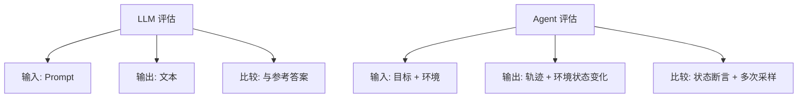
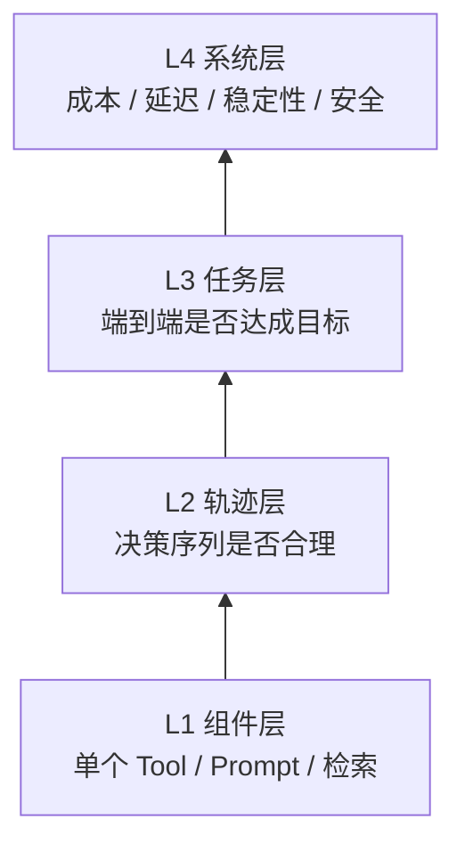
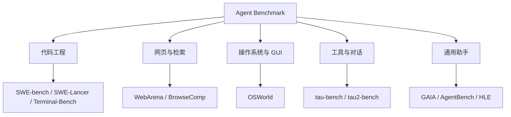
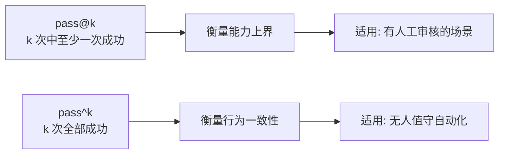
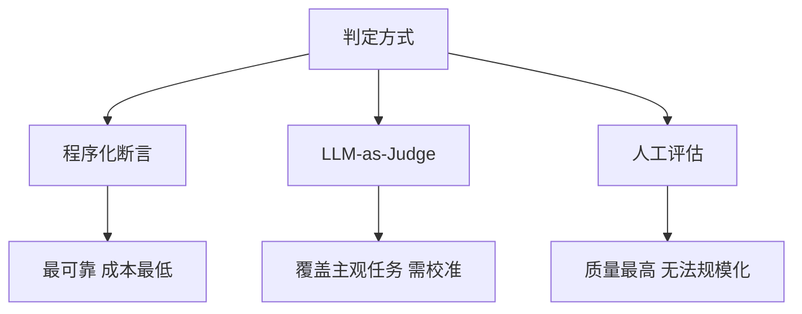
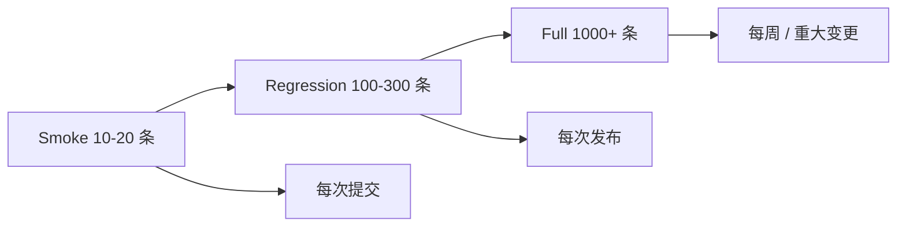
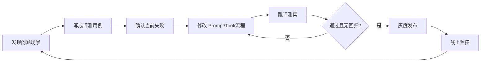

# 第十四章：Agent 评估与 Benchmark

## 14.1 为什么 Agent 评估是独立问题

评估普通 LLM 和评估 Agent 是两件事。

评估 LLM 时，输入是一段 Prompt，输出是一段文本，可以直接和参考答案比较。评估 Agent 时，输入是一个目标，输出是**一整条执行轨迹**：调用了哪些 Tool、传了什么参数、读到了什么结果、中途改了几次方向、最后改动了哪些外部状态。

这带来四个普通 LLM 评估不存在的困难。

**第一，没有唯一正确路径。** 同一个任务可以先搜索再读文件，也可以先读文件再搜索，两条路径都对。因此不能用「轨迹是否匹配参考轨迹」来打分。

**第二，结果不只是文本。** Agent 可能改了数据库、提交了代码、发了邮件。正确性必须在**环境状态**上验证，而不是在输出文本上验证。

**第三，行为不确定。** 同一个任务跑两次可能走不同路径、得到不同结果。单次运行的分数没有统计意义。

**第四，失败有多种形态。** 任务失败、工具调用格式错误、无限循环、超预算、越权操作，这些是不同的失败，不能合并成一个「错误率」。



## 14.2 评估的四个层次

一个完整的 Agent 评估体系应该覆盖四层，从下到上分别是：



| 层次 | 评估对象 | 典型指标 | 何时用 |
|---|---|---|---|
| L1 组件层 | 单个 Tool、单条 Prompt、检索模块 | 参数正确率、召回率、Schema 合规率 | 改动某个组件时的回归 |
| L2 轨迹层 | 决策序列 | 步数、冗余调用比例、路径合理性 | 定位「结果对但过程差」的问题 |
| L3 任务层 | 端到端结果 | 任务成功率、pass@k、pass^k | 版本发布前的主指标 |
| L4 系统层 | 整体运行特性 | Token 成本、P95 延迟、越权率、循环率 | 上线后的持续监控 |

**最常见的工程错误是只做 L3。** 只看端到端成功率，成功时不知道为什么成功，失败时不知道错在哪一步。L1 和 L2 的价值在于**归因**：把一个「任务失败」拆解成「第 3 步检索没召回」或「第 5 步工具参数填错」。

## 14.3 主流 Agent Benchmark 全景

理解学术基准的价值不在于刷分，而在于它们各自**定义了一类能力**，可以借鉴其评测设计思路来构造自己的业务评测集。



### 14.3.1 代码工程类

**SWE-bench** 是影响力最大的 Agent 基准。它从真实 GitHub 仓库中抽取 Issue 与对应的修复 Commit，要求 Agent 在完整仓库中定位问题、修改代码，最后用**仓库自带的测试用例**判定是否修复成功。

它的设计有两个关键点值得借鉴：

1. **用可执行测试而非文本相似度做判定**，彻底避免了主观打分；
2. **提供完整仓库而非孤立文件**，迫使 Agent 具备检索与导航能力。

由于原始数据集中存在部分描述不充分或测试不可靠的样例，后续出现了人工筛选过的 **SWE-bench Verified** 子集（500 题），目前是更常被引用的口径。**引用分数时必须说明是哪个子集**，Full、Lite、Verified 的分数不可直接比较。

**SWE-Lancer** 把任务换成真实自由职业市场上的付费软件任务，用「能赚到多少美元」作为聚合指标，更接近经济价值口径。

**Terminal-Bench** 关注纯终端环境中的任务完成能力，覆盖编译、调试、系统配置等场景。

### 14.3.2 网页与检索类

**WebArena** 构建了可复现的自托管网站环境（电商、论坛、代码托管等），任务用程序化的状态断言判定，而不是看模型说了什么。

**BrowseComp** 走向另一个方向：题目答案简短且易于验证，但需要在网络上进行**深度、多跳的检索**才能找到，专门用来测量「持续搜索并交叉验证」的能力。

### 14.3.3 操作系统与 GUI 类

**OSWorld** 在真实操作系统中评测多模态 Agent，任务涉及跨应用操作（在浏览器里查资料再填进表格），判定同样基于最终的文件与系统状态。这类基准的难度显著高于纯文本环境，也最能暴露长程执行的稳定性问题。

### 14.3.4 工具与对话类

**tau-bench** 模拟客服场景，特点是引入了三方交互：Agent、用户模拟器、以及一份必须遵守的**领域政策**。它同时考察三件事：能否正确调用工具、能否与用户澄清信息、以及**能否在用户提出不合规要求时拒绝**。

**tau²-bench** 是其后继，引入「双向控制」：用户侧也能执行动作，Agent 需要指导用户完成操作，更贴近真实的技术支持场景。

### 14.3.5 通用助手类

**GAIA** 的设计理念是「对人类简单、对 AI 困难」。题目需要组合网页浏览、多模态理解、文件处理与推理，但答案是唯一确定的短字符串，便于自动判定。

**AgentBench** 覆盖操作系统、数据库、知识图谱、游戏等八类环境，用于横向比较不同模型的 Agent 能力。

**Humanity's Last Exam (HLE)** 不是 Agent 基准，而是极高难度的学科知识基准，常被用来配合工具使用能力做联合评测。

### 14.3.6 基准对比表

| 基准 | 领域 | 判定方式 | 主要考察 |
|---|---|---|---|
| SWE-bench | 代码修复 | 单元测试 | 仓库导航 + 代码修改 |
| SWE-Lancer | 软件任务 | 测试 + 经济价值 | 端到端交付能力 |
| Terminal-Bench | 终端操作 | 状态断言 | 命令行与系统能力 |
| WebArena | 网页操作 | 状态断言 | 多步网页交互 |
| BrowseComp | 深度检索 | 精确答案匹配 | 多跳搜索与交叉验证 |
| OSWorld | 桌面 GUI | 文件/系统状态 | 跨应用长程操作 |
| tau-bench | 客服对话 | 数据库状态 + 政策 | 工具 + 澄清 + 合规拒绝 |
| tau²-bench | 双向对话 | 状态断言 | 指导用户执行动作 |
| GAIA | 通用助手 | 精确答案匹配 | 多模态 + 多工具组合 |
| AgentDojo | 安全 | 任务成功 + 攻击成功 | 抗 Prompt Injection |

### 14.3.7 学术基准的局限

必须清楚学术基准**不能替代业务评测集**，原因有四个：

1. **数据污染**：公开基准的题目和答案可能已进入模型训练语料，分数被高估；
2. **分布不匹配**：你的业务任务分布与基准分布几乎必然不同；
3. **过拟合风险**：针对某个基准做的 Scaffold 优化不一定能迁移；
4. **口径混乱**：不同报告使用不同子集、不同尝试次数、不同工具集，分数不可比。

**正确的用法是：用学术基准的评测设计思路，构造自己的业务评测集。** 具体借鉴点包括「用可执行断言代替主观打分」「在真实环境状态上验证」「把安全违规单独计分」。

## 14.4 核心指标定义

### 14.4.1 任务成功率

最基础的指标。设评测集有 $N$ 个任务，第 $i$ 个任务的判定函数为 $s_i \in \lbrace 0, 1 \rbrace$，则：

$$
\text{SuccessRate} = \frac{1}{N}\sum_{i=1}^{N} s_i
$$

关键在于 $s_i$ 必须由**可执行的断言**给出，而不是人工主观判断或让另一个 LLM 随口评价。

### 14.4.2 pass@k：能不能做对

允许一个任务尝试 $k$ 次，只要有一次成功就算成功。设任务 $i$ 采样 $n$ 次中有 $c_i$ 次成功，无偏估计为：

$$
\text{pass@}k = \frac{1}{N}\sum_{i=1}^{N}\left[1 - \frac{\binom{n - c_i}{k}}{\binom{n}{k}}\right]
$$

$\text{pass@}k$ 衡量的是**能力上界**。它适用于有人工审核兜底的场景，比如 Agent 生成三个候选补丁由工程师挑选。

### 14.4.3 pass^k：稳不稳定

这是 Agent 评估中远比 $\text{pass@}k$ 重要、却经常被忽略的指标。它要求同一任务**连续 $k$ 次全部成功**：

$$
\text{pass}\hat{\ }k = \frac{1}{N}\sum_{i=1}^{N} \frac{\binom{c_i}{k}}{\binom{n}{k}}
$$

对于无人值守的生产 Agent，$\text{pass}\hat{\ }k$ 才是真正有意义的指标。tau-bench 的实验揭示了一个重要现象：**模型的 $\text{pass@}1$ 看起来不错，但 $k$ 增大时 $\text{pass}\hat{\ }k$ 会急剧下降**，说明 Agent 的行为一致性远低于其单次能力上限。



**面试高频追问**：为什么 Agent 的 $\text{pass}\hat{\ }k$ 衰减比普通 LLM 更严重？因为 Agent 是多步执行，每一步的随机性都会累积。设每步正确率为 $p$，$m$ 步任务的成功率约为 $p^m$，$p = 0.95$ 且 $m = 20$ 时成功率仅约 $0.36$。**降低单步方差比提升单步能力更能改善端到端稳定性。**

### 14.4.4 轨迹层指标

| 指标 | 定义 | 诊断什么 |
|---|---|---|
| 平均步数 | 完成任务的平均循环轮次 | 是否绕路 |
| 冗余调用率 | 重复或无效的 Tool 调用占比 | 是否在原地打转 |
| 工具选择准确率 | 选对工具的步数占比 | Tool 描述是否清晰 |
| 参数合规率 | 参数通过 Schema 校验的比例 | Schema 设计与模型能力 |
| 循环终止率 | 因触达最大轮次而终止的比例 | 停止条件是否失效 |
| 恢复率 | 出错后成功自我纠正的比例 | 错误处理是否有效 |

### 14.4.5 成本与延迟

$$
\text{CostPerTask} = \frac{\sum_{i=1}^{N}\left(c_{\text{in}} \cdot T_{\text{in}}^{(i)} + c_{\text{out}} \cdot T_{\text{out}}^{(i)}\right)}{N}
$$

其中 $c_{\text{in}}$、$c_{\text{out}}$ 是输入输出单价，$T^{(i)}$ 是任务 $i$ 的 Token 消耗。

**成本必须和成功率一起报告。** 只报成功率会鼓励无限增加反思轮次和搜索宽度。实践中常用的联合指标是「单位成功任务的成本」：

$$
\text{CostPerSuccess} = \frac{\text{CostPerTask}}{\text{SuccessRate}}
$$

即把总成本摊到成功任务上。一个成功率 90% 但单任务成本 0.5 美元的方案，实际优于成功率 95% 但单任务成本 2 美元的方案。同理，延迟应报告 P50 与 P95 而非平均值，因为 Agent 的延迟分布通常是长尾的。

## 14.5 判定方式：如何决定一次运行算不算成功

这是构建评测集时最关键的设计决策。



### 14.5.1 程序化断言（首选）

用代码检查最终状态是否满足条件：

- 单元测试是否通过；
- 数据库中是否存在预期记录；
- 生成的文件是否包含指定字段；
- 是否**没有**调用禁止的工具。

**优先级最高。** 只要任务能定义出可执行的断言，就不要用 LLM 打分。断言可靠、便宜、可重复，而且不会随模型版本漂移。

一个实用技巧是**同时写正向断言和负向断言**：正向检查「做到了什么」，负向检查「没有做不该做的事」（如没有删除其他数据、没有越权调用）。

### 14.5.2 LLM-as-Judge（次选）

对于报告质量、回答有用性这类无法程序化判定的任务，只能用模型评分。工程上必须处理它的四个已知偏差：

| 偏差 | 表现 | 缓解手段 |
|---|---|---|
| 位置偏差 | 偏好排在前面的候选 | 交换顺序各评一次取平均 |
| 长度偏差 | 偏好更长的回答 | 在 Rubric 中显式声明长度不加分 |
| 自我偏好 | 偏好同族模型的输出 | 用与被测模型不同的裁判模型 |
| 尺度漂移 | 不同批次分数不可比 | 用固定锚点样例校准 |

**必须做的一步是校准**：先人工标注 100 条左右的样本，计算裁判模型与人工标注的一致率（如 Cohen's Kappa）。一致率过低时，Judge 的分数没有参考价值，应先优化 Rubric 而不是直接使用。

另外，**尽量让 Judge 做二元判定或少档位判定，而不是打 1–10 分**。模型在「是否满足这条具体标准」上远比在连续打分上可靠。

### 14.5.3 人工评估

作为金标准，用于校准 Judge、抽查线上样本、以及处理争议样例。不应作为主要的回归手段。

## 14.6 评测集的构建

### 14.6.1 分层设计

评测集应该分层，不同层次有不同的运行频率：



| 层次 | 规模 | 频率 | 用途 |
|---|---|---|---|
| Smoke | 10–20 | 每次代码提交 | 快速发现明显崩溃 |
| Regression | 100–300 | 每次发布 | 防止已修复问题回归 |
| Full | 1000+ | 每周或重大变更 | 全面评估与横向对比 |

### 14.6.2 样例来源

优先级从高到低：

1. **线上真实失败样例**（价值最高，直接反映生产分布）；
2. 线上真实成功样例（用于防回归）；
3. 领域专家构造的边界样例；
4. 模型合成的样例（用于扩充覆盖，需人工抽检）。

**每修复一个线上 Bug，就把对应场景固化成一条回归用例。** 这是评测集最健康的增长方式。

### 14.6.3 每条用例应包含什么

```json
{
  "id": "refund-001",
  "goal": "为订单 A123 办理退款并通知用户",
  "initial_state": { "orders": [ { "id": "A123", "status": "shipped" } ] },
  "assertions": [
    { "type": "db", "check": "orders.A123.status == 'refunded'" },
    { "type": "tool_called", "name": "send_email" },
    { "type": "tool_not_called", "name": "delete_order" }
  ],
  "policy": ["已发货订单退款需先确认用户已退货"],
  "budget": { "max_steps": 15, "max_tokens": 60000 },
  "tags": ["refund", "policy-check"]
}
```

关键字段是 `initial_state`（保证可复现）、`assertions`（含正向与负向）、`budget`（超预算即失败）。

### 14.6.4 环境隔离与可复现

评测环境必须与生产环境隔离，且每条用例运行前重置到确定的初始状态。常见做法是用容器快照或数据库事务回滚。**如果两次运行同一条用例的初始状态不同，这条用例的分数就没有意义。**

## 14.7 在线评估与可观测性

离线评测集覆盖不了所有真实情况，必须配合线上监控。

### 14.7.1 必须落库的字段

每次 Agent 运行应记录完整轨迹：

| 字段 | 用途 |
|---|---|
| trace_id / span_id | 关联完整调用链 |
| 每步的 Thought / Action / Observation | 复盘决策过程 |
| Tool 名称、参数、返回、耗时、是否报错 | 定位组件级问题 |
| 输入输出 Token 数与模型版本 | 成本归因与版本对比 |
| 终止原因 | 区分正常完成 / 超轮次 / 超时 / 报错 |
| 用户反馈信号 | 隐式（是否重问、是否采纳）与显式（点赞点踩） |

**终止原因是最容易被遗漏、但诊断价值最高的字段。** 没有它，「失败率 8%」这个数字无法进一步拆解。

### 14.7.2 线上核心监控指标

- 任务完成率与用户重问率；
- P50 / P95 延迟；
- 单任务成本；
- 循环终止率（触达最大轮次的比例）；
- 工具错误率（按工具分组）；
- 安全拦截率与越权尝试次数。

### 14.7.3 灰度与 A/B

Agent 的改动（换模型、改 Prompt、加工具）应通过灰度发布验证。由于 Agent 输出方差大，A/B 实验需要比传统功能更大的样本量才能达到统计显著。**改动前先估算所需样本量，否则容易被噪声误导。**

### 14.7.4 追踪标准

OpenTelemetry 已经定义了 GenAI 语义约定，覆盖模型调用与工具调用的属性命名。**优先采用标准字段名而不是自定义**，这样 LangSmith、Langfuse、Phoenix 等平台可以直接消费你的 Trace，避免锁定在单一厂商。

## 14.8 评估驱动开发

把评估放在开发流程的前面，而不是后面。



这个闭环的关键是第 3 步：**先确认新用例在当前版本下确实失败**。如果一条新用例一开始就通过，它就没有区分度，不应加入回归集。

## 14.9 常见错误

### 14.9.1 只报单次运行结果

Agent 行为不确定，单次运行的分数是噪声。**至少跑 3–5 次并报告均值与方差。**

### 14.9.2 只看端到端成功率

无法归因。需要同时看轨迹层指标才能知道问题出在哪一步。

### 14.9.3 只报成功率不报成本

会导致不断增加反思轮次和搜索宽度来刷分，上线后成本失控。

### 14.9.4 用 LLM-as-Judge 但不做校准

未经校准的 Judge 分数可能与人工判断严重不一致，此时优化的是「讨好裁判」而非真实质量。

### 14.9.5 评测集被污染

用同一批数据既做 Prompt 调优又做最终评估，等于用训练集测分数。**必须保留一个从不用于调优的 Holdout 集。**

### 14.9.6 直接引用学术基准分数作为业务能力承诺

基准分数与业务表现之间没有可靠的映射关系。

### 14.9.7 忽略安全指标

一个成功率 95% 但偶尔会执行越权删除的 Agent，比成功率 85% 但从不越权的 Agent 危险得多。**安全违规应该是独立的、一票否决的指标**，不能被平均进成功率里。

## 14.10 本章总结

Agent 评估与 LLM 评估的根本区别在于：评估对象是**轨迹和环境状态**，而不是一段文本。

工程上应该建立的体系是：

1. **四层指标**：组件层归因、轨迹层诊断、任务层主指标、系统层监控；
2. **判定优先级**：程序化断言 > 校准过的 LLM-as-Judge > 人工评估；
3. **稳定性指标**：无人值守场景看 $\text{pass}\hat{\ }k$ 而非 $\text{pass@}k$；
4. **成本联合报告**：成功率必须与单位成功成本、P95 延迟一起看；
5. **分层评测集**：Smoke / Regression / Full 对应不同运行频率，线上失败样例持续回流；
6. **在线可观测**：完整轨迹落库，终止原因必须记录；
7. **安全独立计分**：越权与违规不参与平均，一票否决。

一句话概括：

> **学术基准用来借鉴评测设计，业务评测集用来做决策；能用断言就不用模型打分；无人值守场景看一致性而不是能力上界。**

## 参考资料

- [SWE-bench: Can Language Models Resolve Real-World GitHub Issues?](https://arxiv.org/abs/2310.06770)
- [SWE-Lancer: Can Frontier LLMs Earn $1 Million from Real-World Freelance Software Engineering?](https://arxiv.org/abs/2502.12115)
- [GAIA: a benchmark for General AI Assistants](https://arxiv.org/abs/2311.12983)
- [tau-bench: A Benchmark for Tool-Agent-User Interaction in Real-World Domains](https://arxiv.org/abs/2406.12045)
- [tau^2-Bench: Evaluating Conversational Agents in a Dual-Control Environment](https://arxiv.org/abs/2506.07982)
- [OSWorld: Benchmarking Multimodal Agents for Open-Ended Tasks in Real Computer Environments](https://arxiv.org/abs/2404.07972)
- [WebArena: A Realistic Web Environment for Building Autonomous Agents](https://arxiv.org/abs/2307.13854)
- [BrowseComp: A Simple Yet Challenging Benchmark for Browsing Agents](https://arxiv.org/abs/2504.12516)
- [AgentBench: Evaluating LLMs as Agents](https://arxiv.org/abs/2308.03688)
- [MLE-bench: Evaluating Machine Learning Agents on Machine Learning Engineering](https://arxiv.org/abs/2410.07095)
- [Humanity's Last Exam](https://arxiv.org/abs/2501.14249)
- [AgentDojo: A Dynamic Environment to Evaluate Prompt Injection Attacks and Defenses for LLM Agents](https://arxiv.org/abs/2406.13352)
- [OpenTelemetry: Semantic Conventions for Generative AI](https://opentelemetry.io/docs/specs/semconv/gen-ai/)
- [Anthropic: Building Effective Agents](https://www.anthropic.com/engineering/building-effective-agents)
- [Anthropic: How we built our multi-agent research system](https://www.anthropic.com/engineering/multi-agent-research-system)
