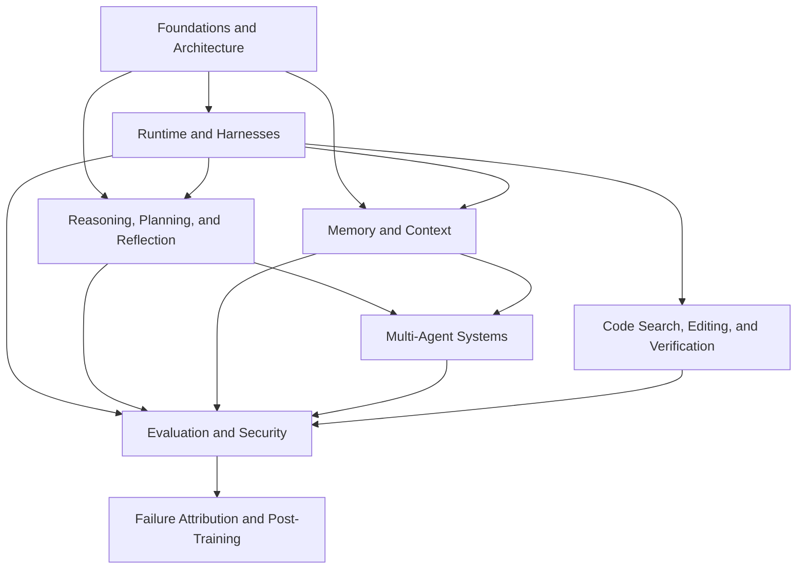

# Agents

This topic covers the application architecture of agents: foundational architecture, runtime harnesses, reasoning and planning, memory and context, multi-agent coordination, and production evaluation and security. The coding and post-training modules take these ideas further: how to change code reliably, and how to use failed trajectories to decide whether to fix a tool or train the model.

## Modules

1. [Foundations and Architecture (Chapters 1–3)](01-foundations/README.md)
2. [Runtime and Harnesses (Chapters 16–23)](02-runtime-harness/README.md)
3. [Reasoning, Planning, and Reflection (Chapters 4–6, 11–12)](02-reasoning-planning/README.md)
4. [Memory and Context (Chapters 7–8, 10)](03-memory-context/README.md)
5. [Multi-Agent Systems (Chapters 9, 13)](04-multi-agent/README.md)
6. [Evaluation and Security (Chapters 14–15)](05-production/README.md)
7. [Coding Agent Engineering (Chapter 24)](06-coding-agents/README.md)
8. [Agent Post-Training (Chapter 25)](07-post-training/README.md)

## How the modules connect

The dependencies move from foundational concepts toward execution and coordination. Planning determines what to try, memory supplies available information, and the harness carries out execution. Evaluation and security constrain these processes. Code tasks ask whether a change is correct; post-training asks how to improve recurring policy errors.

Protocol details are covered elsewhere: see [Tools · MCP](../tools/02-mcp/README.md) for tool integration and [Tools · Agent Communication](../tools/04-agent-communication/README.md) for interoperability between agents.

## Suggested reading paths

- **Getting started**: Foundations and Architecture → Reasoning, Planning, and Reflection.
- **Stateful agents**: Foundations and Architecture → Memory and Context.
- **Multi-agent systems**: Foundations and Architecture → Reasoning and Planning → Multi-Agent Systems.
- **Implementation and harness development**: Foundations and Architecture → Runtime and Harnesses.
- **Coding agents**: Runtime and Harnesses → Coding Agent Engineering → Evaluation and Security.
- **Improving agents through training**: read [LLM Training and Alignment](../llm/02-training-alignment/README.md) and [Tool Learning](../tools/01-function-calling/02-tool-learning.md) before Agent Post-Training.
- **Production deployment**: read Evaluation and Security after the modules relevant to your system.

## Frequently asked questions

### How does an AI agent differ from an ordinary chatbot?

An ordinary chatbot primarily generates replies. An agent places the model in an ongoing control loop: the model chooses the next step toward a goal and uses tools to inspect state or change external systems. Reliable task execution depends on the harness, permissions, and evaluation as well as the model.

### Are an agent framework and an agent harness the same thing?

They describe different aspects of a system. A framework provides development APIs, components, and orchestration abstractions. A harness describes the runtime responsibilities of driving the loop, assembling context, executing tools, saving state, and handling failures. A framework product can also provide a complete harness, whose capabilities still depend on configuration and deployment. Saying that frameworks only support development and have no runtime is also inaccurate.

### When do you need multiple agents?

Multiple agents may help when a task needs explicit permission separation, independent contexts, parallel work, or distinct specialist roles. If one agent with tools and a structured workflow can handle the task, splitting it across several agents often adds communication and debugging costs without a corresponding benefit.

Back to the [documentation topic index](../README.md).
