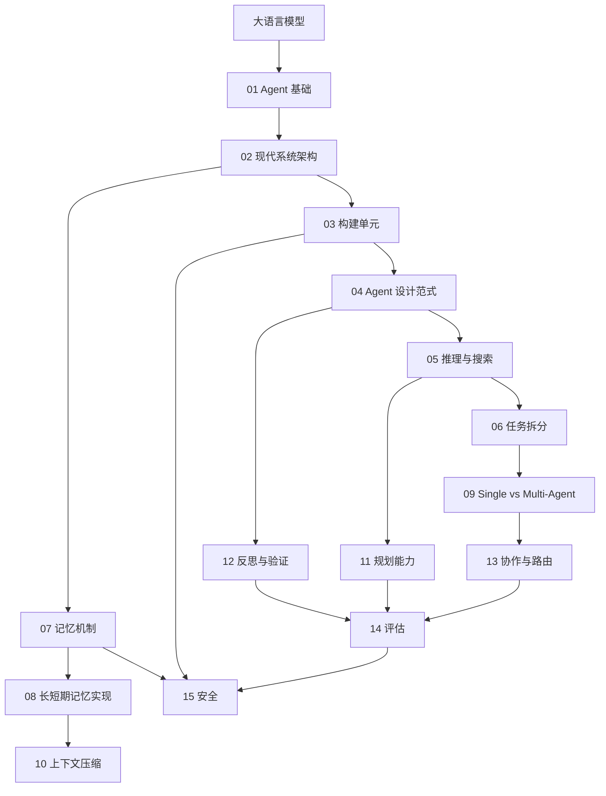

# Agent 相关知识点

本目录系统梳理 AI Agent 的基础概念、架构、设计范式与生产工程实践。

## 目录

1. [从大模型到 AI Agent](01-agent-foundations.md)
2. [Agent 的现代系统架构](02-agent-architecture.md)
3. [Tools、Skills、Agents、Workflows 与 AGENTS.md](03-agentic-building-blocks.md)
4. [Agent 设计范式](04-agent-design-patterns.md)
5. [Agent 的模型推理与搜索方法](05-agent-reasoning-methods.md)
6. [复杂任务拆分与调度](06-task-decomposition.md)
7. [AI Agent 的记忆机制](07-agent-memory.md)
8. [Agent 长短期记忆系统的工程实现](08-agent-memory-implementation.md)
9. [Single-Agent 与 Multi-Agent 系统](09-single-vs-multi-agent.md)
10. [Agent 记忆与上下文压缩](10-agent-memory-compression.md)
11. [如何赋予 LLM 与 Agent 规划能力](11-llm-agent-planning.md)
12. [Agent 的反思、验证与自我改进](12-agent-reflection.md)
13. [Multi-Agent 协作、路由与动态切换](13-multi-agent-coordination.md)
14. [Agent 评估与 Benchmark](14-agent-evaluation.md)
15. [Agent 安全与 Prompt Injection](15-agent-security.md)

协议细节不在本目录重复展开：工具发现与连接见[Tools：MCP](../tools/04-what-is-mcp.md)，跨 Agent 互操作见[Tools：A2A](../tools/11-a2a-protocol.md)。

## 知识图谱

返回[文档主题索引](../README.md)。
