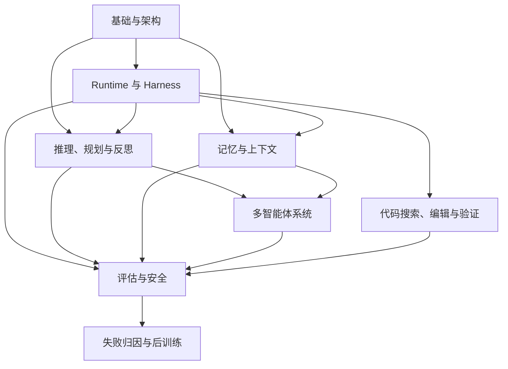

# Agent 相关知识点

本主题位于应用架构层，覆盖 Agent 基础架构、运行时 Harness、推理规划、记忆上下文、多智能体协作，以及生产评估与安全。编码与后训练模块进一步讨论：怎样可靠地修改代码，怎样从失败轨迹判断该改工具还是训练模型。

## 子模块

1. [基础与架构（第 1–3 章）](01-foundations/README.zh.md)
2. [Runtime 与 Harness（第 16–23 章）](02-runtime-harness/README.zh.md)
3. [推理、规划与反思（第 4–6、11–12 章）](02-reasoning-planning/README.zh.md)
4. [记忆与上下文（第 7–8、10 章）](03-memory-context/README.zh.md)
5. [多智能体系统（第 9、13 章）](04-multi-agent/README.zh.md)
6. [评估与安全（第 14–15 章）](05-production/README.zh.md)
7. [Coding Agent 工程（第 24 章）](06-coding-agents/README.zh.md)
8. [Agent 后训练（第 25 章）](07-post-training/README.zh.md)

## 模块关系

图中的依赖从基础概念走向执行与协作：规划决定尝试什么，记忆提供可用信息，Harness 负责实际执行。评估与安全约束这些过程；代码任务和后训练则分别追问“改动是否正确”和“反复出现的策略错误怎样改善”。

协议细节不在本主题重复展开：工具接入见 [Tools · MCP](../tools/02-mcp/README.zh.md)，跨 Agent 互操作见 [Tools · Agent 通信](../tools/04-agent-communication/README.zh.md)。

## 阅读建议

- **Agent 入门**：基础与架构 → 推理、规划与反思；
- **有状态 Agent**：基础与架构 → 记忆与上下文；
- **多 Agent 系统**：基础与架构 → 推理规划 → 多智能体系统；
- **工程落地 / Harness 开发**：基础与架构 → Runtime 与 Harness；
- **Coding Agent**：Runtime 与 Harness → Coding Agent 工程 → 评估与安全；
- **用训练改善 Agent**：先读 [LLM 训练与对齐](../llm/02-training-alignment/README.zh.md)和[工具学习](../tools/01-function-calling/02-tool-learning.zh.md)，再读 Agent 后训练；
- **生产上线**：完成目标模块后阅读评估与安全。

## 常见问题

### AI Agent 和普通聊天机器人有什么区别？

普通聊天机器人主要生成回复；Agent 把模型放入持续控制循环，由模型根据目标决定下一步，并通过工具读取状态或改变外部系统。能否可靠执行任务还取决于 Harness、权限和评测，而不只是模型能力。

### Agent Framework 和 Agent Harness 是一回事吗？

不是同一个视角。Framework 描述开发 API、组件和编排抽象，Harness 描述驱动循环、装配上下文、执行工具、保存状态并处理失败的运行时职责。一个框架产品可以同时提供完整 Harness；具体能力仍需配置和部署，“框架只管开发、不含运行时”也不准确。

### 什么时候需要 Multi-Agent？

当任务需要明确的权限隔离、独立上下文、并行工作或不同专业角色时，Multi-Agent 才可能带来收益。若一个 Agent 加工具和结构化工作流就能完成任务，拆成多个 Agent 往往只会增加通信和调试成本。

返回[文档主题索引](../README.zh.md)。
