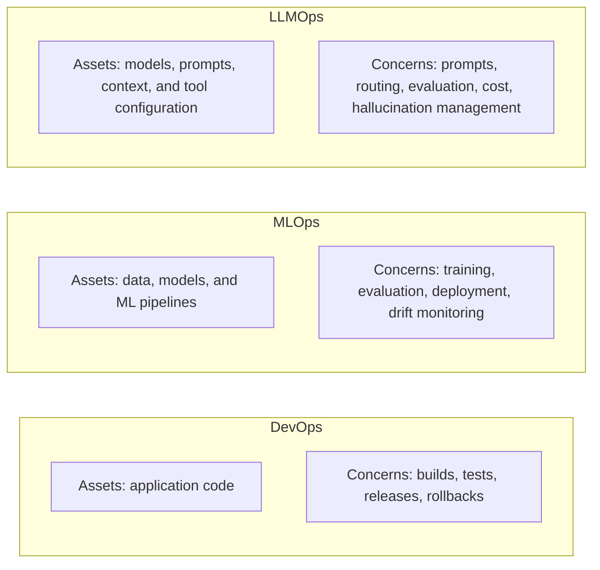
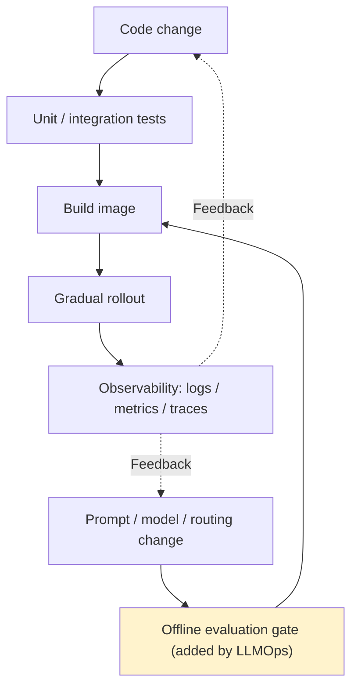

# Chapter 1: What Is LLMOps? How It Relates to MLOps and DevOps

## 1.1 Why are these three terms so often confused?

DevOps, MLOps, and LLMOps are not mutually exclusive roles, and the industry has no universally agreed dividing lines between them. The assets they primarily manage offer a useful distinction, but all three share release management, monitoring, data governance, and incident response capabilities. LLMOps can also include self-hosting, fine-tuning, and training; it is not limited to calling third-party APIs.

DevOps focuses on software delivery and operations. MLOps brings the data and model lifecycle into engineering management. LLMOps emphasizes prompts, context, open-ended outputs, and tool execution in generative applications. Managed APIs introduce constraints around provider versions, quotas, and where and how data is processed. Self-hosted models remove some external dependencies, but leave the team responsible for inference scheduling, compute resources, and model updates.

## 1.2 What requires extra attention in generative applications?

Data versioning, training pipelines, model registries, and A/B testing from MLOps still apply. The following are common differences in emphasis, not defining distinctions between the two:

| Dimension | MLOps | LLMOps |
|---|---|---|
| **What changes during iteration** | Data, features, training, and serving configuration | These assets, plus prompts, retrieval, tools, and routing |
| **Model visibility** | Both in-house and third-party models may be used | APIs usually do not expose weights; open weights do not imply full visibility into training data |
| **Sources of drift** | Changes in input distributions, target relationships, data pipelines, or models | The same sources apply; floating model aliases and context changes can also alter output behavior |
| **Evaluation criteria** | Accuracy, AUC, calibration, and business metrics | A combination of rules, execution results, human reviewers, and model judges; LLM-based scoring is not mandatory |

Service quality can deteriorate without a code change: the input distribution, knowledge base, upstream services, or model version may have changed. First distinguish “the inputs changed” from “the system behaves differently on the same inputs,” then identify the specific asset responsible. The version records in Chapter 9 and production monitoring in Chapter 12 support this investigation together. Provider upgrades are not the only possible cause.

## 1.3 LLMOps extends DevOps rather than replacing it

LLMOps does not discard DevOps and start over. It builds on established DevOps infrastructure, such as CI/CD and observability, and **adds quality gates specific to models and prompts**.

Schemas, authorization, monetary calculations, idempotency, and state machines should still have deterministic tests. Open-ended generation additionally needs quality evaluations that account for sampling error. Traditional ML evaluation also has statistical uncertainty; an additional difficulty with LLMs is that more than one answer may be acceptable. Repeated samples for the same question reveal variability, but must not be presented as additional independent business examples.

## 1.4 Comparing the three perspectives

Even for a problem such as “model inference is slow,” the three perspectives emphasize different questions:

| Scenario | DevOps perspective | MLOps perspective | LLMOps perspective |
|---|---|---|---|
| High inference latency | Queuing, networking, load balancing | Inference scheduling, quantization, distillation | Adjust context and routing; streaming improves initial responsiveness but does not necessarily reduce completion time |
| A poor-quality output | Investigate code, dependencies, and data passing | Check data, models, and distribution drift | Check prompts, retrieval, exact versions, tool results, and caches |
| Whether to roll back | Examine code changes and error rates | Check whether offline model evaluation metrics have regressed | Check whether production evaluation scores and safety cases have regressed after prompt or routing changes |

**These capabilities are not mutually exclusive. A mature team usually has all three, each addressing different parts of the production lifecycle.** The remaining chapters in this topic focus on the last column: production engineering from an LLMOps perspective.

## 1.5 Common mistakes

### 1.5.1 Equating LLMOps with “writing prompts”

Prompt engineering is only a small part of LLMOps. Routing and fallback, evaluation gates, observability, release pipelines, cost and capacity management, and incident response all matter. Good prompts alone cannot sustain a production system if any of these are neglected.

### 1.5.2 Reusing an MLOps toolchain without adapting evaluation

A fixed test set remains necessary, but the evaluation criteria must fit the task. A citation's presence does not mean it supports the conclusion, and natural wording does not imply factual accuracy. Use rules for verifiable fields, and human reviewers or calibrated model judges for open-ended dimensions.

### 1.5.3 Ignoring drift from silent model upgrades

A managed model's floating alias may point to a different underlying version over time. Pinning a snapshot reduces this source of variation, but service configuration, version retirement, and request distributions still need attention. A pinned snapshot does not guarantee permanent availability or word-for-word reproducibility.

### 1.5.4 Assuming LLMOps concerns inference but never training

At sufficient business scale, LLMOps teams also work with fine-tuning and RLHF data; see the data flywheel in Chapter 13. The distinction is not absolute: it is a difference in the assets teams primarily iterate on.

## 1.6 Chapter summary

LLMOps extends existing software and ML engineering practices to generative applications. Whether a team trains its own models is not the defining criterion. In an interview, explaining which assets a change affects is more useful than reciting job definitions: which behaviors can be verified deterministically, which quality dimensions require statistical evaluation, and whether failures can be diagnosed and recovered from.

## References

- [Google Cloud: MLOps: Continuous delivery and automation pipelines in machine learning](https://cloud.google.com/architecture/mlops-continuous-delivery-and-automation-pipelines-in-machine-learning)
- [a16z: What Is LLMOps?](https://a16z.com/emerging-architectures-for-llm-applications/)
- [Chip Huyen: Building LLM applications for production](https://huyenchip.com/2023/04/11/llm-engineering.html)
- [OpenAI: Best practices for production deployments](https://platform.openai.com/docs/guides/production-best-practices)
- [Anthropic: Building effective agents](https://www.anthropic.com/engineering/building-effective-agents)
