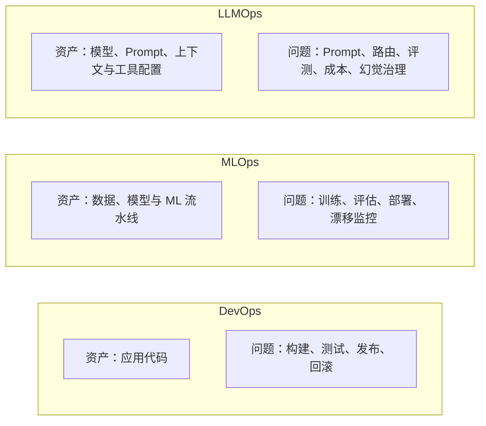
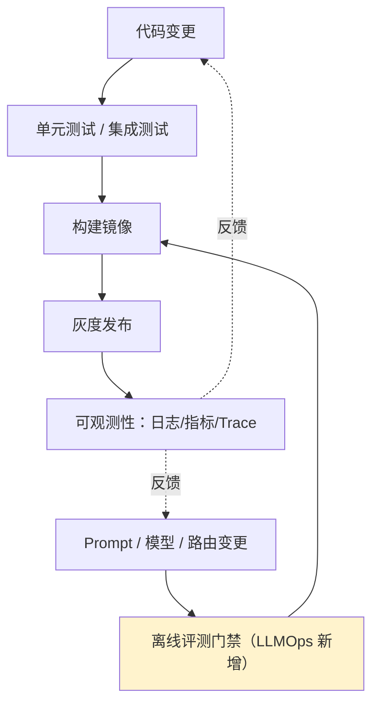

# 第一章：LLMOps 是什么：与 MLOps、DevOps 的边界

## 1.1 三个词为什么总被混用

DevOps、MLOps 与 LLMOps 不是互斥岗位，也没有统一的行业分界。可以按主要管理的资产来理解，但它们共享发布、监控、数据治理和事故响应能力；LLMOps 还可能包括自托管、微调和训练，不只是调用第三方 API。

DevOps 关注软件交付与运行，MLOps 把数据和模型生命周期纳入工程管理，LLMOps 则强调生成式应用中的 Prompt、上下文、开放式输出和工具执行链。使用托管 API 会增加供应商版本、配额和数据处理边界的约束；自托管模型减少部分外部依赖，却需要承担推理调度、算力和模型更新责任。

## 1.2 生成式应用中需要额外关注什么

MLOps 的数据版本管理、训练流水线、模型注册表和 A/B 测试仍然适用。下面是常见侧重点，而非两者的定义性区别：

| 维度 | MLOps | LLMOps |
|---|---|---|
| **迭代对象** | 数据、特征、训练、服务配置 | 除这些资产外，还包括 Prompt、检索、工具和路由 |
| **模型可见性** | 自训与第三方模型都可能存在 | API 通常不开放权重；开放权重也不等于训练数据完全可知 |
| **漂移来源** | 输入分布、目标关系、数据管道或模型变化 | 同样存在；浮动模型别名和上下文变化还会改变输出行为 |
| **评估基准** | 准确率、AUC、校准度及业务指标 | 规则、执行结果、人工和模型裁判组合；不是必须用 LLM 打分 |

没有改代码，服务质量仍可能下降：输入分布、知识库、上游服务或模型版本都可能变化。先区分「输入变了」与「同样输入下的系统行为变了」，再定位具体资产。第 9 章的版本记录和第 12 章的线上监测共同支持这种排查，不能只盯着厂商升级。

## 1.3 LLMOps 与 DevOps 的关系：扩展而非替代

LLMOps 不是抛弃 DevOps 另起炉灶，而是在 CI/CD、可观测性这些 DevOps 已经解决得很好的基础设施之上，**插入一层模型和 Prompt 特有的质量门禁**。

Schema、授权、金额计算、幂等和状态机仍应做确定性测试；开放式生成则补充带采样误差的质量评测。传统 ML 评测也有统计不确定性，LLM 的额外难点是可接受答案往往不唯一。同一问题重复采样用于观察波动，不能冒充更多独立业务样本。

## 1.4 一张表看清三者分工

面对「模型推理慢」这类问题，三个角色关注点也不同：

| 场景 | DevOps 视角 | MLOps 视角 | LLMOps 视角 |
|---|---|---|---|
| 推理延迟高 | 排队、网络、负载均衡 | 推理调度、量化、蒸馏 | 调整上下文与路由；流式改善首响应，不一定缩短完成时间 |
| 一次输出质量差 | 排查代码、依赖和数据传递 | 检查数据、模型和分布漂移 | 检查 Prompt、检索、具体版本、工具结果和缓存 |
| 要不要回滚 | 看代码变更和错误率 | 看模型离线评估指标是否退化 | 看 Prompt/路由变更后线上评测分数和安全用例是否退化 |

**三者不是互斥关系，一个成熟团队里通常同时具备这三种能力，只是各自负责生产生命周期里不同的切片。** 本主题后续章节聚焦的正是最后一列——LLMOps 视角下的生产工程实践。

## 1.5 常见错误

### 1.5.1 把 LLMOps 等同于「写 Prompt」

Prompt 工程只是 LLMOps 里的一小部分。路由与回退、评测门禁、可观测性、发布流水线、成本与容量、事故响应，任何一项做不到位，光有好 Prompt 撑不起生产系统。

### 1.5.2 直接套用 MLOps 工具链却不改评估方式

固定测试集仍然必要，但评价规则要匹配任务：引用存在不等于支持结论，语气自然不等于事实正确。可验证字段用规则，开放式维度用人工或经校准的模型裁判。

### 1.5.3 忽视模型静默升级带来的漂移

托管模型的浮动别名可能改变底层版本。固定快照能减少这一变量，但仍需关注服务配置、版本退役和请求分布，不等于永久可用或逐字可复现。

### 1.5.4 认为 LLMOps 只需要在推理阶段发力，不涉及训练侧

当业务规模足够大时，LLMOps 团队仍会和微调/RLHF 数据打交道（见第 13 章数据飞轮），二者边界不是绝对的，而是「主要迭代对象」的差异。

## 1.6 本章总结

LLMOps 是既有软件与 ML 工程能力在生成式应用中的延伸，不以是否自训模型划界。面试讨论时，与其背岗位定义，不如说明一次变更涉及哪些资产、哪些行为可以确定性验证、哪些质量只能统计评估，以及失败后能否定位并恢复。

## 参考资料

- [Google Cloud: MLOps: Continuous delivery and automation pipelines in machine learning](https://cloud.google.com/architecture/mlops-continuous-delivery-and-automation-pipelines-in-machine-learning)
- [a16z: What Is LLMOps?](https://a16z.com/emerging-architectures-for-llm-applications/)
- [Chip Huyen: Building LLM applications for production](https://huyenchip.com/2023/04/11/llm-engineering.html)
- [OpenAI: Best practices for production deployments](https://platform.openai.com/docs/guides/production-best-practices)
- [Anthropic: Building effective agents](https://www.anthropic.com/engineering/building-effective-agents)
