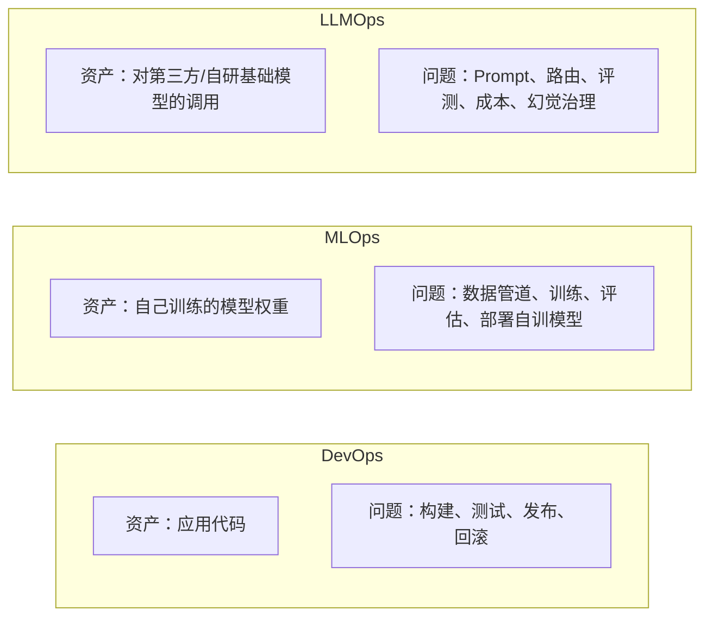
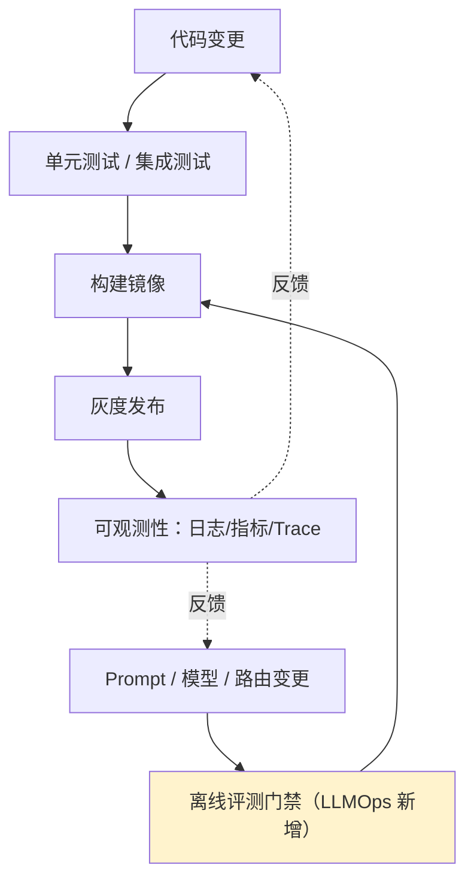

# 第一章：LLMOps 是什么：与 MLOps、DevOps 的边界

## 1.1 三个词为什么总被混用

一个团队要把 LLM 应用送上生产，招聘启事上会同时出现「DevOps 工程师」「MLOps 工程师」「LLMOps 经验」这几个词，而候选人往往说不清楚三者具体分工在哪。**根源是三者面对的「核心资产」不同，工程问题也就完全不同。**

DevOps 关心的是「我写的代码能不能可靠地跑起来」；MLOps 关心的是「我训练出来的模型能不能可靠地更新和部署」；LLMOps 关心的是「我调用的这个模型——很可能不是我训练的、我看不到它的权重、它可能每隔几个月悄悄升级一次——能不能可靠地为我的业务服务」。**这个「模型不是你训的」前提，决定了 LLMOps 里几乎所有独特的工程问题。**

## 1.2 LLMOps 与 MLOps 的四点根本差异

MLOps 的实践（数据版本管理、训练流水线、模型注册表、A/B 测试）在 LLMOps 里大多仍然适用，但以下四点是本质区别：

| 维度 | MLOps | LLMOps |
|---|---|---|
| **迭代对象** | 重新训练/微调模型权重 | 主要迭代 Prompt、上下文构造、路由策略，很少重新训练 |
| **模型可见性** | 白盒：知道架构、训练数据、损失函数 | 多数情况黑盒：只能通过 API 观察输入输出 |
| **模型漂移来源** | 只来自你自己触发的重新训练 | 也来自**上游厂商静默更新模型版本**（如 `gpt-4o` 指向的权重变化） |
| **评估基准** | 固定测试集上的准确率/AUC 等传统 ML 指标 | 开放式生成任务，正确性边界模糊，评测本身要用另一个 LLM 打分 |

第三点是最容易被低估的风险：**你没有改任何代码，但模型厂商更新了模型版本，你的应用行为可能整体发生偏移**。这是传统软件工程和 MLOps 里都不存在的故障模式，第 9 章的模型版本锁定和第 12 章的线上指标监控都是针对它的应对手段。

## 1.3 LLMOps 与 DevOps 的关系：扩展而非替代

LLMOps 不是抛弃 DevOps 另起炉灶，而是在 CI/CD、可观测性这些 DevOps 已经解决得很好的基础设施之上，**插入一层模型和 Prompt 特有的质量门禁**。

传统 DevOps 流水线的「测试」阶段是确定性的：给定输入，断言唯一正确输出。LLMOps 流水线在这一阶段引入的评测门禁是**概率性的**——同样的 Prompt 换一次随机种子输出都可能不同，及格线不是「通过/不通过」而是「在一批样本上的通过率是否达标」。这个差异会贯穿本主题几乎每一章。

## 1.4 一张表看清三者分工

面对「模型推理慢」这类问题，三个角色关注点也不同：

| 场景 | DevOps 视角 | MLOps 视角 | LLMOps 视角 |
|---|---|---|---|
| 推理延迟高 | 扩容、负载均衡 | 模型量化、蒸馏出更小模型 | 换路由到更快的供应商、开启流式返回、语义缓存 |
| 一次输出质量差 | 不在职责范围 | 检查训练数据是否有偏差 | 检查 Prompt、上下文、路由到的具体模型版本、是否命中了脏缓存 |
| 要不要回滚 | 看代码变更和错误率 | 看模型离线评估指标是否退化 | 看 Prompt/路由变更后线上评测分数和安全用例是否退化 |

**三者不是互斥关系，一个成熟团队里通常同时具备这三种能力，只是各自负责生产生命周期里不同的切片。** 本主题后续章节聚焦的正是最后一列——LLMOps 视角下的生产工程实践。

## 1.5 常见错误

### 1.5.1 把 LLMOps 等同于「写 Prompt」

Prompt 工程只是 LLMOps 里的一小部分。路由与回退、评测门禁、可观测性、发布流水线、成本与容量、事故响应，任何一项做不到位，光有好 Prompt 撑不起生产系统。

### 1.5.2 直接套用 MLOps 工具链却不改评估方式

把传统 ML 的固定测试集准确率思路直接搬过来，评不出「回答语气变差了」「引用变得不准了」这类开放式质量问题，需要第 7 章的 LLM-as-Judge 等方法补齐。

### 1.5.3 忽视模型静默升级带来的漂移

厂商在你毫无感知的情况下更新模型版本是 LLMOps 独有的风险源，不做版本锁定和线上指标监控，出问题时甚至不知道该往哪个方向排查。

### 1.5.4 认为 LLMOps 只需要在推理阶段发力，不涉及训练侧

当业务规模足够大时，LLMOps 团队仍会和微调/RLHF 数据打交道（见第 13 章数据飞轮），二者边界不是绝对的，而是「主要迭代对象」的差异。

## 1.6 本章总结

1. **三者核心资产不同**：DevOps 管代码，MLOps 管自训模型权重，LLMOps 管对基础模型的调用；
2. **LLMOps 面对「模型不是你训的」这个前提**，由此产生模型黑盒、厂商静默升级等独有风险；
3. **LLMOps 不是替代 DevOps**，而是在既有 CI/CD 与可观测性基础设施上插入概率性的评测门禁；
4. **评测方式的差异是核心**：MLOps 是确定性测试集指标，LLMOps 是开放式生成任务的概率性质量评估；
5. **三种角色通常共存于同一个团队**，只是分管生产生命周期的不同切片，不是互斥选择。

> **一句话概括：LLMOps 之所以自成一派，是因为它要对一个自己看不见内部、随时可能被厂商悄悄改变的「黑盒」模型，建立起和传统软件同等级别的生产可靠性。**

## 参考资料

- [Google Cloud: MLOps: Continuous delivery and automation pipelines in machine learning](https://cloud.google.com/architecture/mlops-continuous-delivery-and-automation-pipelines-in-machine-learning)
- [a16z: What Is LLMOps?](https://a16z.com/emerging-architectures-for-llm-applications/)
- [Chip Huyen: Building LLM applications for production](https://huyenchip.com/2023/04/11/llm-engineering.html)
- [OpenAI: Best practices for production deployments](https://platform.openai.com/docs/guides/production-best-practices)
- [Anthropic: Building effective agents](https://www.anthropic.com/engineering/building-effective-agents)
