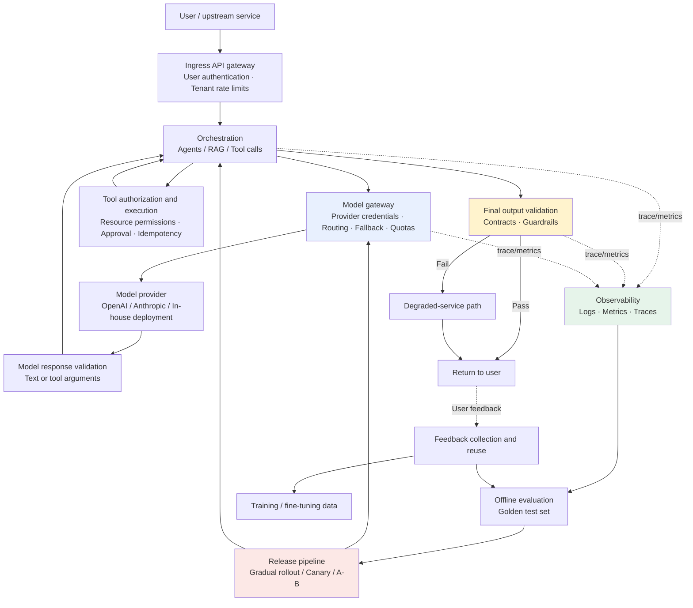
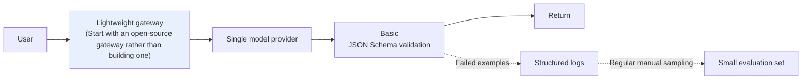

# Chapter 2: A Production Architecture for AI Applications

## 2.1 From “one API call” to “a production system”

An LLM application at the demo stage is often just a call to `client.chat.completions.create()`. Supporting real traffic requires an entire system around that call: gateways, orchestration, output validation, observability, evaluation, and release management.

A request first passes ingress authentication, then enters the orchestration layer. Every model call from the orchestrator goes through the model gateway. After receiving a response, the orchestrator decides whether to call another tool or finish the task and validate the final answer. Tools have their own authorization and execution controls. The diagram separates responsibilities: several may live in the same service, but colocating them does not remove the need for their checks.

## 2.2 The request path: gateway, orchestration, and provider

The ingress layer verifies user and tenant identities. The **model gateway** manages model-provider credentials, quotas, routing, and fallback. Neither replaces the tool service's authorization checks for specific resources. For gateway components, see [Tools · LLM Gateways](../../tools/05-transport-gateway/14-llm-gateway.md); for routing, see [Chapter 3](../02-request-reliability/03-model-gateway-routing-fallback.md); for timeouts and retries, see [Chapter 4](../02-request-reliability/04-retry-timeout-idempotency-circuit-breaker.md).

After the ingress gateway comes the **orchestration layer**. A single question-and-answer interaction may need only one model call, but an agent needs multiple rounds of tool use and planning; see [Agents](../../agent/README.md). Knowledge-intensive tasks need retrieval before generation; see [RAG](../../rag/README.md). Through the model gateway, the orchestration layer accesses a specific **model provider**, which may be a managed API or an in-house deployment. Deployment details are covered in [LLMs · Inference and Serving](../../llm/03-inference-serving/README.md).

## 2.3 The output path: validation and graceful degradation

Text returned by a model cannot be trusted as-is. **Output validation** checks whether it meets the structured contract expected by downstream consumers ([Chapter 5](../03-output-safety/05-structured-output-contracts.md)) and whether it triggers safety guardrails ([Chapter 6](../03-output-safety/06-guardrails-degradation.md)). Failed validation does not necessarily mean returning an error directly to the user. The degraded-service path might retry with a more conservative model, return a cached answer, or use a template response. These options are a central subject of Chapter 6.

## 2.4 The feedback path: observability, evaluation, and releases

The three dashed lines labeled trace/metrics feed the **observability** layer. This is what makes the system diagnosable and amenable to improvement; see [Chapter 8](../04-evaluation-observability/08-online-observability-tracing.md). Production data collected through observability feeds **offline evaluation** ([Chapter 7](../04-evaluation-observability/07-offline-eval-eval-driven-development.md)). Whether evaluation passes determines whether the **release pipeline** admits a prompt, model, or routing change ([Chapters 9](../05-release-pipeline/09-prompt-model-data-versioning.md) and [10](../05-release-pipeline/10-llm-cicd-canary-ab.md)).

The outer **feedback loop** brings explicit user feedback, such as likes and corrections, and implicit behavior, such as retries and abandonment, back into evaluation datasets. Over time, it may also supply fine-tuning data. This is the subject of [Chapter 13](../06-performance-operations/13-feedback-loop-data-flywheel.md).

## 2.5 Two concerns that run through the entire diagram

Two concerns are not drawn as separate boxes, but every box must account for them:

| Concern | Where it appears | Related chapter |
|---|---|---|
| **Performance and cost** | Gateway routing decisions, batching in orchestration, caching | [Chapter 11](../06-performance-operations/11-caching-batching-throughput-cost.md) |
| **Reliability operations** | End-to-end SLOs, capacity planning, incident response | [Chapter 12](../06-performance-operations/12-slo-capacity-incident-response.md) |

This is why the topic's final module is called “Performance, Cost, and Operations” rather than being placed under one particular box. These are cross-cutting concerns that affect every part of the request path.

## 2.6 A lean architecture for a small team

Not every team needs all the modules in the diagram in Section 2.1. A lean but still production-ready starting point is:

The gateway can initially be an existing component. Start logs with request correlation IDs, versions, latency, status, and usage; **do not persist raw inputs and outputs by default**. Manually reviewing a few dozen examples can reveal obvious problems, but cannot establish a low failure rate. Even a small system needs authentication, a total timeout, rate limits, spending caps, and a release switch that can disable the feature. When side effects are involved, add tool authorization, approval, and idempotency. Whether multi-model fallback is necessary depends on the risks and recovery objectives; it is not a prerequisite for launching every application.

## 2.7 Common mistakes

### 2.7.1 Taking a demo architecture straight into production

A demo that returns the result of a single API call has neither a failure budget nor a recovery path. A production design should at least specify what happens when the provider is unavailable: fail fast, queue, reduce functionality, or switch providers. Sending data to an unauthorized backup provider just to appear available is not acceptable.

### 2.7.2 Building every capability at once

A small team does not need to build a complete platform first, but it must still evaluate critical behavior and control releases. Start with the lean design in Section 2.6 and prioritize the task's risks and recovery requirements. Decide later, based on scale and benefits, whether multi-model routing or a sophisticated gradual-rollout platform is worthwhile.

### 2.7.3 Treating observability as an afterthought

Many teams only think of adding logs and traces after a production incident. Observability, including what data may be collected, should be planned during architecture design rather than patched in afterward; see Chapter 8.

### 2.7.4 Collecting feedback without putting it to use

Feedback should be reused only after authorization, deduplication, and human analysis of the cause. Sensitive content in feedback may need to be deleted rather than retained. Once an example enters a tuning dataset, it must not also serve as an independent holdout test to prove that the change helped.

## 2.8 Chapter summary

1. **Production requests pass ingress authentication before the orchestrator calls models or tools.** Model calls go through the model gateway, tool execution is independently authorized, and final answers are validated before returning to users. Observability, evaluation, releases, and feedback connect alongside this path.
2. **Each chapter in this topic addresses a part of the diagram:** Chapters 3–4 cover request-path reliability; Chapters 5–6, output quality and safety; Chapters 7–8, evaluation and observability; Chapters 9–10, versioning and releases; and Chapters 11–13, performance, cost, and operations.
3. **Performance, cost, and reliability operations are cross-cutting concerns.** They span the entire system rather than belonging to one particular box.
4. **An architecture does not have to be built all at once.** Small teams should start lean and add capabilities as they grow.
5. **Feedback must influence evaluation and release decisions.** Collecting it without using it serves no purpose.

## References

- [OpenAI: Production best practices](https://platform.openai.com/docs/guides/production-best-practices)
- [Anthropic: Building effective agents](https://www.anthropic.com/engineering/building-effective-agents)
- [Google SRE Book: Chapter 1 - Introduction](https://sre.google/sre-book/introduction/)
- [Uber Engineering: Michelangelo Machine Learning Platform](https://www.uber.com/blog/michelangelo-machine-learning-platform/)
- [Martin Fowler: Continuous Delivery for Machine Learning](https://martinfowler.com/articles/cd4ml.html)
