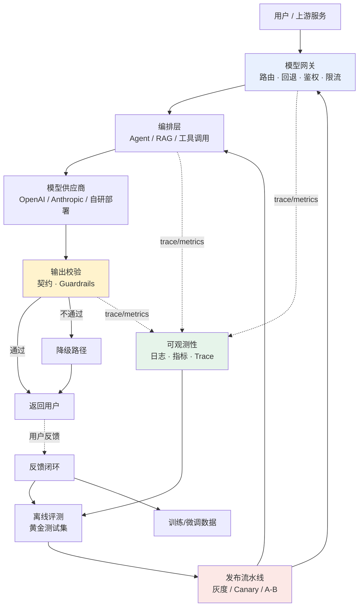
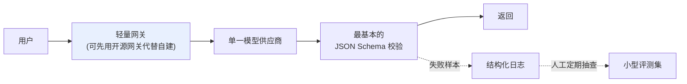

# 第二章：AI 应用生产架构全景

## 2.1 从「调用一次 API」到「一个生产系统」

Demo 阶段的 LLM 应用往往就是一次 `client.chat.completions.create()` 调用。要撑住真实流量，这一次调用的前后会长出一整条链路：网关、编排、输出校验、可观测性、评测和发布都得补上。

这张图不是某一家公司的具体实现，而是把 OpenAI、Anthropic 官方生产指南和大厂工程博客（Netflix、Uber、Stripe 等）里反复出现的模块抽象出来的**共性骨架**。沿着请求链路往下看，先是网关和编排层，再到输出校验、可观测性、评测、发布和反馈回流。

## 2.2 请求路径：网关、编排、供应商

请求进来先经过**模型网关**：统一鉴权、按策略路由到具体模型、失败时回退到备用模型。网关本身怎么搭建（多模型统一接口、限流配额、Key 管理）属于 [Tools · LLM 网关](../../tools/05-transport-gateway/14-llm-gateway.md)，本主题[第 3 章](../02-request-reliability/03-model-gateway-routing-fallback.md)讲的是路由策略和回退链路怎么设计,[第 4 章](../02-request-reliability/04-retry-timeout-idempotency-circuit-breaker.md)讲调用失败时的重试与熔断。

网关之后是**编排层**——单次问答可能只是一次模型调用，但 Agent 需要多轮工具调用与规划（见 [Agent](../../agent/README.md)），知识密集型任务需要先检索再生成（见 [RAG](../../rag/README.md)）。编排层最终落到具体的**模型供应商**：可能是托管 API，也可能是自研部署（部署细节见 [LLM · 推理与部署](../../llm/03-inference-serving/README.md)）。

## 2.3 输出侧：校验、降级

模型返回的文本不能直接信任。**输出校验**检查它是否符合下游期望的结构化契约（[第 5 章](../03-output-safety/05-structured-output-contracts.md)），以及是否触发了安全护栏（[第 6 章](../03-output-safety/06-guardrails-degradation.md)）。校验不通过不代表直接报错给用户——降级路径可能是换用更保守的模型重试、返回缓存答案或模板化兜底回复,这也是第 6 章的核心内容。

## 2.4 反馈支路：可观测性、评测、发布

图中三条虚线（trace/metrics）汇入**可观测性**层——这是整条链路能不能被排查、被优化的前提,详见[第 8 章](../04-evaluation-observability/08-online-observability-tracing.md)。可观测性积累的线上数据反过来喂给**离线评测**([第 7 章](../04-evaluation-observability/07-offline-eval-eval-driven-development.md)),评测通过与否决定**发布流水线**是否放行一次 Prompt/模型/路由变更([第 9](../05-release-pipeline/09-prompt-model-data-versioning.md)、[10 章](../05-release-pipeline/10-llm-cicd-canary-ab.md))。

最外层的**反馈闭环**把用户的显式反馈(点赞/纠正)和隐式行为(重试、放弃)重新汇入评测数据集,长期看甚至会成为微调数据的来源,这是[第 13 章](../06-performance-operations/13-feedback-loop-data-flywheel.md)的主题。

## 2.5 贯穿全图的两条隐藏关注点

架构图没有画出、但每个方框都必须考虑的两件事:

| 关注点 | 体现在哪些方框 | 对应章节 |
|---|---|---|
| **性能与成本** | 网关路由决策、编排层的批处理、缓存 | [第 11 章](../06-performance-operations/11-caching-batching-throughput-cost.md) |
| **稳定性运营** | 整条链路的 SLO、容量规划、事故响应 | [第 12 章](../06-performance-operations/12-slo-capacity-incident-response.md) |

这两点解释了为什么本主题最后一个模块叫「性能、成本与运营」而不是挂在某一个具体方框下——它们是横切关注点,和请求路径上任何一环都有关。

## 2.6 小规模团队的精简版架构

不是每个团队都需要图 2.1 的全部模块。一个精简但仍然「生产可用」的起点:

关键取舍是:**网关可以先用开源方案(如 LiteLLM)顶上而不是自建;可观测性最低限度是把每次调用的输入输出结构化落盘;评测可以从人工定期抽查几十条样本开始,不必一开始就上自动化流水线。** 随着流量增长,再按图 2.1 逐步补齐路由回退、自动化评测门禁、灰度发布这些能力——**过早搭建全套基础设施本身就是一种浪费**,这一点在第 12 章的容量规划里还会展开。

## 2.7 常见错误

### 2.7.1 把 Demo 架构直接套用到生产

Demo 里「一次 API 调用直接返回」在生产里必须补上路由回退、输出校验、可观测性,否则任何一次供应商抖动或模型输出异常都会直接影响用户。

### 2.7.2 把所有能力一步到位建齐

小团队一上来就搭建灰度发布、自动化评测门禁、多模型路由,投入产出比很低。应该按第 2.6 节的精简版起步,随流量和风险增长补齐。

### 2.7.3 把可观测性当成事后补救

不少团队等出了生产事故才想起来加日志和 Trace。可观测性应该在架构设计阶段就规划好数据边界(见第 8 章),而不是事后补丁。

### 2.7.4 反馈闭环只停留在「收集」,没有「回流」

收集了用户点赞点踩却从不用来更新评测集,反馈闭环就是摆设。收集到的信号必须真正流回评测和发布决策,才算闭环。

## 2.8 本章总结

1. **生产架构是 Demo 的一次调用「长出」的一整条链路**:网关 → 编排 → 供应商 → 输出校验 → 返回,外加可观测性、评测、发布、反馈四条支路;
2. **本主题每一章对应图中一个方框**:第 3–4 章讲请求路径可靠性,第 5–6 章讲输出质量与安全,第 7–8 章讲评测与可观测性,第 9–10 章讲版本与发布,第 11–13 章讲性能成本与运营;
3. **性能成本、稳定性运营是横切关注点**,不属于某个具体方框,而是贯穿整条链路;
4. **架构不是一步到位的**,小团队应从精简版起步,随规模增长逐步补齐;
5. **反馈闭环必须真正回流**到评测和发布决策,否则收集反馈没有意义。

## 参考资料

- [OpenAI: Production best practices](https://platform.openai.com/docs/guides/production-best-practices)
- [Anthropic: Building effective agents](https://www.anthropic.com/engineering/building-effective-agents)
- [Google SRE Book: Chapter 1 - Introduction](https://sre.google/sre-book/introduction/)
- [Uber Engineering: Michelangelo Machine Learning Platform](https://www.uber.com/blog/michelangelo-machine-learning-platform/)
- [Martin Fowler: Continuous Delivery for Machine Learning](https://martinfowler.com/articles/cd4ml.html)
