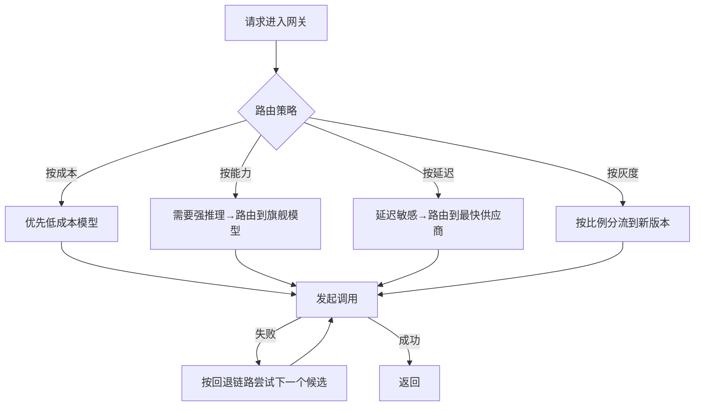

# 第三章：模型网关、路由与回退

## 3.1 路由决策：网关之上的一层策略

[Tools · LLM 网关](../../tools/05-transport-gateway/14-llm-gateway.md)讲过网关**这个组件本身**要具备统一接口、负载均衡、限流配额等能力。更麻烦的是请求到了网关以后:**应该按什么策略决定打给哪个模型、什么时候放弃当前模型换下一个**。这是一层建立在网关基础设施之上的**路由策略**,也是 LLMOps 团队日常调整最频繁的配置之一。



## 3.2 三种常见路由策略

### 3.2.1 成本优先路由

把任务按复杂度分级,简单任务(分类、格式转换、短摘要)路由到小模型,只有复杂推理任务才打旗舰模型。

```python
def route_by_complexity(task_type: str) -> str:
    cheap_tasks = {"classification", "extraction", "short_summary"}
    if task_type in cheap_tasks:
        return "small-model"   # 逻辑名,由网关映射到具体供应商
    return "flagship-model"
```

这个策略的收益直接体现在第 11 章的成本优化上,但前提是**先用离线评测确认小模型在这些简单任务上的质量不低于旗舰模型**——盲目降级路由到小模型,质量退化可能几周后才被用户投诉暴露出来。

### 3.2.2 能力优先路由

某些任务(代码生成、多步推理)只有少数模型能稳定完成,路由策略需要维护一张「模型-能力」映射表,而不是简单的成本阈值判断。这张表本身要跟随[第 7 章](../04-evaluation-observability/07-offline-eval-eval-driven-development.md)的评测结果持续更新——模型能力会随供应商升级而变化。

### 3.2.3 灰度路由

发布新 Prompt 或切换模型版本时,按用户 ID 哈希或请求比例分流一部分流量到新版本,这是[第 10 章](../05-release-pipeline/10-llm-cicd-canary-ab.md)灰度发布的路由层实现基础。

## 3.3 回退链路的设计

### 3.3.1 回退链路是有序候选列表,不是简单的「A 不行就 B」

```yaml
fallback_chain:
  - provider: openai
    model: gpt-4o
  - provider: azure          # 同一模型的另一部署,优先作为第一层回退
    model: gpt-4o
  - provider: anthropic      # 跨厂商兜底,作为最后一层
    model: claude-sonnet-4
```

回退顺序遵循「先同模型跨部署,再跨厂商」的原则——同一模型在不同基础设施上的输出分布几乎一致,跨厂商切换才可能带来风格和能力上的差异,这一点与 [LLM 网关的负载均衡设计](../../tools/05-transport-gateway/14-llm-gateway.md)一致。

### 3.3.2 什么条件触发回退

| 触发条件 | 说明 |
|---|---|
| HTTP 5xx / 超时 | 最直接的失败信号 |
| 429 限流 | 供应商配额耗尽,不代表模型本身有问题 |
| 输出未通过契约校验 | 见[第 5 章](../03-output-safety/05-structured-output-contracts.md),连续多次解析失败也应触发回退 |
| 内容安全拦截 | 某些供应商对特定内容的安全策略更严格,换一个供应商可能规避误伤 |

### 3.3.3 回退要防止「雪崩式重试」

如果主模型是因为过载才失败,而不是偶发故障,所有请求同时回退到备用模型会把备用模型也压垮。回退触发前应结合[第 4 章](04-retry-timeout-idempotency-circuit-breaker.md)的熔断机制判断:**熔断器已经跳闸时不该再对同一路径发起新的探测请求,而应直接走回退链路**。

## 3.4 路由与回退的可观测性要求

路由决策必须记录清楚,否则出问题时无法定位:

| 需要记录的字段 | 用途 |
|---|---|
| 实际路由到的供应商与模型版本 | 排查「为什么这次输出风格不一样」 |
| 触发路由的策略名称 | 区分是成本路由、能力路由还是灰度路由 |
| 是否发生了回退,回退了几层 | 判断某个供应商是否持续不稳定 |
| 端到端延迟(含回退耗时) | 回退会显著拉长尾延迟,需要单独监控 |

这些字段是[第 8 章](../04-evaluation-observability/08-online-observability-tracing.md) Trace 数据模型的一部分。

## 3.5 常见错误

### 3.5.1 把路由策略和网关基础设施混为一谈

网关(统一接口、Key 管理、限流)是基础设施,路由策略(什么任务用什么模型)是运营决策,后者需要频繁调整,不应该和网关代码耦合在一起,而应做成可独立更新的配置。

### 3.5.2 成本路由没有评测背书

把任务降级到便宜模型前不做离线评测验证质量,等同于用生产流量做未经验证的实验。

### 3.5.3 回退链路只考虑「换模型」,没考虑「跨部署」

同一模型的多部署(如 OpenAI 直连 + Azure OpenAI)故障相关性低,应该优先作为第一层回退,跨厂商回退放在链路末尾。

### 3.5.4 过载时无脑重试导致雪崩

主模型过载引发的失败,应结合熔断器判断是否应该跳过重试直接回退,而不是对一个已经过载的服务继续发起探测流量。

### 3.5.5 路由决策不落日志

出现「同样的请求这次和上次结果不一样」时,如果没有记录实际路由到的模型版本,几乎无法排查根因。

## 3.6 本章总结

1. **路由策略建立在网关基础设施之上**,前者是运营决策,后者是基础设施,两者应解耦;
2. **三类常见路由策略**:成本优先、能力优先、灰度路由,各自服务不同目标;
3. **成本路由必须有评测背书**,否则质量退化会悄悄发生;
4. **回退链路应遵循「先同模型跨部署,再跨厂商」的顺序**,降低回退引入的输出差异;
5. **回退要结合熔断机制**,避免在供应商过载时继续加压导致雪崩;
6. **路由决策必须可观测**:记录实际路由目标、策略名称、回退次数和延迟。

## 参考资料

- [LiteLLM: Routing](https://docs.litellm.ai/docs/routing)
- [Amazon Bedrock: Model routing (intelligent prompt routing)](https://docs.aws.amazon.com/bedrock/latest/userguide/intelligent-prompt-routing.html)
- [Martin Fowler: CanaryRelease](https://martinfowler.com/bliki/CanaryRelease.html)
- [Netflix Tech Blog: Fault Tolerance in a High Volume, Distributed System](https://netflixtechblog.com/fault-tolerance-in-a-high-volume-distributed-system-91ab4faae74a)
