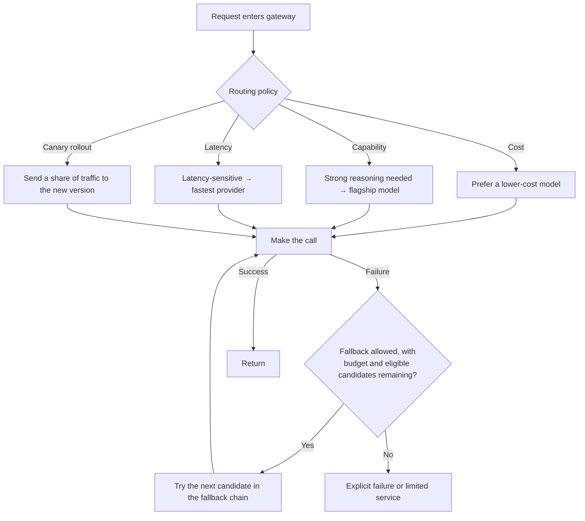

# Chapter 3: Model Gateways, Routing, and Fallback

## 3.1 Routing decisions: a policy layer above the gateway

[Tools · LLM Gateways](../../tools/05-transport-gateway/14-llm-gateway.md) covers the capabilities of **the gateway component itself**: a unified interface, load balancing, rate limits, quotas, and so on. The harder question arises after a request reaches the gateway: **what policy should decide which model receives it, and when to abandon that model and try another?** This **routing policy** sits on top of gateway infrastructure and is among the configurations LLMOps teams adjust most frequently.



## 3.2 Three common routing policies

### 3.2.1 Cost-first routing

Classify tasks by complexity. Route simple tasks, such as classification, format conversion, and short summaries, to small models; reserve flagship models for complex reasoning tasks.

```python
def route_by_complexity(task_type: str) -> str:
    cheap_tasks = {"classification", "extraction", "short_summary"}
    if task_type in cheap_tasks:
        return "small-model"   # Logical name mapped to a provider by the gateway
    return "flagship-model"
```

First evaluate whether the small model meets the minimum quality requirement and the previously agreed acceptable degradation for each business slice. It need not match the flagship on every metric. Include routing-classifier errors, the cost of two calls when escalating, and latency in the calculation. If the small model frequently fails and requires escalation, the end-to-end cost may be higher.

### 3.2.2 Capability-first routing

Only a few models may reliably handle certain tasks, such as code generation or multi-step reasoning. Routing therefore needs a model-to-capability map rather than a simple cost threshold. Keep that map updated using the evaluation results in [Chapter 7](../04-evaluation-observability/07-offline-eval-eval-driven-development.md), because provider upgrades can change model capabilities.

The map must also cover reasoning effort. Changing the effort setting on the same model can alter success rates, latency, and cost, so treat each “model × effort setting” combination as a routing candidate. For simple tasks, compare lower-effort settings with non-reasoning models; consider higher effort for difficult tasks. Base the choice on evaluation data from Chapter 7, not merely on the model's own assessment of the current request's difficulty.

Keeping the same model name does not mean the next call automatically continues the previous call's reasoning. OpenAI reasoning items can be reused only within a compatible model family. The current mode must support reuse, and earlier response items must be made available through `previous_response_id`, an attached `conversation`, or manual replay of the complete response history. These are alternative state-management paths, not parameters that must be combined. Lowering effort on the same model still requires these conditions. After a request fails, if no usable state was received or saved through the selected path, a retry cannot be treated as resuming from the point of interruption.

When switching models, recheck the output contract and remaining budget for the new candidate. In particular, do not assume that internal reasoning state transfers across providers. Record the effort setting and actual usage for every attempt. OpenAI reasoning tokens are billed as output tokens and occupy context-window space, so measuring only the visible answer's length understates the cost.

### 3.2.3 Canary routing

When releasing a new prompt or changing model versions, send a portion of traffic to the new version using a user-ID hash or a request allocation ratio. This is the routing-layer foundation for the gradual releases in [Chapter 10](../05-release-pipeline/10-llm-cicd-canary-ab.md).

## 3.3 Designing a fallback chain

### 3.3.1 A fallback chain is an ordered candidate list, not just “if A fails, use B”

```yaml
fallback_chain:
  - deployment: primary-approved
    model_snapshot: pinned-model-a
  - deployment: secondary-approved
    model_snapshot: pinned-model-a
  - deployment: alternate-approved
    model_snapshot: pinned-model-b
```

This is a logical configuration, not a list of directly callable model IDs. Using the same model across deployments can reduce migration work, but model snapshots, moderation policies, tool protocols, and regional quotas may still differ. Do not assume identical output distributions or independent failures. First exclude candidates that fail data-residency, contractual, context-length, or tool-capability requirements. Then rank the remaining candidates by failure correlation, reserved capacity, quality, and the time left.

### 3.3.2 What should trigger fallback?

| Trigger | Explanation |
|---|---|
| HTTP 5xx / timeout | The most direct failure signals |
| 429 rate limit | Provider quota exhaustion does not mean the model itself is faulty |
| Output fails contract validation | First distinguish refusals, truncation, schema incompatibility, and occasional formatting errors. Repair or fall back only if the problem is recoverable and the budget allows it; see [Chapter 5](../03-output-safety/05-structured-output-contracts.md) |
| Content-safety block | Do not fall back automatically. First apply the same business policy to decide whether to refuse, narrow the task, or seek review. Do not cycle through providers until one allows the request |

### 3.3.3 Prevent fallback from becoming a retry storm

When the primary model is overloaded, a surge of fallback traffic can overwhelm backup deployments. All retries and fallback attempts should share one overall deadline, maximum attempt count, and cost budget, with admission control on the backup side. Skip the original route when its circuit breaker is Open; allow only controlled probes when it is Half-Open. Once streamed content has reached the user, do not simply append another model's continuation. End the current stream and clearly report failure, or start again with a distinctly identifiable new response.

## 3.4 Observability requirements for routing and fallback

Routing decisions must be recorded clearly; otherwise failures cannot be diagnosed:

| Field to record | Purpose |
|---|---|
| Actual provider and model version used | Investigate why the output style changed |
| Name of the policy that selected the route | Distinguish cost-first, capability-first, and canary routing |
| Whether fallback occurred and how many candidates it traversed | Determine whether a provider is persistently unstable |
| End-to-end latency, including fallback time | Monitor the substantial tail-latency increase that fallback can cause |
| Reasoning effort and reasoning-token usage | Investigate rising bills and latency even when the model has not changed |

OpenAI's `reasoning_tokens` are already included in `output_tokens`. They provide a usage breakdown and must not be added to the output total again. Map other providers according to their own `usage` definitions rather than applying the same billing calculation to all of them. Gateway-side usage recording is covered in [Tools · LLM Gateways](../../tools/05-transport-gateway/14-llm-gateway.md).

These fields form part of the trace data model in [Chapter 8](../04-evaluation-observability/08-online-observability-tracing.md).

## 3.5 Common mistakes

### 3.5.1 Conflating routing policy with gateway infrastructure

The gateway—a unified interface, key management, and rate limiting—is infrastructure. Routing policy—which model should handle which task—is an operational decision. It changes frequently and should be independently updateable configuration, not tightly coupled to gateway code.

### 3.5.2 Using cost-based routing without evaluation evidence

Sending tasks to a cheaper model without first validating quality through offline evaluation amounts to running an unvalidated experiment on production traffic.

### 3.5.3 Considering only model changes, not deployment changes, in fallback

Different endpoints for the same model may share model-serving, network, or quota failure domains. Whether multiple deployments improve reliability depends on their dependencies and the results of failure drills, not simply on different brands or domain names.

### 3.5.4 Retrying blindly under overload and causing cascading failures

When the primary model fails because it is overloaded, use circuit-breaker state to decide whether to skip retries and fall back immediately, rather than sending more probe traffic to an already overloaded service.

### 3.5.5 Failing to log routing decisions

When the same request produces different results on two occasions, identifying the cause is nearly impossible without a record of the model version that actually handled each request.

## 3.6 Chapter summary

1. **Routing policy sits on top of gateway infrastructure.** The former is an operational decision and the latter is infrastructure; keep them decoupled.
2. **Three common routing policies are cost-first, capability-first, and canary routing.** Each serves a different objective.
3. **Cost-first routing needs evaluation evidence.** Otherwise, quality can regress unnoticed.
4. **Fallback candidates must first satisfy authorization, residency, and capability requirements; then compare failure domains and capacity.** Trying the same model across deployments first is not universally optimal.
5. **Combine fallback with circuit breaking** to avoid worsening provider overload and triggering cascading failures.
6. **Make routing decisions observable:** record the actual destination, policy name, fallback count, and latency.

## References

- [LiteLLM: Routing](https://docs.litellm.ai/docs/routing)
- [OpenAI: Reasoning models](https://developers.openai.com/api/docs/guides/reasoning)
- [Amazon Bedrock: Model routing (intelligent prompt routing)](https://docs.aws.amazon.com/bedrock/latest/userguide/intelligent-prompt-routing.html)
- [Martin Fowler: CanaryRelease](https://martinfowler.com/bliki/CanaryRelease.html)
- [Netflix Tech Blog: Fault Tolerance in a High Volume, Distributed System](https://netflixtechblog.com/fault-tolerance-in-a-high-volume-distributed-system-91ab4faae74a)
