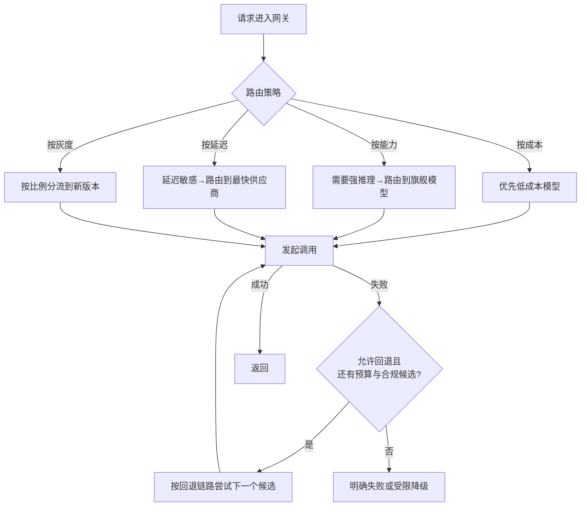

# 第三章：模型网关、路由与回退

## 3.1 路由决策：网关之上的一层策略

[Tools · LLM 网关](../../tools/05-transport-gateway/14-llm-gateway.zh.md)讲过网关**这个组件本身**要具备统一接口、负载均衡、限流配额等能力。更麻烦的是请求到了网关以后:**应该按什么策略决定打给哪个模型、什么时候放弃当前模型换下一个**。这是一层建立在网关基础设施之上的**路由策略**,也是 LLMOps 团队日常调整最频繁的配置之一。



## 3.2 三种常见路由策略

### 3.2.1 成本优先路由

把任务按复杂度分级,简单任务(分类、格式转换、短摘要)路由到小模型,只有复杂推理任务才打旗舰模型。

```python
def route_by_complexity(task_type: str) -> str:
    cheap_tasks = {"classification", "extraction", "short_summary"}
    if task_type in cheap_tasks:
        return "small-model"   # 逻辑名,由网关映射到具体供应商
    return "flagship-model"
```

先按业务切片评估小模型是否满足质量下限和预先约定的可接受退化，而不是要求所有指标都不低于旗舰模型。把路由分类器的误判、两次调用的升级成本、延迟一起计算：如果小模型经常失败后再升级，端到端成本可能更高。

### 3.2.2 能力优先路由

某些任务(代码生成、多步推理)只有少数模型能稳定完成,路由策略需要维护一张「模型-能力」映射表,而不是简单的成本阈值判断。这张表本身要跟随[第 7 章](../04-evaluation-observability/07-offline-eval-eval-driven-development.zh.md)的评测结果持续更新——模型能力会随供应商升级而变化。

能力映射还要覆盖推理档位。同一个模型换了 effort 档位，成功率、延迟和成本都可能变化，因此应把「模型 × 档位」作为路由候选。简单任务可以比较低档位与非推理模型，高难任务再考虑升档；选择要有第 7 章的评测数据支持，不能只凭模型对这一次请求的难度自报。

模型名没变，也不等于上一轮的推理会自动接上。OpenAI 的 reasoning 项只能在兼容的同一模型族内复用，还要确认当前模式支持，并通过 `previous_response_id`、关联的 `conversation`，或手动重放完整响应历史，让当前请求获得先前的响应项。这些是可选的状态管理路径，不是需要一起传入的参数。同模型降档也要满足这些条件。请求失败后，若所选路径没有收到或保存可用状态，就不能把重试当作从中断处续跑。

换模型时，应按新候选重新检查输出契约和剩余预算；跨供应商切换尤其不能假定内部推理状态可以通用。每次尝试都要记录档位和实际用量：OpenAI 的推理 token 按输出 token 计费，也占用上下文窗口，只看可见答案长度会低估开销。

### 3.2.3 灰度路由

发布新 Prompt 或切换模型版本时,按用户 ID 哈希或请求比例分流一部分流量到新版本,这是[第 10 章](../05-release-pipeline/10-llm-cicd-canary-ab.zh.md)灰度发布的路由层实现基础。

## 3.3 回退链路的设计

### 3.3.1 回退链路是有序候选列表,不是简单的「A 不行就 B」

```yaml
fallback_chain:
  - deployment: primary-approved
    model_snapshot: pinned-model-a
  - deployment: secondary-approved
    model_snapshot: pinned-model-a
  - deployment: alternate-approved
    model_snapshot: pinned-model-b
```

以上是逻辑配置，不是可直接调用的模型 ID。同模型跨部署可以减少迁移工作，但模型快照、审核策略、工具协议和区域配额仍可能不同，不能假定输出分布一致或故障独立。先过滤不满足数据驻留、合同、上下文长度和工具能力要求的候选，再按故障相关性、预留容量、质量和剩余时限排序。

### 3.3.2 什么条件触发回退

| 触发条件 | 说明 |
|---|---|
| HTTP 5xx / 超时 | 最直接的失败信号 |
| 429 限流 | 供应商配额耗尽,不代表模型本身有问题 |
| 输出未通过契约校验 | 先区分拒绝、截断、Schema 不兼容与偶发格式错误；只有可恢复且预算允许时才修复或回退，见[第 5 章](../03-output-safety/05-structured-output-contracts.zh.md) |
| 内容安全拦截 | 不自动回退；先按统一业务政策判断是否拒绝、缩小任务或复核，不能轮询供应商直到有一家放行 |

### 3.3.3 回退要防止「雪崩式重试」

主模型过载时，集中回退可能压垮备用部署。应为所有重试与回退共享总 deadline、最大尝试次数和费用预算，并在备用端做准入控制。熔断 Open 状态跳过原路径，Half-Open 仅允许受控探测。已向用户发送流式内容后，不应把另一模型的续文直接拼上去；先结束本次流并明确失败，或通过可识别的新响应重新开始。

## 3.4 路由与回退的可观测性要求

路由决策必须记录清楚,否则出问题时无法定位:

| 需要记录的字段 | 用途 |
|---|---|
| 实际路由到的供应商与模型版本 | 排查「为什么这次输出风格不一样」 |
| 触发路由的策略名称 | 区分是成本路由、能力路由还是灰度路由 |
| 是否发生了回退,回退了几层 | 判断某个供应商是否持续不稳定 |
| 端到端延迟(含回退耗时) | 回退会显著拉长尾延迟,需要单独监控 |
| 推理档位与 reasoning token 用量 | 排查「模型没换、账单和延迟却上涨」 |

OpenAI 返回的 `reasoning_tokens` 已包含在 `output_tokens` 中，只用于拆分用量，不能再与总输出相加。其他供应商要按各自的 `usage` 定义映射，不能套用同一套账单计算规则。网关侧的用量记录见 [Tools · LLM 网关](../../tools/05-transport-gateway/14-llm-gateway.zh.md)。

这些字段是[第 8 章](../04-evaluation-observability/08-online-observability-tracing.zh.md) Trace 数据模型的一部分。

## 3.5 常见错误

### 3.5.1 把路由策略和网关基础设施混为一谈

网关(统一接口、Key 管理、限流)是基础设施,路由策略(什么任务用什么模型)是运营决策,后者需要频繁调整,不应该和网关代码耦合在一起,而应做成可独立更新的配置。

### 3.5.2 成本路由没有评测背书

把任务降级到便宜模型前不做离线评测验证质量,等同于用生产流量做未经验证的实验。

### 3.5.3 回退链路只考虑「换模型」,没考虑「跨部署」

同一模型的不同入口可能共享模型服务、网络或配额故障域。多部署是否更可靠，要看依赖和演练结果；不能仅凭品牌或域名不同判断。

### 3.5.4 过载时无脑重试导致雪崩

主模型过载引发的失败,应结合熔断器判断是否应该跳过重试直接回退,而不是对一个已经过载的服务继续发起探测流量。

### 3.5.5 路由决策不落日志

出现「同样的请求这次和上次结果不一样」时,如果没有记录实际路由到的模型版本,几乎无法排查根因。

## 3.6 本章总结

1. **路由策略建立在网关基础设施之上**,前者是运营决策,后者是基础设施,两者应解耦;
2. **三类常见路由策略**:成本优先、能力优先、灰度路由,各自服务不同目标;
3. **成本路由必须有评测背书**,否则质量退化会悄悄发生;
4. **回退先满足权限、驻留和能力约束，再比较故障域和容量**，同模型跨部署不是通用最优顺序;
5. **回退要结合熔断机制**,避免在供应商过载时继续加压导致雪崩;
6. **路由决策必须可观测**:记录实际路由目标、策略名称、回退次数和延迟。

## 参考资料

- [LiteLLM: Routing](https://docs.litellm.ai/docs/routing)
- [OpenAI: Reasoning models](https://developers.openai.com/api/docs/guides/reasoning)
- [Amazon Bedrock: Model routing (intelligent prompt routing)](https://docs.aws.amazon.com/bedrock/latest/userguide/intelligent-prompt-routing.html)
- [Martin Fowler: CanaryRelease](https://martinfowler.com/bliki/CanaryRelease.html)
- [Netflix Tech Blog: Fault Tolerance in a High Volume, Distributed System](https://netflixtechblog.com/fault-tolerance-in-a-high-volume-distributed-system-91ab4faae74a)
