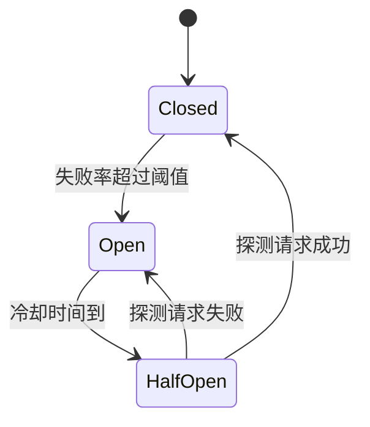

# 第四章：重试、超时、幂等与熔断

## 4.1 为什么 LLM 调用的可靠性模式不能直接照搬传统 API

LLM 调用具备几个和普通微服务调用不同的特征:**耗时长(几秒到几十秒)、费用高(重试一次就是一次完整的 token 账单)、非幂等的副作用少见但一旦发生代价很大(如已经触发了一次下游工具调用)**。这些特征让「重试、超时、幂等、熔断」这套经典分布式系统模式在 LLM 场景下需要重新校准参数,而不是直接套用默认值。

## 4.2 重试:指数退避 + 抖动,但要分清错误类型

```python
import random
import time

RETRYABLE_STATUS = {429, 500, 502, 503, 504}

def call_with_retry(fn, max_retries=3, base_delay=1.0):
    for attempt in range(max_retries + 1):
        try:
            return fn()
        except ApiError as e:
            if e.status not in RETRYABLE_STATUS or attempt == max_retries:
                raise
            # 指数退避 + 全抖动,避免大量客户端同时在同一时刻重试
            delay = base_delay * (2 ** attempt)
            time.sleep(random.uniform(0, delay))
```

**不是所有错误都值得重试**:

| 错误类型 | 是否重试 | 原因 |
|---|---|---|
| 429 限流、5xx | 是 | 大概率是瞬时问题 |
| 400 参数错误、401 鉴权失败 | 否 | 重试结果必然相同,只会浪费时间和费用 |
| 内容安全拦截 | 视情况 | 换供应商可能规避误伤(见第 3 章),原地重试通常无效 |
| 输出解析失败(见第 5 章) | 是,但要改造 Prompt | 单纯重试可能重复相同错误,常配合「把错误信息回填给模型再试一次」 |

> **抖动(jitter)不是可选项。** 如果大量客户端在完全相同的延迟后同时重试,会形成新的流量尖峰,这是分布式系统里经典的「重试风暴」。

## 4.3 超时:要设置的不是一个值,而是一个预算

一次 LLM 调用的耗时和输出长度强相关,固定超时容易在长输出场景下误杀正常请求。更稳健的做法是设置**分层超时预算**:


| 超时层级 | 典型值 | 目的 |
|---|---|---|
| 连接超时 | 1–3 秒 | 网络层面是否可达 |
| 首字节超时(TTFT 上限) | 5–15 秒 | 模型是否卡在排队或推理没有响应,和用户感知的「有没有反应」直接相关 |
| 总耗时超时 | 依据最大输出长度估算,通常 30–120 秒 | 防止极端情况下连接挂起不释放资源 |

流式返回(streaming)场景下,首字节超时比总耗时超时更重要——**只要模型开始吐字,用户体验就是「在响应」,即使总耗时长一些也能接受**;反之首字节迟迟不来,用户会认为系统卡死了。

## 4.4 幂等:防止重试引发重复副作用

如果一次 LLM 调用之后跟着一个有副作用的动作(发邮件、下单、调用外部工具),简单重试可能导致该动作被执行两次。解决方案是**幂等键(idempotency key)**:

```python
import uuid

def create_order_via_agent(request_payload: dict) -> dict:
    idempotency_key = request_payload.get("idempotency_key") or str(uuid.uuid4())
    # 幂等键必须由调用方在首次请求时生成并跨重试保持不变,
    # 而不是每次重试都重新生成
    return call_downstream_api(
        payload=request_payload,
        headers={"Idempotency-Key": idempotency_key},
    )
```

幂等键需要**在最外层生成一次,并贯穿整条重试链路**——包括网关重试、Agent 内部的工具调用重试。下游服务(支付、下单类 API)收到相同幂等键的重复请求时,直接返回第一次的结果而不重复执行。

> 幂等键方案并非 LLMOps 首创,Stripe 等支付 API 早已用它解决类似问题,LLM 场景的特殊之处在于**幂等键必须覆盖到 Agent 多轮工具调用的每一层,而不只是最外层 HTTP 请求**,否则一次「模型决定重试某个工具调用」也会引发重复副作用。

## 4.5 熔断:防止对已经过载的服务继续加压



熔断器有三种状态:**关闭(Closed)** 正常放行请求;失败率超过阈值后跳到**打开(Open)**,在冷却期内直接快速失败,不再实际调用下游;冷却期结束进入**半开(Half-Open)**,放行少量探测请求,成功则回到关闭状态,失败则回到打开状态继续冷却。

对 LLM 调用而言,熔断器的关键价值是**当某个供应商大规模故障时,让重试和回退不再对它发起新请求,直接走回退链路**(见[第 3 章](../02-request-reliability/03-model-gateway-routing-fallback.md)),同时避免海量客户端的重试流量本身成为压垮供应商恢复的最后一根稻草。

## 4.6 舱壁隔离:不同任务的故障不应互相传染

即使做了熔断,如果所有任务共用同一个连接池/线程池,一个慢任务占满资源,会拖慢所有其他任务。**舱壁隔离(bulkhead)**为不同优先级或不同类型的任务分配独立的资源池:

| 任务类型 | 独立资源池 |
|---|---|
| 用户实时对话 | 高优先级连接池,严格超时 |
| 后台批量摘要任务 | 低优先级连接池,宽松超时,可排队 |
| 内部工具调用(如向量检索) | 独立池,防止被主链路的重试风暴挤占 |

## 4.7 常见错误

### 4.7.1 对所有错误码一律重试

400、401 这类确定性错误重试没有意义,只会浪费时间和 token 费用,应该只重试瞬时性错误。

### 4.7.2 重试不带抖动

固定延迟重试会在故障恢复的瞬间制造流量尖峰,必须加入随机抖动。

### 4.7.3 用单一超时值覆盖所有场景

短任务和长输出任务用同一个超时阈值,要么误杀正常的长输出请求,要么让异常请求挂起太久不释放资源。应按第 4.3 节分层设置。

### 4.7.4 幂等键只覆盖最外层请求

Agent 内部多轮工具调用如果各自生成新的幂等键,重试时下游副作用依然可能被重复触发。

### 4.7.5 没有熔断机制,靠重试硬扛供应商故障

供应商大规模故障时,没有熔断器的系统会持续用重试请求给故障服务"添堵",延长故障恢复时间。

### 4.7.6 所有任务共享同一资源池

一个慢的后台任务占满连接池,会连带拖慢用户实时对话的响应,舱壁隔离是防止这种"故障传染"的基本手段。

## 4.8 本章总结

1. **LLM 调用的可靠性模式要重新校准参数**:耗时长、成本高、部分场景非幂等,不能直接照搬默认配置;
2. **重试要区分错误类型**,只对瞬时性错误重试,且必须带抖动的指数退避;
3. **超时应该是分层预算**:连接超时、首字节超时、总耗时超时分别设置,流式场景首字节超时更重要;
4. **幂等键必须贯穿整条重试链路**,包括 Agent 内部的多轮工具调用,而不只是最外层请求;
5. **熔断器防止对已过载的服务继续加压**,配合回退链路使用;
6. **舱壁隔离防止故障在不同任务类型之间传染**,不同优先级任务应有独立资源池。

> **一句话概括:重试、超时、幂等、熔断这套模式本身不新,LLMOps 的工作是把它们的参数和触发条件,按 LLM 调用「慢、贵、部分非幂等」的特性重新校准一遍。**

## 参考资料

- [Google Cloud: Implementing exponential backoff](https://cloud.google.com/storage/docs/retry-strategy)
- [Stripe API: Idempotent requests](https://docs.stripe.com/api/idempotent_requests)
- [Martin Fowler: CircuitBreaker](https://martinfowler.com/bliki/CircuitBreaker.html)
- [Netflix Tech Blog: Fault Tolerance in a High Volume, Distributed System](https://netflixtechblog.com/fault-tolerance-in-a-high-volume-distributed-system-91ab4faae74a)
- [AWS Well-Architected Framework: REL05-BP04 Bulkhead architecture](https://docs.aws.amazon.com/wellarchitected/latest/reliability-pillar/rel_mitigate_interaction_failure_bulkhead.html)
