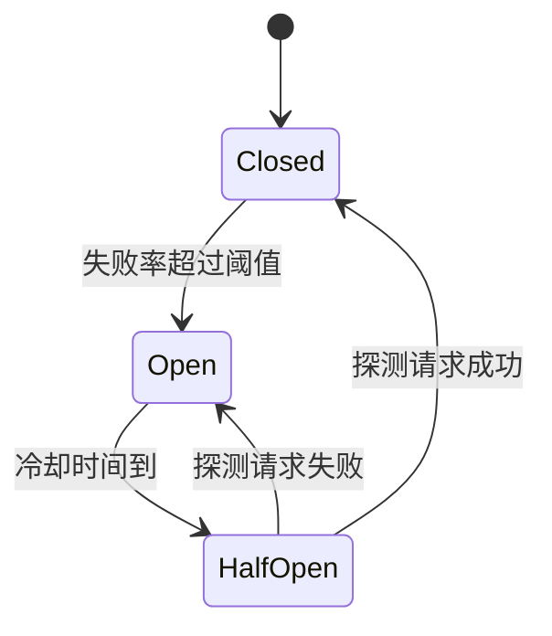

# 第四章：重试、超时、幂等与熔断

## 4.1 为什么 LLM 调用的可靠性模式不能直接照搬传统 API

LLM 生成常有较长且不稳定的时延，重复尝试可能再次计费，具体取决于失败发生的阶段和供应商规则。纯生成不会自动产生订单等业务副作用，但应用执行工具、或调用托管工具后，超时可能意味着「已经执行，只是结果未送达」。因此要分别设计生成重试和业务动作重试。

## 4.2 重试:指数退避 + 抖动,但要分清错误类型

下面只演示退避逻辑；`ApiError` 是供应商适配层的异常类型，生产实现还需统一总时限、识别额度耗尽，并处理 `Retry-After`。

```python
import random
import time

RETRYABLE_STATUS = {429, 500, 502, 503, 504}

def call_with_retry(fn, max_retries=3, base_delay=1.0):
    for attempt in range(max_retries + 1):
        try:
            return fn()
        except ApiError as e:
            if e.status not in RETRYABLE_STATUS or attempt == max_retries:
                raise
            # 指数退避 + 全抖动,避免大量客户端同时在同一时刻重试
            delay = base_delay * (2 ** attempt)
            time.sleep(random.uniform(0, delay))
```

**不是所有错误都值得重试**:

| 错误类型 | 是否重试 | 原因 |
|---|---|---|
| 瞬时限流、部分 5xx | 有预算时 | 尊重 `Retry-After`，指数退避并设上限；账户额度耗尽等持久错误应停止重试 |
| 400 参数错误、401 鉴权失败 | 否 | 重试结果必然相同,只会浪费时间和费用 |
| 内容安全拦截 | 不自动重试 | 按统一政策拒绝或复核，不通过换供应商绕过拦截 |
| 输出解析失败(见第 5 章) | 是,但要改造 Prompt | 单纯重试可能重复相同错误,常配合「把错误信息回填给模型再试一次」 |

网关、SDK、业务层不要各自独立重试。例如三层各最多尝试 3 次，最坏可能放大为 27 次下游调用。指定重试责任层，并让排队、退避、主调用和回退共同消耗同一个 deadline；超时后向下游传播取消，但取消不保证已发生的动作撤销。

## 4.3 超时:要设置的不是一个值,而是一个预算

一次 LLM 调用的耗时和输出长度强相关,固定超时容易在长输出场景下误杀正常请求。更稳健的做法是设置**分层超时预算**:


| 超时层级 | 典型值 | 目的 |
|---|---|---|
| 连接超时 | 1–3 秒 | 网络层面是否可达 |
| 首 token 超时 | 示例为 5–15 秒 | 首个有效内容 token 的等待时间；HTTP 首字节、响应头或心跳不等于首 token |
| 总耗时超时 | 依据最大输出长度估算,通常 30–120 秒 | 防止极端情况下连接挂起不释放资源 |

表中数值仅用于展示层级，应由任务长度、负载实测与 SLO 决定。流式场景还需要 token 间空闲超时，防止首 token 后一直停顿；首响应、完成时间和取消后的资源释放都重要，不能靠不断发心跳维持表面可用。

## 4.4 幂等:防止重试引发重复副作用

如果一次 LLM 调用之后跟着一个有副作用的动作(发邮件、下单、调用外部工具),简单重试可能导致该动作被执行两次。解决方案是**幂等键(idempotency key)**:

```python
def create_order_via_agent(request_payload: dict, idempotency_key: str) -> dict:
    if not idempotency_key:
        raise ValueError("创建订单需要持久化的动作级幂等键")
    return call_downstream_api(
        payload=request_payload,
        headers={"Idempotency-Key": idempotency_key},
    )
```

调用方应在首次执行前生成并持久化动作 ID，同一逻辑动作的重试复用该 ID；同一任务中的「创建订单」和「发送邮件」必须使用不同键。服务端还需要按租户隔离键空间、校验参数摘要、原子登记执行状态并保存结果。只有请求头、没有服务端去重实现，并不能提供幂等保证。

Stripe 的文档明确区分执行开始前的失败、首次执行结果与键的保留期：保存的结果可能包括 `500`，键过期后再次使用也可能重新执行。结果未知时先查询动作状态或对账，不能更换键盲目重放。跨服务动作还可能需要 outbox、补偿或人工处理，不能宣称一个键实现端到端 exactly-once。

## 4.5 熔断:防止对已经过载的服务继续加压



熔断器有三种状态:**关闭(Closed)** 正常放行请求;失败率超过阈值后跳到**打开(Open)**,在冷却期内直接快速失败,不再实际调用下游;冷却期结束进入**半开(Half-Open)**,放行少量探测请求,成功则回到关闭状态,失败则回到打开状态继续冷却。

对 LLM 调用而言,熔断器的关键价值是**当某个供应商大规模故障时,让重试和回退不再对它发起新请求,直接走回退链路**(见[第 3 章](../02-request-reliability/03-model-gateway-routing-fallback.md)),同时避免海量客户端的重试流量本身成为压垮供应商恢复的最后一根稻草。

## 4.6 舱壁隔离:不同任务的故障不应互相传染

即使做了熔断,如果所有任务共用同一个连接池/线程池,一个慢任务占满资源,会拖慢所有其他任务。**舱壁隔离(bulkhead)**为不同优先级或不同类型的任务分配独立的资源池:

| 任务类型 | 独立资源池 |
|---|---|
| 用户实时对话 | 高优先级连接池,严格超时 |
| 后台批量摘要任务 | 低优先级连接池,宽松超时,可排队 |
| 内部工具调用(如向量检索) | 独立池,防止被主链路的重试风暴挤占 |

## 4.7 常见错误

### 4.7.1 对所有错误码一律重试

400、401 这类确定性错误重试没有意义,只会浪费时间和 token 费用,应该只重试瞬时性错误。

### 4.7.2 重试不带抖动

固定延迟重试会在故障恢复的瞬间制造流量尖峰,必须加入随机抖动。

### 4.7.3 用单一超时值覆盖所有场景

短任务和长输出任务用同一个超时阈值,要么误杀正常的长输出请求,要么让异常请求挂起太久不释放资源。应按第 4.3 节分层设置。

### 4.7.4 幂等键只覆盖最外层请求

Agent 内部多轮工具调用如果各自生成新的幂等键,重试时下游副作用依然可能被重复触发。

### 4.7.5 没有熔断机制,靠重试硬扛供应商故障

供应商大规模故障时,没有熔断器的系统会持续用重试请求给故障服务"添堵",延长故障恢复时间。

### 4.7.6 所有任务共享同一资源池

一个慢的后台任务占满连接池,会连带拖慢用户实时对话的响应,舱壁隔离是防止这种"故障传染"的基本手段。

## 4.8 本章总结

1. **LLM 调用的可靠性模式要重新校准参数**:耗时长、成本高、部分场景非幂等,不能直接照搬默认配置;
2. **重试要区分错误类型**,只对瞬时性错误重试,且必须带抖动的指数退避;
3. **超时是共享预算**：连接、首 token、流中停顿和总时限分别约束，覆盖排队与回退;
4. **同一动作的重试复用幂等键，不同动作分键**，并依赖服务端原子去重和结果查询;
5. **熔断器防止对已过载的服务继续加压**,配合回退链路使用;
6. **舱壁隔离防止故障在不同任务类型之间传染**,不同优先级任务应有独立资源池。

## 参考资料

- [Google Cloud: Implementing exponential backoff](https://cloud.google.com/storage/docs/retry-strategy)
- [Stripe API: Idempotent requests](https://docs.stripe.com/api/idempotent_requests)
- [Martin Fowler: CircuitBreaker](https://martinfowler.com/bliki/CircuitBreaker.html)
- [Netflix Tech Blog: Fault Tolerance in a High Volume, Distributed System](https://netflixtechblog.com/fault-tolerance-in-a-high-volume-distributed-system-91ab4faae74a)
- [AWS Well-Architected Framework: REL05-BP04 Bulkhead architecture](https://docs.aws.amazon.com/wellarchitected/latest/reliability-pillar/rel_mitigate_interaction_failure_bulkhead.html)
