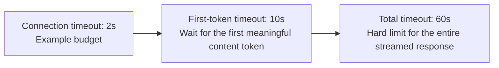
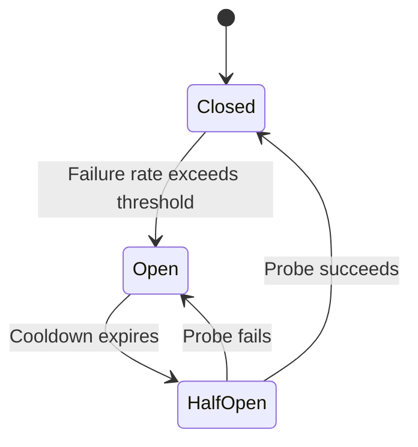

# Chapter 4: Retries, Timeouts, Idempotency, and Circuit Breakers

## 4.1 Why reliability patterns for LLM calls need adaptation

LLM generation often has long, variable latency. Another attempt may incur another charge, depending on when the failure occurred and the provider's rules. Generation alone does not automatically create business side effects such as orders. Once the application executes tools, or invokes hosted tools, however, a timeout may mean “the action already ran, but its result never arrived.” Generation retries and business-action retries therefore need separate designs.

## 4.2 Retries: exponential backoff with jitter, guided by error type

The following example demonstrates only backoff logic. `ApiError` is an exception type from the provider adapter. A production implementation also needs a shared overall deadline, recognition of exhausted account quotas, and support for `Retry-After`.

```python
import random
import time

RETRYABLE_STATUS = {429, 500, 502, 503, 504}

def call_with_retry(fn, max_retries=3, base_delay=1.0):
    for attempt in range(max_retries + 1):
        try:
            return fn()
        except ApiError as e:
            if e.status not in RETRYABLE_STATUS or attempt == max_retries:
                raise
            # Exponential backoff with full jitter keeps clients from retrying together
            delay = base_delay * (2 ** attempt)
            time.sleep(random.uniform(0, delay))
```

**Not every error warrants a retry:**

| Error type | Retry? | Reason |
|---|---|---|
| Transient rate limits and some 5xx errors | If budget remains | Respect `Retry-After`, use exponential backoff, and set a cap; stop retrying persistent errors such as exhausted account quotas |
| 400 invalid parameters, 401 authentication failure | No | Repeating the request will produce the same outcome and only waste time and money |
| Content-safety block | Not automatically | Refuse or seek review under the same policy; do not bypass the block by switching providers |
| Output parsing failure (see Chapter 5) | Diagnose first, then decide | Do not retry a refusal as a formatting error. For truncation, check the output budget first; fix configuration for schema incompatibility. Consider limited retries or feeding back sanitized validation details only for occasional formatting errors |

The gateway, SDK, and business layer must not retry independently. For example, if each of three layers makes up to 3 attempts, the worst case can expand to 27 downstream calls. Assign retry ownership to one layer and make queuing, backoff, the primary call, and fallback consume the same deadline. Propagate cancellation downstream when it expires, but remember that cancellation does not guarantee that completed actions are undone.

## 4.3 Timeouts: a budget, not a single number

An LLM call's duration is strongly related to its output length. A fixed timeout can incorrectly terminate healthy requests that produce long outputs. A more robust approach uses **layered timeout budgets**:



| Timeout layer | Typical value | Purpose |
|---|---|---|
| Connection timeout | 1–3 seconds | Determine whether the service is reachable over the network |
| First-token timeout | 5–15 seconds in this example | Limit the wait for the first meaningful content token; the first HTTP byte, response headers, and heartbeats are not the first token |
| Total timeout | Estimate from maximum output length, usually 30–120 seconds | Prevent a stalled connection from holding resources indefinitely in extreme cases |

These numbers illustrate the layers, not recommended defaults. Choose them from task length, measured load behavior, and SLOs. Streaming also needs an inter-token idle timeout so that the stream cannot stall indefinitely after the first token. Initial response time, completion time, and resource release after cancellation all matter; continually sending heartbeats is not a substitute for actual availability.

## 4.4 Idempotency: preventing duplicate side effects on retry

If an LLM call is followed by a side-effecting action—sending an email, creating an order, or calling an external tool—a simple retry may execute that action twice. The solution is an **idempotency key**:

```python
def create_order_via_agent(request_payload: dict, idempotency_key: str) -> dict:
    if not idempotency_key:
        raise ValueError("创建订单需要持久化的动作级幂等键")
    return call_downstream_api(
        payload=request_payload,
        headers={"Idempotency-Key": idempotency_key},
    )
```

The error message states that creating an order requires a persisted, action-level idempotency key. The caller should generate and persist the action ID before the first execution, then reuse it for retries of that logical action. “Create order” and “send email” within the same task must use different keys. The server must also isolate key namespaces by tenant, validate parameter digests, atomically register execution state, and retain results. A request header without server-side deduplication does not provide idempotency.

Stripe's documentation distinguishes failures before execution begins, the result of the first execution, and key retention. Saved results can include `500` errors, and reusing an expired key may execute the request again. When the outcome is unknown, query action status or reconcile records before proceeding; do not blindly replay the action with a new key. Cross-service actions may also require an outbox, compensation, or manual handling. One key does not provide end-to-end exactly-once effects.

## 4.5 Circuit breakers: stop adding load to an overloaded service



A circuit breaker has three states. **Closed** permits requests normally. When the failure rate exceeds the threshold, it moves to **Open**, failing fast throughout the cooldown without calling the downstream service. After the cooldown, it enters **Half-Open** and allows a small number of probe requests. Successful probes close the circuit; failed probes reopen it for another cooldown.

For LLM calls, the key benefit is **preventing retries and fallback attempts from sending new requests to a provider during a widespread outage, and moving directly to the fallback path**; see [Chapter 3](../02-request-reliability/03-model-gateway-routing-fallback.md). It also prevents retry traffic from large numbers of clients from overwhelming the provider just as it tries to recover.

## 4.6 Bulkhead isolation: keep one task's failures from spreading to others

Even with circuit breakers, a slow task can consume a shared connection or thread pool and delay every other task. **Bulkhead isolation** assigns separate resource pools to different priorities or task types:

| Task type | Separate resource pool |
|---|---|
| Real-time user conversations | High-priority connection pool with strict timeouts |
| Background batch summarization | Low-priority connection pool with more generous timeouts and queuing |
| Internal tool calls, such as vector retrieval | Independent pool protected from retry storms on the main request path |

## 4.7 Common mistakes

### 4.7.1 Retrying every error code

Retrying deterministic failures such as 400 or 401 is pointless and wastes time and token costs. Retry only transient errors.

### 4.7.2 Retrying without jitter

Fixed-delay retries create a traffic spike as the service recovers. Add random jitter.

### 4.7.3 Using one timeout for every scenario

The same threshold for short tasks and long-output tasks either terminates healthy long-running requests or lets faulty requests retain resources for too long. Use the layered approach in Section 4.3.

### 4.7.4 Applying an idempotency key only to the outermost request

If an agent's internal rounds of tool calls each generate new idempotency keys, retries may still repeat downstream side effects.

### 4.7.5 Relying on retries to endure a provider outage without circuit breaking

During a widespread provider outage, a system without circuit breakers keeps adding retry traffic to the failing service and prolongs its recovery.

### 4.7.6 Sharing one resource pool across all tasks

A slow background task can fill the connection pool and delay real-time user conversations. Bulkhead isolation is a basic defense against this propagation of failures.

## 4.8 Chapter summary

1. **Reliability patterns need retuned parameters for LLM calls.** Long durations, high costs, and non-idempotent scenarios make copied default configurations unsuitable.
2. **Distinguish error types before retrying.** Retry only transient errors, using exponential backoff with jitter.
3. **Timeouts form a shared budget:** separately constrain connection establishment, the first token, pauses within a stream, and total elapsed time, including queuing and fallback.
4. **Reuse the same idempotency key for retries of one action, and different keys for different actions.** This depends on atomic server-side deduplication and result queries.
5. **Circuit breakers stop additional load from reaching an overloaded service.** Use them alongside the fallback path.
6. **Bulkhead isolation prevents failures from spreading across task types.** Give tasks of different priorities independent resource pools.

## References

- [Google Cloud: Implementing exponential backoff](https://cloud.google.com/storage/docs/retry-strategy)
- [Stripe API: Idempotent requests](https://docs.stripe.com/api/idempotent_requests)
- [Martin Fowler: CircuitBreaker](https://martinfowler.com/bliki/CircuitBreaker.html)
- [Netflix Tech Blog: Fault Tolerance in a High Volume, Distributed System](https://netflixtechblog.com/fault-tolerance-in-a-high-volume-distributed-system-91ab4faae74a)
- [AWS Well-Architected Framework: REL05-BP04 Bulkhead architecture](https://docs.aws.amazon.com/wellarchitected/latest/reliability-pillar/rel_mitigate_interaction_failure_bulkhead.html)
