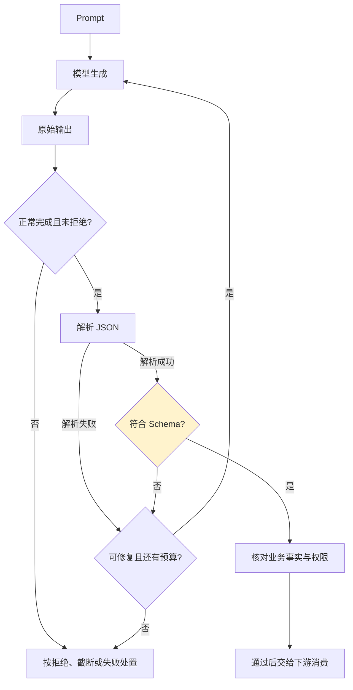

# 第五章：结构化输出与契约校验

## 5.1 为什么下游系统不能直接消费自由文本

生产系统里的 LLM 输出既可能展示给人，也可能被程序解析——填进数据库字段、驱动一次 API 调用、拼进另一个 Prompt。自由文本生成天然带有格式不稳定的风险:同一个 Prompt 多次调用,模型可能这次输出 `{"amount": 100}`,下次输出 `金额是100元`。**契约校验的作用,是在模型输出和下游程序之间建立一层可验证的接口。**



顺序是先检查响应状态，再解析 JSON、验证 Schema，最后核对业务条件。解析和 Schema 校验可以由同一个库完成，但它们不是同一个判断；任何一层失败，都不能把半成品交给下游执行。

## 5.2 接口形式与约束强度要分开看

| 手段 | 约束强度 | 说明 |
|---|---|---|
| **Prompt 里描述格式要求** | 弱 | 只是"建议",模型仍可能不遵守,尤其在长上下文或复杂任务里 |
| **JSON mode** | 语法约束 | 面向合法 JSON，不等于符合指定字段和类型的 Schema |
| **Function Calling / Tool Use** | 取决于配置 | 是生成工具参数的接口，不天然保证 Schema；严格工具调用也可以使用 Structured Outputs |
| **严格结构化输出 / 约束解码** | Schema 约束 | 在模型、接口和 Schema 子集被支持且生成正常完成时约束输出结构 |

OpenAI 的 [Structured Outputs](https://platform.openai.com/docs/guides/structured-outputs) 可用于结构化回答，也可用于严格工具调用。**先检查响应状态和拒绝信号，再解析完整对象**：拒绝可能不符合业务 Schema，长度上限或中断可能留下不完整输出，未支持的 Schema 则可能在请求时被拒绝。约束解码不保证金额、币种或业务事实正确；可验证的语义应在运行时核对，离线评测衡量剩余错误率。

## 5.3 用 Schema 做双重校验:生成时约束 + 接收后再验证

即使使用了约束解码,**接收端仍然应该做一次独立的 Schema 校验**,不能假设生成端一定生效:

```python
from pydantic import BaseModel, ConfigDict, Field, ValidationError

class ContractViolation(ValueError):
    pass

class ExtractedOrder(BaseModel):
    model_config = ConfigDict(strict=True, extra="forbid")
    order_id: str = Field(min_length=1)
    amount_cents: int = Field(ge=0)
    currency: str = Field(pattern=r"^[A-Z]{3}$")

def parse_model_output(raw_json: str) -> ExtractedOrder:
    try:
        return ExtractedOrder.model_validate_json(raw_json)
    except ValidationError as e:
        raise ContractViolation("订单输出未通过契约校验") from e
```

上例按 Pydantic v2 编写，禁止隐式类型转换和额外字段，但仍不保证币种真实存在、订单属于当前租户或金额等于账本。执行前还要查权威数据源并授权。异常链可能包含原始输入，日志不得自动全量序列化它。流式工具参数必须在完整接收并验证后才可执行。

## 5.4 契约要有版本号

下游消费方和模型输出方对 Schema 的理解必须严格对齐,否则新增一个字段就可能让老版本的解析代码报错。契约应该像 API 一样版本化:

```json
{
  "schema_version": "order_extraction.v2",
  "order_id": "ORD-2026-0831",
  "amount_cents": 12900,
  "currency": "USD",
  "confidence": 0.94
}
```

这是扩展契约的独立示例，新增了 `schema_version` 和 `confidence`，不能直接传给 5.3 节禁止额外字段的模型类。请求配置决定预期的 `schema_version`，不能让模型声明任意版本后就选择更宽松的解析器。Prompt 与 Schema 分别编号、显式关联并一起发布。示例的 `confidence` 只是一个数值，不是经校准的正确概率，不能单独作为支付或自动审批依据。

## 5.5 修复策略:校验失败之后怎么办

| 策略 | 适用场景 | 代价 |
|---|---|---|
| **原样重试** | 偶发的格式错误 | 一次额外的模型调用费用 |
| **把错误信息回填给模型再试一次** | 可定位的字段或类型错误 | 增加调用、延迟与注入面，收益应在业务数据上测量 |
| **规则修复(如去除多余的 Markdown 代码块标记)** | 已知的、固定模式的格式问题 | 几乎零成本,但只能覆盖已知问题 |
| **降级到更严格约束解码的模型** | 反复失败 | 见[第 3 章](../02-request-reliability/03-model-gateway-routing-fallback.md)的回退链路 |
| **走降级路径,不再尝试解析** | 重试多次仍失败 | 见[第 6 章](06-guardrails-degradation.md) |

```python
def parse_with_repair(raw_text: str, schema: type, max_repairs: int = 1):
    for attempt in range(max_repairs + 1):
        try:
            return schema.model_validate_json(strip_markdown_fence(raw_text))
        except ValidationError as e:
            if attempt == max_repairs:
                raise
            errors = [
                {"loc": error["loc"], "type": error["type"]}
                for error in e.errors(include_input=False, include_context=False)
            ]
            raw_text = regenerate_with_error_context(errors)
```

## 5.6 常见错误

### 5.6.1 只在 Prompt 里描述格式,不做任何程序化校验

"请用 JSON 格式回答"不是可执行的契约。程序消费场景应按接口能力选择严格结构化输出，并保留接收端校验及拒绝、截断处理。

### 5.6.2 假设约束解码 100% 可靠,省略接收端校验

约束解码可能因为网关转换、流式截断等原因失效,接收端校验是最后一道防线,不能省略。

### 5.6.3 Schema 变更没有版本号

新增或修改字段却不升版本号,会让老版本的下游解析逻辑在不知情的情况下悄悄出错,这类问题往往过很久才被发现。

### 5.6.4 校验失败后无脑原样重试

同样的 Prompt 可能重复原来的错误，回填错误也不保证有效。先判断失败能否通过重新生成解决，再在共同的次数、费用与超时预算内选择修复方式；拒绝、权限不足和不支持的 Schema 不能靠反复生成解决。

### 5.6.5 混淆"格式正确"和"内容正确"

合法 JSON 不是授权证明。金额、日期、资源归属等可验证条件，应由服务端执行前核对；评测不能替代每一次交易的业务校验。规则修复只适合无歧义格式变化，不应猜测并更改金额等业务值。

## 5.7 本章总结

1. **程序需要结构化字段或执行动作时，不能直接信任自由文本**，应建立可验证的契约；单纯展示文本也仍需按渲染环境做安全处理;
2. **工具调用是接口形式，不是固定的约束等级**；JSON 语法约束与严格 Schema 约束要区分;
3. **约束解码解决格式问题,不解决内容语义问题**,两者需要不同的机制兜底;
4. **接收端必须独立做 Schema 校验**,不能假设生成端一定按约束生效;
5. **契约需要版本号**,Prompt 和它对应的输出 Schema 应作为同一个可版本化单元管理;
6. **校验失败要有分级修复策略**,从原样重试到回填错误上下文,再到最终的降级路径。

## 参考资料

- [OpenAI: Structured Outputs](https://platform.openai.com/docs/guides/structured-outputs)
- [OpenAI: Function calling](https://platform.openai.com/docs/guides/function-calling)
- [Anthropic: Tool use with Claude](https://docs.anthropic.com/en/docs/build-with-claude/tool-use)
- [JSON Schema Specification](https://json-schema.org/specification)
- [Pydantic: Validators](https://docs.pydantic.dev/latest/concepts/validators/)
