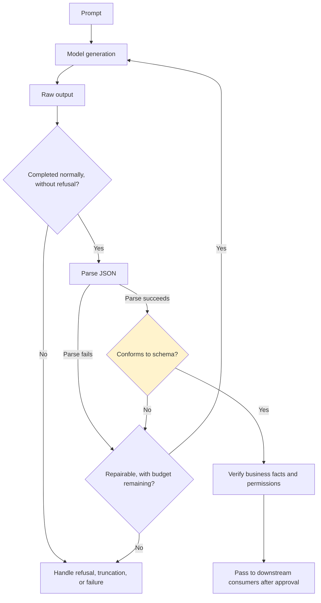

# Chapter 5: Structured Outputs and Contract Validation

## 5.1 Why downstream systems cannot consume free text directly

In production, LLM outputs may be displayed to people or parsed by programs: written into database fields, used to drive an API call, or inserted into another prompt. Free-text generation carries an inherent risk of inconsistent formatting. Given the same prompt, a model might produce `{"amount": 100}` on one call and `金额是100元` (“the amount is 100 yuan”) on the next. **Contract validation establishes a verifiable interface between model output and downstream programs.**



Check response status first, then parse JSON and validate the schema, and finally verify business conditions. A single library may perform both parsing and schema validation, but these are different checks. Failure at any stage must prevent an unfinished result from reaching downstream execution.

## 5.2 Interface form and constraint strength are separate questions

| Method | Constraint strength | Explanation |
|---|---|---|
| **Format instructions in the prompt** | Weak | Merely a request; the model may not comply, particularly with long contexts or complex tasks |
| **JSON mode** | Syntax constraint | Targets valid JSON, not necessarily a schema's required fields and types |
| **Function calling / tool use** | Configuration-dependent | An interface for generating tool arguments, not an inherent schema guarantee; strict tool calling can also use Structured Outputs |
| **Strict structured outputs / constrained decoding** | Schema constraint | Constrains output structure when the model, interface, and schema subset are supported and generation completes normally |

OpenAI's [Structured Outputs](https://platform.openai.com/docs/guides/structured-outputs) can be used for both structured responses and strict tool calling. **Check response status and refusal signals before parsing a complete object.** A refusal may not conform to the business schema, a length limit or interruption may leave output incomplete, and an unsupported schema may cause the request to be rejected. Constrained decoding does not guarantee that amounts, currencies, or business facts are correct. Verify checkable semantics at runtime, and use offline evaluation to measure the remaining error rate.

The same sequence applies to reasoning models. A schema constrains the structure of visible output; valid output does not establish that internal reasoning is controlled.

A missing answer is not necessarily a formatting problem. When the OpenAI Responses API returns `incomplete`, first inspect `incomplete_details.reason`. A value of `max_output_tokens` means generation reached a token limit, but actual usage and available context space must also be examined to determine whether the output allowance was insufficient or the context window filled during generation. Only then decide whether to increase the output allowance, shorten the input, or split the task, while respecting the remaining cost and time budgets. Repeating the same request as described in Section 5.5 may truncate again and should not be the default remedy.

Reserve output space according to the API's definition of total usage, not just the expected JSON length. OpenAI's `max_output_tokens` also includes reasoning and non-visible formatting tokens. For Claude's manual budget rules and mode-specific exceptions, see [LLM Chapter 17, §17.6.7](../../llm/04-prompt-reliability/17-cot.md).

## 5.3 Validate twice: constrain generation and check the received output

Even with constrained decoding, **the receiving side should independently validate the schema** rather than assume the generation constraint took effect:

```python
from pydantic import BaseModel, ConfigDict, Field, ValidationError

class ContractViolation(ValueError):
    pass

class ExtractedOrder(BaseModel):
    model_config = ConfigDict(strict=True, extra="forbid")
    order_id: str = Field(min_length=1)
    amount_cents: int = Field(ge=0)
    currency: str = Field(pattern=r"^[A-Z]{3}$")

def parse_model_output(raw_json: str) -> ExtractedOrder:
    try:
        return ExtractedOrder.model_validate_json(raw_json)
    except ValidationError as e:
        raise ContractViolation("订单输出未通过契约校验") from e
```

The exception message states that the order output failed contract validation. This Pydantic v2 example rejects implicit type conversions and extra fields, but still does not establish that the currency exists, the order belongs to the current tenant, or the amount matches the ledger. Consult authoritative data sources and authorize the action before execution. The exception chain may contain raw input; logs must not automatically serialize it in full. Streamed tool arguments must be completely received and validated before execution.

## 5.4 Contracts need version numbers

The downstream consumer and model-output producer must agree precisely on the schema. Otherwise, even adding a field may break an older parser. Version contracts as you would APIs:

```json
{
  "schema_version": "order_extraction.v2",
  "order_id": "ORD-2026-0831",
  "amount_cents": 12900,
  "currency": "USD",
  "confidence": 0.94
}
```

This is a separate example of an extended contract. It adds `schema_version` and `confidence`, so it cannot be passed directly to the model class in Section 5.3, which forbids extra fields. Request configuration determines the expected `schema_version`; do not let the model declare an arbitrary version and thereby select a more permissive parser. Give prompts and schemas separate version identifiers, associate them explicitly, and release them together. The example's `confidence` is just a number, not a calibrated probability of correctness, and must not independently justify a payment or automated approval.

## 5.5 Repair strategies: what happens after validation fails?

| Strategy | Suitable situation | Cost |
|---|---|---|
| **Retry unchanged** | Occasional formatting errors | The cost of another model call |
| **Feed the error back to the model and try again** | A field or type error that can be located | Additional calls, latency, and exposure to injection; measure the benefit on business data |
| **Rule-based repair, such as removing extra Markdown fences** | Known formatting problems with fixed patterns | Almost no cost, but only covers known problems |
| **Fall back to a model with stricter constrained decoding** | Repeated failures | See the fallback chain in [Chapter 3](../02-request-reliability/03-model-gateway-routing-fallback.md) |
| **Use a degraded-service path and stop parsing attempts** | Continued failure after multiple retries | See [Chapter 6](06-guardrails-degradation.md) |

```python
def parse_with_repair(raw_text: str, schema: type, max_repairs: int = 1):
    for attempt in range(max_repairs + 1):
        try:
            return schema.model_validate_json(strip_markdown_fence(raw_text))
        except ValidationError as e:
            if attempt == max_repairs:
                raise
            errors = [
                {"loc": error["loc"], "type": error["type"]}
                for error in e.errors(include_input=False, include_context=False)
            ]
            raw_text = regenerate_with_error_context(errors)
```

## 5.6 Common mistakes

### 5.6.1 Describing the format in a prompt without programmatic validation

“Please respond in JSON” is not an executable contract. For programmatic consumers, choose strict structured outputs according to the interface's capabilities, while retaining receiving-side validation and handling for refusals and truncation.

### 5.6.2 Assuming constrained decoding is 100% reliable and omitting receiving-side validation

Gateway transformations, truncated streams, and similar issues can defeat the expected guarantee of constrained decoding. Receiving-side validation is the last line of defense and cannot be omitted.

### 5.6.3 Changing a schema without versioning it

Adding or changing fields without a version increment can silently break older downstream parsing logic. Such failures can remain unnoticed for a long time.

### 5.6.4 Blindly retrying the same request after validation fails

The same prompt may repeat the original error, and feeding back an error does not guarantee a fix. First determine whether regeneration can resolve the failure, then choose a repair method within the shared attempt, cost, and timeout budgets. Repeated generation cannot solve refusals, insufficient permissions, or unsupported schemas.

### 5.6.5 Confusing correct format with correct content

Valid JSON is not proof of authorization. The server should verify checkable conditions, such as amounts, dates, and resource ownership, before execution. Evaluation cannot replace business validation for each transaction. Rule-based repair is appropriate only for unambiguous formatting changes, not for guessing or modifying business values such as amounts.

## 5.7 Chapter summary

1. **When programs need structured fields or execute actions, free text cannot be trusted directly.** Establish a verifiable contract. Even text intended only for display still needs safety measures appropriate to its rendering context.
2. **Tool calling is an interface form, not a fixed level of constraint.** Distinguish JSON syntax constraints from strict schema constraints.
3. **Constrained decoding addresses format, not semantic correctness.** These need different safeguards.
4. **The receiving side must independently validate the schema.** Do not assume generation constraints were applied successfully.
5. **Contracts need version numbers.** Manage a prompt and its corresponding output schema as one versionable unit.
6. **Use graduated repair strategies after validation fails,** from an unchanged retry to error-context feedback and, ultimately, a degraded-service path.

## References

- [OpenAI: Structured Outputs](https://platform.openai.com/docs/guides/structured-outputs)
- [OpenAI: Reasoning models](https://developers.openai.com/api/docs/guides/reasoning)
- [OpenAI: Function calling](https://platform.openai.com/docs/guides/function-calling)
- [Anthropic: Tool use with Claude](https://docs.anthropic.com/en/docs/build-with-claude/tool-use)
- [JSON Schema Specification](https://json-schema.org/specification)
- [Pydantic: Validators](https://docs.pydantic.dev/latest/concepts/validators/)
