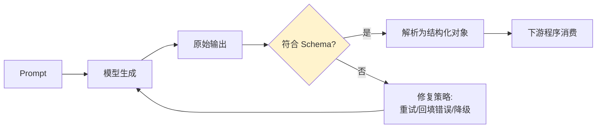

# 第五章：结构化输出与契约校验

## 5.1 为什么下游系统不能直接消费自由文本

生产系统里的 LLM 输出很少是给人看的最终产物,更多情况下要被下一段程序解析——填进数据库字段、驱动一次 API 调用、拼进另一个 Prompt。自由文本生成天然带有格式不稳定的风险:同一个 Prompt 多次调用,模型可能这次输出 `{"amount": 100}`,下次输出 `金额是100元`。**契约校验的作用,是在模型输出和下游程序之间建立一层可验证的接口。**



## 5.2 三层约束手段,强度依次递增

| 手段 | 约束强度 | 说明 |
|---|---|---|
| **Prompt 里描述格式要求** | 弱 | 只是"建议",模型仍可能不遵守,尤其在长上下文或复杂任务里 |
| **Function Calling / Tool Use** | 中 | 模型按声明的参数 Schema 生成调用参数,主流供应商原生支持,可靠性远高于纯文本描述 |
| **约束解码(Structured Outputs)** | 强 | 推理时直接约束 token 采样只能生成符合 JSON Schema 的序列,语法层面保证合法 |

OpenAI 的 [Structured Outputs](https://platform.openai.com/docs/guides/structured-outputs) 和多数开源推理框架的 grammar-constrained decoding 都属于第三种——**它保证输出一定是合法 JSON 且字段类型匹配 Schema,但不保证字段内容语义正确**。这个区别很重要:约束解码解决的是"格式对不对",不解决"内容对不对",后者仍然要靠[第 7 章](../04-evaluation-observability/07-offline-eval-eval-driven-development.md)的评测来兜底。

## 5.3 用 Schema 做双重校验:生成时约束 + 接收后再验证

即使使用了约束解码,**接收端仍然应该做一次独立的 Schema 校验**,不能假设生成端一定生效:

```python
from pydantic import BaseModel, Field, ValidationError

class ExtractedOrder(BaseModel):
    order_id: str = Field(min_length=1)
    amount_cents: int = Field(ge=0)
    currency: str = Field(pattern=r"^[A-Z]{3}$")

def parse_model_output(raw_json: str) -> ExtractedOrder:
    try:
        return ExtractedOrder.model_validate_json(raw_json)
    except ValidationError as e:
        # 记录校验失败详情,供修复策略和评测集回收使用
        raise ContractViolation(str(e)) from e
```

**这不是重复劳动。** 约束解码可能因为供应商版本差异、网关中间层的转换 bug、或流式响应被截断而失效,接收端校验是最后一道防线,也是[第 8 章](../04-evaluation-observability/08-online-observability-tracing.md)统计"契约违反率"这个可观测性指标的数据来源。

## 5.4 契约要有版本号

下游消费方和模型输出方对 Schema 的理解必须严格对齐,否则新增一个字段就可能让老版本的解析代码报错。契约应该像 API 一样版本化:

```json
{
  "schema_version": "order_extraction.v2",
  "order_id": "ORD-2026-0831",
  "amount_cents": 12900,
  "currency": "USD",
  "confidence": 0.94
}
```

`schema_version` 让下游程序可以按版本分支处理,也是[第 9 章](../05-release-pipeline/09-prompt-model-data-versioning.md) Prompt 版本管理里"改动 Prompt 输出格式必须同步升版本号"这条规则的落地方式——**Prompt 和它期望的输出 Schema 应该被当作同一个可版本化的单元**。

## 5.5 修复策略:校验失败之后怎么办

| 策略 | 适用场景 | 代价 |
|---|---|---|
| **原样重试** | 偶发的格式错误 | 一次额外的模型调用费用 |
| **把错误信息回填给模型再试一次** | 复杂 Schema、模型"几乎对了" | 需要额外一轮上下文,但成功率通常显著提升 |
| **规则修复(如去除多余的 Markdown 代码块标记)** | 已知的、固定模式的格式问题 | 几乎零成本,但只能覆盖已知问题 |
| **降级到更严格约束解码的模型** | 反复失败 | 见[第 3 章](../02-request-reliability/03-model-gateway-routing-fallback.md)的回退链路 |
| **走降级路径,不再尝试解析** | 重试多次仍失败 | 见[第 6 章](06-guardrails-degradation.md) |

```python
def parse_with_repair(raw_text: str, schema: type, max_repairs: int = 1):
    for attempt in range(max_repairs + 1):
        try:
            return schema.model_validate_json(strip_markdown_fence(raw_text))
        except ValidationError as e:
            if attempt == max_repairs:
                raise
            # 把校验错误信息作为新一轮 Prompt 的一部分回填给模型
            raw_text = regenerate_with_error_context(str(e))
```

## 5.6 常见错误

### 5.6.1 只在 Prompt 里描述格式,不做任何程序化校验

"请用 JSON 格式回答"这句话不是契约,只是建议。生产系统必须有 5.2 节里中等或更强约束的手段,并且接收端仍要校验。

### 5.6.2 假设约束解码 100% 可靠,省略接收端校验

约束解码可能因为网关转换、流式截断等原因失效,接收端校验是最后一道防线,不能省略。

### 5.6.3 Schema 变更没有版本号

新增或修改字段却不升版本号,会让老版本的下游解析逻辑在不知情的情况下悄悄出错,这类问题往往过很久才被发现。

### 5.6.4 校验失败后无脑原样重试

同样的 Prompt 大概率产生同样的错误。更有效的做法是把错误信息回填给模型,或者切换到修复策略里更强的手段。

### 5.6.5 混淆"格式正确"和"内容正确"

约束解码只保证 JSON 合法、字段类型匹配,不保证提取的金额、日期语义正确。内容正确性要靠评测(第 7 章),不能靠 Schema 校验代替。

## 5.7 本章总结

1. **自由文本不能被下游程序直接消费**,契约校验是模型输出和下游系统之间的必要接口层;
2. **三层约束手段强度递增**:Prompt 描述(弱)→ Function Calling(中)→ 约束解码(强),生产系统应优先选择更强的手段;
3. **约束解码解决格式问题,不解决内容语义问题**,两者需要不同的机制兜底;
4. **接收端必须独立做 Schema 校验**,不能假设生成端一定按约束生效;
5. **契约需要版本号**,Prompt 和它对应的输出 Schema 应作为同一个可版本化单元管理;
6. **校验失败要有分级修复策略**,从原样重试到回填错误上下文,再到最终的降级路径。

> **一句话概括:结构化输出的工程价值不在于"让模型说人话变成说 JSON",而在于把模型输出和下游程序之间那条脆弱的隐式约定,变成一份有版本、可校验、失败可修复的显式契约。**

## 参考资料

- [OpenAI: Structured Outputs](https://platform.openai.com/docs/guides/structured-outputs)
- [OpenAI: Function calling](https://platform.openai.com/docs/guides/function-calling)
- [Anthropic: Tool use with Claude](https://docs.anthropic.com/en/docs/build-with-claude/tool-use)
- [JSON Schema Specification](https://json-schema.org/specification)
- [Pydantic: Validators](https://docs.pydantic.dev/latest/concepts/validators/)
