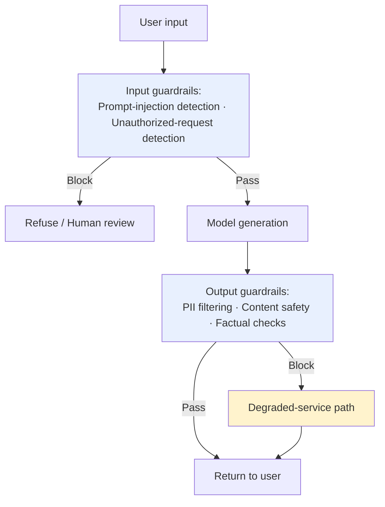
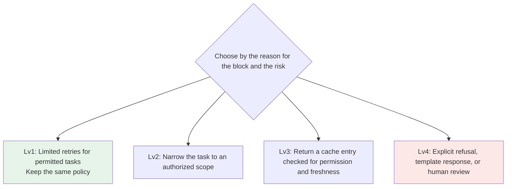

# Chapter 6: Guardrails and Graceful Degradation

## 6.1 Guardrails address what contract validation cannot

Contract validation in [Chapter 5](05-structured-output-contracts.md) asks whether the output has the right format. Guardrails ask something different: **is the content safe, and is it within what the business permits?** Even text that fully conforms to a JSON Schema can disclose private information, include instructions for unauthorized actions, or simply go off topic.



## 6.2 Input guardrails: intercept risks before the model sees them

| Check | What it addresses | Common implementation |
|---|---|---|
| Prompt-injection detection | User or third-party content attempting to redirect the task or induce unauthorized behavior | Rules and classifiers supply risk signals; an undetected input is not thereby proven trustworthy |
| Unauthorized-request detection | Attempts to make an agent act beyond the user's permissions | Check against the business authorization system before execution instead of relying on the model to refuse |
| Input content safety | Prohibited or harmful input content | Call a content-safety API, such as OpenAI Moderation, before generation |

> **Detecting unauthorized actions must not depend entirely on the model deciding whether to execute them.** Adversarial prompts can bypass model refusals. The business system should enforce permissions through deterministic rules; refusal by the model is only an initial safeguard, not the only one.

## 6.3 Output guardrails: after generation, before returning to the user

| Check | What it addresses |
|---|---|
| PII detection and redaction | Accidental repetition of sensitive information from the input context, such as identity-card or mobile-phone numbers |
| Content-safety review | Generated content that is itself prohibited or harmful |
| Factual checks | Cross-check strongly factual fields, such as amounts and dates, against structured data sources rather than trusting model output alone |
| Citation integrity in RAG | Check whether citations in the answer are supported by the retrieved source text; see [RAG · Generation and Evaluation](../../rag/05-generation-evaluation/README.md) for details |

```python
def output_guardrail(text: str, context: dict) -> GuardrailResult:
    if moderation_flagged(text):
        return GuardrailResult(action="block", reason="content_safety")
    if contains_pii(text) and not context.get("pii_allowed"):
        return GuardrailResult(action="redact", reason="pii_detected")
    return GuardrailResult(action="allow")
```

`context` must come from trusted business authorization state, not a dictionary freely populated by the user or model. The example demonstrates only decision priority: blocking takes precedence over redaction. A real system must still aggregate all check results and recheck the redacted text. Guardrail timeouts and unavailability also need an explicit policy. High-risk writes should stop; low-risk scenarios may return a restricted template and raise an alert.

Once streamed output has been sent, it cannot be taken back. Reviewing chunks adds latency and may miss information that becomes sensitive only when chunks are combined. Highly sensitive answers should be buffered in full, or released using an evaluated chunk-review policy. Do not send the original text first and label it “blocked” afterward.

## 6.4 Graceful degradation offers graduated options, not just an error

A guardrail block is not necessarily a service failure, and need not start with a 500 response. Depending on the cause, choose a limited retry, a narrower task, a valid cached result, or an explicit refusal or human review. The levels below are options, not a mandatory sequence. Being able to return some text does not mean the original task was completed.



| Level | Trigger | User experience |
|---|---|---|
| Lv1: Retry with another model | Only for permitted tasks with a suspected generation error, with limited retries under the same policy | Higher latency and cost, with no guarantee of success |
| Lv2: Narrow the task | An authorized subtask remains that can be completed independently | Explicitly identify unfinished portions; do not present a limited answer as a complete result |
| Lv3: Return a cached answer | The cache entry passes checks against current tenant permissions, policy version, and expiry | Identify it as cached or state its freshness; do not return it if applicability cannot be confirmed |
| Lv4: Template response / human review | No safe alternative result is available, or unauthorized access, data disclosure, or a prohibited action has been confirmed as a risk | Clearly state that the task cannot currently be handled; refer it to an authorized reviewer when needed, without having to try the first three options |

**Choose the response for the specific risk; do not mechanically progress from Lv1 to Lv4.** Confirmed unauthorized access, data disclosure, or prohibited actions should stop or enter a review process staffed by authorized people. Switching models must not bypass a block. For payments, medical, or legal requests, distinguish general information requests from high-impact decisions. Business policy determines whether limited information may be provided; topic keywords alone do not make every request equally risky.

## 6.5 Guardrails also need evaluation and monitoring

Guardrails are not a set of rules configured once and forgotten. **Monitor both false positives—blocking legitimate requests as risky—and false negatives—letting real risks through:**

| Metric | What to watch |
|---|---|
| Guardrail block rate | A sudden increase may indicate a change in upstream input distribution or growing overblocking by the rules |
| False-positive rate on legitimate requests | The proportion of genuinely legitimate requests incorrectly blocked. Reviewing only blocked examples instead measures the proportion of blocks that were mistakes; the denominator is different |
| False-negative rate on risky requests | The proportion of labeled risky requests allowed through. A known red-team set estimates performance only on that test distribution; production monitoring also needs sampling of allowed requests |

## 6.6 Common mistakes

### 6.6.1 Leaving guardrails entirely to model self-review

A system-prompt instruction such as “do not disclose private information,” without programmatic detection, is an easily bypassed promise when faced with adversarial input.

### 6.6.2 Returning an error immediately after a block, with no degraded-service option

The user experiences “the system crashed” rather than “the system found another way to respond.” Graduated degradation options help minimize the impact of safety blocks on the user experience.

### 6.6.3 Using the same degradation ladder for every trigger

Choose the degraded-service response according to the risk of the specific request or action, the reason for the block, and business policy. A financial or medical topic alone does not require the most restrictive response. High-impact advice, prohibited actions, and unauthorized requests remain subject to their respective restrictions; switching models and retrying must not bypass a block.

### 6.6.4 Deploying guardrail rules without continuing to monitor false positives

The rules are static, but input distributions and attack techniques keep changing. Without ongoing monitoring, rules can gradually lose effectiveness or block increasing numbers of legitimate requests without anyone noticing.

## 6.7 Chapter summary

1. **Guardrails and contract validation do different jobs.** Guardrails address content safety and permitted business behavior; contract validation checks whether programs can consume the format.
2. **Input and output guardrails have distinct responsibilities.** The former intercept risky requests before generation; the latter intercept risky outputs before they reach users.
3. **Authorization must not rely entirely on model refusals.** Deterministic rules in the business system provide the final enforcement.
4. **Graceful degradation offers several possible responses, not an automatically traversed retry chain.** Returning a template does not count as completing the original task.
5. **The specific action and reason for the block determine the response.** Confirmed unauthorized or prohibited tasks must not be allowed through by switching models.
6. **Guardrails need continuous evaluation:** monitor false-positive and false-negative rates, and use red-team test sets to assess effectiveness.

## References

- [OpenAI: Moderation API](https://platform.openai.com/docs/guides/moderation)
- [OWASP Top 10 for LLM Applications](https://genai.owasp.org/llm-top-10/)
- [Anthropic: Guardrails against misuse](https://www.anthropic.com/news/expanding-our-model-safety-bug-bounty-program)
- [NIST AI Risk Management Framework](https://www.nist.gov/itl/ai-risk-management-framework)
- [Google Cloud: Responsible AI practices](https://ai.google/responsibility/responsible-ai-practices/)
