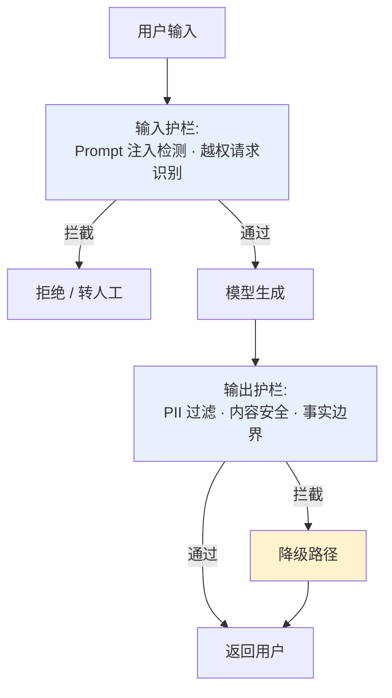
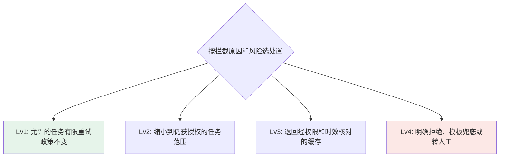

# 第六章：Guardrails 与降级策略

## 6.1 Guardrails 解决的是契约校验管不到的问题

[第 5 章](05-structured-output-contracts.md)的契约校验回答"输出格式对不对",Guardrails 回答的是另一件事:**输出内容是否安全、是否符合业务允许的边界**——即使一段文本完全符合 JSON Schema,它仍然可能包含泄露的隐私信息、越权的操作指令,或者只是单纯地跑题了。



## 6.2 输入护栏:在模型看到之前拦下风险

| 检查项 | 防什么 | 常见实现 |
|---|---|---|
| Prompt 注入检测 | 用户或第三方内容试图改变任务、诱导越权 | 规则与分类器提供风险信号，不能证明未命中的输入可信 |
| 越权请求识别 | 用户尝试让 Agent 执行超出其权限范围的操作 | 结合业务权限系统做前置校验,而非指望模型自己拒绝 |
| 输入内容安全 | 违规、有害的输入内容 | 内容安全 API(如 OpenAI Moderation)前置调用 |

> **越权识别不应该完全依赖模型自己判断该不该执行。** 模型的拒绝行为可以被对抗性 Prompt 绕过,权限边界应该在业务系统层面用确定性规则强制,模型层的拒绝只是第一道、不是唯一一道防线。

## 6.3 输出护栏:模型生成之后、返回用户之前

| 检查项 | 防什么 |
|---|---|
| PII 检测与脱敏 | 模型在回答中意外复述了输入上下文里的身份证号、手机号等敏感信息 |
| 内容安全审核 | 生成内容本身违规或有害 |
| 事实边界检查 | 涉及金额、日期等强事实性字段时,与结构化数据源做交叉校验而非只信任模型输出 |
| 引用完整性(RAG 场景) | 生成内容中的引用是否能在检索到的原文中找到依据,这部分详细展开见 [RAG · 生成与评估](../../rag/05-generation-evaluation/README.md) |

```python
def output_guardrail(text: str, context: dict) -> GuardrailResult:
    if moderation_flagged(text):
        return GuardrailResult(action="block", reason="content_safety")
    if contains_pii(text) and not context.get("pii_allowed"):
        return GuardrailResult(action="redact", reason="pii_detected")
    return GuardrailResult(action="allow")
```

`context` 必须来自可信的业务授权上下文，不是用户或模型自由填写的字典。上例仅演示决策优先级：阻断优先于脱敏，实际系统仍需聚合所有检查结果并复检脱敏后的文本。护栏超时或不可用也应有显式策略，高风险写操作应停止，低风险场景可返回受限模板并告警。

流式输出一旦发出就无法撤回。逐段审核会增加延迟，也可能漏掉跨段组合的信息；高敏感回答应缓冲完整内容，或使用经过评估的分段放行策略。不要先发送原文、事后才打上「已拦截」标签。

## 6.4 降级不是"报错",而是一个有梯度的策略阶梯

护栏拦截不一定是服务故障，也不必先返回 500。应按原因选择受限重试、缩小任务、有效缓存或明确拒绝/转人工；下列层级是可选处置，不是必须依次尝试的链路。能返回一段文字，也不代表原任务已经完成。



| 阶梯 | 触发条件 | 用户感知 |
|---|---|---|
| Lv1:换模型重试 | 仅对允许处理、疑似生成错误的任务，在相同政策下有限重试 | 延迟和费用增加，也可能再次失败 |
| Lv2:缩小任务范围 | 仍有可独立完成、获准处理的子任务 | 明确说明未完成的部分，不把受限回答包装成完整结果 |
| Lv3:返回缓存答案 | 缓存经当前租户权限、政策版本和有效期验证 | 标明缓存或信息时效；无法确认适用则不返回 |
| Lv4:模板兜底/转人工 | 没有安全可用的替代结果，或已确认越权、泄密及禁止执行的风险 | 明确告知当前无法处理，必要时交给有权人员复核，不必先尝试前三种处置 |

**关键原则：按具体风险选择处置，不从 Lv1 机械地试到 Lv4。** 已确认越权、泄密或禁止执行的动作，应停止或进入有权人员的复核流程，不能换模型绕过拦截。涉及支付、医疗或法律的请求还要区分普通信息查询与高影响决定；是否允许提供受限信息由业务政策决定，不能只凭主题词把所有请求当成同一风险。

## 6.5 护栏本身也需要评测和监控

护栏不是配置一次就一劳永逸的规则集。**误报(把正常请求当成风险拦下)和漏报(真实风险没拦住)都需要持续监控**:

| 指标 | 关注点 |
|---|---|
| 护栏拦截率 | 突然上升可能意味着上游输入分布变化,也可能是护栏规则误伤扩大 |
| 正常请求误报率 | 真实正常请求中被误拦的比例；只复核被拦样本得到的是「拦截中误伤占比」，分母不同 |
| 风险请求漏报率 | 已标注风险请求中被放行的比例；已知红队集只能估计该测试分布，线上还需抽查放行样本 |

## 6.6 常见错误

### 6.6.1 把护栏完全交给模型自我审查

依赖系统 Prompt 里一句"不要泄露隐私信息"来防止 PII 泄露,而不做程序化检测,对抗性输入很容易绕过这种"君子协定"。

### 6.6.2 拦截之后直接报错,没有降级路径

用户体验是"这次系统崩了",而不是"系统换了个方式回答了我"。降级阶梯的价值就在于把安全拦截对用户体验的冲击降到最低。

### 6.6.3 所有触发原因都走同一个降级阶梯

应根据具体请求或动作的风险、明确的拦截原因和业务政策选择降级路径，不能仅因涉及资金或医疗就一律采用最严格处理。高影响建议、禁止动作或越权请求仍须遵守相应限制，不得通过“换模型重试”等手段绕过拦截。

### 6.6.4 护栏规则上线后不再监控误报率

规则集是静态的,但输入分布和攻击手法在持续变化,不做持续监控会导致规则逐渐失效或者误伤持续扩大而不自知。

## 6.7 本章总结

1. **Guardrails 和契约校验是两回事**:前者管内容安全与业务边界,后者管格式是否可被程序消费;
2. **输入护栏和输出护栏各有分工**:前者在模型生成之前拦截风险请求,后者在返回用户之前拦截风险输出;
3. **权限边界不应完全依赖模型自我拒绝**,业务系统层面的确定性规则才是最后兜底的防线;
4. **降级有多种可选处置，而非自动遍历的重试链**，返回模板也不能计作原任务完成;
5. **处置取决于具体动作和拦截原因**，已确认越权或禁止执行的任务不能通过换模型放行;
6. **护栏本身需要持续评测**:监控误报率、漏报率,并用红队测试集验证有效性。

## 参考资料

- [OpenAI: Moderation API](https://platform.openai.com/docs/guides/moderation)
- [OWASP Top 10 for LLM Applications](https://genai.owasp.org/llm-top-10/)
- [Anthropic: Guardrails against misuse](https://www.anthropic.com/news/expanding-our-model-safety-bug-bounty-program)
- [NIST AI Risk Management Framework](https://www.nist.gov/itl/ai-risk-management-framework)
- [Google Cloud: Responsible AI practices](https://ai.google/responsibility/responsible-ai-practices/)
