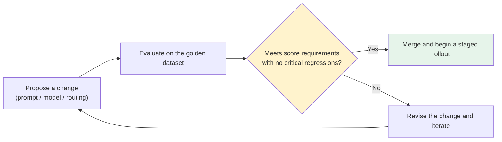

# Chapter 7: Offline Evaluation and Eval-Driven Development

## 7.1 Eval-driven development: evaluate changes before accepting them

In traditional software engineering, test-driven development means writing tests before the implementation. The corresponding practice for LLM applications is **eval-driven development (EDD)**: before merging any change to a prompt, routing policy, or model, evaluate it on a fixed dataset to produce comparable scores. “It seems better” is not enough.



This process and the release pipeline in [Chapter 10](../05-release-pipeline/10-llm-cicd-canary-ab.md) describe two sides of the same work: EDD explains how to validate a change; the release pipeline explains how to deploy it safely once it passes validation.

## 7.2 The golden dataset: a core asset for application evaluation

[LLM · Evaluation and Model Selection](../../llm/05-evaluation-selection/README.md) discusses the systematic limitations of academic benchmarks such as MMLU and HumanEval, including data contamination and a mismatch with business use cases. For an application, build a small, carefully curated **golden dataset**:

| Source | Purpose |
|---|---|
| Manually designed typical and edge cases | Establish a minimum quality baseline covering formatting, unauthorized access, refusals, and similar cases |
| Sanitized examples of real production failures | After each incident review, add a reproduction case to the dataset to prevent recurrence |
| Examples labeled from user feedback | Supplied by the feedback process in [Chapter 13](../06-performance-operations/13-feedback-loop-data-flywheel.md) |

You can start with 50–200 examples for smoke testing and finding problems, but that is only a starting point, not evidence that rare risks are under control. Report sample counts and scores for slices such as order lookups, refunds, and unauthorized access. An overall average must not conceal failures in high-risk slices.

Maintain three datasets with distinct purposes: a development set for prompt iteration, a regression set of known failures, and a holdout set kept out of tuning as far as possible. Split near-duplicate examples from the same user, conversation, or document by group; add a temporal holdout when the business changes quickly. Repeatedly inspecting the same test set and tuning against it leaks test information, so the final score no longer provides independent evidence of generalization.

## 7.3 Grading: automated rules, human review, and LLM-as-judge

| Grading method | Suitable uses | Limitations |
|---|---|---|
| **Deterministic rules** | Schema validity, prohibited content, existence of cited sources | Cannot assess the quality of natural-language expression |
| **Human review** | High-risk cases and calibration of other grading methods | Slow and expensive; cannot cover large test sets comprehensively |
| **LLM-as-judge** | Large-scale comparisons of relevance, completeness, and tone | Subject to bias; requires a grading rubric and protection against prompt injection |

```python
JUDGE_PROMPT = """你是评审员。给定用户问题、参考答案和候选回答,
按以下维度各打 1-5 分:事实准确性、完整性、语气恰当性。
只输出 JSON: {{"accuracy": int, "completeness": int, "tone": int, "reason": str}}

问题: {question}
参考答案: {reference}
候选回答: {candidate}
"""
```

The Chinese prompt above is example input: it asks a reviewer to score factual accuracy, completeness, and appropriate tone from 1 to 5 given a question, reference answer, and candidate answer, and to return only JSON with the specified fields.

**An LLM judge must be calibrated against human labels.** The amount of human review depends on risk, disagreement rates, and slice coverage; 10–20% is not a universal standard. Provide score anchors and counterexamples in the rubric, and fix the judge model, prompt, and parameters. Randomize the order of paired answers, hide model names, and check for position bias, a preference for longer answers, and bias toward outputs from the same model family. First assess agreement among human reviewers, then report a confusion matrix or agreement between the judge and humans. Candidate answers are untrusted data: instructions addressed to the judge inside them must not be followed.

### 7.3.1 Is the score difference enough to justify a release?

Compare the baseline and candidate on the same tasks, prioritizing the paired differences. A paired bootstrap that resamples independent tasks or users can estimate an interval for the difference; paired binary success/failure outcomes can also be assessed with McNemar’s test. Repeated generations for one task help estimate randomness, but do not count as multiple independent users. Report effect size, confidence intervals, the number of independent samples, and the number of repetitions—not just a p-value.

Agree in advance on the minimum acceptable improvement or maximum acceptable regression. “No significant difference was found” does not mean “non-inferiority has been established.” For example, with independent, identically distributed binomial trials, observing no failures in 100 trials still leaves a one-sided 95% upper bound of about 3% on the failure probability—the approximate rule of three for zero failures. Requiring zero failures in an unauthorized-access regression set can be a release gate, but is not proof of zero risk in production. Repeatedly selecting the best prompt or examining many slices also requires accounting for multiple comparisons and selection bias.

## 7.4 Release gates: inspect critical cases, not just averages

```python
def release_gate(eval_result: EvalResult, baseline: EvalResult) -> GateDecision:
    if eval_result.critical_failures > 0:
        return GateDecision.BLOCK("关键安全/越权用例未通过")
    for slice_name, score in eval_result.slice_scores.items():
        if score < baseline.slice_scores[slice_name] - REGRESSION_THRESHOLD:
            return GateDecision.BLOCK(f"切片 {slice_name} 超过允许退化阈值")
    if eval_result.overall_score < MIN_OVERALL_SCORE:
        return GateDecision.BLOCK("总分未达标")
    return GateDecision.PASS
```

The Chinese rejection messages in this example identify failed critical safety or authorization cases, a slice exceeding its allowed regression, and an overall score below the required minimum. This pseudocode illustrates threshold logic only, not a significance test. Before running it, verify that all slices are present, sample sizes are sufficient, graders are working, and the candidate and baseline use the same dataset version. Empty slices, judge errors, and missing results must not count as passes. **An improvement in average score cannot compensate for confirmed unauthorized access or data disclosure.** Where tool execution results or authorization logs can establish a high-risk failure, do not rely solely on a model judge’s written conclusion.

## 7.5 Offline evaluation cannot replace production monitoring

Offline evaluation runs on a fixed test set to assess whether a change improves on the baseline, but no test set can cover the full distribution of production inputs. **Offline evaluation checks changes before release; production observability ([Chapter 8](08-online-observability-tracing.md)) continuously checks performance on real traffic after release.** Both are necessary.

## 7.6 How this chapter relates to other chapters

This chapter covers the common evaluation structure: how to build test sets, grade results, and define gates. Specialized methods for agents and RAG are covered in their respective topics:

| Use case | Further reading |
|---|---|
| Evaluating multi-turn agent tool use and task completion rates | [Agent · Evaluation and Safety](../../agent/05-production/14-agent-evaluation.md) |
| Evaluating RAG retrieval recall and citation accuracy | [RAG · Generation and Evaluation](../../rag/05-generation-evaluation/README.md) |
| Academic benchmarks for general model capabilities | [LLM · Evaluation and Model Selection](../../llm/05-evaluation-selection/README.md) |

## 7.7 Common mistakes

### 7.7.1 Deciding that a change “looks better” by intuition

Without a fixed test set and comparable scores, a judgment that something “feels better” cannot be reproduced or falsified when the next change arrives.

### 7.7.2 Keeping one undifferentiated test set without business slices

An overall score can hide regressions in specific slices. High-risk safety regressions are particularly easy to miss when diluted by an average.

### 7.7.3 Using an LLM judge without human calibration

A sample of cases must be reviewed by humans. Otherwise, there is no basis for trusting the grading itself, and the evaluation offers little assurance.

### 7.7.4 Treating production evaluation as pre-release validation

Production evaluation tells you what happened in production. It cannot replace reproducible experiments on a fixed dataset before release.

### 7.7.5 Fixing an incident without adding its failure case to the test set

The same kind of problem is likely to recur. Each incident review should produce at least one new regression test case.

## 7.8 Chapter summary

1. **Eval-driven development requires evaluation before a change is merged**, rather than an intuitive judgment.
2. **The golden dataset is a core asset for application evaluation.** Manage it by use-case slices rather than relying only on the overall score.
3. **Grading has three layers:** deterministic rules, human review, and LLM-as-judge. The last requires human calibration.
4. **Release gates must check for regressions in critical cases.** Better averages cannot offset failures in high-risk cases.
5. **Offline evaluation and production monitoring complement rather than replace each other.** One checks proposed changes; the other verifies real-traffic performance.
6. **Agents and RAG have more specialized evaluation methods.** This chapter establishes the common structure.

## References

A tool’s lifecycle is not the lifecycle of an evaluation method. OpenAI’s announcement of 2026-06-03 states that its hosted Evals platform will become read-only on 2026-10-31, with the Evals dashboard and API scheduled to shut down on 2026-11-30. Teams using that platform should check their migration plans; this does not imply that the open-source `openai/evals` project or self-hosted evaluation methods also stop being valid.

- [OpenAI Evals](https://github.com/openai/evals)
- [OpenAI: Evaluation best practices](https://developers.openai.com/api/docs/guides/evaluation-best-practices)
- [OpenAI: 2026-06-03 Evals platform deprecation](https://developers.openai.com/api/docs/deprecations#2026-06-03-evals-platform)
- [Anthropic: Demystifying evals for AI agents](https://www.anthropic.com/engineering/demystifying-evals-for-ai-agents)
- [SciPy: Binomial proportion confidence intervals](https://docs.scipy.org/doc/scipy/reference/generated/scipy.stats._result_classes.BinomTestResult.proportion_ci.html)
- [Google: Rules of Machine Learning - Rule #4: Keep the first model simple and get the infrastructure right](https://developers.google.com/machine-learning/guides/rules-of-ml)
- [Braintrust: What is an eval?](https://www.braintrust.dev/docs/guides/evals)
- [LangSmith: Evaluation concepts](https://docs.langchain.com/langsmith/evaluation-concepts)
