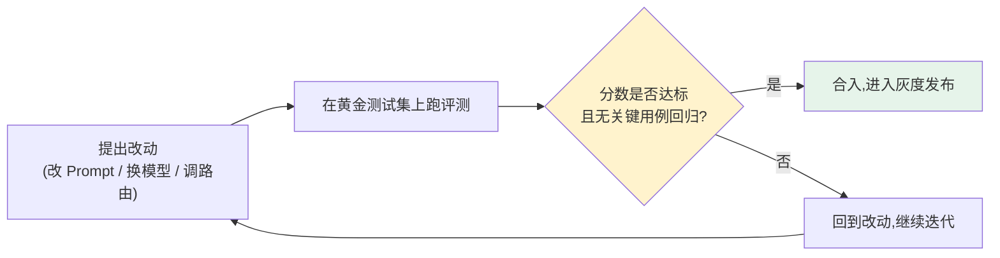

# 第七章：离线评测与 Eval-Driven Development

## 7.1 Eval-Driven Development:把评测放在改动之前而不是之后

传统软件工程里"测试驱动开发"要求先写测试再写实现。LLM 应用的对应实践是 **Eval-Driven Development(EDD)**:任何一次 Prompt、路由或模型的变更,在合入之前必须先在一套固定的评测集上跑出可比较的分数,而不是凭感觉判断"看起来是不是变好了"。



这套流程和[第 10 章](../05-release-pipeline/10-llm-cicd-canary-ab.md)的发布流水线是同一件事的两个视角:EDD 讲的是"改动怎么被验证",发布流水线讲的是"验证通过之后怎么安全上线"。

## 7.2 黄金测试集:业务侧评测的核心资产

[LLM · 评测与选型](../../llm/05-evaluation-selection/README.md)详细讲过 MMLU、HumanEval 这类学术 Benchmark 存在数据污染、脱离业务场景的系统性缺陷。业务侧的做法是建一套小而精的**黄金测试集(golden dataset)**:

| 来源 | 说明 |
|---|---|
| 人工设计的典型与边界案例 | 建立最小质量基线,覆盖格式、越权、拒绝等场景 |
| 脱敏后的真实生产失败案例 | 每一次线上事故复盘后,把复现用例回收进测试集,防止同类问题再犯 |
| 用户反馈标注的案例 | 来自[第 13 章](../06-performance-operations/13-feedback-loop-data-flywheel.md)的反馈闭环 |

黄金测试集通常从 50–200 条起步,按业务子场景切片管理(如 `订单查询`、`退款流程`、`越权拦截`),而不是当作一个笼统的整体分数。**切片管理的价值在于:一次改动可能让整体平均分上升,但某个高风险切片(如越权拦截)出现回归——只看总分会完全错过这个信号。**

## 7.3 评分方式:自动规则、人工评审、LLM-as-Judge

| 评分方式 | 适合场景 | 局限 |
|---|---|---|
| **确定性规则** | Schema 是否合法、是否包含禁止内容、引用是否存在 | 无法评估自然语言表达质量 |
| **人工评审** | 高风险场景、需要校准其他评分方式 | 慢、贵,无法覆盖大规模测试集 |
| **LLM-as-Judge** | 大规模的相关性、完整性、语气比较 | 存在偏差,需要 rubric 设计和防提示注入 |

```python
JUDGE_PROMPT = """你是评审员。给定用户问题、参考答案和候选回答,
按以下维度各打 1-5 分:事实准确性、完整性、语气恰当性。
只输出 JSON: {{"accuracy": int, "completeness": int, "tone": int, "reason": str}}

问题: {question}
参考答案: {reference}
候选回答: {candidate}
"""
```

**LLM-as-Judge 必须做人工校准**:抽查 10–20% 的打分样本,人工复核 Judge 的判断是否可信。不校准,就无法判断"分数变好了"到底是候选回答真的变好,还是裁判本身在乱打分。这一实践与[LangSmith 生产质量闭环](../../frameworks/01-langchain/05-production/13-langsmith-production-loop.md)里的做法一致——Judge 校准不是某个工具特有的功能,而是所有 LLM-as-Judge 场景下的通用要求。

## 7.4 发布门禁:不是看平均分,是看关键用例

```python
def release_gate(eval_result: EvalResult, baseline: EvalResult) -> GateDecision:
    if eval_result.critical_failures > 0:
        return GateDecision.BLOCK("关键安全/越权用例未通过")
    for slice_name, score in eval_result.slice_scores.items():
        if score < baseline.slice_scores[slice_name] - REGRESSION_THRESHOLD:
            return GateDecision.BLOCK(f"切片 {slice_name} 相对基线显著回归")
    if eval_result.overall_score < MIN_OVERALL_SCORE:
        return GateDecision.BLOCK("总分未达标")
    return GateDecision.PASS
```

**平均分提升不能抵消一次越权、泄密或安全拦截失效。** 高风险用例应该用确定性规则设置"零容忍"门槛,而不是被平均分稀释掉。这一原则和[第 10 章](../05-release-pipeline/10-llm-cicd-canary-ab.md)里 CI/CD 流水线的门禁设计是同一套逻辑在发布环节的落地。

## 7.5 离线评测不能替代线上监测

离线评测在固定测试集上运行,能发现的是"这个改动是否比基线更好",但测试集永远无法覆盖生产环境的全部输入分布。**离线评测负责"改动前把关",线上可观测性([第 8 章](08-online-observability-tracing.md))负责"上线后持续验证真实流量表现"**,两者缺一不可。

## 7.6 与相邻章节的分工

本章讲的是评测的通用方法论——如何建测试集、如何评分、如何设门禁。以下场景有更专门的评测方法,不在本章重复展开:

| 场景 | 详见 |
|---|---|
| Agent 多轮工具调用、任务完成率评估 | [Agent · 评估与安全](../../agent/05-production/14-agent-evaluation.md) |
| RAG 检索召回率、引用准确性评估 | [RAG · 生成与评估](../../rag/05-generation-evaluation/README.md) |
| 模型通用能力的学术 Benchmark | [LLM · 评测与选型](../../llm/05-evaluation-selection/README.md) |

## 7.7 常见错误

### 7.7.1 凭感觉判断"这次改动看起来更好"

没有固定测试集和可比较的分数,任何"感觉变好了"的判断都无法在下一次改动时复现或证伪。

### 7.7.2 只维护一个笼统的测试集,不做业务切片

总分掩盖了具体切片的回归,尤其是高风险的安全类切片,一旦被平均分稀释就很难被发现。

### 7.7.3 使用 LLM-as-Judge 却不做人工校准

必须抽查一部分样本人工复核,否则无法判断评分本身是否可信,评测结果形同虚设。

### 7.7.4 把线上评测当作发布前的验证手段

线上评测只能告诉你"生产里发生了什么",无法替代发布前在固定数据集上的可复现实验。

### 7.7.5 线上事故修复后不把失败案例回收进测试集

同类问题很可能再次出现,每一次事故复盘都应该产出至少一条新的回归测试用例。

## 7.8 本章总结

1. **Eval-Driven Development 要求改动先经过评测再合入**,而不是凭感觉判断;
2. **黄金测试集是业务侧评测的核心资产**,应按子场景切片管理,而不是只看整体分数;
3. **评分方式分三层**:确定性规则、人工评审、LLM-as-Judge,后者必须人工校准;
4. **发布门禁要看关键用例是否回归**,平均分提升不能抵消高风险用例的失败;
5. **离线评测和线上监测互补而非互相替代**,前者把关改动,后者验证真实流量表现;
6. **Agent、RAG 场景有各自更专门的评测方法**,本章讲的是通用方法论。

> **一句话概括:Eval-Driven Development 的核心不是"多写几个测试用例",而是让每一次改动都必须先在业务切片和高风险用例上证明自己没有退化,才允许进入下一步的灰度发布。**

## 参考资料

- [OpenAI Evals](https://github.com/openai/evals)
- [Anthropic: Building evals for AI applications](https://www.anthropic.com/engineering/writing-evals-for-claude)
- [Google: Rules of Machine Learning - Rule #4: Keep the first model simple and get the infrastructure right](https://developers.google.com/machine-learning/guides/rules-of-ml)
- [Braintrust: What is an eval?](https://www.braintrust.dev/docs/guides/evals)
- [LangSmith: Evaluation concepts](https://docs.langchain.com/langsmith/evaluation-concepts)
