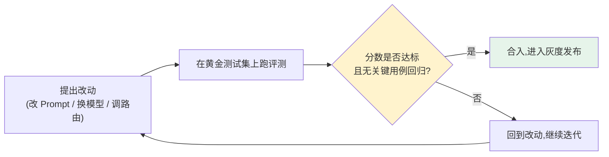

# 第七章：离线评测与 Eval-Driven Development

## 7.1 Eval-Driven Development:把评测放在改动之前而不是之后

传统软件工程里"测试驱动开发"要求先写测试再写实现。LLM 应用的对应实践是 **Eval-Driven Development(EDD)**:任何一次 Prompt、路由或模型的变更,在合入之前必须先在一套固定的评测集上跑出可比较的分数,而不是凭感觉判断"看起来是不是变好了"。



这套流程和[第 10 章](../05-release-pipeline/10-llm-cicd-canary-ab.md)的发布流水线是同一件事的两个视角:EDD 讲的是"改动怎么被验证",发布流水线讲的是"验证通过之后怎么安全上线"。

## 7.2 黄金测试集:业务侧评测的核心资产

[LLM · 评测与选型](../../llm/05-evaluation-selection/README.md)详细讲过 MMLU、HumanEval 这类学术 Benchmark 存在数据污染、脱离业务场景的系统性缺陷。业务侧的做法是建一套小而精的**黄金测试集(golden dataset)**:

| 来源 | 说明 |
|---|---|
| 人工设计的典型与边界案例 | 建立最小质量基线,覆盖格式、越权、拒绝等场景 |
| 脱敏后的真实生产失败案例 | 每一次线上事故复盘后,把复现用例回收进测试集,防止同类问题再犯 |
| 用户反馈标注的案例 | 来自[第 13 章](../06-performance-operations/13-feedback-loop-data-flywheel.md)的反馈闭环 |

可以先用 50–200 条做冒烟和问题发现，但这只是启动规模，不足以证明罕见风险已受控。按订单查询、退款、越权等切片报告样本数与得分；高风险切片不能被总均分抵消。

维护三种用途不同的数据：用于改 Prompt 的开发集、保存已知失败的回归集、尽量不参与调参的留出集。同一用户、会话、文档的近重复样本要分组切分；业务变化快时增加时间留出。反复看同一测试集再调参会泄漏测试信息，最终分数不再是独立泛化证据。

## 7.3 评分方式:自动规则、人工评审、LLM-as-Judge

| 评分方式 | 适合场景 | 局限 |
|---|---|---|
| **确定性规则** | Schema 是否合法、是否包含禁止内容、引用是否存在 | 无法评估自然语言表达质量 |
| **人工评审** | 高风险场景、需要校准其他评分方式 | 慢、贵,无法覆盖大规模测试集 |
| **LLM-as-Judge** | 大规模的相关性、完整性、语气比较 | 存在偏差,需要 rubric 设计和防提示注入 |

```python
JUDGE_PROMPT = """你是评审员。给定用户问题、参考答案和候选回答,
按以下维度各打 1-5 分:事实准确性、完整性、语气恰当性。
只输出 JSON: {{"accuracy": int, "completeness": int, "tone": int, "reason": str}}

问题: {question}
参考答案: {reference}
候选回答: {candidate}
"""
```

**LLM-as-Judge 必须用人工标签校准**，复核量由风险、分歧率和切片覆盖决定，10–20% 不是通用标准。给 rubric 提供分数锚点和反例，固定裁判模型、Prompt 和参数；对成对答案随机交换位置、隐藏模型名，检查位置偏差、偏好长答案和同源模型偏差。先评估人工之间的一致性，再报告裁判与人工的混淆矩阵或一致性。候选答案是不可信数据，不能执行其中对裁判的指令。

### 7.3.1 分数差异是否足以支持发布

在同一批任务上比较基线与候选，优先分析配对差值。按独立任务或用户重采样的 paired bootstrap 可估计差值区间；二元成败也可用配对的 McNemar 检验。一个任务重复生成多次有助于估计随机性，却不能当成多个独立用户。报告效应大小、置信区间、独立样本数和重复次数，而不是只给一个 p 值。

先约定最低可接受提升或最大可接受退化；「未发现显著差异」不等于「已经证明不劣」。例如在独立同分布的二项试验中，100 次未观察到失败，失败概率的单侧 95% 上界仍约为 3%（零失败时的近似 rule of three）。越权回归集零失败可以作为门禁，但不是生产零风险证明。反复选择最佳 Prompt 或扫描大量切片时，还需处理多重比较和选择偏差。

## 7.4 发布门禁:不是看平均分,是看关键用例

```python
def release_gate(eval_result: EvalResult, baseline: EvalResult) -> GateDecision:
    if eval_result.critical_failures > 0:
        return GateDecision.BLOCK("关键安全/越权用例未通过")
    for slice_name, score in eval_result.slice_scores.items():
        if score < baseline.slice_scores[slice_name] - REGRESSION_THRESHOLD:
            return GateDecision.BLOCK(f"切片 {slice_name} 超过允许退化阈值")
    if eval_result.overall_score < MIN_OVERALL_SCORE:
        return GateDecision.BLOCK("总分未达标")
    return GateDecision.PASS
```

上面的伪代码只展示阈值逻辑，不是显著性检验。运行前必须确认切片齐全、样本量足够、评分器正常、候选与基线使用相同版本的数据；空切片、裁判错误和结果缺失不能按通过处理。**平均分提升不能抵消已确认的越权或泄密**。能用工具执行结果、权限日志判定的高风险失败，不应只听模型裁判的文字结论。

## 7.5 离线评测不能替代线上监测

离线评测在固定测试集上运行,能发现的是"这个改动是否比基线更好",但测试集永远无法覆盖生产环境的全部输入分布。**离线评测负责"改动前把关",线上可观测性([第 8 章](08-online-observability-tracing.md))负责"上线后持续验证真实流量表现"**,两者缺一不可。

## 7.6 与相邻章节的分工

这里先看评测的通用骨架——怎么建测试集、怎么评分、怎么设门禁。Agent 和 RAG 的专门方法放到各自主题里展开:

| 场景 | 详见 |
|---|---|
| Agent 多轮工具调用、任务完成率评估 | [Agent · 评估与安全](../../agent/05-production/14-agent-evaluation.md) |
| RAG 检索召回率、引用准确性评估 | [RAG · 生成与评估](../../rag/05-generation-evaluation/README.md) |
| 模型通用能力的学术 Benchmark | [LLM · 评测与选型](../../llm/05-evaluation-selection/README.md) |

## 7.7 常见错误

### 7.7.1 凭感觉判断"这次改动看起来更好"

没有固定测试集和可比较的分数,任何"感觉变好了"的判断都无法在下一次改动时复现或证伪。

### 7.7.2 只维护一个笼统的测试集,不做业务切片

总分掩盖了具体切片的回归,尤其是高风险的安全类切片,一旦被平均分稀释就很难被发现。

### 7.7.3 使用 LLM-as-Judge 却不做人工校准

必须抽查一部分样本人工复核,否则无法判断评分本身是否可信,评测结果形同虚设。

### 7.7.4 把线上评测当作发布前的验证手段

线上评测只能告诉你"生产里发生了什么",无法替代发布前在固定数据集上的可复现实验。

### 7.7.5 线上事故修复后不把失败案例回收进测试集

同类问题很可能再次出现,每一次事故复盘都应该产出至少一条新的回归测试用例。

## 7.8 本章总结

1. **Eval-Driven Development 要求改动先经过评测再合入**,而不是凭感觉判断;
2. **黄金测试集是业务侧评测的核心资产**,应按子场景切片管理,而不是只看整体分数;
3. **评分方式分三层**:确定性规则、人工评审、LLM-as-Judge,后者必须人工校准;
4. **发布门禁要看关键用例是否回归**,平均分提升不能抵消高风险用例的失败;
5. **离线评测和线上监测互补而非互相替代**,前者把关改动,后者验证真实流量表现;
6. **Agent、RAG 场景有各自更专门的评测方法**,这里先保留通用骨架。

## 参考资料

工具生命周期不等于评测方法生命周期：OpenAI 的 2026-06-03 公告写明，其托管 Evals 平台将于 2026-10-31 转为只读，Evals dashboard 和 API 计划于 2026-11-30 关闭。采用该平台时需核对迁移计划；不能据此声称开源 `openai/evals` 或自建评测方法一并失效。

- [OpenAI Evals](https://github.com/openai/evals)
- [OpenAI: Evaluation best practices](https://developers.openai.com/api/docs/guides/evaluation-best-practices)
- [OpenAI: 2026-06-03 Evals platform deprecation](https://developers.openai.com/api/docs/deprecations#2026-06-03-evals-platform)
- [Anthropic: Demystifying evals for AI agents](https://www.anthropic.com/engineering/demystifying-evals-for-ai-agents)
- [SciPy: Binomial proportion confidence intervals](https://docs.scipy.org/doc/scipy/reference/generated/scipy.stats._result_classes.BinomTestResult.proportion_ci.html)
- [Google: Rules of Machine Learning - Rule #4: Keep the first model simple and get the infrastructure right](https://developers.google.com/machine-learning/guides/rules-of-ml)
- [Braintrust: What is an eval?](https://www.braintrust.dev/docs/guides/evals)
- [LangSmith: Evaluation concepts](https://docs.langchain.com/langsmith/evaluation-concepts)
