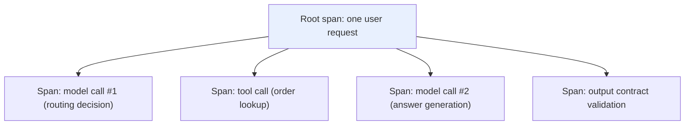

# Chapter 8: Production Observability and Tracing

## 8.1 Why use traces as well as logs?

A single agent request may involve several model, tool, and retrieval calls. Structured logs can also be correlated through a request ID, but tracing shows the timing and dependencies of individual steps more directly. Ordinary calls form a tree of parent and child spans. Asynchronous queues, batch jobs, and fan-in from multiple sources also need span links; not every causal relationship can be forced into a single parent-child relationship.



## 8.2 The roles of the three observability signals

| Signal | Question it answers | Typical tools |
|---|---|---|
| **Logs** | What happened in detail at a particular moment? | Structured logging systems |
| **Metrics** | Are overall trends improving or worsening—latency, error rate, token usage? | Prometheus / Grafana |
| **Traces** | How do timing and causality connect the steps within a particular request? | OpenTelemetry / LangSmith / Arize Phoenix |

Metrics can tell you that the error rate rose over the past hour; correlated logs and traces help identify the failing step. In this diagram, a model span covers only the model request itself. The orchestration layer performs final validation after the model returns, so validation gets a separate child span under the request. Parent-child relationships should reflect the actual instrumentation scope, not merely who consumes an output.

## 8.3 What should a GenAI span record?

OpenTelemetry’s generative AI [semantic conventions](https://github.com/open-telemetry/semantic-conventions-genai) define field meanings across implementations, but continuously updated documentation should not be mistaken for a stable, uniform interface. Pin both the convention and instrumentation versions, and check each field’s stability and provider support. The following table lists semantic categories to collect, not standard field names that can be copied directly:

| Field category | Examples |
|---|---|
| Request parameters | Model name, temperature, max_tokens |
| Token usage | Input and output token counts, directly relevant to the cost accounting in Chapter 11 |
| Response characteristics | Time to first token (TTFT), inter-token latency, total duration, retries/fallbacks; the first HTTP byte may be only a header or heartbeat |
| Content requiring sanitization | Sampled or sanitized versions of prompts and outputs |

**These conventions provide shared field semantics across providers and frameworks**, but implementations still need mappings. Consistent field names alone do not resolve differences in units, missing usage data, or versions.

## 8.4 Data collection limits: observability does not mean collecting everything

Tracing passes through code that handles raw user input. If everything is collected without restrictions, the tracing system itself becomes another place where sensitive data is exposed. Decide what may be collected **before traces are sent**, rather than relying on hiding it later in an administrative console:

| Data | Default policy |
|---|---|
| Secrets, tokens, Authorization headers | Never write them to traces or error stack traces |
| PII, order contents, user identifiers | Avoid collecting them; where diagnosis requires them, use field-level sanitization, hashing, and access controls |
| High-risk actions such as approvals and payments | Record the decision ID, policy version, and outcome, not unnecessary source material |

```python
import hmac
from hashlib import sha256

def trace_metadata(tenant_id: str, prompt_version: str, trace_key: bytes) -> dict:
    # Obtain trace_key from a secrets manager; never hard-code it.
    tenant_hash = hmac.new(trace_key, tenant_id.encode(), sha256).hexdigest()[:24]
    return {"tenant_hash": tenant_hash, "prompt_version": prompt_version}
```

An HMAC identifier can still link records to a user: this is pseudonymization, not anonymization. It requires access controls, key rotation, and retention limits. Individual platforms’ data models are not identical to OpenTelemetry’s. When choosing a platform, verify its mapping, export, and deletion capabilities; see [The LangSmith Production Quality Feedback Loop](../../frameworks/01-langchain/05-production/13-langsmith-production-loop.md) for relevant principles.

## 8.5 Sampling strategies: not all traffic needs complete traces

Recording every trace becomes expensive at high traffic volumes. Use risk-based sampling:

| Scenario | Sampling guidance |
|---|---|
| Safety blocks, unauthorized access, payments | Required decision audits must not depend on debug-trace sampling; minimize and sanitize records, with explicit retention and access policies |
| Ordinary failed requests | Prioritize retention through tail sampling; account for buffer capacity and export loss rather than promising unconditional 100% retention |
| Staged rollout of a new model or prompt | Stratify sampling by version and tenant, retaining a control group for the A/B analysis in [Chapter 10](../05-release-pipeline/10-llm-cicd-canary-ab.md) |
| Ordinary low-risk traffic | Random sampling with a cost cap |

## 8.6 From traces to alerts: metric aggregation and thresholds

Prefer counters and histograms collected before sampling for SLO metrics. If only 1% of successes are sampled but all failures are retained, calculating the error rate directly from retained traces will substantially overestimate it. If an estimate must use sampled data, retain sampling probabilities and apply appropriate weights. Averaging instance-level p99 values does not produce a global p99; merge compatible histogram buckets instead.

```python
# Pseudocode: use pre-sampling aggregates from one window with nonzero denominators.
metrics = {
    "p50_latency_ms": percentile(latencies, 50),
    "p99_latency_ms": percentile(latencies, 99),
    "error_rate": failed_count / total_count,
    "contract_violation_rate": violations / completed_structured_outputs,
    "fallback_rate": fallback_count / total_count,          # See Chapter 3.
    "cost_per_request": total_billed_cost / total_count,
}
```

The contract violation rate should exclude requests that did not require structured output. Count refusals, truncation, and provider errors separately. Sum costs using the applicable prices for input, output, caching, tools, and retries; mark unknown usage as missing, not zero. User IDs, full URLs, and prompts are unsuitable metric labels because they create high cardinality and risk disclosing sensitive information. If these details must be retained, put them in access-controlled logs or traces.

## 8.7 Common mistakes

### 8.7.1 Recording every prompt and tool output for troubleshooting

Traces themselves become another source of sensitive-data exposure. Select only allowlisted fields and sanitize them before sending, rather than collecting everything and expecting the console to hide it.

### 8.7.2 Keeping logs without traces

When a complex request path fails, logs without correlation IDs make it difficult to reconstruct relationships across steps. Traces also require correct context propagation, and an externally supplied trace ID must never be treated as an identity credential.

### 8.7.3 Collecting traces for all traffic without sampling

Costs can become unmanageable at high traffic volumes. Sample debug traces by risk and collect required decision audits independently. Do not turn a log-retention policy into blanket retention of sensitive raw content.

### 8.7.4 Collecting data without turning it into metrics that can trigger alerts

If traces accumulate without producing metrics such as p99 latency and error rate that can trigger threshold-based alerts, someone still has to search through them manually to discover an incident.

### 8.7.5 Treating observability as an afterthought rather than part of the architecture

As discussed in [Chapter 2](../01-foundations/02-production-architecture-overview.md), plan observability data collection limits and sampling policies during system design.

## 8.8 Chapter summary

1. **Tracing represents call relationships with parent-child spans and links**, complementing structured logs with correlation IDs.
2. **Logs, metrics, and traces serve different purposes:** details, trends, and the sequence of events in a particular request.
3. **GenAI spans should follow OpenTelemetry semantic conventions** for consistent recording of model parameters, token usage, latency, and related fields.
4. **Decide what may be collected before collection begins.** By default, exclude sensitive information such as secrets and PII, or sanitize it where collection is permitted.
5. **Sample by risk and separate auditing from debugging.** Monitor data loss within the collection system itself.
6. **Prefer pre-sampling metrics for SLOs.** Do not calculate the overall error rate directly from a trace sample biased toward failures.

## References

The original GenAI documentation has moved to a dedicated repository, and the old location is no longer maintained. The Chinese source manuscript records a check of the migration notice on 2026-09-15.

- [OpenTelemetry: Semantic conventions for generative AI systems](https://opentelemetry.io/docs/specs/semconv/gen-ai/)
- [OpenTelemetry: GenAI semantic conventions repository](https://github.com/open-telemetry/semantic-conventions-genai)
- [Google SRE Book: Monitoring Distributed Systems](https://sre.google/sre-book/monitoring-distributed-systems/)
- [LangSmith Observability](https://docs.langchain.com/langsmith/observability)
- [Arize Phoenix: Tracing](https://docs.arize.com/phoenix/tracing/llm-traces)
- [Honeycomb: Observability for LLMs](https://www.honeycomb.io/blog/pillars-observability)
