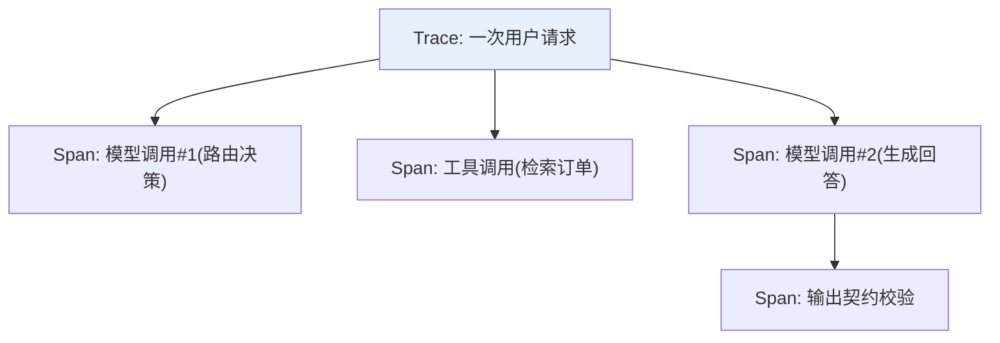

# 第八章：在线可观测性与 Tracing

## 8.1 为什么日志不够,需要 Trace

一次 Agent 请求可能包含多次模型调用、多次工具调用、一次检索,任何一步都可能是失败的根因。传统的按行打印日志无法把这些跨步骤、跨服务的调用关联起来,排查一次失败往往要在多个日志系统之间来回跳转。**Tracing 把一次请求从入口到出口的所有子步骤,组织成一棵有父子关系的 Span 树**,这是可观测性区别于普通日志的核心能力。



## 8.2 三种可观测性信号的分工

| 信号 | 回答什么问题 | 典型工具 |
|---|---|---|
| **日志(Logs)** | 某个具体时刻发生了什么细节 | 结构化日志系统 |
| **指标(Metrics)** | 整体趋势是好是坏(延迟、错误率、token 用量) | Prometheus / Grafana |
| **追踪(Traces)** | 一次具体请求内部,时间和因果是怎么串起来的 | OpenTelemetry / LangSmith / Arize Phoenix |

三者不能互相替代:指标能告诉你"过去一小时错误率上升了",但要知道"具体是哪一步失败的",必须靠 Trace 下钻到那一次请求的 Span 树。

## 8.3 GenAI 场景下 Span 该记录什么字段

OpenTelemetry 在传统的 Span(服务名、耗时、状态码)之上,为生成式 AI 场景定义了[语义约定(GenAI semantic conventions)](https://opentelemetry.io/docs/specs/semconv/gen-ai/),核心字段包括:

| 字段类别 | 示例 |
|---|---|
| 请求参数 | 模型名、temperature、max_tokens |
| Token 用量 | 输入 token 数、输出 token 数(直接对应第 11 章的成本核算) |
| 响应特征 | 首字节延迟(TTFT)、总耗时、是否发生了重试/回退(对应第 3、4 章) |
| 内容(需脱敏) | Prompt 内容、输出内容的采样或脱敏版本 |

**这套语义约定的价值在于跨供应商、跨框架统一了字段命名**,不用为每个模型供应商各写一套指标口径。

## 8.4 数据边界:可观测不等于收集一切

Trace 天然会流经用户的原始输入,一旦不加限制地全量采集,Trace 系统本身会变成新的敏感数据面。数据边界应该在**发送 Trace 之前**就确定,而不是指望在后台控制台里再做隐藏:

| 数据 | 默认策略 |
|---|---|
| 密钥、令牌、Authorization header | 绝不写入 Trace 或错误堆栈 |
| PII、订单正文、用户身份标识 | 尽量不采集;必须诊断时使用字段级脱敏、哈希、访问控制 |
| 审批、支付等高风险动作 | 记录决策 ID、策略版本、结果,不记录不必要的原始材料 |

```python
import hmac
from hashlib import sha256

def trace_metadata(tenant_id: str, prompt_version: str, trace_key: bytes) -> dict:
    # trace_key 来自密钥管理系统,不能写进代码
    tenant_hash = hmac.new(trace_key, tenant_id.encode(), sha256).hexdigest()[:24]
    return {"tenant_hash": tenant_hash, "prompt_version": prompt_version}
```

> 这套脱敏原则和 [LangSmith 生产质量闭环](../../frameworks/01-langchain/05-production/13-langsmith-production-loop.md)里讲的做法完全一致——本章讲的是厂商中立的可观测性数据模型,LangSmith 是这套模型在 LangChain 生态里的一种具体实现,选用其他 Tracing 方案时同样适用这些边界原则。

## 8.5 采样策略:不是所有流量都值得全量记录

全量记录所有 Trace 在高流量场景下成本很高,需要按风险分层采样:

| 场景 | 采样建议 |
|---|---|
| 安全拦截、越权、支付、失败请求 | 100% 记录,优先分析 |
| 新模型/新 Prompt 的灰度发布 | 按版本和租户分层采样,保留对照组用于[第 10 章](../05-release-pipeline/10-llm-cicd-canary-ab.md)的 A/B 分析 |
| 普通低风险流量 | 随机采样,设置成本上限 |

## 8.6 从 Trace 到告警:指标聚合与阈值

Trace 数据汇聚之后,要转化为可以设置告警阈值的聚合指标,这些指标同时是[第 12 章](../06-performance-operations/12-slo-capacity-incident-response.md) SLO 体系的输入:

```python
# 伪代码:从 Trace 聚合出关键指标
metrics = {
    "p50_latency_ms": percentile(latencies, 50),
    "p99_latency_ms": percentile(latencies, 99),
    "error_rate": failed_count / total_count,
    "contract_violation_rate": violations / total_count,  # 对应第5章
    "fallback_rate": fallback_count / total_count,          # 对应第3章
    "token_cost_per_request": total_tokens * unit_price / total_count,
}
```

## 8.7 常见错误

### 8.7.1 为了排障记录全部 Prompt 和工具输出

Trace 本身会成为新的敏感数据面。应在发送前按白名单投影、脱敏,而不是采集全部再指望后台隐藏。

### 8.7.2 只有日志,没有 Trace

复杂链路失败时,单纯的日志无法还原跨步骤的因果关系,排查效率极低。

### 8.7.3 全量采集所有流量的 Trace

高流量场景下成本失控。应按风险分层采样,安全类和失败请求优先全量。

### 8.7.4 采集了数据却没有转化为可告警的聚合指标

Trace 堆积如山但没有形成 p99 延迟、错误率这类可以设阈值告警的指标,故障发生时仍然要靠人工翻查才能发现。

### 8.7.5 把可观测性当成事后补救,而非架构设计的一部分

参见[第 2 章](../01-foundations/02-production-architecture-overview.md),可观测性的数据边界和采样策略应该在系统设计阶段就规划好。

## 8.8 本章总结

1. **Tracing 把一次请求的多个步骤组织成 Span 树**,解决日志无法关联跨步骤因果的问题;
2. **日志、指标、追踪三种信号分工不同**,分别回答"细节是什么""趋势如何""这次具体发生了什么";
3. **GenAI 场景的 Span 应遵循 OpenTelemetry 语义约定**,统一记录模型参数、Token 用量、延迟等字段;
4. **数据边界必须在采集前确定**,密钥、PII 等敏感信息默认不采集或脱敏后采集;
5. **采样策略按风险分层**,安全类和失败请求优先全量记录;
6. **Trace 数据要聚合成可告警的指标**,是 SLO 体系(第 12 章)的直接输入。

> **一句话概括:可观测性的价值不在于记录得多细,而在于用脱敏、分层采样过的证据,把"生产里到底发生了什么"变成可以下钻排查、也可以聚合告警的结构化数据。**

## 参考资料

- [OpenTelemetry: Semantic conventions for generative AI systems](https://opentelemetry.io/docs/specs/semconv/gen-ai/)
- [Google SRE Book: Monitoring Distributed Systems](https://sre.google/sre-book/monitoring-distributed-systems/)
- [LangSmith Observability](https://docs.langchain.com/langsmith/observability)
- [Arize Phoenix: Tracing](https://docs.arize.com/phoenix/tracing/llm-traces)
- [Honeycomb: Observability for LLMs](https://www.honeycomb.io/blog/pillars-observability)
