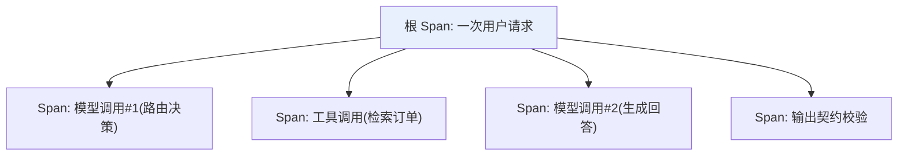

# 第八章：在线可观测性与 Tracing

## 8.1 为什么日志不够,需要 Trace

一次 Agent 请求可能包含多次模型、工具和检索调用。结构化日志也能通过请求 ID 关联，但 Tracing 更直接地展示子步骤的时序和依赖。常见调用形成父子 Span 树，异步队列、批任务和多来源合并还需要 Span links，不能强行用一个父子关系表示所有因果。



## 8.2 三种可观测性信号的分工

| 信号 | 回答什么问题 | 典型工具 |
|---|---|---|
| **日志(Logs)** | 某个具体时刻发生了什么细节 | 结构化日志系统 |
| **指标(Metrics)** | 整体趋势是好是坏(延迟、错误率、token 用量) | Prometheus / Grafana |
| **追踪(Traces)** | 一次具体请求内部,时间和因果是怎么串起来的 | OpenTelemetry / LangSmith / Arize Phoenix |

指标能告诉你“过去一小时错误率上升了”，关联日志和 Trace 则帮助定位具体失败步骤。此图把模型 Span 限定为模型请求本身；编排层在返回后执行最终校验，因此另建一个请求子 Span。父子关系应反映实际插桩边界，不能只按输出被谁消费来连线。

## 8.3 GenAI 场景下 Span 该记录什么字段

OpenTelemetry 的生成式 AI [语义约定](https://github.com/open-telemetry/semantic-conventions-genai)提供跨实现的字段含义，但不能把滚动文档当成已稳定的统一接口。实施时固定约定版本和 instrumentation 版本，核对各字段稳定性与供应商支持；下面是需要采集的语义类别，不是可直接复制的标准字段表：

| 字段类别 | 示例 |
|---|---|
| 请求参数 | 模型名、temperature、max_tokens |
| Token 用量 | 输入 token 数、输出 token 数(直接对应第 11 章的成本核算) |
| 响应特征 | 首 token 延迟（TTFT）、token 间延迟、总耗时、重试/回退；HTTP 首字节可能只是响应头或心跳 |
| 内容(需脱敏) | Prompt 内容、输出内容的采样或脱敏版本 |

**这套语义约定提供跨供应商、跨框架的共同字段语义**，但各实现仍需做映射；单位、用量缺失和版本差异不能仅靠统一字段名消除。

## 8.4 数据边界:可观测不等于收集一切

Trace 天然会流经用户的原始输入,一旦不加限制地全量采集,Trace 系统本身会变成新的敏感数据面。数据边界应该在**发送 Trace 之前**就确定,而不是指望在后台控制台里再做隐藏:

| 数据 | 默认策略 |
|---|---|
| 密钥、令牌、Authorization header | 绝不写入 Trace 或错误堆栈 |
| PII、订单正文、用户身份标识 | 尽量不采集;必须诊断时使用字段级脱敏、哈希、访问控制 |
| 审批、支付等高风险动作 | 记录决策 ID、策略版本、结果,不记录不必要的原始材料 |

```python
import hmac
from hashlib import sha256

def trace_metadata(tenant_id: str, prompt_version: str, trace_key: bytes) -> dict:
    # trace_key 来自密钥管理系统,不能写进代码
    tenant_hash = hmac.new(trace_key, tenant_id.encode(), sha256).hexdigest()[:24]
    return {"tenant_hash": tenant_hash, "prompt_version": prompt_version}
```

HMAC 标识仍可关联用户，属于假名化而非匿名化；需要访问控制、密钥轮换和保留期限。具体平台的数据模型并不完全等同于 OpenTelemetry，选型时需确认映射、导出和删除能力，原则可参考 [LangSmith 生产质量闭环](../../frameworks/01-langchain/05-production/13-langsmith-production-loop.md)。

## 8.5 采样策略:不是所有流量都值得全量记录

全量记录所有 Trace 在高流量场景下成本很高,需要按风险分层采样:

| 场景 | 采样建议 |
|---|---|
| 安全拦截、越权、支付 | 必要的决策审计不依赖调试 Trace 采样；限量、脱敏记录，明确保留与访问策略 |
| 普通失败请求 | 尾部采样优先保留，考虑缓冲容量和导出丢失，不能无条件承诺 100% |
| 新模型/新 Prompt 的灰度发布 | 按版本和租户分层采样,保留对照组用于[第 10 章](../05-release-pipeline/10-llm-cicd-canary-ab.md)的 A/B 分析 |
| 普通低风险流量 | 随机采样,设置成本上限 |

## 8.6 从 Trace 到告警:指标聚合与阈值

SLO 指标优先由采样前的计数器与直方图产生。若成功只采 1%、失败全采，直接用留下的 Trace 计算错误率会严重高估；确需从采样数据估计时，要保留采样概率并使用适当权重。不能平均各实例的 p99 得到全局 p99，应合并兼容的直方图分桶。

```python
# 伪代码：使用采样前、同一窗口且分母非零的聚合量
metrics = {
    "p50_latency_ms": percentile(latencies, 50),
    "p99_latency_ms": percentile(latencies, 99),
    "error_rate": failed_count / total_count,
    "contract_violation_rate": violations / completed_structured_outputs,
    "fallback_rate": fallback_count / total_count,          # 对应第3章
    "cost_per_request": total_billed_cost / total_count,
}
```

契约违反率不应混入未要求结构化输出的请求；拒绝、截断和供应商错误另行计数。费用按输入、输出、缓存、工具和重试各自价格求和，未知用量要标记缺失而不是填零。用户 ID、完整 URL 和 Prompt 不适合作为指标标签，会造成高基数与泄密；这些信息如确需保留，应放入受控的日志或 Trace。

## 8.7 常见错误

### 8.7.1 为了排障记录全部 Prompt 和工具输出

Trace 本身会成为新的敏感数据面。应在发送前按白名单投影、脱敏,而不是采集全部再指望后台隐藏。

### 8.7.2 只有日志,没有 Trace

复杂链路失败时,缺少关联 ID 的日志难以还原跨步骤关系；Trace 也必须正确传播上下文，且不能把外部传入的 Trace ID 当作身份凭证。

### 8.7.3 全量采集所有流量的 Trace

高流量场景下成本可能失控。调试 Trace 按风险分层采样，必要的决策审计独立采集；不要把日志保留范围扩大成敏感原文全量留存。

### 8.7.4 采集了数据却没有转化为可告警的聚合指标

Trace 堆积如山但没有形成 p99 延迟、错误率这类可以设阈值告警的指标,故障发生时仍然要靠人工翻查才能发现。

### 8.7.5 把可观测性当成事后补救,而非架构设计的一部分

参见[第 2 章](../01-foundations/02-production-architecture-overview.md),可观测性的数据边界和采样策略应该在系统设计阶段就规划好。

## 8.8 本章总结

1. **Tracing 用父子 Span 和 links 表达调用关系**，与带关联 ID 的结构化日志互补;
2. **日志、指标、追踪三种信号分工不同**,分别回答"细节是什么""趋势如何""这次具体发生了什么";
3. **GenAI 场景的 Span 应遵循 OpenTelemetry 语义约定**,统一记录模型参数、Token 用量、延迟等字段;
4. **数据边界必须在采集前确定**,密钥、PII 等敏感信息默认不采集或脱敏后采集;
5. **采样按风险分层，审计与调试分开**，采集系统自身的丢失也需要监控;
6. **SLO 优先使用采样前指标**，不能直接用偏向失败的 Trace 样本计算整体错误率。

## 参考资料

原 GenAI 文档入口已迁移至独立仓库，旧入口不再维护；本次于 2026-09-15 核对迁移说明。

- [OpenTelemetry: Semantic conventions for generative AI systems](https://opentelemetry.io/docs/specs/semconv/gen-ai/)
- [OpenTelemetry: GenAI semantic conventions repository](https://github.com/open-telemetry/semantic-conventions-genai)
- [Google SRE Book: Monitoring Distributed Systems](https://sre.google/sre-book/monitoring-distributed-systems/)
- [LangSmith Observability](https://docs.langchain.com/langsmith/observability)
- [Arize Phoenix: Tracing](https://docs.arize.com/phoenix/tracing/llm-traces)
- [Honeycomb: Observability for LLMs](https://www.honeycomb.io/blog/pillars-observability)
