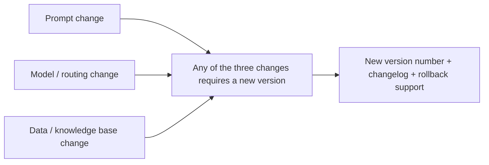

# Chapter 9: Prompt, Model, and Data Versioning

## 9.1 Why should prompts be versioned like code?

Prompts shape system behavior, yet many teams treat them as string constants that can be edited casually and take effect immediately. Without version numbers or change records, they cannot identify the last working version when something goes wrong. **A change to the prompt, model selection, or retrieval data can change the system’s output.** All three deserve the same version-control discipline as application code.



## 9.2 Prompt versioning

### 9.2.1 Version numbers are not optional

```python
PROMPT_REGISTRY = {
    "order_extraction.v3": {
        "template": "...",
        "schema_version": "order_extraction.v2",  # Output contract version; see Chapter 5.
        "created_at": "2026-08-20",
        "eval_score": 0.94,           # From the offline evaluation in Chapter 7.
        "changelog": "修复金额单位歧义,新增币种字段约束",
    },
}
```

The Chinese changelog in this example says that the change fixes ambiguity in monetary units and adds a currency-field constraint. The prompt version and its expected output schema version ([Chapter 5](../03-output-safety/05-structured-output-contracts.md)) should have separate identifiers with an explicit association. A prompt change does not necessarily change the output format. A schema change requires revalidating compatibility among the prompt, generation configuration, and consumers, but if an independent schema parameter constrains the format, the prompt text may not need to change.

### 9.2.2 Review prompt changes through the same process as code

Put prompt changes in version control and review them through pull requests, including comparative offline evaluation scores from [Chapter 7](../04-evaluation-observability/07-offline-eval-eval-driven-development.md). Do not edit them directly in a production configuration console and make them effective immediately.

## 9.3 Pinning model versions

Some providers offer both floating aliases and fixed snapshots. For example, OpenAI’s GPT-4o documentation lists `gpt-4o` and `gpt-4o-2024-08-06`. This is an example of a released historical snapshot, not a current model recommendation. Do not construct an unpublished model name by appending a date. Consult the specific model’s lifecycle documentation for version-pinning support, regional availability, and retirement dates:

| Reference type | Behavior | Suitable uses |
|---|---|---|
| Floating alias | The provider may switch the underlying version at any time | Rapid prototyping and uses that tolerate small behavioral changes |
| Fixed snapshot | Identifies a specific model version, but retirement and service-configuration changes still apply | Preferred for controlled releases to reduce version-related variation; does not guarantee word-for-word reproducibility |

Prefer pinned snapshots in production when the provider supports them, and treat upgrades as releases. If only automatically updated deployments are available, record the actual model identifier in responses, run continuous probes, and prepare an alternative path. Even a temperature of zero or a specified seed does not make hosted inference a guarantee of word-for-word reproducibility across time, hardware, and service configurations.

## 9.4 Data versioning: making evaluation and diagnosis reproducible

Here, “data” includes RAG knowledge-base snapshots, few-shot example sets, and golden evaluation datasets. Data versioning addresses a central diagnostic question: **when investigating a production request, can you trace it back to the knowledge-base version used at that time?**

```yaml
# Example version manifest generated after each knowledge-base update.
knowledge_base_version: kb-2026-08-25
source_documents_hash: sha256:9f2e1a...
embedding_model: text-embedding-3-large
indexed_at: 2026-08-25T02:00:00Z
```

A common approach is Git-like dataset versioning with tools such as DVC or LakeFS, or at least an immutable version tag for each index rebuild. Also record document and chunk IDs, chunking rules, the embedding model, index configuration, reranker, and authorization-policy versions. A source-file hash alone is insufficient to reproduce retrieval. Deletion and permission revocation must apply to old indexes and caches as well; rollback must not restore revoked data access. **Without data versions, offline evaluation scores lose comparability.** If the knowledge base changed unnoticed between two evaluations, you cannot distinguish the effect of the prompt change from the effect of the data change.

## 9.5 The model registry: recording which version runs where

Collect the relevant versions in an immutable release manifest. Each asset may have its own version number, but every production request should be traceable to the complete combination:

| Record | Purpose |
|---|---|
| Prompt version + associated schema version | Identify the cause of output-format changes |
| Model snapshot version + routing-policy version | Investigate why an output’s style changed ([Chapter 3](../02-request-reliability/03-model-gateway-routing-fallback.md)) |
| Knowledge-base / data version | Identify the cause of changes in retrieved content |
| Code, tool schema, authorization, and guardrail versions | Distinguish generation-quality changes from execution-policy changes, and avoid rolling back only the model while leaving incompatible configuration |
| Evaluation dataset, grader, rubric, and run ID | Tie scores to specific evaluation conditions; a single `eval_score` is not complete release evidence |
| Associated evaluation scores and change time | Support release-gate and rollback decisions in the pipeline described in Chapter 10 |

This follows the same idea as an MLOps model registry such as MLflow Model Registry. The registered asset changes from trained weight files to a combined snapshot of prompts, routing, and data.

## 9.6 Common mistakes

### 9.6.1 Editing prompts directly in production without version control

If a change breaks something, you cannot quickly identify the responsible edit or roll back to the previous known-good version in one step.

### 9.6.2 Using floating model aliases in production

A floating alias may switch the underlying model without any application-code change. Prefer pinned snapshots when supported, and make deliberate upgrades through controlled releases. Where pinning is unavailable, record response identifiers, run probes, and prepare an alternative path; do not promise that service behavior can remain frozen indefinitely.

### 9.6.3 Updating the knowledge base without a version tag

When evaluation scores change, you cannot distinguish a prompt change from a data change, so results are no longer comparable.

### 9.6.4 Failing to associate prompt and output schema versions explicitly

Downstream systems parse outputs according to a schema version. If an independent prompt upgrade causes the output format to drift without a corresponding schema-version update, parsing can fail.

## 9.7 Chapter summary

1. **A change to a prompt, model, or dataset can change system behavior.** Version all three.
2. **Prompt changes should go through code review**, accompanied by comparative offline evaluation scores.
3. **Prefer pinned model snapshots where supported.** Gate upgrades with evaluation, plan for retirement, and monitor and prepare alternatives where versions cannot be pinned.
4. **Data versioning is a prerequisite for comparable evaluations.** Without it, the true cause of a score change is unclear.
5. **Collect all three sets of version information in a shared registry** to support diagnosis and release decisions.

## References

- [OpenAI: GPT-4o snapshots](https://developers.openai.com/api/docs/models/gpt-4o)
- [OpenAI: Deprecations](https://developers.openai.com/api/docs/deprecations)
- [DVC: Data Version Control](https://dvc.org/doc)
- [MLflow: Model Registry](https://mlflow.org/docs/latest/model-registry.html)
- [Google Cloud: MLOps continuous delivery and automation pipelines](https://cloud.google.com/architecture/mlops-continuous-delivery-and-automation-pipelines-in-machine-learning)
