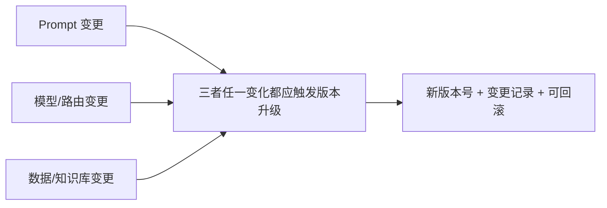

# 第九章：Prompt / 模型 / 数据版本管理

## 9.1 为什么 Prompt 也需要像代码一样版本化

Prompt 决定了系统行为,但很多团队把它当成字符串常量随手改,改完直接生效,没有版本号,没有变更记录,出问题时无法确定"上一个还工作的版本是哪个"。**Prompt、模型选择、检索数据这三者任何一个变化,都可能改变系统输出**,理应像应用代码一样接受版本管理的约束。



## 9.2 Prompt 版本管理

### 9.2.1 版本号不是可选项

```python
PROMPT_REGISTRY = {
    "order_extraction.v3": {
        "template": "...",
        "schema_version": "order_extraction.v2",  # 对应第5章的输出契约版本
        "created_at": "2026-08-20",
        "eval_score": 0.94,           # 来自第7章的离线评测
        "changelog": "修复金额单位歧义,新增币种字段约束",
    },
}
```

Prompt 版本和它期望的输出 Schema 版本([第 5 章](../03-output-safety/05-structured-output-contracts.md))应该分开编号但显式关联——**改 Prompt 不一定改输出格式,改输出格式几乎一定要同步升级 Prompt**。

### 9.2.2 Prompt 变更走和代码一样的评审流程

Prompt 改动应该进入版本控制系统,通过 Pull Request 走评审,并附上[第 7 章](../04-evaluation-observability/07-offline-eval-eval-driven-development.md)离线评测的对比分数,而不是在生产配置后台直接编辑生效。

## 9.3 模型版本锁定

第 1 章提到过 LLMOps 独有的风险:**厂商静默升级模型版本**。多数供应商同时提供"浮动别名"(如 `gpt-4o`)和"固定快照"(如 `gpt-4o-2026-08-06`)两种引用方式:

| 引用方式 | 行为 | 适用场景 |
|---|---|---|
| 浮动别名 | 厂商随时可能切换到新的底层版本 | 快速原型、对细微行为变化不敏感的场景 |
| 固定快照 | 明确指向某个不变的模型版本 | 生产环境的默认选择,行为可复现 |

生产环境应默认使用固定快照,**主动升级到新快照本身也是一次需要经过评测门禁的"发布"**,而不是被动接受厂商推送。升级前后的评测对比,和[第 10 章](10-llm-cicd-canary-ab.md)的灰度发布流程完全一致。

## 9.4 数据版本管理:让评测和排障可复现

这里的"数据"包括 RAG 知识库快照、Few-shot 示例集、评测用的黄金测试集。数据版本管理要解决的核心问题是:**给定一次线上请求的排查结果,能不能倒查回"当时用的是哪个版本的知识库"**。

```yaml
# 每次知识库更新后生成的版本清单示例
knowledge_base_version: kb-2026-08-25
source_documents_hash: sha256:9f2e1a...
embedding_model: text-embedding-3-large
indexed_at: 2026-08-25T02:00:00Z
```

常见做法是用 DVC、LakeFS 等工具对数据集做类似 Git 的版本管理,或者至少为每次索引重建生成一个不可变的版本标签。**没有数据版本,离线评测的分数会失去可比性**——如果知识库在两次评测之间偷偷更新过,分数变化到底是 Prompt 改动的效果还是数据变化的效果,根本无法区分。

## 9.5 模型注册表:统一记录"什么版本在哪里跑"

三者版本信息最终应该汇总到一个模型/配置注册表,而不是分散在各个服务的配置文件里:

| 记录项 | 用途 |
|---|---|
| Prompt 版本 + 关联的 Schema 版本 | 排查输出格式变化的根因 |
| 模型快照版本 + 路由策略版本 | 排查"这次输出风格为什么不一样"([第 3 章](../02-request-reliability/03-model-gateway-routing-fallback.md)) |
| 知识库/数据版本 | 排查检索内容变化的根因 |
| 关联的评测分数与变更时间 | 支持第 10 章发布流水线的门禁判断和回滚决策 |

这和 MLOps 里的模型注册表(如 MLflow Model Registry)是同一个思路,只是登记的资产从"训练出的权重文件"换成了"Prompt + 路由 + 数据的组合快照"。

## 9.6 常见错误

### 9.6.1 直接在生产配置后台改 Prompt,不走版本控制

改坏了无法快速定位是哪次改动引入的问题,也无法一键回滚到上一个已知良好版本。

### 9.6.2 生产环境使用浮动模型别名

厂商静默升级会导致系统行为在没有任何代码变更的情况下发生偏移,且难以定位根因。生产环境应锁定固定快照,主动升级作为一次受控发布。

### 9.6.3 知识库更新没有版本标签

评测分数变化时无法区分是 Prompt 改动还是数据变化导致的,评测结果失去可比性。

### 9.6.4 Prompt 版本和输出 Schema 版本没有显式关联

下游系统按 Schema 版本解析,如果 Prompt 版本独立升级导致输出格式漂移却没有同步 Schema 版本,会引发解析失败。

## 9.7 本章总结

1. **Prompt、模型、数据任何一项变化都可能改变系统行为**,三者都需要纳入版本管理;
2. **Prompt 变更应走代码评审流程**,并附带离线评测的对比分数;
3. **生产环境应锁定模型固定快照**,主动升级视为一次需要评测门禁的发布,而非被动接受厂商推送;
4. **数据版本化是评测可比性的前提**,没有它无法区分分数变化的真正原因;
5. **三者版本信息应汇总到统一注册表**,支撑排查和发布决策。

> **一句话概括:LLMOps 的版本管理管的不是一份权重文件,而是 Prompt、模型快照、数据这三者的组合快照——任何一项漂移都要能被追溯到,任何一次变更都要能被回滚。**

## 参考资料

- [OpenAI: Model version and lifecycle](https://platform.openai.com/docs/models#model-version)
- [DVC: Data Version Control](https://dvc.org/doc)
- [MLflow: Model Registry](https://mlflow.org/docs/latest/model-registry.html)
- [Google Cloud: MLOps continuous delivery and automation pipelines](https://cloud.google.com/architecture/mlops-continuous-delivery-and-automation-pipelines-in-machine-learning)
