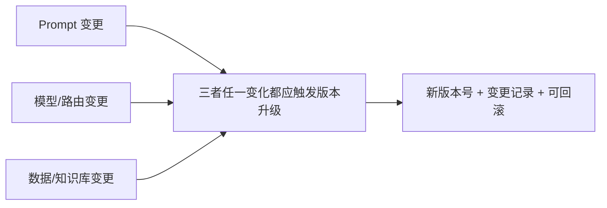

# 第九章：Prompt / 模型 / 数据版本管理

## 9.1 为什么 Prompt 也需要像代码一样版本化

Prompt 决定了系统行为,但很多团队把它当成字符串常量随手改,改完直接生效,没有版本号,没有变更记录,出问题时无法确定"上一个还工作的版本是哪个"。**Prompt、模型选择、检索数据这三者任何一个变化,都可能改变系统输出**,理应像应用代码一样接受版本管理的约束。



## 9.2 Prompt 版本管理

### 9.2.1 版本号不是可选项

```python
PROMPT_REGISTRY = {
    "order_extraction.v3": {
        "template": "...",
        "schema_version": "order_extraction.v2",  # 对应第5章的输出契约版本
        "created_at": "2026-08-20",
        "eval_score": 0.94,           # 来自第7章的离线评测
        "changelog": "修复金额单位歧义,新增币种字段约束",
    },
}
```

Prompt 版本和它期望的输出 Schema 版本([第 5 章](../03-output-safety/05-structured-output-contracts.md))应该分开编号但显式关联——**改 Prompt 不一定改输出格式,改输出格式几乎一定要同步升级 Prompt**。

### 9.2.2 Prompt 变更走和代码一样的评审流程

Prompt 改动应该进入版本控制系统,通过 Pull Request 走评审,并附上[第 7 章](../04-evaluation-observability/07-offline-eval-eval-driven-development.md)离线评测的对比分数,而不是在生产配置后台直接编辑生效。

## 9.3 模型版本锁定

部分供应商提供浮动别名和固定快照。例如 OpenAI GPT-4o 文档列有 `gpt-4o` 与 `gpt-4o-2024-08-06`；这是已发布的历史快照示例，不是当前选型推荐。不要按日期自行拼出未发布的模型名。是否支持固定版本、可用区域和退役时间，要以具体模型生命周期文档为准：

| 引用方式 | 行为 | 适用场景 |
|---|---|---|
| 浮动别名 | 厂商随时可能切换到新的底层版本 | 快速原型、对细微行为变化不敏感的场景 |
| 固定快照 | 指向明确的模型版本，但仍有退役与服务配置变化 | 优先用于受控发布，减少版本变量；不保证逐字可复现 |

生产环境在供应商支持时优先锁定快照，升级视为一次发布。若只能使用自动更新部署，应记录实际响应模型标识、持续跑探针并准备替代路径。即使温度为零或设置 seed，也不能把托管推理当成跨时间、硬件和服务配置的逐字复现保证。

## 9.4 数据版本管理:让评测和排障可复现

这里的"数据"包括 RAG 知识库快照、Few-shot 示例集、评测用的黄金测试集。数据版本管理要解决的核心问题是:**给定一次线上请求的排查结果,能不能倒查回"当时用的是哪个版本的知识库"**。

```yaml
# 每次知识库更新后生成的版本清单示例
knowledge_base_version: kb-2026-08-25
source_documents_hash: sha256:9f2e1a...
embedding_model: text-embedding-3-large
indexed_at: 2026-08-25T02:00:00Z
```

常见做法是用 DVC、LakeFS 等工具对数据集做类似 Git 的版本管理,或者至少为每次索引重建生成一个不可变的版本标签。还应记录文档与 chunk ID、切分规则、嵌入模型、索引配置、重排器和权限策略版本；只记录源文件哈希不足以复现检索。删除与权限撤销应覆盖旧索引和缓存，回滚不能恢复已撤销的数据访问。**没有数据版本,离线评测的分数会失去可比性**——如果知识库在两次评测之间偷偷更新过,分数变化到底是 Prompt 改动的效果还是数据变化的效果,根本无法区分。

## 9.5 模型注册表:统一记录"什么版本在哪里跑"

把相关版本汇总为不可变的发布清单，各资产可独立编号，但线上一次请求要能关联到完整组合：

| 记录项 | 用途 |
|---|---|
| Prompt 版本 + 关联的 Schema 版本 | 排查输出格式变化的根因 |
| 模型快照版本 + 路由策略版本 | 排查"这次输出风格为什么不一样"([第 3 章](../02-request-reliability/03-model-gateway-routing-fallback.md)) |
| 知识库/数据版本 | 排查检索内容变化的根因 |
| 代码、工具 Schema、权限与护栏版本 | 区分生成质量变化和执行策略变化，防止只回滚模型却留下不兼容配置 |
| 评测集、评分器、rubric 与运行 ID | 分数必须绑定具体评测条件，单个 `eval_score` 不能作为完整发布证据 |
| 关联的评测分数与变更时间 | 支持第 10 章发布流水线的门禁判断和回滚决策 |

这和 MLOps 里的模型注册表(如 MLflow Model Registry)是同一个思路,只是登记的资产从"训练出的权重文件"换成了"Prompt + 路由 + 数据的组合快照"。

## 9.6 常见错误

### 9.6.1 直接在生产配置后台改 Prompt,不走版本控制

改坏了无法快速定位是哪次改动引入的问题,也无法一键回滚到上一个已知良好版本。

### 9.6.2 生产环境使用浮动模型别名

厂商静默升级会导致系统行为在没有任何代码变更的情况下发生偏移,且难以定位根因。生产环境应锁定固定快照,主动升级作为一次受控发布。

### 9.6.3 知识库更新没有版本标签

评测分数变化时无法区分是 Prompt 改动还是数据变化导致的,评测结果失去可比性。

### 9.6.4 Prompt 版本和输出 Schema 版本没有显式关联

下游系统按 Schema 版本解析,如果 Prompt 版本独立升级导致输出格式漂移却没有同步 Schema 版本,会引发解析失败。

## 9.7 本章总结

1. **Prompt、模型、数据任何一项变化都可能改变系统行为**,三者都需要纳入版本管理;
2. **Prompt 变更应走代码评审流程**,并附带离线评测的对比分数;
3. **生产环境应锁定模型固定快照**,主动升级视为一次需要评测门禁的发布,而非被动接受厂商推送;
4. **数据版本化是评测可比性的前提**,没有它无法区分分数变化的真正原因;
5. **三者版本信息应汇总到统一注册表**,支撑排查和发布决策。

## 参考资料

- [OpenAI: GPT-4o snapshots](https://developers.openai.com/api/docs/models/gpt-4o)
- [OpenAI: Deprecations](https://developers.openai.com/api/docs/deprecations)
- [DVC: Data Version Control](https://dvc.org/doc)
- [MLflow: Model Registry](https://mlflow.org/docs/latest/model-registry.html)
- [Google Cloud: MLOps continuous delivery and automation pipelines](https://cloud.google.com/architecture/mlops-continuous-delivery-and-automation-pipelines-in-machine-learning)
