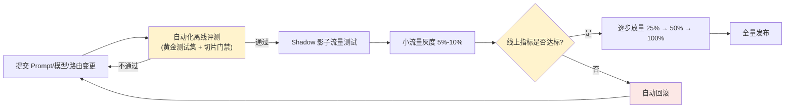

# 第十章：LLM CI/CD 与灰度、Canary、A/B 发布

## 10.1 LLM CI/CD 流水线长什么样

LLM CI/CD 在单元测试、集成测试、授权和契约测试之外，**新增**[离线评测门禁](../04-evaluation-observability/07-offline-eval-eval-driven-development.md)，不是替换这些测试。质量退化可能不触发异常，因此发布还需观察业务质量信号，不能只看进程存活。



## 10.2 Shadow 测试:让新版本"看见"流量但不影响用户

在真正切流量之前,可以让新版本(新 Prompt/新模型)接收生产流量的复制,**产出结果但不返回给用户**,只用于离线对比:

```python
def handle_request(request):
    response = production_pipeline(request)   # 真实返回给用户
    if shadow_enabled():
        async_run(shadow_pipeline, request)    # 异步执行,结果只记录不返回
    return response
```

Shadow 不把候选回答发给用户，但并非零风险：重复调用会增加费用、争用配额，也可能把数据送往新的处理方。上例的 `shadow_pipeline` 必须使用只读副本、录制回放或模拟工具，**禁止真实写操作与重复通知**，并隔离队列、限流和日志。它能比较相同输入下的结果，却不能直接测量候选回答引发的后续用户行为。

## 10.3 灰度发布:按比例放量,而不是一步切换

```yaml
rollout_plan:
  - stage: canary
    traffic_percent: 5
    duration_minutes: 60
    guard_metrics: &guards
      error_rate: 0.02
      contract_violation_rate: 0.01
      p99_latency_ms: 8000
  - stage: ramp_25
    traffic_percent: 25
    duration_minutes: 120
    guard_metrics: *guards
  - stage: full
    traffic_percent: 100
    guard_metrics: *guards
```

数值和时长仅为示例，不是推荐阈值。每一阶段都设置**护栏指标(guard metrics)**,这些指标来自[第 8 章](../04-evaluation-observability/08-online-observability-tracing.md)的可观测性聚合数据。任意护栏指标越界,自动暂停放量或回滚到上一阶段,而不是等人工发现问题。

## 10.4 A/B 测试:回答"哪个版本更好",而不只是"新版本有没有崩"

灰度发布关注的是"新版本是否安全",A/B 测试关注的是"两个版本哪个业务效果更好",两者可以结合但目的不同:

| | 灰度发布 | A/B 测试 |
|---|---|---|
| 核心问题 | 新版本会不会引发事故 | 新旧版本哪个业务指标更好 |
| 流量分配 | 单调递增(5%→25%→100%) | 长期保持固定比例对照(如 50/50) |
| 判断依据 | 错误率、延迟、契约违反率等护栏指标 | 用户满意度、任务完成率等业务指标 |
| 典型时长 | 数小时到几天 | 数天到数周,需要统计显著性 |

### 10.4.1 A/B 测试对样本量和统计显著性有明确要求

样本量取决于基线、方差、最小可检测效应和统计功效，不能因「用了 LLM」就断言方差更大。先明确主指标和随机化单位；多轮场景按用户或租户稳定分组，避免同一用户来回切版本。检查分流比例异常（SRM）、曝光丢失和跨组污染，并覆盖业务周期与反馈延迟。

```python
from scipy import stats

def compare_user_scores(control_scores: list[float], treatment_scores: list[float]):
    # 两组独立、每用户一个汇总分数、样本量充足的连续指标示例
    result = stats.ttest_ind(control_scores, treatment_scores, equal_var=False)
    return result.statistic, result.pvalue
```

这是 Welch t 检验的局部示例，不是自动上线函数；空样本、缺失值和检验前提需要先检查。二元任务完成率、重尾成本、用户内相关数据各有相应方法。报告提升幅度与置信区间，区分统计显著与业务有用；不应每天重复看固定样本检验并在首次显著时停止。可预先固定样本量与时长，或使用事先选定的序贯检验；多指标、多版本比较需要控制误报。

## 10.5 回滚要快且要有明确触发条件

回滚不应该依赖人工盯着仪表盘做判断,应该把 10.3 节的护栏指标接入自动化回滚:

```python
from math import isfinite

def check_rollout_health(current_metrics: dict, guard_metrics: dict) -> bool:
    if not guard_metrics:
        pause_rollout(reason="未配置护栏")
        return False
    for metric_name, max_value in guard_metrics.items():
        if metric_name not in current_metrics:
            pause_rollout(reason=f"缺少指标 {metric_name}")
            return False
        if not isfinite(current_metrics[metric_name]) or not isfinite(max_value):
            pause_rollout(reason=f"指标或阈值无效: {metric_name}")
            return False
        if current_metrics[metric_name] > max_value:
            trigger_rollback(reason=f"{metric_name} 超过阈值")
            return False
    return True
```

示例配置的值都是上界，键与指标同名；真实发布系统还需检查数据类型、窗口、分母和采集新鲜度，不能把缺失或过期指标当作正常。回滚按[第 9 章](09-prompt-model-data-versioning.md)的已验证组合恢复 Prompt、模型、路由、工具和兼容的数据版本。正在执行的任务需要版本粘性或排空；已发邮件、已扣款等副作用不会被配置回滚撤销。安全补丁、删除标记和权限撤销不能跟着回滚失效。

## 10.6 常见错误

### 10.6.1 评测通过就直接全量发布

离线评测无法覆盖全部生产分布，应按风险选择影子测试、受控试点或灰度。无法隔离写操作时不要机械复制生产请求做 Shadow。

### 10.6.2 灰度阶段不设护栏指标,靠人工盯着看

人工监控响应慢且容易疏漏,护栏指标应该接入自动化的暂停/回滚机制。

### 10.6.3 把灰度发布和 A/B 测试混为一谈

灰度发布关注"安全性",A/B 测试关注"业务效果哪个更优",两者的流量策略和判断依据都不同,不能用同一套流程处理。

### 10.6.4 A/B 测试样本量不足就下结论

低流量或高方差指标可能需要较长观察；只运行一小时或只看 p 值，无法证明收益稳定，也不能证明「没有显著退化」就是安全。

### 10.6.5 回滚只回滚模型,不回滚配套的 Prompt 和路由策略

三者应作为一个整体版本快照一起回滚,否则可能出现新旧配置不匹配引发的次生问题。

## 10.7 本章总结

1. **LLM CI/CD 在传统测试之外增加评测门禁**，不取消确定性的契约、授权和状态机测试;
2. **Shadow 不返回候选结果，但仍需隔离副作用、资源与数据流向**;
3. **灰度发布按比例递增放量,每阶段设自动化护栏指标**,越界自动暂停或回滚;
4. **A/B 测试和灰度发布目的不同**：前者估计业务效果差异，后者控制放量风险；分别约定实验方法与发布门禁，不把 p 值当成上线许可;
5. **回滚要快且自动化**,回滚目标是版本注册表里的完整版本快照,而非单一组件。

## 参考资料

- [Martin Fowler: CanaryRelease](https://martinfowler.com/bliki/CanaryRelease.html)
- [Google SRE Workbook: Canarying Releases](https://sre.google/workbook/canarying-releases/)
- [SciPy: ttest_ind，独立样本与 Welch 检验前提](https://docs.scipy.org/doc/scipy/reference/generated/scipy.stats.ttest_ind.html)
- [Martin Fowler: Continuous Delivery for Machine Learning](https://martinfowler.com/articles/cd4ml.html)
- [Spinnaker: Canary Analysis](https://spinnaker.io/docs/guides/user/canary/)
- [Optimizely: Statistical significance in A/B testing](https://www.optimizely.com/optimization-glossary/statistical-significance/)
