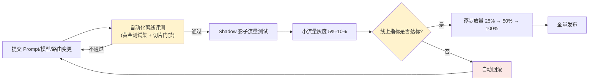

# 第十章：LLM CI/CD 与灰度、Canary、A/B 发布

## 10.1 LLM CI/CD 流水线长什么样

传统 CI/CD 的"测试"阶段是确定性断言,LLM 应用的流水线在这一阶段替换成[第 7 章](../04-evaluation-observability/07-offline-eval-eval-driven-development.md)的离线评测门禁,发布阶段则需要比传统蓝绿部署更谨慎的灰度策略——因为质量退化不像应用崩溃那样会立刻报错,而是悄悄发生。



## 10.2 Shadow 测试:让新版本"看见"流量但不影响用户

在真正切流量之前,可以让新版本(新 Prompt/新模型)接收生产流量的复制,**产出结果但不返回给用户**,只用于离线对比:

```python
def handle_request(request):
    response = production_pipeline(request)   # 真实返回给用户
    if shadow_enabled():
        async_run(shadow_pipeline, request)    # 异步执行,结果只记录不返回
    return response
```

Shadow 测试的价值在于**用真实流量分布验证新版本,而不承担任何用户体验风险**,是离线评测(固定测试集)和线上灰度(真实承接流量)之间的中间地带。局限是它只能对比"输出内容",无法验证端到端的用户交互体验(如多轮追问)。

## 10.3 灰度发布:按比例放量,而不是一步切换

```yaml
rollout_plan:
  - stage: canary
    traffic_percent: 5
    duration_minutes: 60
    guard_metrics:
      error_rate_max: 0.02
      contract_violation_rate_max: 0.01
      p99_latency_ms_max: 8000
  - stage: ramp_25
    traffic_percent: 25
    duration_minutes: 120
  - stage: full
    traffic_percent: 100
```

每一阶段都设置**护栏指标(guard metrics)**,这些指标来自[第 8 章](../04-evaluation-observability/08-online-observability-tracing.md)的可观测性聚合数据。任意护栏指标越界,自动暂停放量或回滚到上一阶段,而不是等人工发现问题。

## 10.4 A/B 测试:回答"哪个版本更好",而不只是"新版本有没有崩"

灰度发布关注的是"新版本是否安全",A/B 测试关注的是"两个版本哪个业务效果更好",两者可以结合但目的不同:

| | 灰度发布 | A/B 测试 |
|---|---|---|
| 核心问题 | 新版本会不会引发事故 | 新旧版本哪个业务指标更好 |
| 流量分配 | 单调递增(5%→25%→100%) | 长期保持固定比例对照(如 50/50) |
| 判断依据 | 错误率、延迟、契约违反率等护栏指标 | 用户满意度、任务完成率等业务指标 |
| 典型时长 | 数小时到几天 | 数天到数周,需要统计显著性 |

### 10.4.1 A/B 测试对样本量和统计显著性有明确要求

LLM 输出的业务指标(如用户满意度)方差通常比传统 A/B 测试(如按钮点击率)更大,需要更大的样本量才能得出有统计意义的结论。**没有做显著性检验就下结论"新版本更好",是最容易踩的坑**——观察到的差异很可能只是噪声。

```python
from scipy import stats

def is_significant(control_scores: list[float], treatment_scores: list[float], alpha=0.05) -> bool:
    _, p_value = stats.ttest_ind(control_scores, treatment_scores)
    return p_value < alpha
```

## 10.5 回滚要快且要有明确触发条件

回滚不应该依赖人工盯着仪表盘做判断,应该把 10.3 节的护栏指标接入自动化回滚:

```python
def check_rollout_health(current_metrics: dict, guard_metrics: dict) -> bool:
    for metric_name, max_value in guard_metrics.items():
        if current_metrics.get(metric_name, 0) > max_value:
            trigger_rollback(reason=f"{metric_name} 超过阈值")
            return False
    return True
```

回滚目标应该是[第 9 章](09-prompt-model-data-versioning.md)版本注册表里"上一个已知良好版本"的完整快照——Prompt、模型快照、路由策略三者一起回滚,而不是只回滚其中一项,否则可能出现版本组合不一致导致的新问题。

## 10.6 常见错误

### 10.6.1 评测通过就直接全量发布

离线评测无法覆盖生产环境全部输入分布,必须经过 Shadow 测试和灰度放量的验证,才能全量。

### 10.6.2 灰度阶段不设护栏指标,靠人工盯着看

人工监控响应慢且容易疏漏,护栏指标应该接入自动化的暂停/回滚机制。

### 10.6.3 把灰度发布和 A/B 测试混为一谈

灰度发布关注"安全性",A/B 测试关注"业务效果哪个更优",两者的流量策略和判断依据都不同,不能用同一套流程处理。

### 10.6.4 A/B 测试样本量不足就下结论

LLM 业务指标方差大,没做统计显著性检验就宣布"新版本更好",很可能被噪声误导。

### 10.6.5 回滚只回滚模型,不回滚配套的 Prompt 和路由策略

三者应作为一个整体版本快照一起回滚,否则可能出现新旧配置不匹配引发的次生问题。

## 10.7 本章总结

1. **LLM CI/CD 用评测门禁替代传统的确定性测试断言**,发布环节需要比传统应用更谨慎的灰度策略;
2. **Shadow 测试用真实流量验证新版本,但不影响用户**,是离线评测和线上灰度之间的中间地带;
3. **灰度发布按比例递增放量,每阶段设自动化护栏指标**,越界自动暂停或回滚;
4. **A/B 测试和灰度发布目的不同**:前者比较业务效果,后者验证安全性,需要统计显著性支撑结论;
5. **回滚要快且自动化**,回滚目标是版本注册表里的完整版本快照,而非单一组件。

> **一句话概括:LLM 发布流水线的核心不是"跑个测试就上线",而是用评测门禁、影子测试、分阶段灰度和自动化护栏,把"质量退化悄悄发生"这件事变成"任何一步都能被自动拦下"。**

## 参考资料

- [Martin Fowler: CanaryRelease](https://martinfowler.com/bliki/CanaryRelease.html)
- [Google SRE Workbook: Canarying Releases](https://sre.google/workbook/canarying-releases/)
- [Martin Fowler: Continuous Delivery for Machine Learning](https://martinfowler.com/articles/cd4ml.html)
- [Spinnaker: Canary Analysis](https://spinnaker.io/docs/guides/user/canary/)
- [Optimizely: Statistical significance in A/B testing](https://www.optimizely.com/optimization-glossary/statistical-significance/)
