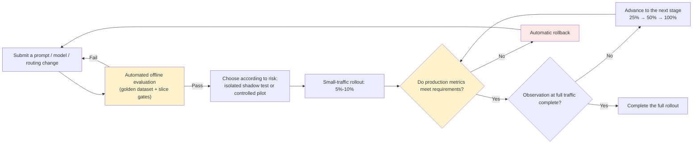

# Chapter 10: LLM CI/CD, Staged Rollouts, Canary Releases, and A/B Tests

## 10.1 What does an LLM CI/CD pipeline look like?

LLM CI/CD **adds** an [offline evaluation gate](../04-evaluation-observability/07-offline-eval-eval-driven-development.md) to unit, integration, authorization, and contract tests; it does not replace them. A quality regression may not raise an exception, so a release must also be assessed through business-quality signals, not merely whether the process is alive.



## 10.2 Shadow testing: expose the new version to traffic without serving its answers

Before switching live traffic, a new version—a new prompt or model—can receive a copy of production traffic and **produce results without returning them to users**, solely for offline comparison:

```python
def handle_request(request):
    response = production_pipeline(request)   # Actually returned to the user.
    if shadow_enabled():
        async_run(shadow_pipeline, request)    # Run asynchronously; log, but do not serve, results.
    return response
```

Shadow testing does not send candidate answers to users, but it is not risk-free. Duplicate calls increase costs, compete for quota, and may send data to a new processor. The `shadow_pipeline` above must use read-only replicas, record-and-replay, or simulated tools, **with no real writes or duplicate notifications**, and must isolate its queues, rate limiting, and logs. It can compare outputs for the same input, but cannot directly measure the subsequent user behavior that a candidate answer would produce.

## 10.3 Staged rollouts: increase traffic gradually rather than switching all at once

```yaml
rollout_plan:
  - stage: canary
    traffic_percent: 5
    duration_minutes: 60
    guard_metrics: &guards
      error_rate: 0.02
      contract_violation_rate: 0.01
      p99_latency_ms: 8000
  - stage: ramp_25
    traffic_percent: 25
    duration_minutes: 120
    guard_metrics: *guards
  - stage: full
    traffic_percent: 100
    guard_metrics: *guards
```

These values and durations are examples, not recommended thresholds. Each stage has **guard metrics** derived from the aggregated observability data in [Chapter 8](../04-evaluation-observability/08-online-observability-tracing.md). If any guard metric breaches its threshold, automatically pause the rollout or revert to the previous stage rather than waiting for someone to notice.

## 10.4 A/B tests: which version is better, not just whether the new one crashes

A staged rollout asks whether the new version is safe to release. An A/B test asks which of two versions delivers better business outcomes. They can be combined, but their objectives differ:

| | Staged rollout | A/B test |
|---|---|---|
| Core question | Will the new version cause an incident? | Which version improves business metrics? |
| Traffic allocation | Increase in gated stages, pausing or reverting on problems | Usually stable randomized groups over a predefined window; a 50/50 split is not required |
| Decision criteria | Guard metrics such as error rate, latency, and contract violation rate | Business metrics such as user satisfaction and task completion rate |
| Observation period | Determined by risk, sample size, and business cycles | Determined by the effect to detect, statistical power, and business cycles; does not end at the first significant result |

### 10.4.1 A/B tests require an explicit sample-size and significance plan

Sample size depends on the baseline, variance, minimum detectable effect, and statistical power. Using an LLM does not by itself establish that variance is higher. Define the primary metric and unit of randomization first. In multi-turn settings, assign users or tenants to stable groups so that the same user does not switch back and forth between versions. Check for sample ratio mismatch (SRM), missing exposure records, and cross-group contamination, and allow for business cycles and feedback delays.

```python
from scipy import stats

def compare_user_scores(control_scores: list[float], treatment_scores: list[float]):
    # Continuous metric: independent groups, one aggregate score per user, sufficient samples.
    result = stats.ttest_ind(control_scores, treatment_scores, equal_var=False)
    return result.statistic, result.pvalue
```

This is a limited example of Welch’s t-test, not a function that decides to deploy automatically. First check for empty samples, missing values, and the test’s assumptions. Binary task-completion rates, heavy-tailed costs, and within-user correlated observations each require appropriate methods. Report the improvement and its confidence interval, distinguishing statistical significance from business usefulness. Do not repeatedly inspect a fixed-sample test every day and stop at the first significant result. Either fix the sample size and duration in advance or choose a sequential test beforehand. Comparisons across multiple metrics or versions require false-positive control.

## 10.5 Rollback should be fast and have explicit triggers

Rollback should not depend on someone watching a dashboard and making a judgment. Connect the guard metrics in Section 10.3 to automated rollback:

```python
from math import isfinite

def check_rollout_health(current_metrics: dict, guard_metrics: dict) -> bool:
    if not guard_metrics:
        pause_rollout(reason="未配置护栏")
        return False
    for metric_name, max_value in guard_metrics.items():
        if metric_name not in current_metrics:
            pause_rollout(reason=f"缺少指标 {metric_name}")
            return False
        if not isfinite(current_metrics[metric_name]) or not isfinite(max_value):
            pause_rollout(reason=f"指标或阈值无效: {metric_name}")
            return False
        if current_metrics[metric_name] > max_value:
            trigger_rollback(reason=f"{metric_name} 超过阈值")
            return False
    return True
```

The Chinese reason strings distinguish absent guards, a missing metric, an invalid metric or threshold, and a threshold breach. All values in the example configuration are upper bounds, and keys match metric names. A real release system must also check types, measurement windows, denominators, and collection freshness; missing or stale metrics must not count as healthy. Rollback should restore the validated combination of prompt, model, routing, tools, and compatible data versions described in [Chapter 9](09-prompt-model-data-versioning.md). In-flight tasks need version stickiness or draining. A configuration rollback does not undo side effects such as sent emails or completed charges. Security patches, deletion markers, and permission revocations must remain effective through rollback.

## 10.6 Common mistakes

### 10.6.1 Releasing to all traffic as soon as evaluation passes

Offline evaluation cannot cover the entire production distribution. Choose shadow testing, a controlled pilot, or a staged rollout according to risk. Do not blindly duplicate production requests for shadow testing when writes cannot be isolated.

### 10.6.2 Watching the rollout manually instead of setting guard metrics

Manual monitoring is slow to respond and prone to omissions. Connect guard metrics to an automated pause or rollback mechanism.

### 10.6.3 Conflating staged rollouts with A/B tests

Staged rollouts focus on release safety; A/B tests focus on better business outcomes. Their traffic strategies and decision criteria differ, so they should not be treated as the same procedure.

### 10.6.4 Drawing A/B conclusions from insufficient samples

Low traffic or high-variance metrics may require longer observation. Running for only one hour or looking only at a p-value cannot establish stable gains, nor does it prove that “no significant regression” means the release is safe.

### 10.6.5 Rolling back the model without its associated prompt and routing policy

Roll back all three together as one versioned snapshot. Otherwise, mismatched old and new configuration may create secondary failures.

## 10.7 Chapter summary

1. **LLM CI/CD adds evaluation gates to traditional tests.** It does not remove deterministic contract, authorization, or state-machine tests.
2. **Shadow tests do not serve candidate results, but still require isolation of side effects, resources, and data flows.**
3. **Staged rollouts increase traffic incrementally with automated guard metrics at each stage.** Threshold breaches trigger a pause or rollback.
4. **A/B tests and staged rollouts have different objectives:** estimating differences in business outcomes versus controlling rollout risk. Define the experimental method and release gates separately; a p-value is not permission to deploy.
5. **Rollback should be fast and automated.** Restore a complete versioned snapshot from the registry, not just one component.

## References

- [Martin Fowler: CanaryRelease](https://martinfowler.com/bliki/CanaryRelease.html)
- [Google SRE Workbook: Canarying Releases](https://sre.google/workbook/canarying-releases/)
- [SciPy: ttest_ind, independent samples, and Welch’s test assumptions](https://docs.scipy.org/doc/scipy/reference/generated/scipy.stats.ttest_ind.html)
- [Martin Fowler: Continuous Delivery for Machine Learning](https://martinfowler.com/articles/cd4ml.html)
- [Spinnaker: Canary Analysis](https://spinnaker.io/docs/guides/user/canary/)
- [Optimizely: Statistical significance in A/B testing](https://www.optimizely.com/optimization-glossary/statistical-significance/)
