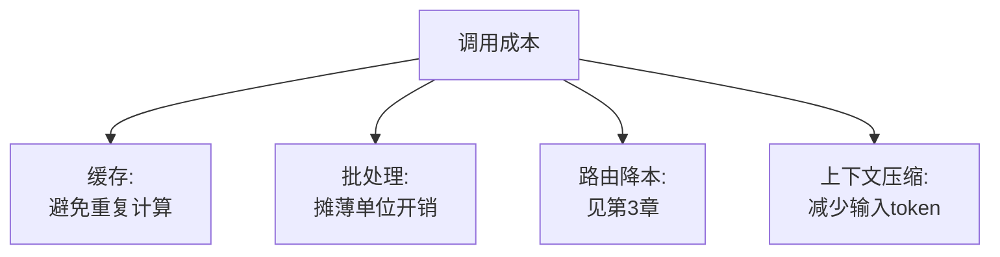

# 第十一章：缓存、批处理、吞吐与成本优化

## 11.1 成本优化的四个杠杆

LLM 应用的成本主要由 token 用量和调用次数决定。四个可独立操作的杠杆:**减少重复调用(缓存)、合并调用(批处理)、换更便宜的模型(路由)、压缩上下文(减少 token)**。本章聚焦前两个应用层杠杆,路由降本已在[第 3 章](../02-request-reliability/03-model-gateway-routing-fallback.md)讨论,推理引擎内部的量化、KV Cache 等降本手段见 [LLM · 推理与部署](../../llm/03-inference-serving/README.md),本章不重复展开。



## 11.2 语义缓存:应用层最直接的降本手段

[Tools · LLM 网关](../../tools/05-transport-gateway/14-llm-gateway.md)已经详细讲过语义缓存的机制(向量相似度匹配)、阈值调参(0.85–0.95)和适用场景,这里不重复展开,只强调一点应用层的补充实践:**缓存命中率应该按业务场景分别统计,而不是看一个全局数字**。客服 FAQ 场景命中率可能高达 60%,但个性化推荐场景命中率可能不到 5%——全局平均数会掩盖"这个场景其实值得开缓存,那个场景根本不该开"的差异化决策。

## 11.3 Prompt Caching:另一种缓存,作用层次不同

**语义缓存跳过整次模型调用,Prompt Caching(如 Anthropic 的 Prompt Caching、OpenAI 的自动 Prompt Caching)是调用照做,但复用已经计算过的前缀部分的 KV,只需要重新计算新增的部分。** 这是[LLM · KV Cache](../../llm/03-inference-serving/14-kv-cache.md)机制在应用层的直接收益。

**应用层能做的事是把 Prompt 结构设计成"缓存友好"**:

```python
# 缓存友好的结构:固定不变的部分放前面,易变部分放后面
prompt = (
    SYSTEM_INSTRUCTIONS      # 长期不变,命中缓存
    + FEW_SHOT_EXAMPLES      # 较少变化,大概率命中缓存
    + retrieved_context      # 每次检索结果不同,缓存不命中
    + user_question          # 每次都不同
)
```

如果把 `user_question` 放在最前面、`SYSTEM_INSTRUCTIONS` 放在后面,即使内容完全一样,Prompt Caching 也无法命中——**前缀必须字节级完全一致才能复用 KV**。这条设计原则简单,但很多团队在拼接 Prompt 时完全没意识到顺序会影响成本。

## 11.4 请求批处理:同步实时 vs 异步批量

| 场景 | 策略 | 收益 |
|---|---|---|
| 用户实时对话 | 不适合等待攒批,牺牲延迟换吞吐不划算 | 无 |
| 后台批量任务(摘要、打标签、离线分析) | 使用批量 API(如 OpenAI Batch API、Anthropic Message Batches) | 通常比同步调用便宜 50% 左右,代价是数小时级别的延迟 |

```python
# 伪代码:把可以延迟处理的任务路由到批量 API
def submit_batch_job(tasks: list[dict]) -> str:
    batch_input = "\n".join(json.dumps(t) for t in tasks)
    return batch_api.create(input_file=batch_input, completion_window="24h")
```

**批量 API 和第 3 章讲的"实时路由"是完全不同的两条路径**:实时对话走网关的低延迟路由,能够容忍延迟的后台任务应该在架构设计阶段就分流到批量 API,而不是和实时流量走同一条路径再事后优化。

## 11.5 上下文压缩:减少输入侧 token

| 手段 | 说明 |
|---|---|
| 检索结果精简 | RAG 场景下只把真正相关的片段放入上下文,而非整篇文档,详见 [RAG · 检索](../../rag/03-retrieval/README.md) |
| 历史对话摘要 | 多轮对话中把较早的轮次压缩成摘要而非保留全文,详见 [Agent · 记忆与上下文](../../agent/03-memory-context/README.md) |
| 精简系统 Prompt | 定期审查系统 Prompt 是否存在冗余指令,过长的系统 Prompt 会在每次调用中重复计费 |

## 11.6 吞吐:用并发和排队策略平衡延迟与成本

在自建推理服务的场景下(见 [LLM · 部署框架](../../llm/03-inference-serving/20-deployment-frameworks.md)),连续批处理(continuous batching)等技术由推理引擎负责;应用层能控制的是**并发请求数的准入策略**——过多并发请求同时涌入会推高排队延迟,进而影响 SLO(见[第 12 章](12-slo-capacity-incident-response.md)):

```python
import asyncio

semaphore = asyncio.Semaphore(MAX_CONCURRENT_REQUESTS)

async def call_model_with_admission_control(prompt: str):
    async with semaphore:
        return await model_client.generate(prompt)
```

## 11.7 成本可观测性:没有度量就没有优化依据

[第 8 章](../04-evaluation-observability/08-online-observability-tracing.md)提到的 Trace 数据应该聚合出按业务场景、按团队维度的成本报表:

| 报表维度 | 回答的问题 |
|---|---|
| 按接口/场景 | 哪个功能最烧钱,是否有优化空间 |
| 按团队/租户 | 成本如何分摊 |
| 按模型版本 | 换模型前后的成本变化是否符合预期 |

## 11.8 常见错误

### 11.8.1 只统计全局缓存命中率,不按场景拆分

会掩盖"该开缓存的场景没开、不该开的场景瞎开"的差异化问题,见 11.2 节。

### 11.8.2 拼接 Prompt 时把易变内容放在前面

导致 Prompt Caching 完全无法命中,是最容易被忽视的隐性成本浪费。

### 11.8.3 把可以异步处理的任务和实时流量混在一起同步处理

错失批量 API 通常 50% 左右的降本空间,还可能因为攒批逻辑拖慢实时请求。

### 11.8.4 历史对话不做任何压缩,无限累加上下文

多轮对话越往后,输入 token 越多,成本和延迟同步上升,且可能超出上下文窗口限制。

### 11.8.5 没有成本报表,优化决策靠猜测

不知道哪个场景真正烧钱,优化精力容易投入到影响不大的地方。

## 11.9 本章总结

1. **成本优化有四个杠杆**:缓存、批处理、路由降本、上下文压缩,本章聚焦前两个应用层手段;
2. **语义缓存命中率要按业务场景拆分统计**,而非只看全局数字;
3. **Prompt Caching 要求前缀字节级一致才能命中**,Prompt 结构设计应把固定内容放在前面;
4. **能容忍延迟的后台任务应分流到批量 API**,通常能降本约 50%,不应和实时流量混在一起处理;
5. **上下文压缩(检索精简、对话摘要)直接减少输入 token**,是最容易被忽视的降本手段;
6. **成本可观测性是优化的前提**,应按场景、团队、模型版本建立报表。

> **一句话概括:LLM 应用层的成本优化不需要碰推理引擎内部,靠缓存策略、Prompt 结构设计、批量与实时流量分流这几个应用层杠杆,通常就能拿到大部分收益。**

## 参考资料

- [Anthropic: Prompt caching](https://docs.anthropic.com/en/docs/build-with-claude/prompt-caching)
- [OpenAI: Prompt caching](https://platform.openai.com/docs/guides/prompt-caching)
- [OpenAI: Batch API](https://platform.openai.com/docs/guides/batch)
- [Anthropic: Message Batches API](https://docs.anthropic.com/en/docs/build-with-claude/batch-processing)
- [Google Cloud: Cost optimization for AI and ML workloads](https://cloud.google.com/architecture/framework/cost-optimization/ai-ml)
