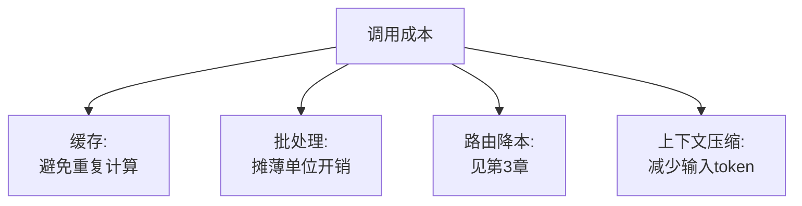

# 第十一章：缓存、批处理、吞吐与成本优化

## 11.1 成本优化的四个杠杆

对按用量计费的模型 API，token 用量、工具使用和调用次数直接影响费用；自托管还要算算力利用率与运维。常用的四个杠杆是：**减少重复计算（缓存）、把可延迟任务交给异步批处理、换更便宜的模型（路由）、压缩上下文（减少 token）**。这里先看前两个应用层杠杆，路由降本已在[第 3 章](../02-request-reliability/03-model-gateway-routing-fallback.md)讨论，推理引擎内部的量化、KV Cache 等降本手段见 [LLM · 推理与部署](../../llm/03-inference-serving/README.md)。



## 11.2 语义缓存:应用层最直接的降本手段

语义缓存用向量相似度寻找可复用答案，机制见 [Tools · LLM 网关](../../tools/05-transport-gateway/14-llm-gateway.md)。相似度不是答案等价概率，0.85–0.95 之类阈值只能作为特定嵌入模型下的实验值；「可退款」与「不可退款」、不同日期和不同订单可能非常相似却不能共用答案。

先做精确缓存，再评估语义复用是否划算。缓存键或过滤条件应覆盖租户、用户权限、Prompt/模型/知识库/策略版本和业务时效；命中后仍要验证资源权限。对付款、实时余额等请求通常不能复用旧答案。按场景同时统计命中率、错误命中率、节省费用和答案陈旧率，删除文档或撤销权限时联动失效，不能只追求更高命中率。

## 11.3 Prompt Caching:另一种缓存,作用层次不同

**答案缓存命中后可以跳过整次生成；Prompt Caching 则仍然发起调用，只复用已计算的前缀状态。** 后者减少重复的 prefill 计算，未命中的输入和新输出仍要计算，生成时也仍需读取历史 KV 做注意力运算。这是[LLM · KV Cache](../../llm/03-inference-serving/14-kv-cache.md)机制在应用层的直接收益，不是整段上下文此后都不参与推理。

**应用层能做的事是把 Prompt 结构设计成"缓存友好"**:

```python
# 缓存友好的结构:固定不变的部分放前面,易变部分放后面
prompt = (
    SYSTEM_INSTRUCTIONS
    + FEW_SHOT_EXAMPLES
    + retrieved_context
    + user_question
)
```

易变内容提前会缩短可复用前缀。应让供应商实际渲染后的前缀保持一致，包括消息、工具定义、多模态内容和相关设置，而不是只比较某个字符串的字节。最低长度、保留期、缓存写入价格与隔离范围由供应商和模型决定；命中后仍会生成新答案，不代表复用旧输出，也不保证整体延迟按同一比例下降。

## 11.4 请求批处理:同步实时 vs 异步批量

| 场景 | 策略 | 收益 |
|---|---|---|
| 用户实时对话 | 通常不等待应用层长时间攒批；引擎内部仍可在延迟预算内连续批处理 | 是否获益取决于排队时间与吞吐，不等于实时请求不能批处理 |
| 后台批量任务(摘要、打标签、离线分析) | 使用供应商异步批量 API | OpenAI Batch 官方文档给出相对同步 API 的 50% 折扣和 24 小时处理窗口；这是产品条件，不是批处理通则 |

```python
# 伪代码:把可以延迟处理的任务路由到批量 API
def submit_batch_job(tasks: list[dict]) -> str:
    batch_input = "\n".join(json.dumps(t) for t in tasks)
    return batch_api.create(input_file=batch_input, completion_window="24h")
```

批量任务需要唯一的 `custom_id`、逐条状态和结果对账，结果顺序不保证与提交顺序一致。到期或部分失败时只重试失败项，不能重放已成功的有副作用任务。上述代码是接口无关伪代码，实际 OpenAI Batch 需先上传 JSONL 文件并使用文件 ID。**批量 API 和第 3 章讲的"实时路由"是完全不同的两条路径**:实时对话走网关的低延迟路由,能够容忍延迟的后台任务应该在架构设计阶段就分流到批量 API,而不是和实时流量走同一条路径再事后优化。

## 11.5 上下文压缩:减少输入侧 token

| 手段 | 说明 |
|---|---|
| 检索结果精简 | RAG 场景下只把真正相关的片段放入上下文,而非整篇文档,详见 [RAG · 检索](../../rag/03-retrieval/README.md) |
| 历史对话摘要 | 多轮对话中把较早的轮次压缩成摘要而非保留全文,详见 [Agent · 记忆与上下文](../../agent/03-memory-context/README.md) |
| 精简系统 Prompt | 定期审查系统 Prompt 是否存在冗余指令,过长的系统 Prompt 会在每次调用中重复计费 |

## 11.6 吞吐:用并发和排队策略平衡延迟与成本

在自建推理服务的场景下(见 [LLM · 部署框架](../../llm/03-inference-serving/20-deployment-frameworks.md)),连续批处理(continuous batching)等技术由推理引擎负责;应用层能控制的是**并发请求数的准入策略**——过多并发请求同时涌入会推高排队延迟,进而影响 SLO(见[第 12 章](12-slo-capacity-incident-response.md)):

```python
import asyncio

semaphore = asyncio.Semaphore(MAX_CONCURRENT_REQUESTS)

async def call_model_with_admission_control(prompt: str):
    async with asyncio.timeout(REQUEST_TIMEOUT_SECONDS):  # Python 3.11+
        async with semaphore:
            return await model_client.generate(prompt)
```

Semaphore 只限制单进程活跃调用，不限制等待队列长度，也不约束多副本的总 RPM/TPM。入口还需要有界队列、按租户配额和超额拒绝；等待时间应计入总超时。多副本扩容之前确认供应商配额，否则只是更快触发限流。

## 11.7 成本可观测性:没有度量就没有优化依据

[第 8 章](../04-evaluation-observability/08-online-observability-tracing.md)提到的 Trace 数据应该聚合出按业务场景、按团队维度的成本报表:

| 报表维度 | 回答的问题 |
|---|---|
| 按接口/场景 | 哪个功能最烧钱,是否有优化空间 |
| 按团队/租户 | 成本如何分摊 |
| 按模型版本 | 换模型前后的成本变化是否符合预期 |

至少区分未缓存输入、缓存读写、输出、工具、检索、重试和评测费用；自托管还要计入 GPU 空闲、存储和运维。优化目标最好是「每个成功完成任务的总成本」，否则低价模型多轮重试、错误缓存和降级模板都可能让每请求价格更低、实际业务成本更高。

## 11.8 常见错误

### 11.8.1 只统计全局缓存命中率,不按场景拆分

会掩盖"该开缓存的场景没开、不该开的场景瞎开"的差异化问题,见 11.2 节。

### 11.8.2 拼接 Prompt 时把易变内容放在前面

这会缩短可复用的共同前缀；若低于供应商要求的最低长度，就无法命中。不能把任何一次内容变化都说成整段缓存必然失效。

### 11.8.3 把可以异步处理的任务和实时流量混在一起同步处理

可能错失供应商批量定价优惠，还可能因为攒批逻辑拖慢实时请求；折扣与完成窗口要按所选 API 核算。

### 11.8.4 历史对话不做任何压缩,无限累加上下文

多轮对话越往后,输入 token 越多,成本和延迟同步上升,且可能超出上下文窗口限制。

### 11.8.5 没有成本报表,优化决策靠猜测

不知道哪个场景真正烧钱,优化精力容易投入到影响不大的地方。

## 11.9 本章总结

1. **成本优化有四个杠杆**:缓存、批处理、路由降本、上下文压缩,这里先看前两个应用层手段;
2. **语义缓存命中率要按业务场景拆分统计**,而非只看全局数字;
3. **Prompt Caching 复用供应商实际处理的相同前缀**，需满足具体模型与接口的缓存条件;
4. **异步批量接口可能以较长完成窗口换取优惠**，需处理部分失败和逐项对账;
5. **上下文压缩(检索精简、对话摘要)直接减少输入 token**,是最容易被忽视的降本手段;
6. **成本可观测性是优化的前提**,应按场景、团队、模型版本建立报表。

## 参考资料

- [Anthropic: Prompt caching](https://docs.anthropic.com/en/docs/build-with-claude/prompt-caching)
- [OpenAI: Prompt caching](https://platform.openai.com/docs/guides/prompt-caching)
- [OpenAI: Batch API](https://platform.openai.com/docs/guides/batch)
- [Anthropic: Message Batches API](https://docs.anthropic.com/en/docs/build-with-claude/batch-processing)
- [Google Cloud: Cost optimization for AI and ML workloads](https://cloud.google.com/architecture/framework/cost-optimization/ai-ml)
