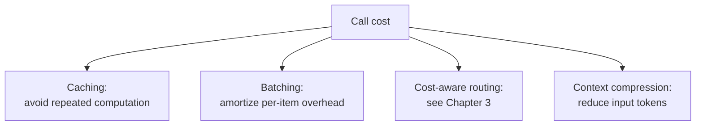

# Chapter 11: Caching, Batching, Throughput, and Cost Optimization

## 11.1 Four levers for cost optimization

For usage-priced model APIs, token usage, tool usage, and call counts directly affect the bill. Self-hosting also requires accounting for compute utilization and operations. Four common levers are **avoiding repeated computation through caching, sending delay-tolerant tasks to asynchronous batch processing, routing to cheaper models, and compressing context to reduce tokens**. We begin with the first two application-level levers. Cost-aware routing is covered in [Chapter 3](../02-request-reliability/03-model-gateway-routing-fallback.md); inference-engine techniques such as quantization and KV caching are covered in [LLM · Inference and Serving](../../llm/03-inference-serving/README.md).



## 11.2 Semantic caching: a direct way to reduce application costs

Semantic caching uses vector similarity to find answers that might be reusable; see [Tools · LLM Gateways](../../tools/05-transport-gateway/14-llm-gateway.md) for the mechanism. Similarity is not the probability that two answers are equivalent. Thresholds such as 0.85–0.95 are experimental values for a particular embedding model, not general rules. “Refundable” and “non-refundable,” different dates, or different orders may be highly similar yet cannot share an answer.

Start with exact-match caching, then evaluate whether semantic reuse is worth the tradeoff. Cache keys or filters should account for tenant, user permissions, prompt/model/knowledge-base/policy versions, and business freshness requirements. Recheck resource permissions even after a cache hit. Requests involving payments or real-time balances generally cannot reuse old answers. For each use case, track hit rate, false-hit rate, cost savings, and stale-answer rate together. Invalidate affected entries when documents are deleted or permissions are revoked, rather than optimizing only for a higher hit rate.

## 11.3 Prompt caching works at a different layer

**An answer-cache hit can skip generation entirely; prompt caching still makes a model call and reuses only previously computed prefix state.** Prompt caching reduces repeated prefill computation. Uncached input and new output still require computation, and generation still reads historical keys and values for attention. This is a direct application-level benefit of the [LLM · KV Cache](../../llm/03-inference-serving/14-kv-cache.md) mechanism; it does not mean the entire context stops participating in inference.

**At the application layer, make the prompt structure cache-friendly:**

```python
# Cache-friendly structure: stable content first, frequently changing content last.
prompt = (
    SYSTEM_INSTRUCTIONS
    + FEW_SHOT_EXAMPLES
    + retrieved_context
    + user_question
)
```

Placing changing content earlier shortens the reusable prefix. Keep the provider’s actual rendered prefix consistent, including messages, tool definitions, multimodal content, and relevant settings; comparing the bytes of one string is not enough. Minimum length, retention, cache-write pricing, and isolation scope depend on the provider and model. A cache hit still generates a new answer, does not reuse an old output, and does not guarantee a proportional reduction in end-to-end latency.

## 11.4 Request batching: synchronous real-time requests versus asynchronous jobs

| Scenario | Strategy | Benefit |
|---|---|---|
| Real-time user conversations | Usually avoid waiting a long time for the application to accumulate a batch; the engine can still use continuous batching within the latency budget | Benefits depend on queuing time and throughput; real-time requests are not inherently incompatible with batching |
| Background jobs such as summarization, labeling, and offline analysis | Use the provider’s asynchronous batch API | OpenAI Batch documentation specifies a 50% discount relative to synchronous APIs and a 24-hour processing window; these are product terms, not universal properties of batching |

```python
# Pseudocode: route delay-tolerant tasks to a batch API.
def submit_batch_job(tasks: list[dict]) -> str:
    batch_input = "\n".join(json.dumps(t) for t in tasks)
    return batch_api.create(input_file=batch_input, completion_window="24h")
```

Batch requests need a unique `custom_id`, per-item status tracking, and result reconciliation. Result order is not guaranteed to match submission order. On expiry or partial failure, retry only failed items; do not replay successful tasks with side effects. The code above is API-independent pseudocode. The actual OpenAI Batch API requires uploading a JSONL file first and using its file ID. **The batch API and the real-time routing discussed in Chapter 3 are separate paths.** Real-time conversations use the gateway’s low-latency route. Delay-tolerant background tasks should be routed to a batch API during architecture design, rather than sharing the real-time path and being optimized afterward.

## 11.5 Context compression: reducing input tokens

| Technique | Explanation |
|---|---|
| Trim retrieval results | In RAG, include genuinely relevant passages rather than entire documents; see [RAG · Retrieval](../../rag/03-retrieval/README.md) |
| Summarize conversation history | Compress earlier turns into summaries instead of retaining their full text; see [Agent · Memory and Context](../../agent/03-memory-context/README.md) |
| Simplify the system prompt | Review system prompts regularly for redundant instructions; an unnecessarily long system prompt incurs repeated charges on every call |

## 11.6 Throughput: balance latency and cost through concurrency and queuing

For self-hosted inference services (see [LLM · Deployment Frameworks](../../llm/03-inference-serving/20-deployment-frameworks.md)), the inference engine handles techniques such as continuous batching. The application controls **admission policies for concurrent requests**. Too many simultaneous requests increase queuing latency and affect SLOs (see [Chapter 12](12-slo-capacity-incident-response.md)):

```python
import asyncio

semaphore = asyncio.Semaphore(MAX_CONCURRENT_REQUESTS)

async def call_model_with_admission_control(prompt: str):
    async with asyncio.timeout(REQUEST_TIMEOUT_SECONDS):  # Python 3.11+
        async with semaphore:
            return await model_client.generate(prompt)
```

A semaphore limits active calls in one process, not the length of the waiting queue or total RPM/TPM across replicas. The entry point also needs bounded queues, per-tenant quotas, and rejection of excess demand. Include waiting time in the overall timeout. Check provider quotas before adding replicas; otherwise, scaling only reaches rate limits faster.

## 11.7 Cost observability: optimization needs measurements

Aggregate the trace data discussed in [Chapter 8](../04-evaluation-observability/08-online-observability-tracing.md) into cost reports by business use case and team:

| Reporting dimension | Question it answers |
|---|---|
| Endpoint / use case | Which feature costs the most, and can it be optimized? |
| Team / tenant | How should costs be allocated? |
| Model version | Did the cost change after a model switch match expectations? |

At minimum, distinguish costs for uncached input, cache reads and writes, output, tools, retrieval, retries, and evaluation. For self-hosting, also include idle GPUs, storage, and operations. Prefer optimizing **total cost per successfully completed task**. Otherwise, repeated attempts with a cheaper model, incorrect cache reuse, or degraded template responses may reduce the price per request while increasing the actual cost to the business.

## 11.8 Common mistakes

### 11.8.1 Tracking only a global cache hit rate

A global rate can hide caching being absent where it is appropriate and enabled where it is not. See Section 11.2.

### 11.8.2 Putting changing content first when assembling a prompt

This shortens the reusable common prefix. If it falls below the provider’s minimum length, there can be no hit. It is incorrect, however, to claim that every content change necessarily invalidates the entire cache.

### 11.8.3 Processing delay-tolerant jobs synchronously alongside real-time traffic

This may forfeit batch-pricing discounts, while batch accumulation logic may slow real-time requests. Evaluate discounts and completion windows for the chosen API.

### 11.8.4 Accumulating conversation history without compression

As a conversation progresses, input tokens accumulate, increasing cost and latency and potentially exceeding the context-window limit.

### 11.8.5 Guessing what to optimize without cost reports

Without knowing which use cases actually drive spending, optimization effort can go to areas with little impact.

## 11.9 Chapter summary

1. **There are four cost-optimization levers:** caching, batching, cost-aware routing, and context compression. This chapter begins with the first two application-level techniques.
2. **Break down semantic-cache hit rates by business use case**, rather than relying on one global figure.
3. **Prompt caching reuses the same prefix as actually processed by the provider**, subject to the chosen model’s and API’s caching conditions.
4. **Asynchronous batch APIs may offer discounts in exchange for longer completion windows.** Handle partial failures and reconcile each item.
5. **Context compression through retrieval trimming and conversation summaries directly reduces input tokens**, yet is easily overlooked.
6. **Cost observability is a prerequisite for optimization.** Report costs by use case, team, and model version.

## References

- [Anthropic: Prompt caching](https://docs.anthropic.com/en/docs/build-with-claude/prompt-caching)
- [OpenAI: Prompt caching](https://platform.openai.com/docs/guides/prompt-caching)
- [OpenAI: Batch API](https://platform.openai.com/docs/guides/batch)
- [Anthropic: Message Batches API](https://docs.anthropic.com/en/docs/build-with-claude/batch-processing)
- [Google Cloud: Cost optimization for AI and ML workloads](https://cloud.google.com/architecture/framework/cost-optimization/ai-ml)
