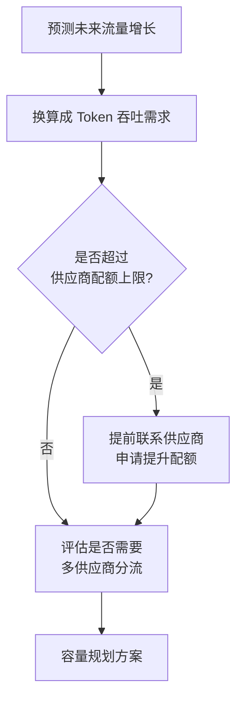
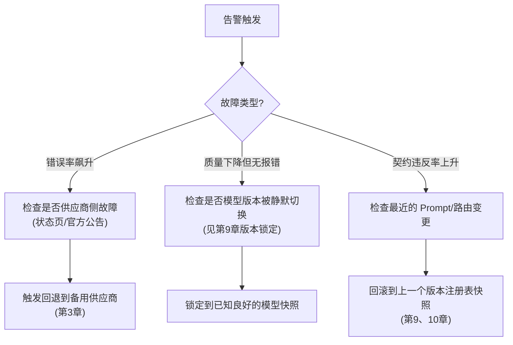

# 第十二章：SLO、容量规划与事故响应

## 12.1 先定义 LLM 服务的 SLI,再谈 SLO

Google SRE 体系里,SLI(服务水平指标)是可以被测量的具体数字,SLO(服务水平目标)是团队对 SLI 设定的目标值,错误预算(error budget)是允许偏离目标的余量。LLM 服务的 SLI 选取需要结合[第 8 章](../04-evaluation-observability/08-online-observability-tracing.md)的可观测性数据,并且比传统 API 多几个特有维度:

| SLI 类别 | 传统 API 常见指标 | LLM 服务额外需要的指标 |
|---|---|---|
| 可用性 | 请求成功率 | 相同,但要区分"供应商 5xx"和"契约校验失败"([第 5 章](../03-output-safety/05-structured-output-contracts.md))两类失败 |
| 延迟 | P50/P99 响应时间 | 首字节延迟(TTFT)对流式场景同样重要,不能只看总耗时 |
| 质量 | 通常不涉及 | 契约违反率、护栏拦截率、离线评测分数是否达标([第 6、7 章](../03-output-safety/06-guardrails-degradation.md)) |
| 成本 | 通常不涉及 | 单位请求 token 成本是否在预算内([第 11 章](11-caching-batching-throughput-cost.md)) |

**"质量"这一类 SLI 是 LLM 服务独有的**——传统 API 只要返回 200 就算成功,LLM 服务即使返回 200,内容质量也可能不达标,这是 LLMOps 比传统 SRE 多出来的一层考核维度。

## 12.2 错误预算:给"可以承受多少失败"定一个数

```python
SLO_TARGETS = {
    "availability_rate": 0.999,          # 成功请求比例
    "latency_under_8s_rate": 0.99,       # 99% 请求在 8 秒内完成
    "contract_compliance_rate": 0.99,    # 契约合规比例
}

def error_budget_remaining(
    actual_rates: dict[str, float],
    target_rates: dict[str, float],
    window_requests: int,
) -> dict[str, float]:
    return {
        name: (
            (1 - target_rate) * window_requests
            - (1 - actual_rates[name]) * window_requests
        )
        for name, target_rate in target_rates.items()
    }
```

延迟也必须先转换成“满足阈值的好事件比例”，不能直接拿毫秒值计算错误预算。上例返回值的单位是请求数：正数表示剩余预算，负数表示已经透支。

错误预算的价值在于**给"要不要冒险发布一次实验性改动"提供客观依据**:预算充足时可以承担更激进的灰度节奏([第 10 章](../05-release-pipeline/10-llm-cicd-canary-ab.md));预算即将耗尽时,团队应该暂停新功能发布,优先修复稳定性问题——这是错误预算机制本身自带的决策规则,不需要额外开会争论。

## 12.3 容量规划:LLM 场景的特殊之处

传统容量规划关注 QPS 和服务器数量,LLM 场景要额外考虑**供应商侧的速率限制(rate limit)和配额,这部分容量往往不在自己掌控范围内**。



| 容量规划要素 | 说明 |
|---|---|
| 供应商速率限制 | 每分钟 token 数(TPM)、每分钟请求数(RPM)上限,需要提前评估流量高峰是否会触顶 |
| 多供应商分流 | 单一供应商配额不足以支撑峰值流量时,需要[第 3 章](../02-request-reliability/03-model-gateway-routing-fallback.md)的路由能力做流量切分,而非依赖单一供应商扩容 |
| 突发流量缓冲 | 大促、活动等可预期的流量高峰,应提前和供应商沟通临时提额,而不是等触发限流才应对 |
| 自建部署的算力规划 | 若使用自研模型部署,容量规划回归传统 GPU 集群规划问题,详见 [LLM · 部署框架](../../llm/03-inference-serving/20-deployment-frameworks.md) |

**这是 LLMOps 容量规划和传统容量规划最本质的区别:很大一部分"容量"掌握在供应商手里,规划工作的重心从"买多少台服务器"变成"和供应商谈多少配额、以及怎么在多个供应商之间分摊风险"。**

## 12.4 事故响应:LLM 服务特有的排查路径



**"质量下降但没有任何报错"是 LLM 服务特有的、最难排查的故障类型**——服务返回 200,契约校验也通过,但输出内容质量下降,唯一线索往往是线上评测分数或用户反馈的异常波动。这也是为什么[第 8 章](../04-evaluation-observability/08-online-observability-tracing.md)强调要采集足够的元数据(模型快照版本、路由决策)来支撑这类排查。

### 12.4.1 事后复盘必须产出可执行的改进项

每次事故复盘,标准产出应该包括:一条新的[第 7 章](../04-evaluation-observability/07-offline-eval-eval-driven-development.md)回归测试用例、必要时调整的 SLO 阈值、以及是否需要新增一项自动化护栏或告警规则。**只写"下次注意"这种不可执行的复盘结论,等于没有复盘。**

## 12.5 常见错误

### 12.5.1 只设可用性和延迟 SLO,不设质量 SLO

LLM 服务返回 200 不代表内容质量合格,不设质量类 SLI 会让"服务在报表上健康,但用户体验在下降"的情况长期被忽视。

### 12.5.2 容量规划没有考虑供应商侧配额

自己的服务能扛住流量,但供应商的速率限制先被打满,一样会导致大规模失败,这是很多团队第一次做容量规划时会漏掉的一环。

### 12.5.3 错误预算耗尽后仍然按原计划发布高风险变更

错误预算机制本身自带决策规则,预算不足时应该暂停冒险的发布,优先修复稳定性,而不是硬着头皮上线。

### 12.5.4 事故复盘只归因到"模型不稳定",不深挖具体原因

模型不稳定可能只是表象,真正原因可能是没有锁定模型版本、没有设置质量类告警,或者是路由策略在过载时没有及时回退。

## 12.6 本章总结

1. **LLM 服务的 SLI 除了可用性和延迟,还需要质量类和成本类指标**,这是它区别于传统 API 服务的关键;
2. **错误预算给"是否可以冒险发布"提供客观决策依据**,而不是靠开会争论;
3. **容量规划的重心从"自己的服务器够不够"转移到"供应商配额够不够、多供应商怎么分摊"**;
4. **"质量下降但无报错"是 LLM 服务特有的故障类型**,排查依赖足够的元数据和版本记录;
5. **事故复盘必须产出可执行的改进项**,包括新增回归测试、调整告警阈值等,而非空泛的"下次注意"。

## 参考资料

- [Google SRE Book: Service Level Objectives](https://sre.google/sre-book/service-level-objectives/)
- [Google SRE Workbook: Implementing SLOs](https://sre.google/workbook/implementing-slos/)
- [OpenAI: Rate limits](https://platform.openai.com/docs/guides/rate-limits)
- [Anthropic: Rate limits](https://docs.anthropic.com/en/api/rate-limits)
- [PagerDuty: Incident Response Documentation](https://response.pagerduty.com/)
