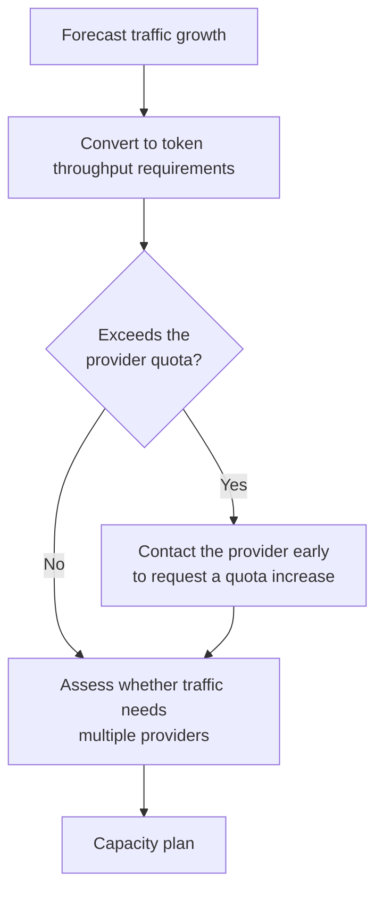
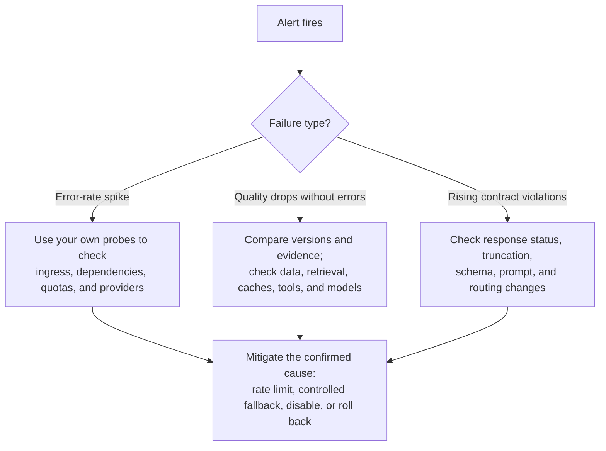

# Chapter 12: SLOs, Capacity Planning, and Incident Response

## 12.1 Define the service’s SLIs before setting SLOs

In Google’s SRE framework, a service level indicator (SLI) is a measurable quantity, a service level objective (SLO) is the team’s target for that indicator, and an error budget is the allowance for outcomes that fall short of the target. Choose SLIs for an LLM service using the observability data in [Chapter 8](../04-evaluation-observability/08-online-observability-tracing.md), accounting for dimensions beyond those commonly measured for traditional APIs:

| SLI category | Common traditional API metrics | Additional considerations for LLM services |
|---|---|---|
| Availability | Request success rate | The same, but distinguish provider 5xx responses from contract validation failures ([Chapter 5](../03-output-safety/05-structured-output-contracts.md)) |
| Latency | Fraction completed within a threshold; latency distribution | First-token latency, pauses between tokens, and total task time; a heartbeat is not the first token |
| Quality | Correctness, data freshness, business completion rate | Structural compliance, factual correctness, and task completion; offline scores are release evidence, not a direct production SLI |
| Cost | Resources consumed per transaction | Total model and tool cost per successful task, usually managed as a separate operational budget |

Traditional services also require correctness and freshness; HTTP 200 has never guaranteed business success. The added difficulty with LLMs is assessing semantic quality immediately. Define the measurement window, eligible-request denominator, and good-event criteria for every SLI. A user request that goes through three retries should count as one end-to-end event. A legitimate refusal need not be a service failure, but a mistaken refusal of a legitimate request should appear in quality metrics. A template fallback must not automatically count as task completion.

## 12.2 Error budgets: quantifying how much failure is acceptable

```python
SLO_TARGETS = {
    "availability_rate": 0.999,          # Fraction of successful requests.
    "latency_under_8s_rate": 0.99,       # 99% of requests complete within 8 seconds.
    "contract_compliance_rate": 0.99,    # Fraction complying with the contract.
}

def error_budget_remaining(
    actual_rates: dict[str, float],
    target_rates: dict[str, float],
    window_requests: int,
) -> dict[str, float]:
    return {
        name: (
            (1 - target_rate) * window_requests
            - (1 - actual_rates[name]) * window_requests
        )
        for name, target_rate in target_rates.items()
    }
```

First express latency as the fraction of good events that meet the threshold. The example assumes all metrics share the same nonzero denominator; in practice, each metric often needs its own good-event and eligible-event counts. The function returns a number of requests, with a negative value indicating that the budget has been exceeded. For example, with 1 million eligible requests over 30 days, a 99.9% target permits 1,000 bad events. If 700 have occurred, 300 remain. A request-based ratio cannot be directly converted into permitted minutes of downtime, and budgets across multiple metrics must not be added together for the same failure.

Product, engineering, and business owners must agree on an error-budget policy in advance; the number alone does not decide when to stop releases. When the budget is exhausted, pause feature changes that add risk, while typically allowing an exception-approval process for security patches and recovery changes. Track budget burn rates over short and long windows to detect ongoing risk instead of looking only at the month-end balance. If guardrail refusal rates rise, first determine whether attacks have increased or legitimate traffic is being rejected.

## 12.3 What is different about capacity planning for LLMs?

Traditional capacity planning focuses on QPS and server counts. LLM services must also account for **provider-side rate limits and quotas—capacity that is often outside the team’s direct control**.



| Planning consideration | Explanation |
|---|---|
| Provider rate limits | Assess in advance whether peak traffic will reach tokens-per-minute (TPM) or requests-per-minute (RPM) limits |
| Traffic distribution across providers | If one provider’s quota cannot support peak traffic, use the routing capabilities in [Chapter 3](../02-request-reliability/03-model-gateway-routing-fallback.md) to split traffic rather than relying on one provider to scale |
| Burst headroom | For predictable peaks such as major promotions or events, arrange temporary quota increases beforehand rather than reacting only after rate limiting starts |
| Compute planning for self-hosted deployments | Measure prefill/decode throughput, KV cache capacity, output-length distributions, and continuous batching; GPU count alone is not enough |

Hosted and self-hosted services have different constraints, but both require measurements of peaks and queuing. In steady state, the average number of in-flight requests is approximately the arrival rate multiplied by average duration—Little’s law. It does not directly give the capacity required to meet a p99 target. Account for model calls per task, retries, shadow traffic, and output tokens against quotas, and reserve headroom for fallback. Load tests should also cover mixtures of long and short requests, cancellation, bursts, and remaining capacity after one deployment fails.

## 12.4 Incident response: diagnostic paths for LLM services



Quality degradation without exceptions is not unique to LLMs. A service may return HTTP 200 with schema-compliant output and still produce incorrect content because of retrieval permissions, stale data, caches, or tool failures. Do not attribute it solely to a model upgrade. This is why [Chapter 8](../04-evaluation-observability/08-online-observability-tracing.md) emphasizes collecting enough metadata—such as model snapshot versions and routing decisions—to support diagnosis.

### 12.4.1 Incident reviews must produce actionable improvements

First limit the damage and establish responsibility for incident command and communication, then retain the minimum necessary evidence. Reconcile actions already executed and compensate where necessary: a configuration rollback does not mean the business has recovered. The review should produce improvements with owners and deadlines, reproducible regression cases, and recovery exercises. Do not relax an SLO merely to silence an alert. A provider status page is only a clue; cross-check it against your own end-to-end probes, version records, and dependency records.

## 12.5 Common mistakes

### 12.5.1 Setting availability and latency SLOs but no quality SLOs

An LLM service returning HTTP 200 does not establish acceptable content quality. Without quality SLIs, a service can appear healthy in reports while its user experience deteriorates unnoticed.

### 12.5.2 Ignoring provider quotas in capacity planning

Even if your own service can handle the traffic, hitting the provider’s rate limit first can cause widespread failures. Teams often miss this constraint in their first capacity plan.

### 12.5.3 Continuing high-risk releases after exhausting the error budget

Pause risk-increasing releases under the agreed error-budget policy and prioritize restoring stability. Exceptions such as security fixes need clear ownership and approval, not ad hoc metric changes to evade the policy.

### 12.5.4 Blaming “model instability” without investigating the cause

Apparent model instability may be only a symptom. The underlying cause might be an unpinned model version, missing quality alerts, or a routing policy that failed to fall back promptly under overload.

## 12.6 Chapter summary

1. **Define SLIs around user-visible success and quality**, with a separate cost budget. Neither HTTP 200 nor a guardrail refusal rate is a direct substitute for completion rate.
2. **Error budgets inform release decisions, but the rules must be agreed in advance**, with exception procedures for security and recovery changes.
3. **Distinguish hosted from self-hosted capacity planning.** Hosted services emphasize provider quotas and fallback headroom; self-hosted services emphasize inference throughput and KV cache capacity. Both must test queuing, bursts, and post-failure capacity.
4. **Quality can deteriorate without reported errors.** Investigate data, retrieval, caches, tools, and models together.
5. **Incident reviews must produce actionable improvements**, such as new regression tests or adjusted alert thresholds, rather than a vague promise to “be more careful next time.”

## References

- [Google SRE Book: Service Level Objectives](https://sre.google/sre-book/service-level-objectives/)
- [Google SRE Workbook: Implementing SLOs](https://sre.google/workbook/implementing-slos/)
- [OpenAI: Rate limits](https://platform.openai.com/docs/guides/rate-limits)
- [Anthropic: Rate limits](https://docs.anthropic.com/en/api/rate-limits)
- [PagerDuty: Incident Response Documentation](https://response.pagerduty.com/)
