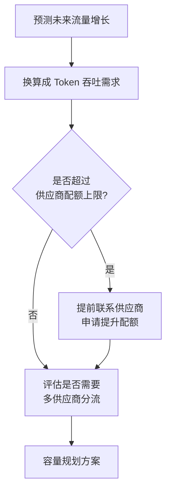
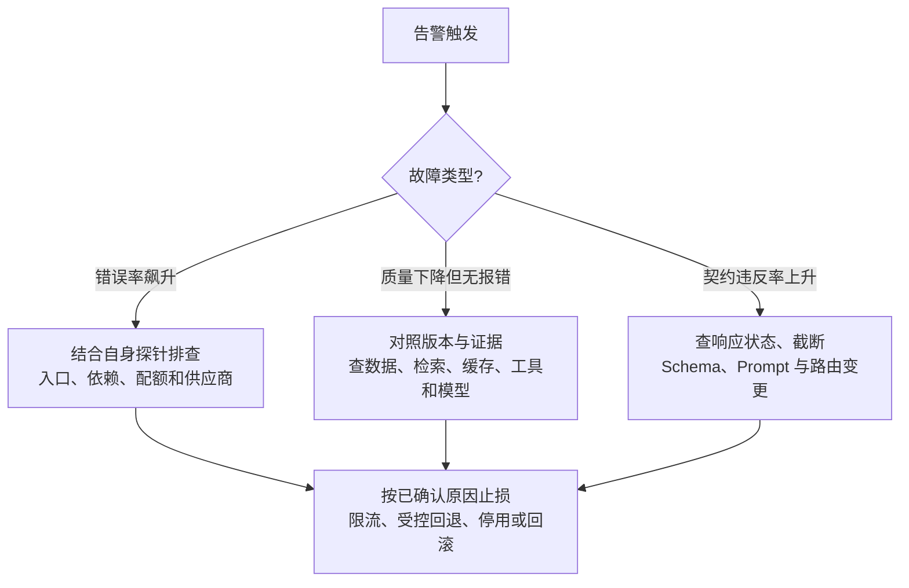

# 第十二章：SLO、容量规划与事故响应

## 12.1 先定义 LLM 服务的 SLI,再谈 SLO

Google SRE 体系里,SLI(服务水平指标)是可以被测量的具体数字,SLO(服务水平目标)是团队对 SLI 设定的目标值,错误预算(error budget)是允许偏离目标的余量。LLM 服务的 SLI 选取需要结合[第 8 章](../04-evaluation-observability/08-online-observability-tracing.zh.md)的可观测性数据,并且比传统 API 多几个特有维度:

| SLI 类别 | 传统 API 常见指标 | LLM 服务额外需要的指标 |
|---|---|---|
| 可用性 | 请求成功率 | 相同,但要区分"供应商 5xx"和"契约校验失败"([第 5 章](../03-output-safety/05-structured-output-contracts.zh.md))两类失败 |
| 延迟 | 阈值内完成比例、延迟分布 | 首 token、token 间停顿与完整任务时间，不能把心跳当 TTFT |
| 质量 | 正确性、数据新鲜度、业务完成率 | 结构合规、事实正确与任务完成；离线分数是发布证据，不直接代表在线 SLI |
| 成本 | 每交易资源开销 | 每成功任务的模型与工具总费用，通常单独作运营预算 |

传统服务也需要正确性和新鲜度，HTTP 200 从来不保证业务成功。LLM 的难点是语义质量较难即时判断。定义 SLI 时写清统计窗口、有效请求分母和好事件标准：一次用户请求经历三次重试应算一个端到端事件；合法拒绝不必算服务故障，但正常用户被误拒应反映在质量指标中。模板兜底不能不加区分地当作任务完成。

## 12.2 错误预算:给"可以承受多少失败"定一个数

```python
SLO_TARGETS = {
    "availability_rate": 0.999,          # 成功请求比例
    "latency_under_8s_rate": 0.99,       # 99% 请求在 8 秒内完成
    "contract_compliance_rate": 0.99,    # 契约合规比例
}

def error_budget_remaining(
    actual_rates: dict[str, float],
    target_rates: dict[str, float],
    window_requests: int,
) -> dict[str, float]:
    return {
        name: (
            (1 - target_rate) * window_requests
            - (1 - actual_rates[name]) * window_requests
        )
        for name, target_rate in target_rates.items()
    }
```

延迟先转换为“满足阈值的好事件比例”。上例假设各指标共享同一非零分母，实际常需按指标分别保存好事件与有效事件数；返回单位是请求数，负数表示透支。假设 30 天有 100 万个有效请求，99.9% 目标允许 1000 个坏事件，已发生 700 个则剩余 300 个。不能把请求比例直接换成允许停机分钟数，也不能把同一失败在多个指标上的预算相加。

错误预算政策需要产品、工程和业务负责人事先约定，数值本身不会自动决定停发。预算耗尽时可暂停增加风险的功能变更，但安全补丁和恢复性变更通常要有例外审批。用短、长窗口的预算燃烧率观察持续风险，避免只看月末余额；护栏拒绝率上升需先判断攻击增多还是正常流量误伤。

## 12.3 容量规划:LLM 场景的特殊之处

传统容量规划关注 QPS 和服务器数量,LLM 场景要额外考虑**供应商侧的速率限制(rate limit)和配额,这部分容量往往不在自己掌控范围内**。



| 容量规划要素 | 说明 |
|---|---|
| 供应商速率限制 | 每分钟 token 数(TPM)、每分钟请求数(RPM)上限,需要提前评估流量高峰是否会触顶 |
| 多供应商分流 | 单一供应商配额不足以支撑峰值流量时,需要[第 3 章](../02-request-reliability/03-model-gateway-routing-fallback.zh.md)的路由能力做流量切分,而非依赖单一供应商扩容 |
| 突发流量缓冲 | 大促、活动等可预期的流量高峰,应提前和供应商沟通临时提额,而不是等触发限流才应对 |
| 自建部署的算力规划 | 测量 prefill/decode 吞吐、KV Cache 容量、输出长度分布与连续批处理，不能只按 GPU 数估算 |

托管与自托管的约束不同，但都要测峰值和排队。稳定状态下，平均在途请求数约为到达率乘平均耗时（Little 定律）；它不直接给出满足 p99 的容量。每任务的模型调用次数、重试、影子流量与输出 token 都要折算进配额，并给回退预留余量。压测还应覆盖长短请求混合、取消、突发以及单部署故障后的剩余容量。

## 12.4 事故响应:LLM 服务特有的排查路径



质量下降但无异常并非 LLM 独有。服务返回 200、Schema 合规，也可能因检索权限、数据新鲜度、缓存或工具失败而生成错误内容；不要仅归因于模型升级。这也是为什么[第 8 章](../04-evaluation-observability/08-online-observability-tracing.zh.md)强调要采集足够的元数据(模型快照版本、路由决策)来支撑这类排查。

### 12.4.1 事后复盘必须产出可执行的改进项

先止损、明确事件指挥与沟通责任，再保留最小必要证据。对已执行动作对账并必要时补偿，配置回滚不代表业务已恢复。复盘应产出带负责人和期限的改进项、可复现的回归用例及恢复演练；不能只为消除报警而放宽 SLO。供应商状态页只是线索，须与自身端到端探针、版本和依赖记录交叉核对。

## 12.5 常见错误

### 12.5.1 只设可用性和延迟 SLO,不设质量 SLO

LLM 服务返回 200 不代表内容质量合格,不设质量类 SLI 会让"服务在报表上健康,但用户体验在下降"的情况长期被忽视。

### 12.5.2 容量规划没有考虑供应商侧配额

自己的服务能扛住流量,但供应商的速率限制先被打满,一样会导致大规模失败,这是很多团队第一次做容量规划时会漏掉的一环。

### 12.5.3 错误预算耗尽后仍然按原计划发布高风险变更

按事先约定的错误预算政策暂停增加风险的发布，优先恢复稳定性；安全修复等例外需明确责任人与审批，而不是临时改指标逃避约束。

### 12.5.4 事故复盘只归因到"模型不稳定",不深挖具体原因

模型不稳定可能只是表象,真正原因可能是没有锁定模型版本、没有设置质量类告警,或者是路由策略在过载时没有及时回退。

## 12.6 本章总结

1. **SLI 围绕用户可见的成功与质量定义**，成本另设预算，不以 HTTP 200 或护栏拒绝率直接代替完成率;
2. **错误预算为发布提供依据，执行规则需事先约定**，并保留安全与恢复变更的例外流程;
3. **容量规划要区分托管与自托管**：前者关注供应商配额和回退余量，后者关注推理吞吐与 KV Cache；两者都要验证排队、突发和故障后的容量;
4. **质量下降不一定有报错**，需要同时排查数据、检索、缓存、工具和模型;
5. **事故复盘必须产出可执行的改进项**,包括新增回归测试、调整告警阈值等,而非空泛的"下次注意"。

## 参考资料

- [Google SRE Book: Service Level Objectives](https://sre.google/sre-book/service-level-objectives/)
- [Google SRE Workbook: Implementing SLOs](https://sre.google/workbook/implementing-slos/)
- [OpenAI: Rate limits](https://platform.openai.com/docs/guides/rate-limits)
- [Anthropic: Rate limits](https://docs.anthropic.com/en/api/rate-limits)
- [PagerDuty: Incident Response Documentation](https://response.pagerduty.com/)
