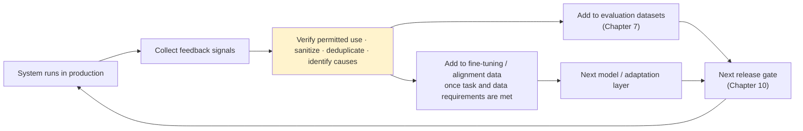
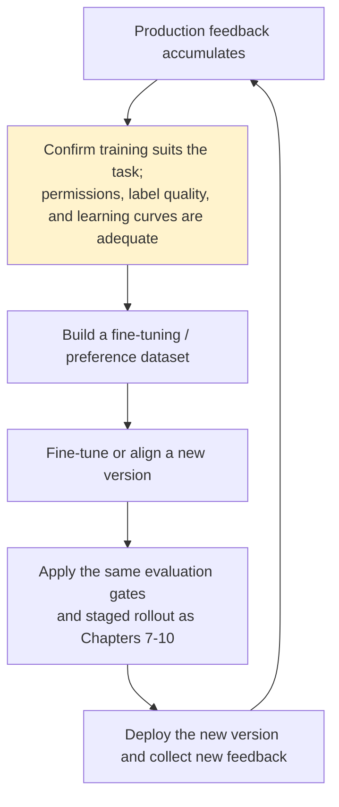

# Chapter 13: Feedback Loops and the Data Flywheel

## 13.1 Feedback ends one production cycle and starts the next

Return to the architecture overview in [Chapter 2](../01-foundations/02-production-architecture-overview.md). Every stage ultimately feeds into feedback collection, and the resulting data returns to evaluation and training datasets as the starting point for the next iteration. **The goal is not to add another component, but to connect the evaluation, release, and training-data entry points established across Chapters 7–12.**



## 13.2 Sources of feedback: explicit and implicit signals

| Type | Signals | Characteristics |
|---|---|---|
| **Explicit feedback** | Thumbs up/down, human corrections to answers, reasons for support escalation | Clear intent, but low coverage because most users do not volunteer feedback |
| **Implicit feedback** | Rephrasing or follow-up questions, abandoning a conversation, editing an answer immediately after copying it | Higher coverage, but interpreting the behavior requires additional logic before it becomes a quality signal |

```python
def infer_implicit_signal(session_events: list[dict]) -> str | None:
    if not session_events:
        return None
    if session_events[-1]["type"] == "abandon_within_5s":
        return "likely_dissatisfied"
    if count_rephrase_attempts(session_events) >= 2:
        return "likely_answer_not_helpful"
    return None
```

Explicit feedback has self-selection bias, but not necessarily toward overestimating satisfaction: highly dissatisfied users may also be more likely to respond. A user may leave because they already have the answer, and a follow-up may indicate progress. The example above can only produce signals for review, not automatic negative labels. Report feedback coverage, denominators, and user strata, and use human review of a random sample to include users who give no feedback. Behavioral instrumentation itself also needs a clear purpose and collection limits.

## 13.3 From feedback to evaluation data: the short iteration cycle

This cycle connects directly to [Chapter 7](../04-evaluation-observability/07-offline-eval-eval-driven-development.md) and is the quickest, least expensive way to use feedback:

1. Associate feedback with a specific trace ID and the version snapshot used at the time ([Chapter 9](../05-release-pipeline/09-prompt-model-data-versioning.md)).
2. Sanitize it and triage it by root cause into the appropriate test-set slice, such as `金额计算错误` (incorrect monetary calculation) or `语气生硬` (an abrupt tone).
3. After human confirmation, add it to the golden dataset as a new regression case for that slice.
4. Cover that scenario automatically in the next release evaluation.

This short cycle does not require model training. The fix may belong in retrieval, tools, data, or authorization code rather than always in the prompt. Use different evidence to discover a problem and to demonstrate that it has been fixed. A regression case derived from a failure is valuable, but it cannot go into both the training set and an independent holdout set. Also keep near-duplicate examples associated with the same users, documents, and conversations from leaking across those sets.

## 13.4 From feedback to training data: the longer cycle, or data flywheel

Once feedback data has accumulated and short-cycle prompt adjustments no longer improve a particular task, consider a more substantial intervention: fine-tuning or preference alignment with the collected data, such as RLHF or DPO (see [LLM · Training and Alignment](../../llm/02-training-alignment/README.md)).



There is no universal threshold of “a few thousand to tens of thousands of examples is enough for fine-tuning.” Begin with small experiments and learning curves, comparing gains from training with gains from prompt, retrieval, or tool fixes. Preference pairs must correspond to the same task and context. Verify that the preference reflects answer quality rather than differences in version, exposure, or user population. Model-generated answers must not become factual labels without verification.

Feedback is available only for answers that were actually shown, and routing and recommendation policies change the observable data distribution. Repeatedly training on the system’s own high-scoring outputs can amplify existing biases and lead it to forget long-tail tasks. Retain representative samples with permission for their use, long-term holdouts, and any necessary controlled exploration. Monitor performance across slices rather than using an overall thumbs-up rate to tell a story of an ever-improving flywheel.

## 13.5 Governing feedback use

Feedback is user data. Its governance follows the same principles as the trace-data controls in [Chapter 8](../04-evaluation-observability/08-online-observability-tracing.md):

| Governance requirement | Explanation |
|---|---|
| Sanitization | Feedback may contain raw user input; sanitize it before adding it to a dataset |
| Deduplication and abuse detection | Prevent repeated downvotes or malicious score manipulation by a few users from distorting the signal |
| Permission to use data | Specify the purpose, applicable legal basis, contractual terms, and user rights; a general user agreement or sanitization does not automatically authorize training |
| Lineage and deletion | Trace feedback through annotations, datasets, indexes, summaries, and training versions; record retention periods, deletion propagation, and model effects that cannot be directly undone |
| No direct behavior change from a single feedback item | One user correction must not rewrite the system prompt or authorization policy without review; it must go through triage and validation |

## 13.6 Common mistakes

### 13.6.1 Tracking only explicit feedback, such as thumbs-up rates

Explicit feedback has self-selection bias, and implicit feedback can also be misinterpreted. Combine human labels from sampled cases, task outcomes, and several types of signals rather than equating any single behavior directly with satisfaction.

### 13.6.2 Collecting feedback without using it in evaluation or training

Feedback should lead to a clear decision: fix the system, update a regression case, use it for training with the necessary permission, or delete it because of privacy or purpose restrictions. Not every feedback item is worth retaining. What matters is that someone identifies the cause and decides what to do, rather than merely accumulating likes.

### 13.6.3 Rushing into fine-tuning before the data is adequate

First determine whether the error truly comes from a model capability gap that training can address. Authorization errors, API failures, and stale data should be fixed in the responsible systems. Fine-tuning without enough reliable labels may teach the model noise. Compare small-scale learning curves with other fixes rather than deciding solely by example count.

### 13.6.4 Sending uncleaned raw feedback directly into training

The model may learn noise, manipulated ratings, and even adversarial examples, reducing rather than improving quality.

### 13.6.5 Letting one feedback item directly rewrite system behavior

Changing a prompt or authorization policy in response to one correction without triage and validation can be exploited, or may simply address an isolated case rather than a general problem.

## 13.7 Chapter summary

1. **Feedback completes the production cycle and starts the next iteration.** It is not another technical component, but a way to connect the existing stages.
2. **Both explicit and implicit feedback are biased.** Higher coverage does not mean more accurate labels.
3. **The short cycle first turns feedback into reproducible problems and fixes.** Changes may involve prompts, routing, retrieval, tools, authorization, or processes; model training is not a prerequisite.
4. **Using feedback for training requires a suitable task, permission, reliable labels, and independent evaluation.** There is no universal example-count threshold.
5. **Feedback data needs the same controls as trace data:** sanitization, deduplication, permission for use, and no direct change to system behavior from an unvalidated feedback item.

## References

- [OpenAI: Fine-tuning](https://platform.openai.com/docs/guides/fine-tuning)
- [Anthropic: Constitutional AI and RLHF](https://www.anthropic.com/research/constitutional-ai-harmlessness-from-ai-feedback)
- [LangSmith: Attach user feedback](https://docs.langchain.com/langsmith/attach-user-feedback)
- [Netflix Tech Blog: Recommendation systems and the data flywheel](https://netflixtechblog.com/artwork-personalization-c589f074ad76)
- [Google: People + AI Guidebook - Feedback + Control](https://pair.withgoogle.com/guidebook/)
