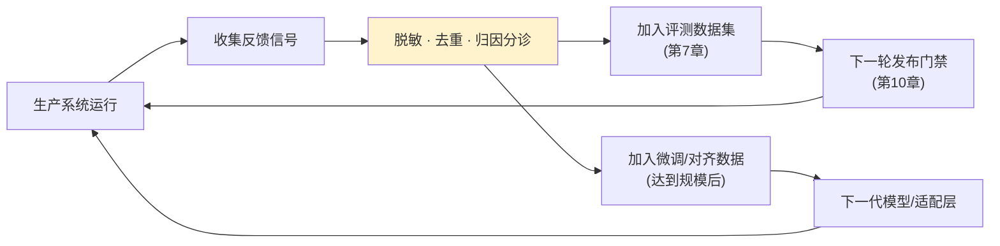
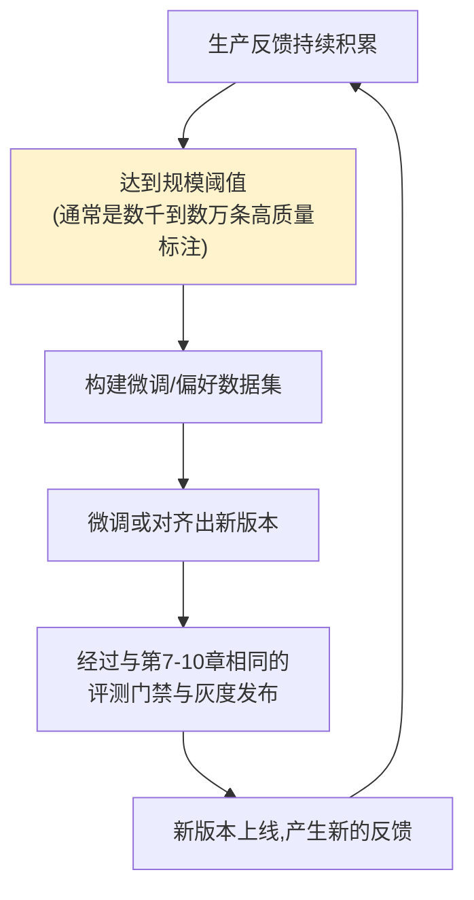

# 第十三章：反馈闭环与数据飞轮

## 13.1 反馈闭环是整个生产架构图的最后一环,也是第一环

回到[第 2 章](../01-foundations/02-production-architecture-overview.md)的架构全景图:所有环节最终都指向反馈闭环,而反馈闭环产出的数据又重新流回评测集和训练数据,成为下一轮迭代的起点。**这一章讲的不是新的技术组件,而是怎么让第 7–12 章建立起来的各个环节真正首尾相连,形成飞轮。**



## 13.2 反馈信号的来源:显式与隐式

| 类型 | 信号 | 特点 |
|---|---|---|
| **显式反馈** | 点赞/点踩、人工纠正答案、客服转接原因 | 意图明确,但覆盖率低(多数用户不会主动反馈) |
| **隐式反馈** | 重新提问/追问、会话中途放弃、复制答案后立刻编辑 | 覆盖率高,但需要额外的行为解读逻辑才能转化成质量信号 |

```python
def infer_implicit_signal(session_events: list[dict]) -> str | None:
    if session_events[-1]["type"] == "abandon_within_5s":
        return "likely_dissatisfied"
    if count_rephrase_attempts(session_events) >= 2:
        return "likely_answer_not_helpful"
    return None
```

单纯统计"点赞率"通常会高估满意度——因为愿意主动点赞的往往是已经满意的用户,不满意的用户更倾向于直接离开而不留反馈。**隐式信号的价值恰恰在于补上这个盲区。**

## 13.3 从反馈到评测集:短周期闭环

这一层闭环与[第 7 章](../04-evaluation-observability/07-offline-eval-eval-driven-development.md)直接衔接,是响应最快、成本最低的反馈利用方式:

1. 反馈关联到具体的 Trace ID 和当时的版本快照([第 9 章](../05-release-pipeline/09-prompt-model-data-versioning.md));
2. 脱敏后按根因分诊到对应的测试集切片(如 `金额计算错误`、`语气生硬`);
3. 人工确认后加入黄金测试集,成为该切片的新增回归用例;
4. 下一次发布评测时自动覆盖该场景。

**这个短周期闭环不需要任何模型训练,纯靠 Prompt 和路由调整就能持续修复问题**,是大多数团队应该优先建立的能力。

## 13.4 从反馈到训练数据:长周期闭环(数据飞轮)

当反馈数据积累到一定规模,且短周期的 Prompt 调整已经无法进一步提升某类任务的表现时,才需要考虑更重的手段——用积累的数据做微调或偏好对齐(RLHF/DPO,见 [LLM · 训练与对齐](../../llm/02-training-alignment/README.md))。



**数据飞轮的关键前提是"规模阈值"和"数据质量",不是"有反馈就直接拿去微调"。** 未经清洗、未经去重、未经归因分诊的原始反馈直接用于训练,很容易把噪声甚至对抗性输入也学进模型里。

## 13.5 反馈闭环的治理边界

反馈数据本质上也是用户数据,治理边界和[第 8 章](../04-evaluation-observability/08-online-observability-tracing.md)讲的 Trace 数据边界原则一致:

| 治理要求 | 说明 |
|---|---|
| 脱敏 | 反馈中可能包含用户输入的原始内容,进入数据集前需要脱敏 |
| 去重与滥用检测 | 防止少数用户的重复点踩或恶意刷分扭曲信号 |
| 数据授权 | 用于训练的反馈数据需要明确的用户协议授权,不能默认所有生产数据都能拿去训练 |
| 不能让单次反馈直接改变系统行为 | 用户的一次纠正不应该未经审核就直接改写系统 Prompt 或权限策略,必须经过分诊和验证 |

## 13.6 常见错误

### 13.6.1 只统计显式反馈(点赞率),忽视隐式信号

显式反馈天然被幸存者偏差影响,只看点赞率容易得出"用户很满意"的错误结论。

### 13.6.2 反馈收集了但从不真正回流到评测集或训练数据

收集反馈却不用来更新测试集或微调数据,反馈闭环就是摆设,见[第 2 章](../01-foundations/02-production-architecture-overview.md)的常见错误。

### 13.6.3 数据量不够就急着上微调

短周期的 Prompt/路由调整往往已经能解决大部分问题,数据规模不足、质量不稳定的情况下直接上微调,投入产出比很低,且容易过拟合到少量噪声样本。

### 13.6.4 未经清洗的原始反馈直接进入训练数据

会把噪声、恶意刷分甚至对抗性样本一起学进模型,损害而非提升模型质量。

### 13.6.5 让单次用户反馈直接改写系统行为

一次纠正没有经过分诊和验证就直接改 Prompt 或权限策略,可能被恶意利用,也可能只是个例而非普遍问题。

## 13.7 本章总结

1. **反馈闭环是整个生产架构的收尾环节,也是下一轮迭代的起点**,不是新增技术组件,而是让已有环节真正首尾相连;
2. **反馈分显式和隐式两类**,隐式信号覆盖率更高,能补上"不满意的用户往往不会主动反馈"这个盲区;
3. **短周期闭环(反馈→评测集)是大多数团队应优先建立的能力**,不需要训练,靠 Prompt/路由调整就能持续见效;
4. **长周期闭环(数据飞轮,反馈→训练数据)需要规模和质量前提**,不是"有反馈就直接拿去微调";
5. **反馈数据的治理边界和 Trace 数据一致**:脱敏、去重、授权,且不能让单次反馈未经验证直接改变系统行为。

> **一句话概括:数据飞轮转起来的前提,不是收集了多少反馈,而是有没有把反馈经过脱敏、分诊、验证之后,真正喂回评测集和训练数据,让每一轮生产运行都比上一轮更懂自己的用户。**

## 参考资料

- [OpenAI: Fine-tuning](https://platform.openai.com/docs/guides/fine-tuning)
- [Anthropic: Constitutional AI and RLHF](https://www.anthropic.com/research/constitutional-ai-harmlessness-from-ai-feedback)
- [LangSmith: Attach user feedback](https://docs.langchain.com/langsmith/attach-user-feedback)
- [Netflix Tech Blog: Recommendation systems and the data flywheel](https://netflixtechblog.com/artwork-personalization-c589f074ad76)
- [Google: People + AI Guidebook - Feedback + Control](https://pair.withgoogle.com/guidebook/)
