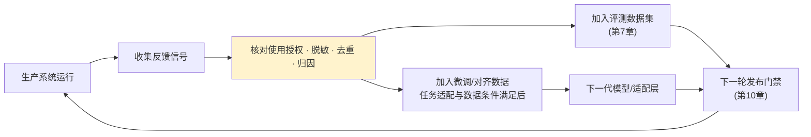
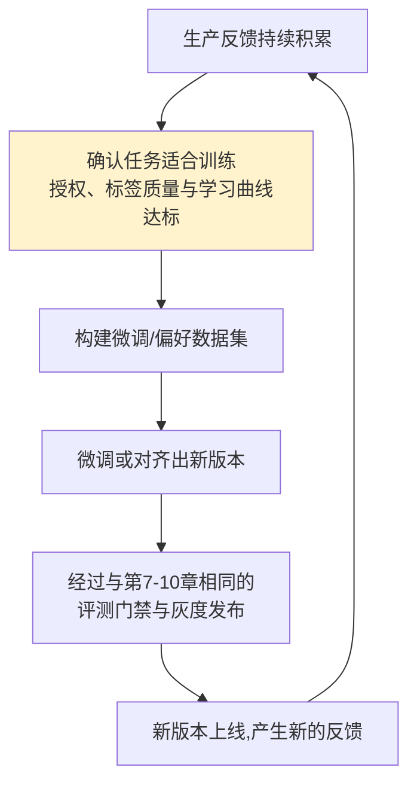

# 第十三章：反馈闭环与数据飞轮

## 13.1 反馈闭环是整个生产架构图的最后一环,也是第一环

回到[第 2 章](../01-foundations/02-production-architecture-overview.zh.md)的架构全景图:所有环节最终都指向反馈闭环,而反馈闭环产出的数据又重新流回评测集和训练数据,成为下一轮迭代的起点。**这里不是再加一个新组件,而是把第 7–12 章那些已经搭好的评测、发布和训练数据入口真正接起来。**



## 13.2 反馈信号的来源:显式与隐式

| 类型 | 信号 | 特点 |
|---|---|---|
| **显式反馈** | 点赞/点踩、人工纠正答案、客服转接原因 | 意图明确,但覆盖率低(多数用户不会主动反馈) |
| **隐式反馈** | 重新提问/追问、会话中途放弃、复制答案后立刻编辑 | 覆盖率高,但需要额外的行为解读逻辑才能转化成质量信号 |

```python
def infer_implicit_signal(session_events: list[dict]) -> str | None:
    if not session_events:
        return None
    if session_events[-1]["type"] == "abandon_within_5s":
        return "likely_dissatisfied"
    if count_rephrase_attempts(session_events) >= 2:
        return "likely_answer_not_helpful"
    return None
```

显式反馈存在自选择偏差，方向不一定是高估：强烈不满的用户也可能更愿意反馈。离开可能因为已经得到答案，追问也可能表示任务有进展；上例只能产生待复核信号，不能直接生成负标签。报告反馈覆盖率、分母和用户分层，用随机抽样人工评审补足沉默用户；行为埋点本身也需要明确用途与采集边界。

## 13.3 从反馈到评测集:短周期闭环

这一层闭环与[第 7 章](../04-evaluation-observability/07-offline-eval-eval-driven-development.zh.md)直接衔接,是响应最快、成本最低的反馈利用方式:

1. 反馈关联到具体的 Trace ID 和当时的版本快照([第 9 章](../05-release-pipeline/09-prompt-model-data-versioning.zh.md));
2. 脱敏后按根因分诊到对应的测试集切片(如 `金额计算错误`、`语气生硬`);
3. 人工确认后加入黄金测试集,成为该切片的新增回归用例;
4. 下一次发布评测时自动覆盖该场景。

短周期闭环不必训练模型，但修复可能落在检索、工具、数据或权限代码，而非总是改 Prompt。发现问题与证明修复要用不同证据：从失败案例生成的回归用例有价值，却不能同时进入训练集和独立留出集，近重复用户、文档与会话也要隔离。

## 13.4 从反馈到训练数据:长周期闭环(数据飞轮)

当反馈数据积累到一定规模,且短周期的 Prompt 调整已经无法进一步提升某类任务的表现时,才需要考虑更重的手段——用积累的数据做微调或偏好对齐(RLHF/DPO,见 [LLM · 训练与对齐](../../llm/02-training-alignment/README.zh.md))。



没有通用的「数千到数万条即可微调」门槛。先做小规模实验和学习曲线，比较训练收益与 Prompt、检索、工具修复的收益。偏好对要对应相同任务与上下文，并确认差异来自答案质量而不是版本、曝光和用户群；模型生成的答案不能未经核验当作事实标签。

反馈只来自已展示答案，路由和推荐策略会改变可观察的数据分布。反复用自身高分输出训练可能放大已有偏差并遗忘长尾任务。保留经授权的代表性样本、长期留出集和必要的受控探索，监控不同切片的性能，而非只看总体点赞率形成「飞轮变好」的叙事。

## 13.5 反馈闭环的治理边界

反馈数据也是用户数据,治理边界和[第 8 章](../04-evaluation-observability/08-online-observability-tracing.zh.md)讲的 Trace 数据边界原则一致:

| 治理要求 | 说明 |
|---|---|
| 脱敏 | 反馈中可能包含用户输入的原始内容,进入数据集前需要脱敏 |
| 去重与滥用检测 | 防止少数用户的重复点踩或恶意刷分扭曲信号 |
| 数据授权 | 明确目的、适用法律依据、合同与用户权利；一份笼统用户协议或脱敏处理不自动授权训练 |
| 血缘与删除 | 从反馈追踪到标注、数据集、索引、摘要和训练版本，记录保留期、删除传播及无法直接撤销的模型影响 |
| 不能让单次反馈直接改变系统行为 | 用户的一次纠正不应该未经审核就直接改写系统 Prompt 或权限策略,必须经过分诊和验证 |

## 13.6 常见错误

### 13.6.1 只统计显式反馈(点赞率),忽视隐式信号

显式反馈有自选择偏差，隐式反馈也会误判。应组合抽样人工标签、任务结果和多类信号，而不是把某一种行为直接等同满意度。

### 13.6.2 反馈收集了但从不真正回流到评测集或训练数据

反馈应进入明确的处理决定：修复系统、更新回归用例、经授权用于训练，或因隐私与用途限制删除。并非每条反馈都值得保存，关键是有人归因和处置，而不是只积累点赞数。

### 13.6.3 数据量不够就急着上微调

先定位错误是否真的来自模型可训练的能力缺口。权限错误、接口故障或数据过期应修对应系统；可靠标签不足时直接微调，还可能学到噪声。比较小规模学习曲线与其他修复方案，不能仅按数据条数决定。

### 13.6.4 未经清洗的原始反馈直接进入训练数据

会把噪声、恶意刷分甚至对抗性样本一起学进模型,损害而非提升模型质量。

### 13.6.5 让单次用户反馈直接改写系统行为

一次纠正没有经过分诊和验证就直接改 Prompt 或权限策略,可能被恶意利用,也可能只是个例而非普遍问题。

## 13.7 本章总结

1. **反馈闭环是整个生产架构的收尾环节,也是下一轮迭代的起点**,不是新增技术组件,而是让已有环节真正首尾相连;
2. **显式与隐式反馈都有偏差**，覆盖率更高不代表标签更准确;
3. **短周期闭环先把反馈变成可复现的问题与修复**，改动可能在 Prompt、路由，也可能在检索、工具、权限或流程，不必先训练模型;
4. **反馈进入训练需有任务适配、授权、可靠标签和独立评测**，不存在通用数量门槛;
5. **反馈数据的治理边界和 Trace 数据一致**:脱敏、去重、授权,且不能让单次反馈未经验证直接改变系统行为。

## 参考资料

- [OpenAI: Fine-tuning](https://platform.openai.com/docs/guides/fine-tuning)
- [Anthropic: Constitutional AI and RLHF](https://www.anthropic.com/research/constitutional-ai-harmlessness-from-ai-feedback)
- [LangSmith: Attach user feedback](https://docs.langchain.com/langsmith/attach-user-feedback)
- [Netflix Tech Blog: Recommendation systems and the data flywheel](https://netflixtechblog.com/artwork-personalization-c589f074ad76)
- [Google: People + AI Guidebook - Feedback + Control](https://pair.withgoogle.com/guidebook/)
