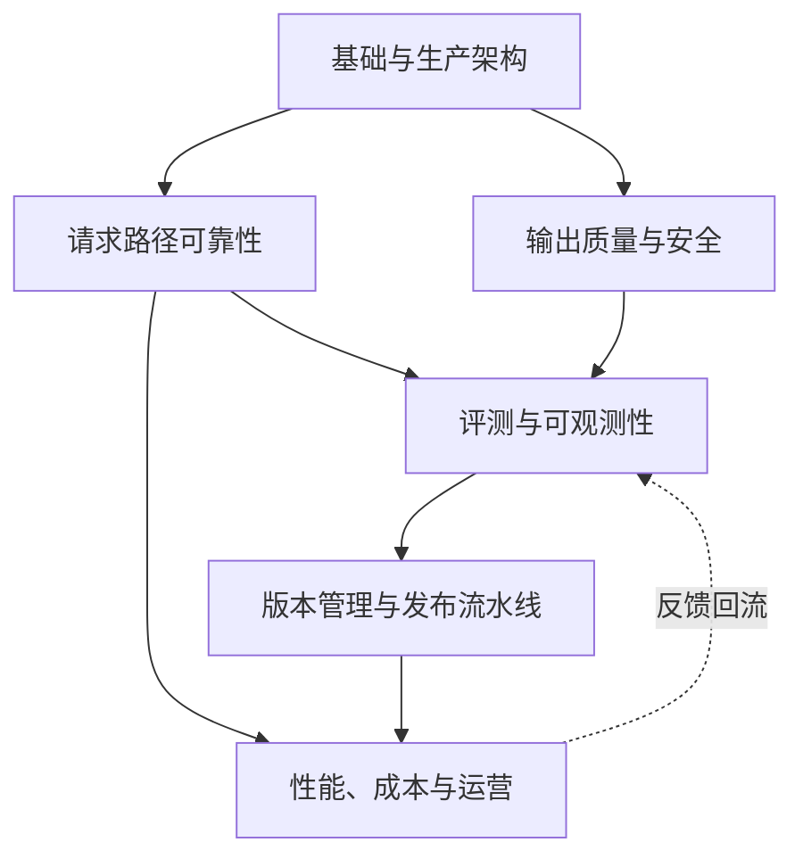

# AI Engineering / LLMOps 相关知识点

本主题位于应用架构层之上、贯穿整个生产生命周期，回答一个问题：**一个 LLM 应用从「跑通 Demo」到「稳定服务真实流量」之间，缺的是什么工程能力**。它不讲怎么训练模型（那是 [LLM](../llm/README.md) 的事），也不讲怎么搭 Agent/RAG 架构（那是 [Agent](../agent/README.md)、[RAG](../rag/README.md) 的事），而是讲这些系统上线后如何被路由、评测、观测、发布、限流降级、控成本、扛事故、持续用反馈改进——这套围绕「已经存在的模型」展开的生产工程实践，通常被称为 **LLMOps**。

内容基线为 2026-08-31，主要依据一手论文、模型厂商官方文档（OpenAI、Anthropic、Google）以及大公司生产实践（Netflix、Uber、Stripe、Google SRE 等）。

## 子模块

1. [基础与生产架构（第 1–2 章）](01-foundations/README.md)
2. [请求路径可靠性（第 3–4 章）](02-request-reliability/README.md)
3. [输出质量与安全（第 5–6 章）](03-output-safety/README.md)
4. [评测与可观测性（第 7–8 章）](04-evaluation-observability/README.md)
5. [版本管理与发布流水线（第 9–10 章）](05-release-pipeline/README.md)
6. [性能、成本与运营（第 11–13 章）](06-performance-operations/README.md)

## 模块关系

「请求路径可靠性」和「输出质量与安全」是同一层的两个侧面——前者管「这次调用能不能打通」，后者管「打通之后的结果能不能信」；两者共同产生的信号，是「评测与可观测性」的原料，评测结果又反过来决定「版本管理与发布流水线」能不能放行一次变更，最终在「性能、成本与运营」里稳定运行，并把线上反馈重新喂回评测环节，构成闭环。

## LLMOps、MLOps、DevOps 的边界（导读）

三者常被混用，但关注点并不相同，详见 [第一章](01-foundations/01-llmops-vs-mlops-devops.md)：

| | 核心资产 | 典型问题 |
|---|---|---|
| **DevOps** | 应用代码 | 怎么把代码可靠地构建、测试、发布到生产 |
| **MLOps** | 训练出的模型权重 | 怎么管理数据、训练、评估、部署「自己训出来的模型」 |
| **LLMOps** | 对第三方/自研基础模型的调用 | 怎么管理 Prompt、路由、评测、成本和「模型不是你训的」这个前提下的可靠性 |

## 与现有主题的关系

本主题不重复展开已经讲过的内容，只做交叉引用：

| 概念 | 详解归属 | 本主题引用点 |
|---|---|---|
| 模型部署、批处理、KV Cache、量化 | [LLM · 推理与部署](../llm/03-inference-serving/README.md) | [第 11 章](06-performance-operations/11-caching-batching-throughput-cost.md)只讲应用层的缓存与批处理策略，不重复推理引擎内部机制 |
| LLM 网关的七项核心能力与选型 | [Tools · 传输与网关](../tools/05-transport-gateway/README.md) | [第 3 章](02-request-reliability/03-model-gateway-routing-fallback.md)聚焦路由策略与回退设计，网关本身怎么搭建见 Tools |
| LangSmith 生产质量闭环的具体实现 | [LangChain · 生产实践](../frameworks/01-langchain/05-production/README.md) | [第 8 章](04-evaluation-observability/08-online-observability-tracing.md)讲厂商中立的可观测性模型，LangSmith 是其中一种落地 |
| Agent 评估与安全 | [Agent · 评估与安全](../agent/05-production/README.md) | [第 7 章](04-evaluation-observability/07-offline-eval-eval-driven-development.md)讲通用的评测方法论，Agent 特有的工具调用/多轮评估见 Agent |
| 通用能力评测指标（MMLU 等） | [LLM · 评测与选型](../llm/05-evaluation-selection/README.md) | [第 7 章](04-evaluation-observability/07-offline-eval-eval-driven-development.md)讲业务侧评测流程，学术 Benchmark 见 LLM |

## 阅读建议

- **第一次接触 LLMOps**：基础与生产架构 → 评测与可观测性 → 版本管理与发布流水线；
- **正在为线上事故背锅**：请求路径可靠性 → 输出质量与安全 → 性能、成本与运营；
- **要建立评测/发布体系**：评测与可观测性 → 版本管理与发布流水线；
- **要做成本与容量治理**：性能、成本与运营，配合 [LLM · 推理与部署](../llm/03-inference-serving/README.md)一起看。

返回[文档主题索引](../README.md)。
