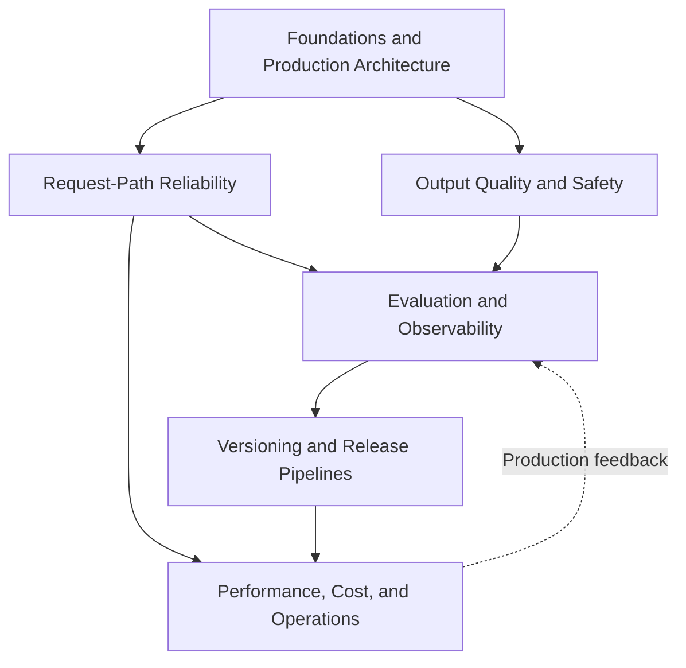

# AI Engineering / LLMOps

This topic follows an application through its production lifecycle to answer one question: **what engineering capabilities does an LLM application need to move from a working demo to reliably serving real traffic?** LLMOps can include training and self-hosting; here the focus is request management, evaluation, observability, releases, costs, incidents, and feedback. For training methods, see [LLM](../llm/README.md); for application architecture, see [Agent](../agent/README.md) and [RAG](../rag/README.md).

Example thresholds are not industry standards, and model snapshots are not model-selection recommendations. Established distributed-systems methods are discussed separately from the additional constraints of generative applications.

## Modules

1. [Foundations and Production Architecture (Chapters 1–2)](01-foundations/README.md)
2. [Request-Path Reliability (Chapters 3–4)](02-request-reliability/README.md)
3. [Output Quality and Safety (Chapters 5–6)](03-output-safety/README.md)
4. [Evaluation and Observability (Chapters 7–8)](04-evaluation-observability/README.md)
5. [Versioning and Release Pipelines (Chapters 9–10)](05-release-pipeline/README.md)
6. [Performance, Cost, and Operations (Chapters 11–13)](06-performance-operations/README.md)

## How the modules relate

Request-Path Reliability and Output Quality and Safety address two aspects of the same layer: whether a call can complete, and whether its result can be trusted. Their signals feed Evaluation and Observability. Evaluation results then determine whether Versioning and Release Pipelines can approve a change. Performance, Cost, and Operations keeps the deployed system running reliably and feeds production feedback back into evaluation.

## LLMOps, MLOps, and DevOps: a guide to their scope

These terms are often used interchangeably, but they emphasize different concerns. See [Chapter 1](01-foundations/01-llmops-vs-mlops-devops.md):

| | Core assets | Typical question |
|---|---|---|
| **DevOps** | Application code | How do we reliably build, test, and deploy code to production? |
| **MLOps** | Data, models, and ML pipelines | How do we manage data, training, evaluation, serving, and distribution shifts—not only for models we train ourselves? |
| **LLMOps** | Models, prompts, context, tools, and routing | How do we extend existing engineering practices to handle open-ended quality, nondeterministic generation, and limits on execution, for both hosted and self-hosted systems? |

## Relationship to other topics

Material covered elsewhere is cross-referenced rather than repeated:

| Concept | Detailed coverage | How this topic uses it |
|---|---|---|
| Model deployment, batching, KV caching, quantization | [LLM · Inference and Serving](../llm/03-inference-serving/README.md) | [Chapter 11](06-performance-operations/11-caching-batching-throughput-cost.md) covers application-level caching and batching strategies without repeating inference-engine internals |
| The seven core LLM gateway capabilities and gateway selection | [Tools · Transport and Gateways](../tools/05-transport-gateway/README.md) | [Chapter 3](02-request-reliability/03-model-gateway-routing-fallback.md) focuses on routing policies and fallback design; building the gateway itself is covered in Tools |
| Implementing the LangSmith production quality feedback loop | [LangChain · Production Practices](../frameworks/01-langchain/05-production/README.md) | [Chapter 8](04-evaluation-observability/08-online-observability-tracing.md) presents a vendor-neutral observability model; LangSmith is one implementation |
| Agent evaluation and safety | [Agent · Evaluation and Safety](../agent/05-production/README.md) | [Chapter 7](04-evaluation-observability/07-offline-eval-eval-driven-development.md) covers general evaluation methods; agent-specific tool-call and multi-turn evaluation are covered in Agent |
| General-capability evaluation metrics such as MMLU | [LLM · Evaluation and Model Selection](../llm/05-evaluation-selection/README.md) | [Chapter 7](04-evaluation-observability/07-offline-eval-eval-driven-development.md) covers application evaluation workflows; academic benchmarks are covered in LLM |

## Suggested reading paths

- **New to LLMOps:** Foundations and Production Architecture → Evaluation and Observability → Versioning and Release Pipelines.
- **Responsible for production incidents:** Request-Path Reliability → Output Quality and Safety → Performance, Cost, and Operations.
- **Building evaluation and release processes:** Evaluation and Observability → Versioning and Release Pipelines.
- **Managing cost and capacity:** Performance, Cost, and Operations, alongside [LLM · Inference and Serving](../llm/03-inference-serving/README.md).

For interview preparation, follow one concrete request: does a timeout mean the action was not executed? Does valid JSON authorize placing an order? Is a higher average score enough to approve a release? Does the fallback model satisfy data-residency requirements? Can rollback undo actions already taken? Explain denominators, versions, permissions, and failure handling rather than merely naming components. If you lack real project experience, present an example as a design proposal or experiment; do not claim this topic’s example numbers as personal achievements.

Return to the [documentation topic index](../README.md).
