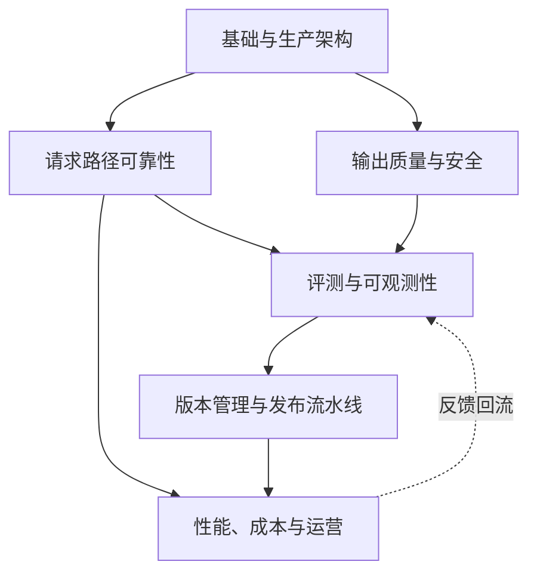

# AI Engineering / LLMOps 相关知识点

本主题贯穿应用的生产生命周期，回答一个问题：**一个 LLM 应用从「跑通 Demo」到「稳定服务真实流量」之间，缺的是什么工程能力**。LLMOps 可以涉及训练与自托管，本主题则聚焦请求治理、评测、观测、发布、成本、事故与反馈。训练方法见 [LLM](../llm/README.zh.md)，应用架构见 [Agent](../agent/README.zh.md) 与 [RAG](../rag/README.zh.md)。

示例阈值不是行业标准，模型快照不代表选型推荐；经典分布式系统方法与生成式应用的额外约束分开讨论。

## 子模块

1. [基础与生产架构（第 1–2 章）](01-foundations/README.zh.md)
2. [请求路径可靠性（第 3–4 章）](02-request-reliability/README.zh.md)
3. [输出质量与安全（第 5–6 章）](03-output-safety/README.zh.md)
4. [评测与可观测性（第 7–8 章）](04-evaluation-observability/README.zh.md)
5. [版本管理与发布流水线（第 9–10 章）](05-release-pipeline/README.zh.md)
6. [性能、成本与运营（第 11–13 章）](06-performance-operations/README.zh.md)

## 模块关系

「请求路径可靠性」和「输出质量与安全」是同一层的两个侧面——前者管「这次调用能不能打通」，后者管「打通之后的结果能不能信」；两者共同产生的信号，是「评测与可观测性」的原料，评测结果又反过来决定「版本管理与发布流水线」能不能放行一次变更，最终在「性能、成本与运营」里稳定运行，并把线上反馈重新喂回评测环节，构成闭环。

## LLMOps、MLOps、DevOps 的边界（导读）

三者常被混用，但关注点并不相同，详见 [第一章](01-foundations/01-llmops-vs-mlops-devops.zh.md)：

| | 核心资产 | 典型问题 |
|---|---|---|
| **DevOps** | 应用代码 | 怎么把代码可靠地构建、测试、发布到生产 |
| **MLOps** | 数据、模型与 ML 流水线 | 管理数据、训练、评估、服务和分布漂移，不限于自训模型 |
| **LLMOps** | 模型、Prompt、上下文、工具与路由 | 在既有工程能力上处理开放式质量、非确定性生成和执行边界，包含托管与自托管 |

## 与现有主题的关系

本主题不重复展开已经讲过的内容，只做交叉引用：

| 概念 | 详解归属 | 本主题引用点 |
|---|---|---|
| 模型部署、批处理、KV Cache、量化 | [LLM · 推理与部署](../llm/03-inference-serving/README.zh.md) | [第 11 章](06-performance-operations/11-caching-batching-throughput-cost.zh.md)只讲应用层的缓存与批处理策略，不重复推理引擎内部机制 |
| LLM 网关的七项核心能力与选型 | [Tools · 传输与网关](../tools/05-transport-gateway/README.zh.md) | [第 3 章](02-request-reliability/03-model-gateway-routing-fallback.zh.md)聚焦路由策略与回退设计，网关本身怎么搭建见 Tools |
| LangSmith 生产质量闭环的具体实现 | [LangChain · 生产实践](../frameworks/01-langchain/05-production/README.zh.md) | [第 8 章](04-evaluation-observability/08-online-observability-tracing.zh.md)讲厂商中立的可观测性模型，LangSmith 是其中一种落地 |
| Agent 评估与安全 | [Agent · 评估与安全](../agent/05-production/README.zh.md) | [第 7 章](04-evaluation-observability/07-offline-eval-eval-driven-development.zh.md)讲通用的评测方法论，Agent 特有的工具调用/多轮评估见 Agent |
| 通用能力评测指标（MMLU 等） | [LLM · 评测与选型](../llm/05-evaluation-selection/README.zh.md) | [第 7 章](04-evaluation-observability/07-offline-eval-eval-driven-development.zh.md)讲业务侧评测流程，学术 Benchmark 见 LLM |

## 阅读建议

- **第一次接触 LLMOps**：基础与生产架构 → 评测与可观测性 → 版本管理与发布流水线；
- **负责线上故障处置**：请求路径可靠性 → 输出质量与安全 → 性能、成本与运营；
- **要建立评测/发布体系**：评测与可观测性 → 版本管理与发布流水线；
- **要做成本与容量治理**：性能、成本与运营，配合 [LLM · 推理与部署](../llm/03-inference-serving/README.zh.md)一起看。

面试准备可沿一个具体请求展开：超时是否意味着未执行、JSON 合法是否能直接下单、均分提高是否足以放行、备用模型是否满足数据驻留、回滚能否撤销已发生动作。回答要交代分母、版本、权限和失败后的处置，不要只报组件名。没有实际项目经历时，把例子说明为设计方案或实验，不能把本主题中的示例数字当成个人成果。

返回[文档主题索引](../README.zh.md)。
